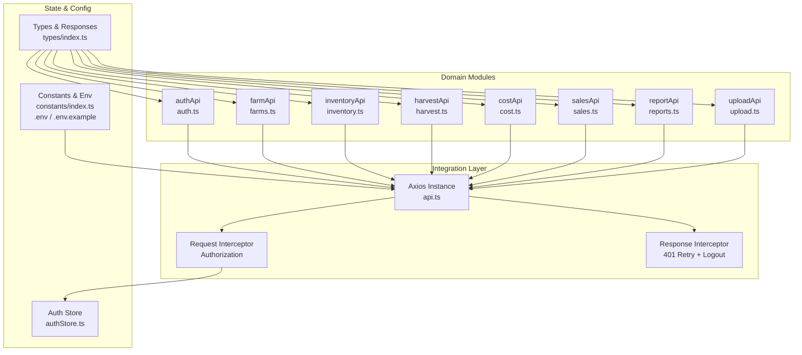
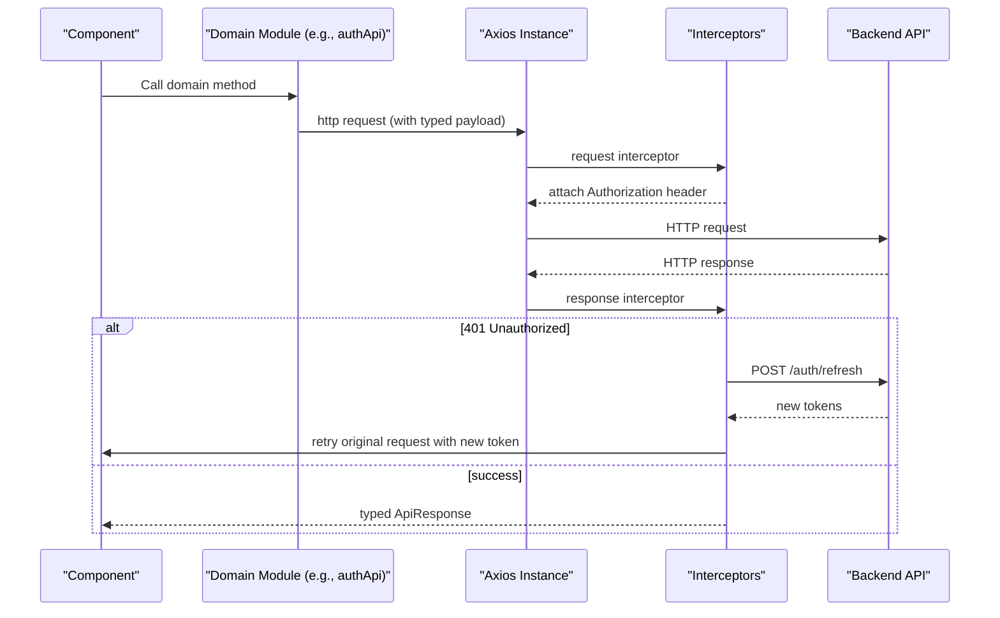
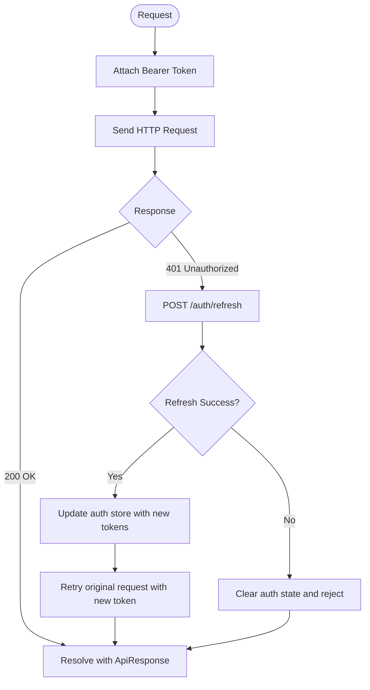
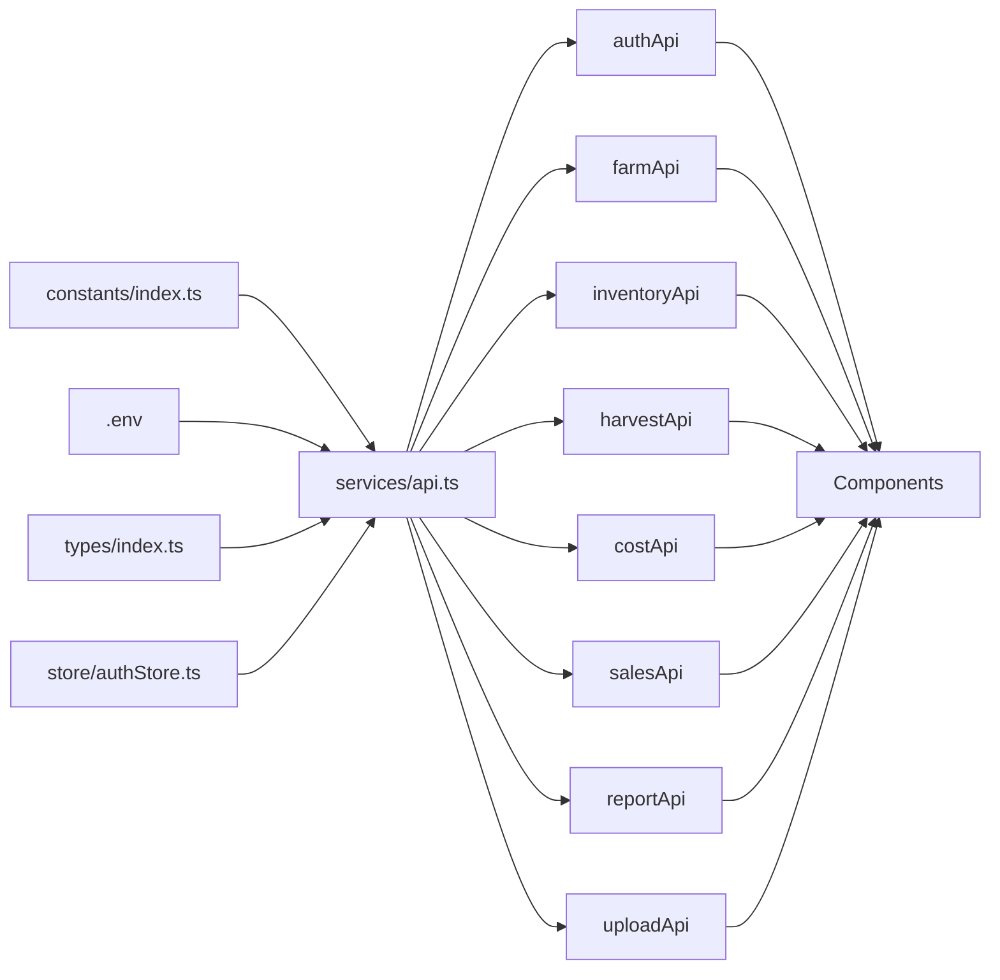

# API Integration

<cite>
**Referenced Files in This Document**
- [api.ts](file://src/services/api.ts)
- [authStore.ts](file://src/store/authStore.ts)
- [index.ts](file://src/constants/index.ts)
- [.env](file://.env)
- [.env.example](file://.env.example)
- [index.ts](file://src/types/index.ts)
- [LoginScreen.tsx](file://src/screens/auth/LoginScreen.tsx)
- [FarmsScreen.tsx](file://src/screens/farms/FarmsScreen.tsx)
- [HarvestScreen.tsx](file://src/screens/harvest/HarvestScreen.tsx)
- [SalesScreen.tsx](file://src/screens/sales/SalesScreen.tsx)
- [AppNavigator.tsx](file://src/navigation/AppNavigator.tsx)
</cite>

## Table of Contents
1. [Introduction](#introduction)
2. [Project Structure](#project-structure)
3. [Core Components](#core-components)
4. [Architecture Overview](#architecture-overview)
5. [Detailed Component Analysis](#detailed-component-analysis)
6. [Dependency Analysis](#dependency-analysis)
7. [Performance Considerations](#performance-considerations)
8. [Troubleshooting Guide](#troubleshooting-guide)
9. [Conclusion](#conclusion)
10. [Appendices](#appendices)

## Introduction
This document describes the Banana Harvest App’s API integration layer built with Axios. It covers centralized client configuration, authentication and error handling via interceptors, endpoint groups by feature domains, request/response patterns, and practical usage in components. It also outlines retry strategies, offline-friendly patterns, and operational considerations such as versioning, rate limiting, and caching.

## Project Structure
The API integration is encapsulated in a single Axios instance with domain-specific API modules exported as namespaces. Authentication state is persisted and synchronized with the Axios request headers. Environment variables configure the base URL and optional flags.

**Diagram sources**
- [api.ts](file://src/services/api.ts#L1-L326)
- [authStore.ts](file://src/store/authStore.ts#L1-L116)
- [index.ts](file://src/constants/index.ts#L1-L363)
- [.env](file://.env#L1-L19)
- [.env.example](file://.env.example#L1-L19)
- [index.ts](file://src/types/index.ts#L1-L429)

**Section sources**
- [api.ts](file://src/services/api.ts#L1-L326)
- [index.ts](file://src/constants/index.ts#L1-L363)
- [.env](file://.env#L1-L19)
- [.env.example](file://.env.example#L1-L19)
- [index.ts](file://src/types/index.ts#L1-L429)

## Core Components
- Centralized Axios client with base URL, timeout, and JSON headers.
- Request interceptor injects Authorization: Bearer token from the auth store.
- Response interceptor handles 401 Unauthorized by attempting a token refresh, updating the store, and retrying the original request once.
- Domain-specific API modules expose typed functions for each endpoint group.

Key behaviors:
- Base URL and timeout configured from constants/environment.
- Authentication token stored in Zustand with persistence.
- All API calls return a standardized response envelope with success, message, data, timestamp, and optional errorCode.

**Section sources**
- [api.ts](file://src/services/api.ts#L6-L14)
- [api.ts](file://src/services/api.ts#L16-L27)
- [api.ts](file://src/services/api.ts#L29-L65)
- [authStore.ts](file://src/store/authStore.ts#L29-L115)
- [index.ts](file://src/constants/index.ts#L6-L7)

## Architecture Overview
The integration layer enforces a consistent contract across all endpoints. Components use domain modules to perform CRUD and workflow operations, while React Query manages caching, invalidation, and optimistic updates.

**Diagram sources**
- [api.ts](file://src/services/api.ts#L16-L65)
- [authStore.ts](file://src/store/authStore.ts#L40-L72)

## Detailed Component Analysis

### Centralized Axios Client and Interceptors
- Base URL and timeout are loaded from constants/environment.
- Request interceptor reads token from Zustand store and attaches Authorization header.
- Response interceptor:
  - Detects 401 Unauthorized and attempts a single retry after refreshing the token.
  - On refresh failure, clears auth state and rejects the error.
- Exports domain modules grouped by feature.

**Diagram sources**
- [api.ts](file://src/services/api.ts#L16-L65)
- [authStore.ts](file://src/store/authStore.ts#L40-L72)

**Section sources**
- [api.ts](file://src/services/api.ts#L6-L14)
- [api.ts](file://src/services/api.ts#L16-L65)
- [index.ts](file://src/constants/index.ts#L6-L7)
- [.env](file://.env#L2-L2)
- [.env.example](file://.env.example#L2-L2)

### Authentication API
Endpoints:
- POST /auth/login
- POST /auth/register
- POST /auth/refresh
- GET /auth/me
- GET /auth/users
- GET /auth/users/role/{role}
- POST /auth/approve/{userId}

Usage patterns:
- Login stores tokens and user metadata in the auth store.
- Refresh token flow is handled automatically by the response interceptor.
- Role-based access controls are enforced by backend.

Typical request/response:
- Request bodies conform to LoginRequest, RegisterRequest, RefreshTokenRequest.
- Response envelope wraps LoginResponse or void.

Error handling:
- 401 triggers automatic retry with refreshed token.
- 403/422 mapped to user feedback in components.

**Section sources**
- [api.ts](file://src/services/api.ts#L67-L89)
- [index.ts](file://src/types/index.ts#L36-L63)
- [index.ts](file://src/types/index.ts#L412-L418)
- [LoginScreen.tsx](file://src/screens/auth/LoginScreen.tsx#L43-L82)

### Farm Management API
Endpoints:
- POST /farms
- GET /farms
- GET /farms/{id}
- POST /inspections
- GET /inspections/pending
- GET /inspections/my
- GET /inspections
- POST /inspections/{id}/approve
- GET /inspections/{id}
- GET /batches
- GET /batches/{id}
- PATCH /batches/{id}/status
- POST /inspections/requests
- GET /inspections/requests/my
- GET /inspections/requests
- PATCH /inspections/requests/{id}/cancel

Usage patterns:
- Components fetch lists and details via React Query.
- Mutations trigger invalidations to keep cache fresh.
- Role-aware visibility and actions.

**Section sources**
- [api.ts](file://src/services/api.ts#L91-L144)
- [FarmsScreen.tsx](file://src/screens/farms/FarmsScreen.tsx#L65-L100)
- [FarmsScreen.tsx](file://src/screens/farms/FarmsScreen.tsx#L140-L168)

### Inventory API
Endpoints:
- GET /inventory/items
- GET /inventory/items/{id}
- POST /inventory/items
- POST /inventory/items/{id}/stock?quantity=...
- GET /inventory/items/{id}/stock
- POST /inventory/allocate

Usage patterns:
- Stock adjustments and allocations use query parameters for scalar values.
- Real-time availability checks support dispatch decisions.

**Section sources**
- [api.ts](file://src/services/api.ts#L146-L167)

### Harvest API
Endpoints:
- POST /harvest/daily
- GET /harvest/batch/{batchId}
- GET /harvest/today
- GET /harvest/reports?date=...
- POST /transport
- POST /gate-passes
- POST /gate-passes/{id}/receive?receivedBoxes=...
- GET /gate-passes/batch/{batchId}
- GET /gate-passes/pending
- GET /gate-passes/today
- GET /gate-passes/reports?date=...

Usage patterns:
- Gate pass creation and receiving integrate with batch lifecycle.
- Daily reports aggregated by date for dashboards and audit trails.

**Section sources**
- [api.ts](file://src/services/api.ts#L169-L209)
- [HarvestScreen.tsx](file://src/screens/harvest/HarvestScreen.tsx#L94-L114)

### Cost API
Endpoints:
- GET /costs/batch/{batchId}
- GET /costs/batch/code/{batchId}
- GET /costs

Usage patterns:
- Cost rollups per batch inform profitability and pricing.

**Section sources**
- [api.ts](file://src/services/api.ts#L211-L221)

### Sales API
Endpoints:
- POST /sales
- GET /sales
- GET /sales/{id}
- GET /sales/invoice/{invoiceNumber}
- GET /sales/batch/{batchId}
- PUT /sales/{id}/payment?status&amount?
- GET /sales/{id}/invoice/pdf (Blob)
- POST /sales/{id}/invoice/share/whatsapp?phoneNumber=...
- POST /sales/{id}/invoice/share/email?email=...
- GET /sales/{id}/invoice/share/whatsapp-link?phoneNumber=...

Usage patterns:
- PDF generation and sharing use Blob responses and native file system.
- Payment status updates support ledger reconciliation.

**Section sources**
- [api.ts](file://src/services/api.ts#L223-L265)
- [SalesScreen.tsx](file://src/screens/sales/SalesScreen.tsx#L96-L174)

### Reporting API
Endpoints:
- GET /reports/dashboard
- GET /reports/vendor-ledger/{vendorId}
- GET /reports/vendor-balance/{vendorId}
- GET /reports/profitability
- GET /reports/daily-activity
- GET /reports/my-ledger
- GET /reports/my-balance

Usage patterns:
- Dashboard aggregates metrics and activity.
- Vendor-specific ledgers enable reconciliation.

**Section sources**
- [api.ts](file://src/services/api.ts#L267-L289)

### Upload API (Media)
Endpoints:
- POST /upload/photo (FormData)
- POST /upload/photos (FormData)
- POST /upload/video (FormData)
- POST /upload/inspection-media (multipart)
- DELETE /upload/file?url=...

Usage patterns:
- Photo uploads support single and multiple media.
- Inspection media bundles photos and video.
- File deletion removes uploaded assets.

**Section sources**
- [api.ts](file://src/services/api.ts#L291-L323)

### Request/Response Transformation and Serialization
- All requests use JSON except multipart uploads; Content-Type is adjusted per endpoint.
- Query parameters are used for scalar values (e.g., stock quantity, receivedBoxes, date).
- Blob responses are used for PDF downloads.
- Standardized ApiResponse envelope ensures consistent parsing across components.

**Section sources**
- [api.ts](file://src/services/api.ts#L293-L322)
- [api.ts](file://src/services/api.ts#L42-L44)
- [api.ts](file://src/services/api.ts#L247-L248)
- [index.ts](file://src/types/index.ts#L412-L418)

### Caching and Offline Patterns
- React Query manages caching, pagination, and invalidation.
- Queries are keyed by domain and parameters (e.g., ['todayReports'], ['batchDetails', id]).
- Mutations invalidate affected queries to maintain consistency.
- Offline-friendly: components surface loading and error states; retries occur automatically on 401.

**Section sources**
- [FarmsScreen.tsx](file://src/screens/farms/FarmsScreen.tsx#L65-L100)
- [HarvestScreen.tsx](file://src/screens/harvest/HarvestScreen.tsx#L63-L114)
- [SalesScreen.tsx](file://src/screens/sales/SalesScreen.tsx#L58-L94)

### Examples of API Usage in Components
- LoginScreen: Calls authApi.login, stores tokens, shows success/error toasts.
- FarmsScreen: Uses farmApi.getAllFarms, authApi.getUsersByRole, farmApi.createFarm, farmApi.createInspectionRequest, farmApi.cancelInspectionRequest.
- HarvestScreen: Uses farmApi.getAllBatches, farmApi.getBatchById, farmApi.updateBatchStatus; harvestApi.getReportsByDate.
- SalesScreen: Uses farmApi.getAllBatches, salesApi.getAllSales, salesApi.createSale, salesApi.downloadInvoicePdf, salesApi.shareInvoiceViaWhatsApp/Email.

**Section sources**
- [LoginScreen.tsx](file://src/screens/auth/LoginScreen.tsx#L43-L82)
- [FarmsScreen.tsx](file://src/screens/farms/FarmsScreen.tsx#L65-L168)
- [HarvestScreen.tsx](file://src/screens/harvest/HarvestScreen.tsx#L63-L148)
- [SalesScreen.tsx](file://src/screens/sales/SalesScreen.tsx#L58-L94)

## Dependency Analysis
- api.ts depends on constants for base URL and timeout, types for request/response shapes, and authStore for token retrieval.
- Domain modules depend on api.ts and types.
- Components depend on domain modules and React Query.

**Diagram sources**
- [api.ts](file://src/services/api.ts#L1-L326)
- [index.ts](file://src/constants/index.ts#L1-L363)
- [.env](file://.env#L1-L19)
- [index.ts](file://src/types/index.ts#L1-L429)
- [authStore.ts](file://src/store/authStore.ts#L1-L116)

**Section sources**
- [api.ts](file://src/services/api.ts#L1-L326)
- [index.ts](file://src/constants/index.ts#L1-L363)
- [index.ts](file://src/types/index.ts#L1-L429)
- [authStore.ts](file://src/store/authStore.ts#L1-L116)

## Performance Considerations
- Centralized timeout prevents long-running requests from blocking UI.
- Interceptor-based retry minimizes repeated manual error handling.
- React Query caching reduces redundant network calls; selective invalidation keeps data fresh.
- Blob downloads are streamed; consider chunked writes and progress indicators for large files.

## Troubleshooting Guide
Common issues and resolutions:
- 401 Unauthorized
  - Symptom: Automatic logout or prompt to re-authenticate.
  - Resolution: Ensure refresh token exists; interceptor retries once with new token.
- Network errors
  - Symptom: Toast messages indicating network/server errors.
  - Resolution: Verify base URL and connectivity; check backend health.
- Validation errors
  - Symptom: Backend returns structured error messages.
  - Resolution: Surface user-friendly messages and highlight invalid fields.
- PDF download/share failures
  - Symptom: Download or share operations fail.
  - Resolution: Confirm Blob handling and device permissions; verify file URLs.

**Section sources**
- [api.ts](file://src/services/api.ts#L29-L65)
- [index.ts](file://src/constants/index.ts#L339-L347)
- [SalesScreen.tsx](file://src/screens/sales/SalesScreen.tsx#L96-L174)

## Conclusion
The API integration layer provides a robust, typed, and resilient foundation for the Banana Harvest App. With centralized configuration, automatic authentication and error handling, and domain-focused modules, it supports scalable development and reliable user experiences across authentication, farm management, inventory, harvest, sales, and reporting workflows.

## Appendices

### API Versioning
- The base URL includes /api, enabling future versioning under /api/v1, /api/v2, etc., without changing client code.

**Section sources**
- [index.ts](file://src/constants/index.ts#L6-L7)
- [.env](file://.env#L2-L2)
- [.env.example](file://.env.example#L2-L2)

### Rate Limiting Considerations
- Implement exponential backoff in clients if backend enforces strict limits.
- Use React Query’s retry and staleTime to minimize thrashing.

[No sources needed since this section provides general guidance]

### Offline Data Synchronization Strategies
- Persist critical state in auth store and caches.
- Defer destructive mutations until online; queue and replay when connectivity resumes.
- Use optimistic updates with rollback on failure.

[No sources needed since this section provides general guidance]