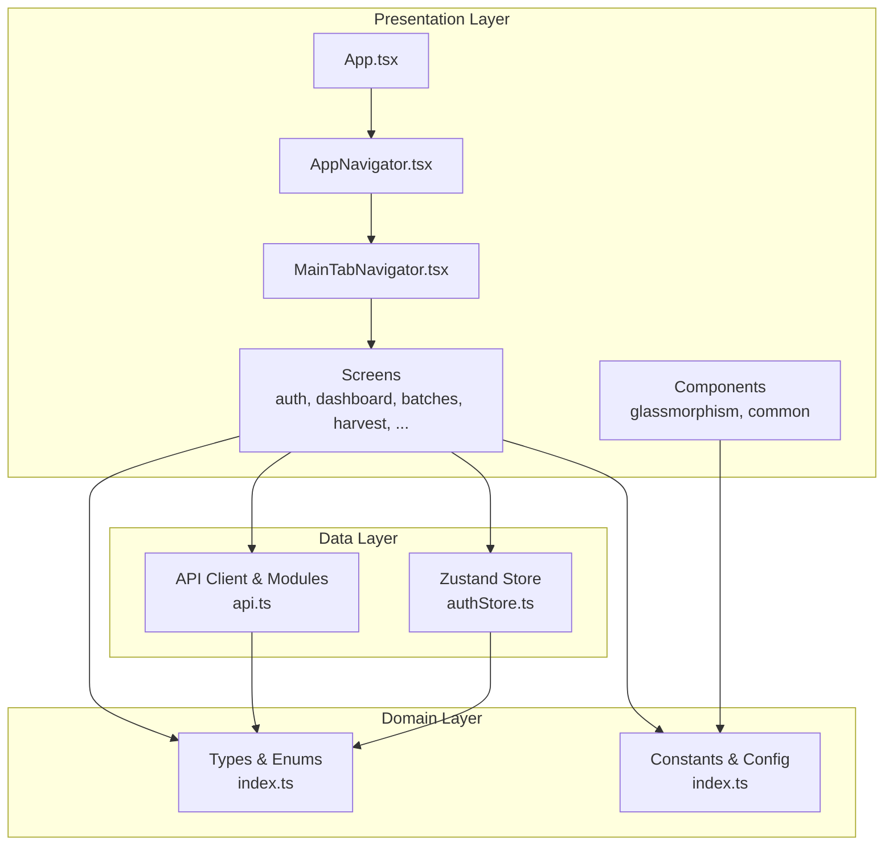
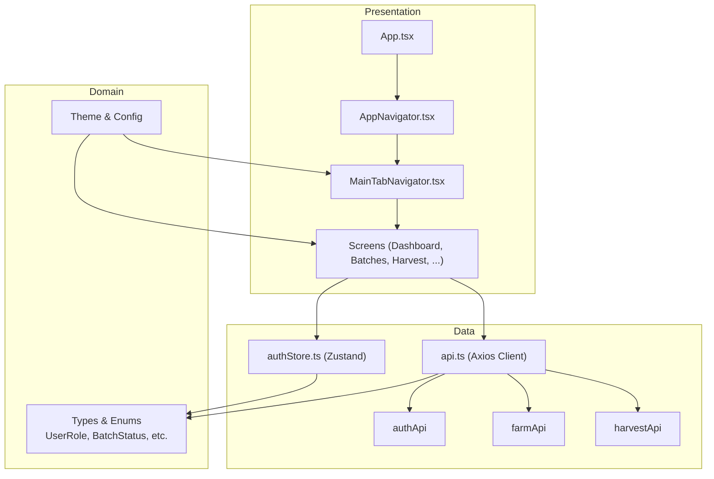
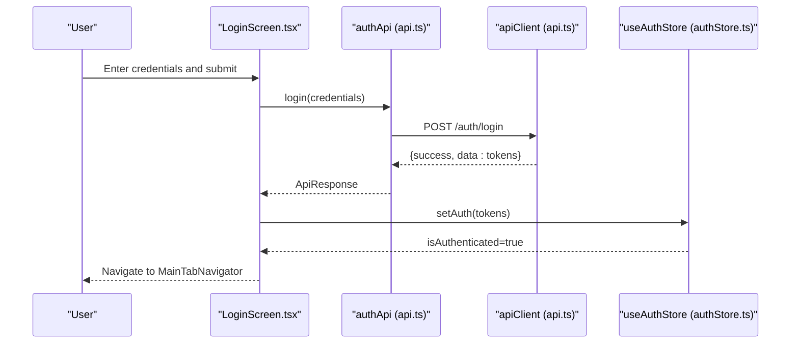
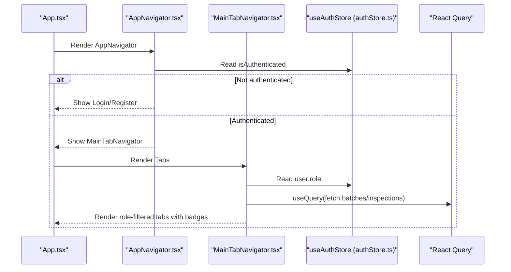
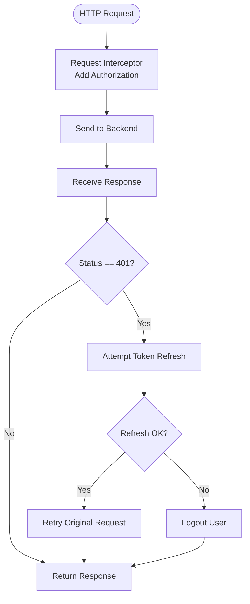
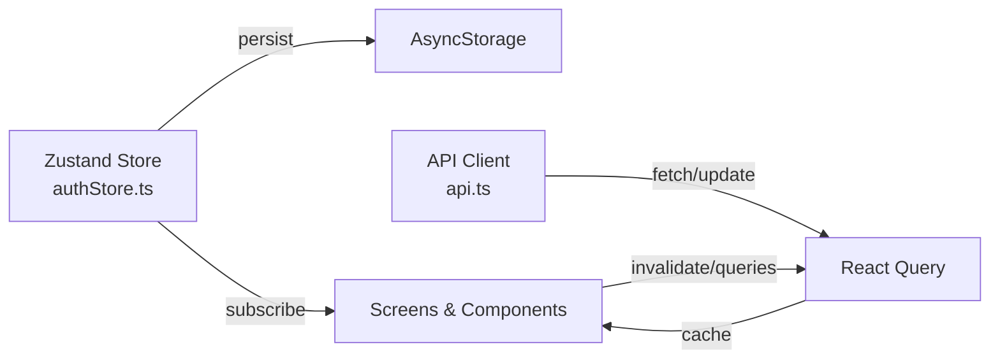
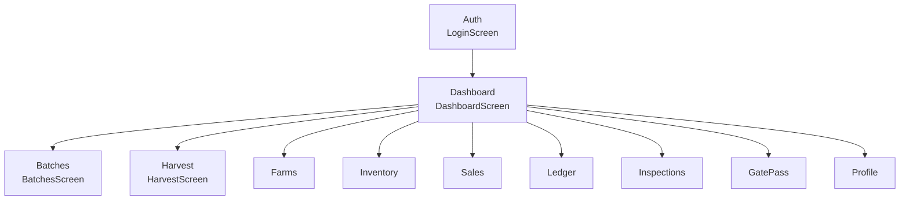
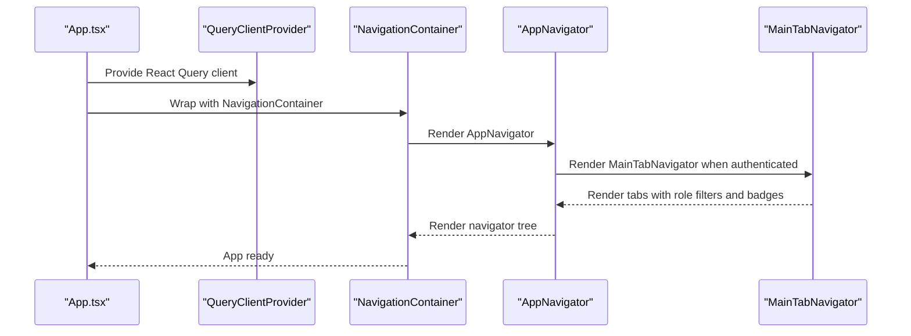
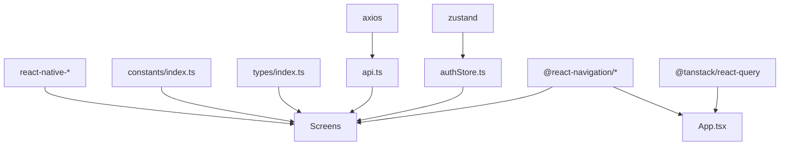

# Application Architecture

<cite>
**Referenced Files in This Document**
- [App.tsx](file://App.tsx)
- [AppNavigator.tsx](file://src/navigation/AppNavigator.tsx)
- [MainTabNavigator.tsx](file://src/navigation/MainTabNavigator.tsx)
- [api.ts](file://src/services/api.ts)
- [authStore.ts](file://src/store/authStore.ts)
- [index.ts](file://src/types/index.ts)
- [LoginScreen.tsx](file://src/screens/auth/LoginScreen.tsx)
- [DashboardScreen.tsx](file://src/screens/dashboard/DashboardScreen.tsx)
- [BatchesScreen.tsx](file://src/screens/batches/BatchesScreen.tsx)
- [HarvestScreen.tsx](file://src/screens/harvest/HarvestScreen.tsx)
- [index.ts](file://src/constants/index.ts)
- [BatchStatusBadge.tsx](file://src/components/common/BatchStatusBadge.tsx)
- [GlassButton.tsx](file://src/components/glassmorphism/GlassButton.tsx)
- [.env](file://.env)
- [package.json](file://package.json)
</cite>

## Table of Contents
1. [Introduction](#introduction)
2. [Project Structure](#project-structure)
3. [Core Components](#core-components)
4. [Architecture Overview](#architecture-overview)
5. [Detailed Component Analysis](#detailed-component-analysis)
6. [Dependency Analysis](#dependency-analysis)
7. [Performance Considerations](#performance-considerations)
8. [Troubleshooting Guide](#troubleshooting-guide)
9. [Conclusion](#conclusion)

## Introduction
This document describes the Banana Harvest App’s system design and architecture. The application follows a clean architecture pattern with clear separation between presentation, domain, and data layers. It uses React Navigation for routing and a custom animated bottom tab bar with role-based visibility. State management combines local state via Zustand for authentication and UI state, and React Query for server state caching and synchronization. The API integration layer centralizes HTTP client configuration, request/response interceptors, and error handling. Cross-cutting concerns include authentication flows, error boundaries, and loading states across the app.

## Project Structure
The project is organized by feature and layer:
- Presentation layer: React Native screens under src/screens organized by business domain (auth, dashboard, farms, batches, harvest, etc.), shared UI components under src/components, and navigation under src/navigation.
- Domain layer: Types and enums under src/types define business entities and contracts.
- Data layer: Centralized API client under src/services/api.ts with domain-specific API modules (auth, farm, inventory, harvest, sales, reports, uploads).
- State management: Local state via Zustand in src/store/authStore.ts; server state via React Query in screens and services.
- Constants and styling: Theme, typography, spacing, and role-based navigation definitions under src/constants.

**Diagram sources**
- [App.tsx](file://App.tsx#L1-L95)
- [AppNavigator.tsx](file://src/navigation/AppNavigator.tsx#L1-L60)
- [MainTabNavigator.tsx](file://src/navigation/MainTabNavigator.tsx#L1-L414)
- [api.ts](file://src/services/api.ts#L1-L326)
- [authStore.ts](file://src/store/authStore.ts#L1-L116)
- [index.ts](file://src/types/index.ts#L1-L429)
- [index.ts](file://src/constants/index.ts#L1-L363)

**Section sources**
- [App.tsx](file://App.tsx#L1-L95)
- [AppNavigator.tsx](file://src/navigation/AppNavigator.tsx#L1-L60)
- [MainTabNavigator.tsx](file://src/navigation/MainTabNavigator.tsx#L1-L414)
- [api.ts](file://src/services/api.ts#L1-L326)
- [authStore.ts](file://src/store/authStore.ts#L1-L116)
- [index.ts](file://src/types/index.ts#L1-L429)
- [index.ts](file://src/constants/index.ts#L1-L363)

## Core Components
- App bootstrap and providers: Initializes React Query, Toast, gesture handling, safe areas, and wraps the app with providers.
- Navigation orchestration: AppNavigator routes authenticated vs unauthenticated flows; MainTabNavigator renders a custom animated tab bar with role-based visibility and dynamic badges.
- API integration: Centralized Axios client with request/response interceptors for token injection and automatic refresh on 401.
- State management: Zustand store for authentication state persistence; React Query for server state caching and invalidation.
- Screen architecture: Modular screens per domain with domain-specific APIs and shared UI components.

**Section sources**
- [App.tsx](file://App.tsx#L1-L95)
- [AppNavigator.tsx](file://src/navigation/AppNavigator.tsx#L1-L60)
- [MainTabNavigator.tsx](file://src/navigation/MainTabNavigator.tsx#L1-L414)
- [api.ts](file://src/services/api.ts#L1-L326)
- [authStore.ts](file://src/store/authStore.ts#L1-L116)

## Architecture Overview
The system adheres to clean architecture:
- Presentation depends on domain abstractions (types) and delegates to services/data.
- Domain defines contracts via TypeScript types and enums.
- Data layer encapsulates HTTP clients and domain-specific modules.

**Diagram sources**
- [App.tsx](file://App.tsx#L1-L95)
- [AppNavigator.tsx](file://src/navigation/AppNavigator.tsx#L1-L60)
- [MainTabNavigator.tsx](file://src/navigation/MainTabNavigator.tsx#L1-L414)
- [api.ts](file://src/services/api.ts#L1-L326)
- [authStore.ts](file://src/store/authStore.ts#L1-L116)
- [index.ts](file://src/types/index.ts#L1-L429)
- [index.ts](file://src/constants/index.ts#L1-L363)

## Detailed Component Analysis

### Authentication Flow and State Management
- Zustand store manages user, tokens, roles, and authentication state with persistence to AsyncStorage.
- Login screen triggers authApi.login, validates response, and persists credentials via Zustand.
- API client injects Authorization header automatically and handles 401 by attempting token refresh; on failure, logs out the user.

**Diagram sources**
- [LoginScreen.tsx](file://src/screens/auth/LoginScreen.tsx#L1-L259)
- [api.ts](file://src/services/api.ts#L68-L89)
- [authStore.ts](file://src/store/authStore.ts#L29-L115)

**Section sources**
- [authStore.ts](file://src/store/authStore.ts#L1-L116)
- [LoginScreen.tsx](file://src/screens/auth/LoginScreen.tsx#L1-L259)
- [api.ts](file://src/services/api.ts#L1-L326)

### Navigation Architecture and Role-Based Visibility
- AppNavigator conditionally renders authentication screens or the MainTabNavigator based on authentication state.
- MainTabNavigator defines role-aware tabs and computes dynamic badges from shared React Query caches.
- Custom animated tab bar uses Reanimated for interactive feedback and displays role-filtered tabs.

**Diagram sources**
- [App.tsx](file://App.tsx#L1-L95)
- [AppNavigator.tsx](file://src/navigation/AppNavigator.tsx#L1-L60)
- [MainTabNavigator.tsx](file://src/navigation/MainTabNavigator.tsx#L1-L414)
- [authStore.ts](file://src/store/authStore.ts#L1-L116)

**Section sources**
- [AppNavigator.tsx](file://src/navigation/AppNavigator.tsx#L1-L60)
- [MainTabNavigator.tsx](file://src/navigation/MainTabNavigator.tsx#L1-L414)
- [authStore.ts](file://src/store/authStore.ts#L1-L116)

### API Integration Layer
- Centralized Axios instance configured with base URL, timeout, and headers.
- Request interceptor adds Authorization Bearer token from Zustand store.
- Response interceptor handles 401 by refreshing token; on failure, clears auth state.
- Domain-specific API modules expose typed functions for auth, farm, inventory, harvest, sales, reports, and uploads.

**Diagram sources**
- [api.ts](file://src/services/api.ts#L1-L326)
- [authStore.ts](file://src/store/authStore.ts#L1-L116)

**Section sources**
- [api.ts](file://src/services/api.ts#L1-L326)
- [.env](file://.env#L1-L19)
- [index.ts](file://src/constants/index.ts#L6-L7)

### State Management Architecture
- Local state (Zustand):
  - Stores user, tokens, authentication status, and role checks.
  - Persisted to AsyncStorage with selective state serialization.
- Server state (React Query):
  - Provides caching, invalidation, refetch on focus, and shared query keys across related screens.
  - Used in dashboards, tab bars, and domain screens to keep UI in sync with backend.

**Diagram sources**
- [authStore.ts](file://src/store/authStore.ts#L1-L116)
- [api.ts](file://src/services/api.ts#L1-L326)
- [DashboardScreen.tsx](file://src/screens/dashboard/DashboardScreen.tsx#L1-L402)
- [MainTabNavigator.tsx](file://src/navigation/MainTabNavigator.tsx#L1-L414)

**Section sources**
- [authStore.ts](file://src/store/authStore.ts#L1-L116)
- [DashboardScreen.tsx](file://src/screens/dashboard/DashboardScreen.tsx#L1-L402)
- [MainTabNavigator.tsx](file://src/navigation/MainTabNavigator.tsx#L1-L414)

### Modular Screen Architecture by Business Domains
- Authentication: LoginScreen, RegisterScreen (planned).
- Dashboard: DashboardScreen with role-based content and statistics.
- Batches: BatchesScreen with lifecycle navigation and inspection approvals.
- Harvest: HarvestScreen with today/history tabs, batch selection, and completion actions.
- Additional domains: Farms, Inventory, Sales, Ledger, Inspections, Gate Pass, Profile.

**Diagram sources**
- [LoginScreen.tsx](file://src/screens/auth/LoginScreen.tsx#L1-L259)
- [DashboardScreen.tsx](file://src/screens/dashboard/DashboardScreen.tsx#L1-L402)
- [BatchesScreen.tsx](file://src/screens/batches/BatchesScreen.tsx#L1-L462)
- [HarvestScreen.tsx](file://src/screens/harvest/HarvestScreen.tsx#L1-L718)

**Section sources**
- [LoginScreen.tsx](file://src/screens/auth/LoginScreen.tsx#L1-L259)
- [DashboardScreen.tsx](file://src/screens/dashboard/DashboardScreen.tsx#L1-L402)
- [BatchesScreen.tsx](file://src/screens/batches/BatchesScreen.tsx#L1-L462)
- [HarvestScreen.tsx](file://src/screens/harvest/HarvestScreen.tsx#L1-L718)

### Component Hierarchy and Orchestration
- App.tsx orchestrates providers (React Query, NavigationContainer, SafeAreaProvider, GestureHandlerRootView) and renders AppNavigator.
- AppNavigator decides between authentication stack and MainTabNavigator.
- MainTabNavigator renders role-filtered tabs and computes badges via shared React Query caches.

**Diagram sources**
- [App.tsx](file://App.tsx#L1-L95)
- [AppNavigator.tsx](file://src/navigation/AppNavigator.tsx#L1-L60)
- [MainTabNavigator.tsx](file://src/navigation/MainTabNavigator.tsx#L1-L414)

**Section sources**
- [App.tsx](file://App.tsx#L1-L95)
- [AppNavigator.tsx](file://src/navigation/AppNavigator.tsx#L1-L60)
- [MainTabNavigator.tsx](file://src/navigation/MainTabNavigator.tsx#L1-L414)

## Dependency Analysis
External dependencies include React Navigation, React Query, Axios, Zustand, and UI libraries. The app’s internal dependencies are structured to minimize coupling:
- Screens depend on domain types and API modules.
- API modules depend on the centralized Axios client.
- Navigation components depend on Zustand for authentication state.
- UI components depend on constants for theme and styling.

**Diagram sources**
- [package.json](file://package.json#L14-L48)
- [App.tsx](file://App.tsx#L1-L95)
- [api.ts](file://src/services/api.ts#L1-L326)
- [authStore.ts](file://src/store/authStore.ts#L1-L116)
- [index.ts](file://src/constants/index.ts#L1-L363)
- [index.ts](file://src/types/index.ts#L1-L429)

**Section sources**
- [package.json](file://package.json#L1-L74)
- [App.tsx](file://App.tsx#L1-L95)
- [api.ts](file://src/services/api.ts#L1-L326)
- [authStore.ts](file://src/store/authStore.ts#L1-L116)
- [index.ts](file://src/constants/index.ts#L1-L363)
- [index.ts](file://src/types/index.ts#L1-L429)

## Performance Considerations
- React Query defaults: retry attempts, staleTime tuning, and disabling refetch on window focus reduce unnecessary network calls.
- Shared query keys across related screens ensure cache coherency and fewer redundant requests.
- Animated tab buttons use Reanimated with spring animations for smooth UX without heavy re-renders.
- Badge computations filter shared batch/inspection lists to minimize rendering overhead.
- Local state persistence avoids repeated auth round-trips by storing tokens and user metadata.

[No sources needed since this section provides general guidance]

## Troubleshooting Guide
- Authentication failures:
  - 401 Unauthorized triggers automatic token refresh; if refresh fails, the user is logged out. Verify refresh token availability and backend endpoint health.
  - Confirm Authorization header injection in the request interceptor.
- Network errors:
  - Check API base URL and timeout values; ensure environment variables are loaded correctly.
  - Validate toast messages and error surfaces in screens for actionable feedback.
- State inconsistencies:
  - Use React Query invalidation on navigation focus and after mutations to keep UI in sync.
  - Verify Zustand store hydration and AsyncStorage permissions.
- UI responsiveness:
  - Prefer Reanimated animations and memoized computations for tab badges and list rendering.

**Section sources**
- [api.ts](file://src/services/api.ts#L1-L326)
- [.env](file://.env#L1-L19)
- [DashboardScreen.tsx](file://src/screens/dashboard/DashboardScreen.tsx#L1-L402)
- [MainTabNavigator.tsx](file://src/navigation/MainTabNavigator.tsx#L1-L414)
- [authStore.ts](file://src/store/authStore.ts#L1-L116)

## Conclusion
The Banana Harvest App implements a clean architecture with distinct presentation, domain, and data layers. React Navigation orchestrates a role-aware tab bar with animated interactions, while Zustand and React Query manage local and server state respectively. The centralized API client enforces consistent authentication and error handling. The modular screen architecture supports scalable growth across business domains, and cross-cutting concerns like authentication, error handling, and loading states are consistently applied throughout the app.