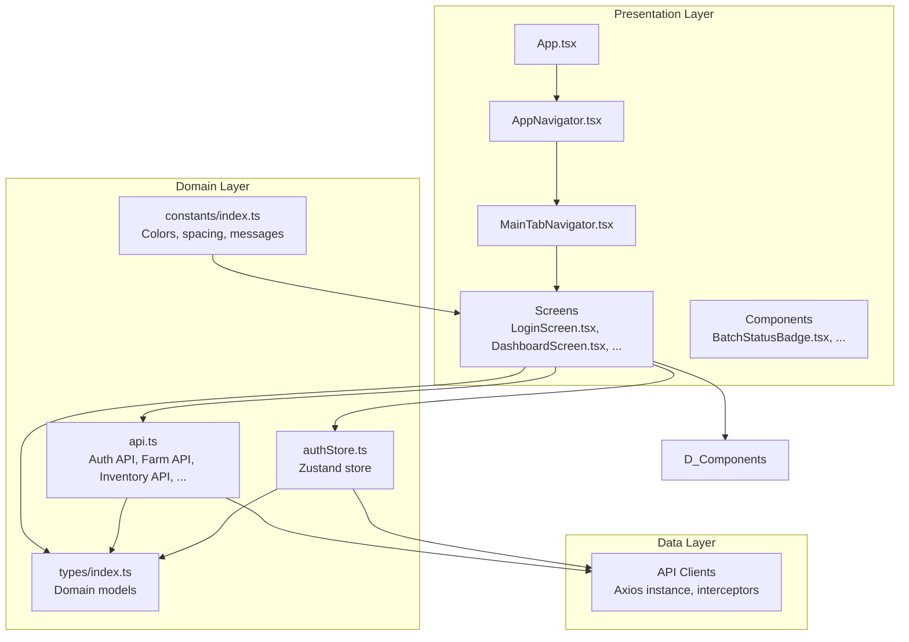
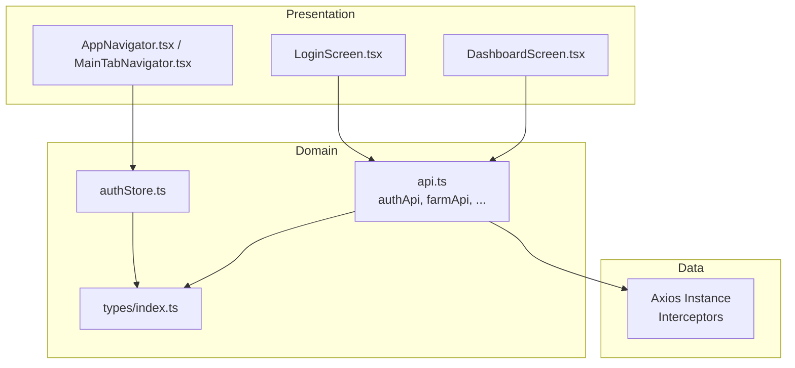
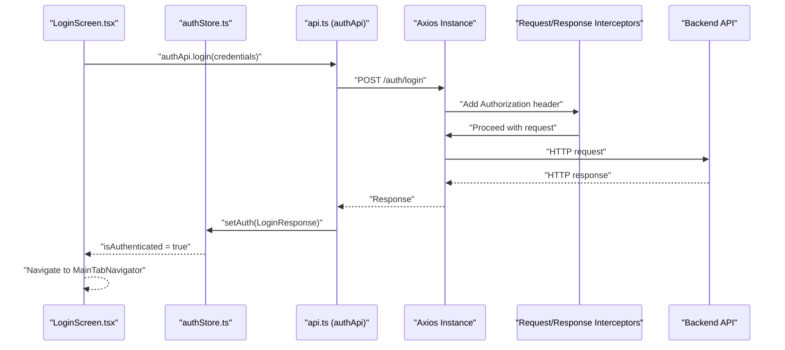
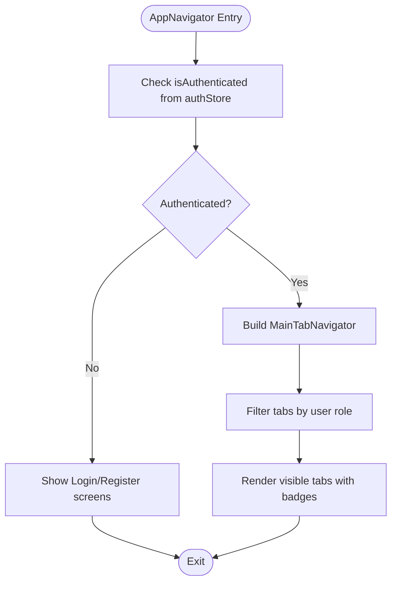
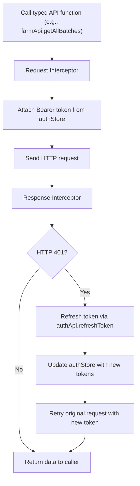
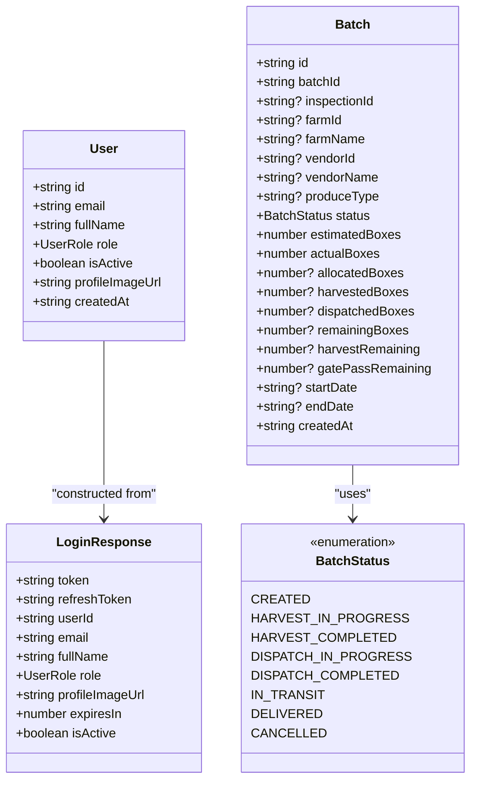
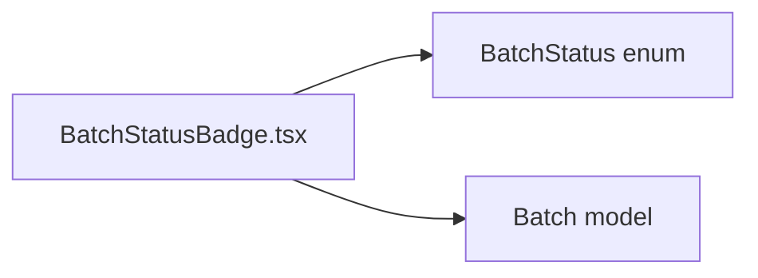
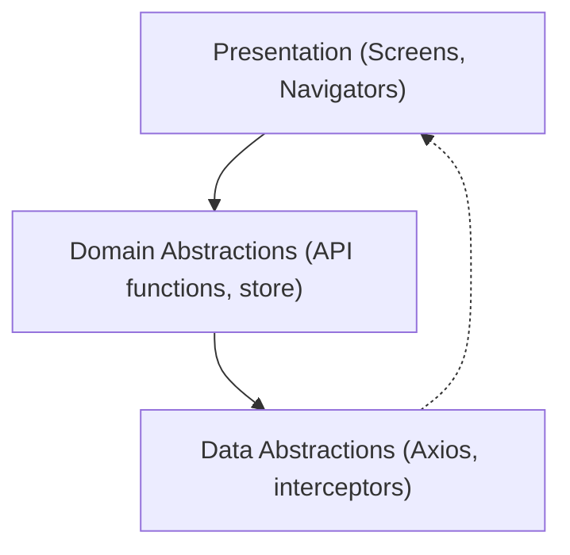

# Clean Architecture Implementation

<cite>
**Referenced Files in This Document**
- [App.tsx](file://App.tsx)
- [AppNavigator.tsx](file://src/navigation/AppNavigator.tsx)
- [MainTabNavigator.tsx](file://src/navigation/MainTabNavigator.tsx)
- [LoginScreen.tsx](file://src/screens/auth/LoginScreen.tsx)
- [DashboardScreen.tsx](file://src/screens/dashboard/DashboardScreen.tsx)
- [api.ts](file://src/services/api.ts)
- [authStore.ts](file://src/store/authStore.ts)
- [index.ts](file://src/types/index.ts)
- [index.ts](file://src/constants/index.ts)
- [BatchStatusBadge.tsx](file://src/components/common/BatchStatusBadge.tsx)
- [package.json](file://package.json)
</cite>

## Table of Contents
1. [Introduction](#introduction)
2. [Project Structure](#project-structure)
3. [Core Components](#core-components)
4. [Architecture Overview](#architecture-overview)
5. [Detailed Component Analysis](#detailed-component-analysis)
6. [Dependency Analysis](#dependency-analysis)
7. [Performance Considerations](#performance-considerations)
8. [Troubleshooting Guide](#troubleshooting-guide)
9. [Conclusion](#conclusion)

## Introduction
This document explains the clean architecture implementation in the Banana Harvest App, focusing on the three-layer separation:
- Presentation layer: React Native components and screens
- Domain layer: Business logic and services
- Data layer: API clients and repositories

It demonstrates how each layer communicates through well-defined interfaces and dependencies, implements the dependency inversion principle, and enables testability, maintainability, and separation of concerns. It also covers how authentication logic, navigation state, and API calls flow through these layers, and how this approach benefits mobile development and team collaboration.

## Project Structure
The project follows a feature-based organization with clear boundaries between layers:
- Presentation: Screens under src/screens, navigation under src/navigation, shared UI components under src/components
- Domain: Business logic and services under src/services, stores under src/store
- Data: API clients under src/services, typed models under src/types, constants under src/constants

**Diagram sources**
- [App.tsx](file://App.tsx#L1-L95)
- [AppNavigator.tsx](file://src/navigation/AppNavigator.tsx#L1-L60)
- [MainTabNavigator.tsx](file://src/navigation/MainTabNavigator.tsx#L1-L414)
- [LoginScreen.tsx](file://src/screens/auth/LoginScreen.tsx#L1-L259)
- [DashboardScreen.tsx](file://src/screens/dashboard/DashboardScreen.tsx#L1-L402)
- [api.ts](file://src/services/api.ts#L1-L326)
- [authStore.ts](file://src/store/authStore.ts#L1-L116)
- [index.ts](file://src/types/index.ts#L1-L429)
- [index.ts](file://src/constants/index.ts#L1-L363)
- [BatchStatusBadge.tsx](file://src/components/common/BatchStatusBadge.tsx#L1-L98)

**Section sources**
- [App.tsx](file://App.tsx#L1-L95)
- [AppNavigator.tsx](file://src/navigation/AppNavigator.tsx#L1-L60)
- [MainTabNavigator.tsx](file://src/navigation/MainTabNavigator.tsx#L1-L414)
- [api.ts](file://src/services/api.ts#L1-L326)
- [authStore.ts](file://src/store/authStore.ts#L1-L116)
- [index.ts](file://src/types/index.ts#L1-L429)
- [index.ts](file://src/constants/index.ts#L1-L363)
- [BatchStatusBadge.tsx](file://src/components/common/BatchStatusBadge.tsx#L1-L98)
- [package.json](file://package.json#L1-L74)

## Core Components
- Presentation layer components:
  - App.tsx orchestrates the app lifecycle, providers, and navigation container
  - AppNavigator.tsx defines stack-based navigation and routes
  - MainTabNavigator.tsx manages bottom tabs, role-based visibility, and badges
  - Screens (e.g., LoginScreen.tsx, DashboardScreen.tsx) encapsulate UI and orchestrate domain actions
  - Components (e.g., BatchStatusBadge.tsx) encapsulate reusable UI logic

- Domain layer:
  - api.ts provides typed API clients and interceptors for authentication and error handling
  - authStore.ts provides a Zustand store for authentication state and getters
  - types/index.ts defines domain models and enums used across the app
  - constants/index.ts centralizes theme, typography, spacing, and error messages

- Data layer:
  - Axios instance with request/response interceptors handles token injection and automatic refresh
  - API modules (authApi, farmApi, inventoryApi, etc.) expose typed functions for backend interactions

**Section sources**
- [App.tsx](file://App.tsx#L1-L95)
- [AppNavigator.tsx](file://src/navigation/AppNavigator.tsx#L1-L60)
- [MainTabNavigator.tsx](file://src/navigation/MainTabNavigator.tsx#L1-L414)
- [LoginScreen.tsx](file://src/screens/auth/LoginScreen.tsx#L1-L259)
- [DashboardScreen.tsx](file://src/screens/dashboard/DashboardScreen.tsx#L1-L402)
- [api.ts](file://src/services/api.ts#L1-L326)
- [authStore.ts](file://src/store/authStore.ts#L1-L116)
- [index.ts](file://src/types/index.ts#L1-L429)
- [index.ts](file://src/constants/index.ts#L1-L363)
- [BatchStatusBadge.tsx](file://src/components/common/BatchStatusBadge.tsx#L1-L98)

## Architecture Overview
Clean architecture separates concerns into three layers:
- Presentation: React Native screens and navigation
- Domain: Services and stores (business logic)
- Data: API clients and typed models

The dependency inversion principle is implemented by:
- Higher-level modules (screens, navigators) depend on abstractions (typed API functions, store actions)
- Lower-level modules (Axios instance, interceptors) implement these abstractions
- No screen depends directly on Axios internals; they depend on exported API functions

**Diagram sources**
- [LoginScreen.tsx](file://src/screens/auth/LoginScreen.tsx#L1-L259)
- [DashboardScreen.tsx](file://src/screens/dashboard/DashboardScreen.tsx#L1-L402)
- [AppNavigator.tsx](file://src/navigation/AppNavigator.tsx#L1-L60)
- [MainTabNavigator.tsx](file://src/navigation/MainTabNavigator.tsx#L1-L414)
- [api.ts](file://src/services/api.ts#L1-L326)
- [authStore.ts](file://src/store/authStore.ts#L1-L116)
- [index.ts](file://src/types/index.ts#L1-L429)

## Detailed Component Analysis

### Authentication Flow Through Layers
This sequence illustrates how authentication moves from presentation to domain to data and back:

**Diagram sources**
- [LoginScreen.tsx](file://src/screens/auth/LoginScreen.tsx#L43-L82)
- [api.ts](file://src/services/api.ts#L68-L89)
- [authStore.ts](file://src/store/authStore.ts#L40-L76)
- [AppNavigator.tsx](file://src/navigation/AppNavigator.tsx#L28-L58)

**Section sources**
- [LoginScreen.tsx](file://src/screens/auth/LoginScreen.tsx#L1-L259)
- [api.ts](file://src/services/api.ts#L1-L326)
- [authStore.ts](file://src/store/authStore.ts#L1-L116)
- [AppNavigator.tsx](file://src/navigation/AppNavigator.tsx#L1-L60)

### Navigation State and Role-Based Visibility
The navigation layer depends on domain state to decide which screens are shown and which tabs are visible:

**Diagram sources**
- [AppNavigator.tsx](file://src/navigation/AppNavigator.tsx#L28-L58)
- [MainTabNavigator.tsx](file://src/navigation/MainTabNavigator.tsx#L284-L313)
- [authStore.ts](file://src/store/authStore.ts#L1-L116)
- [index.ts](file://src/types/index.ts#L1-L7)

**Section sources**
- [AppNavigator.tsx](file://src/navigation/AppNavigator.tsx#L1-L60)
- [MainTabNavigator.tsx](file://src/navigation/MainTabNavigator.tsx#L1-L414)
- [authStore.ts](file://src/store/authStore.ts#L1-L116)
- [index.ts](file://src/types/index.ts#L1-L7)

### API Calls and Error Handling
The API layer encapsulates HTTP communication and provides typed functions. Interceptors handle token injection and automatic refresh:

**Diagram sources**
- [api.ts](file://src/services/api.ts#L16-L65)
- [api.ts](file://src/services/api.ts#L92-L144)
- [authStore.ts](file://src/store/authStore.ts#L1-L116)

**Section sources**
- [api.ts](file://src/services/api.ts#L1-L326)
- [authStore.ts](file://src/store/authStore.ts#L1-L116)

### Domain Models and Type Safety
Typed models define the domain contracts used across layers:

**Diagram sources**
- [index.ts](file://src/types/index.ts#L9-L18)
- [index.ts](file://src/types/index.ts#L49-L59)
- [index.ts](file://src/types/index.ts#L142-L176)

**Section sources**
- [index.ts](file://src/types/index.ts#L1-L429)

### UI Components and Reusability
Reusable UI components encapsulate presentation logic and improve maintainability:

**Diagram sources**
- [BatchStatusBadge.tsx](file://src/components/common/BatchStatusBadge.tsx#L1-L98)
- [index.ts](file://src/types/index.ts#L142-L176)

**Section sources**
- [BatchStatusBadge.tsx](file://src/components/common/BatchStatusBadge.tsx#L1-L98)
- [index.ts](file://src/types/index.ts#L1-L429)

## Dependency Analysis
The app enforces dependency inversion:
- Presentation depends on domain abstractions (API functions, store actions)
- Domain depends on data abstractions (Axios instance, interceptors)
- Data does not depend on presentation or domain

**Diagram sources**
- [App.tsx](file://App.tsx#L1-L95)
- [AppNavigator.tsx](file://src/navigation/AppNavigator.tsx#L1-L60)
- [MainTabNavigator.tsx](file://src/navigation/MainTabNavigator.tsx#L1-L414)
- [LoginScreen.tsx](file://src/screens/auth/LoginScreen.tsx#L1-L259)
- [DashboardScreen.tsx](file://src/screens/dashboard/DashboardScreen.tsx#L1-L402)
- [api.ts](file://src/services/api.ts#L1-L326)
- [authStore.ts](file://src/store/authStore.ts#L1-L116)

**Section sources**
- [App.tsx](file://App.tsx#L1-L95)
- [AppNavigator.tsx](file://src/navigation/AppNavigator.tsx#L1-L60)
- [MainTabNavigator.tsx](file://src/navigation/MainTabNavigator.tsx#L1-L414)
- [LoginScreen.tsx](file://src/screens/auth/LoginScreen.tsx#L1-L259)
- [DashboardScreen.tsx](file://src/screens/dashboard/DashboardScreen.tsx#L1-L402)
- [api.ts](file://src/services/api.ts#L1-L326)
- [authStore.ts](file://src/store/authStore.ts#L1-L116)

## Performance Considerations
- Centralized API configuration and interceptors reduce duplication and improve caching
- React Query integration enables efficient caching, retries, and stale-time controls
- Role-based tab filtering reduces unnecessary rendering and network calls
- Constants and theme definitions promote consistency and reduce layout recalculations

[No sources needed since this section provides general guidance]

## Troubleshooting Guide
Common issues and resolutions:
- Authentication failures: Verify token presence and refresh logic in interceptors
- Network errors: Check API base URL and timeout configuration
- Navigation anomalies: Confirm auth state and role-based tab visibility logic
- UI inconsistencies: Ensure constants and theme usage are consistent across components

**Section sources**
- [api.ts](file://src/services/api.ts#L1-L326)
- [index.ts](file://src/constants/index.ts#L1-L363)
- [authStore.ts](file://src/store/authStore.ts#L1-L116)
- [MainTabNavigator.tsx](file://src/navigation/MainTabNavigator.tsx#L1-L414)

## Conclusion
The Banana Harvest App applies clean architecture principles to achieve:
- Clear separation of concerns across presentation, domain, and data layers
- Dependency inversion enabling testability and flexibility
- Maintainable and collaborative development through typed models and centralized configuration
- Robust authentication and navigation flows with reusable UI components

This structure supports scalable growth, easier testing, and improved developer productivity across teams.