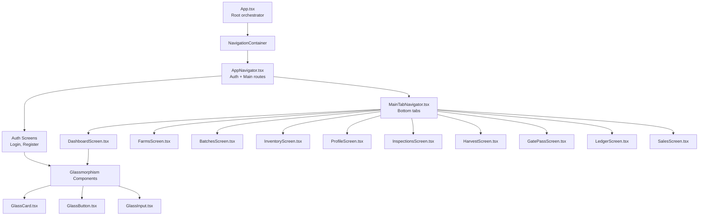
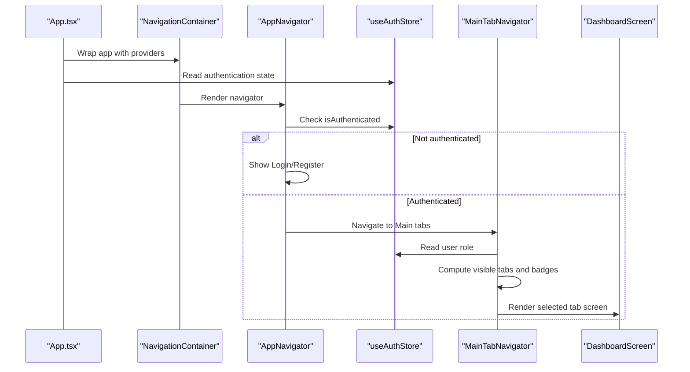
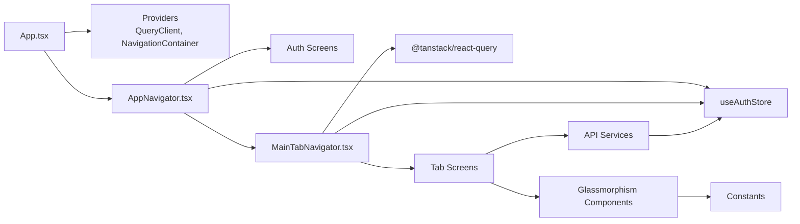

# Component Hierarchy & Composition

<cite>
**Referenced Files in This Document**
- [App.tsx](file://App.tsx)
- [AppNavigator.tsx](file://src/navigation/AppNavigator.tsx)
- [MainTabNavigator.tsx](file://src/navigation/MainTabNavigator.tsx)
- [GlassCard.tsx](file://src/components/glassmorphism/GlassCard.tsx)
- [GlassButton.tsx](file://src/components/glassmorphism/GlassButton.tsx)
- [GlassInput.tsx](file://src/components/glassmorphism/GlassInput.tsx)
- [DashboardScreen.tsx](file://src/screens/dashboard/DashboardScreen.tsx)
- [LoginScreen.tsx](file://src/screens/auth/LoginScreen.tsx)
- [index.ts (glassmorphism)](file://src/components/glassmorphism/index.ts)
- [index.ts (common)](file://src/components/common/index.ts)
- [index.ts (types)](file://src/types/index.ts)
- [index.ts (constants)](file://src/constants/index.ts)
- [authStore.ts](file://src/store/authStore.ts)
- [api.ts](file://src/services/api.ts)
</cite>

## Table of Contents
1. [Introduction](#introduction)
2. [Project Structure](#project-structure)
3. [Core Components](#core-components)
4. [Architecture Overview](#architecture-overview)
5. [Detailed Component Analysis](#detailed-component-analysis)
6. [Dependency Analysis](#dependency-analysis)
7. [Performance Considerations](#performance-considerations)
8. [Troubleshooting Guide](#troubleshooting-guide)
9. [Conclusion](#conclusion)

## Introduction
This document explains the component hierarchy and composition patterns used throughout the application. It focuses on how App.tsx serves as the root component orchestrating the entire application structure, how navigation components (AppNavigator, MainTabNavigator) relate to screen components, and how reusable glassmorphism UI elements compose complex layouts. It also documents prop drilling prevention, context usage, and the design system that ensures consistency across screens and user roles.

## Project Structure
The application follows a layered architecture:
- Root orchestration in App.tsx
- Navigation layer with stack and tab navigators
- Screen components organized by feature areas
- Reusable glassmorphism UI components
- Design system constants and types
- State management via Zustand store
- API service layer with interceptors

**Diagram sources**
- [App.tsx](file://App.tsx#L55-L69)
- [AppNavigator.tsx](file://src/navigation/AppNavigator.tsx#L28-L58)
- [MainTabNavigator.tsx](file://src/navigation/MainTabNavigator.tsx#L315-L349)
- [DashboardScreen.tsx](file://src/screens/dashboard/DashboardScreen.tsx#L45-L204)
- [GlassCard.tsx](file://src/components/glassmorphism/GlassCard.tsx#L23-L101)
- [GlassButton.tsx](file://src/components/glassmorphism/GlassButton.tsx#L33-L138)
- [GlassInput.tsx](file://src/components/glassmorphism/GlassInput.tsx#L22-L82)

**Section sources**
- [App.tsx](file://App.tsx#L1-L95)
- [AppNavigator.tsx](file://src/navigation/AppNavigator.tsx#L1-L60)
- [MainTabNavigator.tsx](file://src/navigation/MainTabNavigator.tsx#L1-L414)

## Core Components
- App.tsx: Creates providers (QueryClient, NavigationContainer, SafeAreaProvider, GestureHandlerRootView), initializes app state, and renders the root navigator.
- AppNavigator: Conditionally renders auth screens or the main tab navigator based on authentication state.
- MainTabNavigator: Provides a role-aware bottom tab bar with animated interactions and dynamic badges derived from shared queries.
- Glassmorphism components: Reusable UI primitives (GlassCard, GlassButton, GlassInput) that encapsulate glassmorphism styling, animations, and interactions.

Key design system constants include colors, typography, spacing, and shadows that unify visual language across components.

**Section sources**
- [App.tsx](file://App.tsx#L24-L72)
- [AppNavigator.tsx](file://src/navigation/AppNavigator.tsx#L28-L58)
- [MainTabNavigator.tsx](file://src/navigation/MainTabNavigator.tsx#L315-L350)
- [GlassCard.tsx](file://src/components/glassmorphism/GlassCard.tsx#L23-L101)
- [GlassButton.tsx](file://src/components/glassmorphism/GlassButton.tsx#L33-L138)
- [GlassInput.tsx](file://src/components/glassmorphism/GlassInput.tsx#L22-L82)
- [index.ts (constants)](file://src/constants/index.ts#L21-L138)

## Architecture Overview
The application uses a provider-first architecture:
- App.tsx wraps the app with gesture handling, safe area, query client, and navigation container.
- AppNavigator decides whether to show auth flows or the main tabbed interface.
- MainTabNavigator manages role-aware tabs and computes badge counts via shared queries.
- Screen components consume the design system and glassmorphism components to build consistent UIs.

**Diagram sources**
- [App.tsx](file://App.tsx#L55-L69)
- [AppNavigator.tsx](file://src/navigation/AppNavigator.tsx#L28-L58)
- [MainTabNavigator.tsx](file://src/navigation/MainTabNavigator.tsx#L315-L349)
- [DashboardScreen.tsx](file://src/screens/dashboard/DashboardScreen.tsx#L45-L204)
- [authStore.ts](file://src/store/authStore.ts#L29-L115)

## Detailed Component Analysis

### App.tsx: Root Orchestrator
Responsibilities:
- Initializes React Query client with retry and stale-time policies.
- Wraps the app with GestureHandlerRootView, SafeAreaProvider, QueryClientProvider, and NavigationContainer.
- Renders AppNavigator inside NavigationContainer.
- Uses a loading state during initialization and applies global status bar styling.

Design system integration:
- Uses COLORS from constants for background and status bar styling.

State and side effects:
- Uses useEffect to simulate initialization and sets readiness flag.

**Section sources**
- [App.tsx](file://App.tsx#L13-L72)
- [index.ts (constants)](file://src/constants/index.ts#L21-L27)

### AppNavigator: Conditional Routing
Responsibilities:
- Imports all screen components and defines stack routes.
- Uses authentication state to conditionally render either auth screens or the main tab navigator.
- Configures stack animation and header behavior.

Navigation contract:
- Defines RootStackParamList for type-safe navigation.

**Section sources**
- [AppNavigator.tsx](file://src/navigation/AppNavigator.tsx#L1-L60)
- [index.ts (types)](file://src/types/index.ts#L20-L34)

### MainTabNavigator: Role-Aware Tabs with Dynamic Badges
Responsibilities:
- Defines tab items with icons, labels, and role permissions.
- Implements a custom animated tab bar with reanimated scaling and badges computed from shared queries.
- Computes badge counts for Farms, Batches, Harvest, GatePass, and Inspections based on user role and data fetched via @tanstack/react-query.
- Sets initial tab based on user role.

Tab bar composition:
- CustomTabBar composes TabButton components with animated interactions and badge rendering.
- Uses farmApi and shared query keys to compute counts efficiently.

Role-based visibility:
- Filters tab items by user role before rendering.

**Section sources**
- [MainTabNavigator.tsx](file://src/navigation/MainTabNavigator.tsx#L49-L60)
- [MainTabNavigator.tsx](file://src/navigation/MainTabNavigator.tsx#L152-L313)
- [MainTabNavigator.tsx](file://src/navigation/MainTabNavigator.tsx#L315-L350)
- [authStore.ts](file://src/store/authStore.ts#L78-L102)

### Glassmorphism Components: Reusable Primitives

#### GlassCard
Composition pattern:
- Encapsulates gradient background, optional border, optional glow effect, and optional press interaction.
- Uses LinearGradient for glass-like appearance and reanimated scaling for interactive feedback.
- Supports onPress callback and configurable intensity levels.

Usage examples:
- DashboardScreen uses GlassCard for stat cards, revenue card, and section cards.
- LoginScreen uses GlassCard for the form container with high intensity.

**Section sources**
- [GlassCard.tsx](file://src/components/glassmorphism/GlassCard.tsx#L23-L101)
- [DashboardScreen.tsx](file://src/screens/dashboard/DashboardScreen.tsx#L32-L43)
- [DashboardScreen.tsx](file://src/screens/dashboard/DashboardScreen.tsx#L97-L117)
- [LoginScreen.tsx](file://src/screens/auth/LoginScreen.tsx#L109)

#### GlassButton
Composition pattern:
- Provides variants (primary, secondary, accent, outline, ghost), sizes (sm, md, lg), and loading state.
- Uses LinearGradient for variant-specific coloring and reanimated scaling for press feedback.
- Supports icon placement and disabled state.

Usage examples:
- LoginScreen uses GlassButton for the sign-in action with large size and loading indicator.

**Section sources**
- [GlassButton.tsx](file://src/components/glassmorphism/GlassButton.tsx#L33-L138)
- [LoginScreen.tsx](file://src/screens/auth/LoginScreen.tsx#L139-L146)

#### GlassInput
Composition pattern:
- Composes label, input container with focused/error states, optional icon, and password visibility toggle.
- Manages local focus and secureTextEntry toggling.
- Integrates with design system colors and spacing.

Usage examples:
- LoginScreen uses two GlassInput instances for email and password fields.

**Section sources**
- [GlassInput.tsx](file://src/components/glassmorphism/GlassInput.tsx#L22-L82)
- [LoginScreen.tsx](file://src/screens/auth/LoginScreen.tsx#L120-L137)

### Screen Components: Composition with Glassmorphism

#### DashboardScreen
Composition strategy:
- Uses role-based rendering to display different content for vendors vs admins.
- Builds stat cards with a dedicated StatCard component that composes GlassCard.
- Uses linear gradients for page backgrounds and SafeAreaView for device-safe layout.
- Implements refresh control and query invalidation on focus to keep data fresh.

**Section sources**
- [DashboardScreen.tsx](file://src/screens/dashboard/DashboardScreen.tsx#L45-L204)
- [DashboardScreen.tsx](file://src/screens/dashboard/DashboardScreen.tsx#L24-L43)

#### LoginScreen
Composition strategy:
- Uses Formik for form handling and Yup for validation.
- Composes GlassCard for the form container, GlassInput for fields, and GlassButton for submit.
- Integrates toast notifications and navigation to register screen.

**Section sources**
- [LoginScreen.tsx](file://src/screens/auth/LoginScreen.tsx#L38-L171)

### Component Composition Patterns
- Presentation components (e.g., StatCard) are built from reusable glassmorphism primitives.
- Screen components compose multiple glassmorphism components to assemble complex layouts.
- Props are passed down to achieve consistent styling and behavior while avoiding duplication.

**Section sources**
- [DashboardScreen.tsx](file://src/screens/dashboard/DashboardScreen.tsx#L32-L43)
- [GlassCard.tsx](file://src/components/glassmorphism/GlassCard.tsx#L23-L101)
- [GlassButton.tsx](file://src/components/glassmorphism/GlassButton.tsx#L33-L138)
- [GlassInput.tsx](file://src/components/glassmorphism/GlassInput.tsx#L22-L82)

### Prop Drilling Prevention and Context Usage
- Authentication state is centralized in Zustand store (useAuthStore) and accessed directly by navigators and screens without prop drilling.
- React Query client is provided globally via QueryClientProvider, enabling shared caching and optimistic updates across screens.
- Design system constants are imported locally where needed, maintaining a single source of truth.

**Section sources**
- [authStore.ts](file://src/store/authStore.ts#L29-L115)
- [App.tsx](file://App.tsx#L14-L22)
- [App.tsx](file://App.tsx#L58-L69)
- [index.ts (constants)](file://src/constants/index.ts#L21-L138)

### Design System Implementation
- COLORS define the glassmorphism palette, gradients, and status colors.
- TYPOGRAPHY provides font families and sizes.
- SPACING and BORDER_RADIUS standardize layout and corner radii.
- SHADOWS and GLASS_EFFECT presets ensure consistent visual weight and glass appearance.
- ROLE_NAV_ITEMS and enums (UserRole, BatchStatus, InspectionStatus) support role-based UI and data modeling.

**Section sources**
- [index.ts (constants)](file://src/constants/index.ts#L21-L138)
- [index.ts (types)](file://src/types/index.ts#L2-L7)
- [index.ts (types)](file://src/types/index.ts#L143-L152)

## Dependency Analysis
The application exhibits clean separation of concerns:
- App.tsx depends on navigation and providers.
- AppNavigator depends on auth store and screen components.
- MainTabNavigator depends on auth store, types, and shared API queries.
- Glassmorphism components depend on constants and reanimated for animations.
- Screen components depend on glassmorphism components, constants, and APIs.

**Diagram sources**
- [App.tsx](file://App.tsx#L55-L69)
- [AppNavigator.tsx](file://src/navigation/AppNavigator.tsx#L28-L58)
- [MainTabNavigator.tsx](file://src/navigation/MainTabNavigator.tsx#L315-L349)
- [GlassCard.tsx](file://src/components/glassmorphism/GlassCard.tsx#L23-L101)
- [GlassButton.tsx](file://src/components/glassmorphism/GlassButton.tsx#L33-L138)
- [GlassInput.tsx](file://src/components/glassmorphism/GlassInput.tsx#L22-L82)
- [authStore.ts](file://src/store/authStore.ts#L29-L115)
- [api.ts](file://src/services/api.ts#L6-L65)

**Section sources**
- [App.tsx](file://App.tsx#L1-L95)
- [AppNavigator.tsx](file://src/navigation/AppNavigator.tsx#L1-L60)
- [MainTabNavigator.tsx](file://src/navigation/MainTabNavigator.tsx#L1-L414)
- [GlassCard.tsx](file://src/components/glassmorphism/GlassCard.tsx#L1-L133)
- [GlassButton.tsx](file://src/components/glassmorphism/GlassButton.tsx#L1-L165)
- [GlassInput.tsx](file://src/components/glassmorphism/GlassInput.tsx#L1-L136)
- [authStore.ts](file://src/store/authStore.ts#L1-L116)
- [api.ts](file://src/services/api.ts#L1-L326)

## Performance Considerations
- Global QueryClient with retry and staleTime reduces redundant network calls and improves perceived performance.
- Reanimated animations in glassmorphism components provide smooth interactions without blocking the UI thread.
- Shared query keys across tab bar and screens enable efficient badge computation and cache reuse.
- SafeAreaProvider and GestureHandlerRootView improve UX on various devices and gestures.

[No sources needed since this section provides general guidance]

## Troubleshooting Guide
Common issues and resolutions:
- Authentication state not persisting: Verify Zustand persistence configuration and storage keys.
- Navigation not switching between auth and main tabs: Confirm useAuthStore state and AppNavigator conditional rendering.
- Tab badges not updating: Ensure shared query keys and enabled conditions match user role and screen visibility.
- Glassmorphism visuals not appearing: Check gradient colors and border radius constants; confirm LinearGradient availability.
- Network errors: Inspect API interceptors and token refresh logic; ensure proper error handling and logout flow.

**Section sources**
- [authStore.ts](file://src/store/authStore.ts#L104-L115)
- [AppNavigator.tsx](file://src/navigation/AppNavigator.tsx#L28-L58)
- [MainTabNavigator.tsx](file://src/navigation/MainTabNavigator.tsx#L156-L188)
- [index.ts (constants)](file://src/constants/index.ts#L52-L58)
- [api.ts](file://src/services/api.ts#L16-L65)

## Conclusion
The application demonstrates a robust component hierarchy centered around a root orchestrator (App.tsx), a conditional navigation layer (AppNavigator), and a role-aware tab navigator (MainTabNavigator). Reusable glassmorphism components (GlassCard, GlassButton, GlassInput) compose complex screen layouts consistently, leveraging a unified design system and state management. The architecture prevents prop drilling, centralizes authentication, and maintains performance through shared caching and optimized animations.