# Data Flow & Communication Patterns

<cite>
**Referenced Files in This Document**
- [App.tsx](file://App.tsx)
- [api.ts](file://src/services/api.ts)
- [authStore.ts](file://src/store/authStore.ts)
- [AppNavigator.tsx](file://src/navigation/AppNavigator.tsx)
- [MainTabNavigator.tsx](file://src/navigation/MainTabNavigator.tsx)
- [LoginScreen.tsx](file://src/screens/auth/LoginScreen.tsx)
- [CameraScreen.tsx](file://src/screens/common/CameraScreen.tsx)
- [index.ts (types)](file://src/types/index.ts)
- [index.ts (constants)](file://src/constants/index.ts)
- [package.json](file://package.json)
</cite>

## Table of Contents
1. [Introduction](#introduction)
2. [Project Structure](#project-structure)
3. [Core Components](#core-components)
4. [Architecture Overview](#architecture-overview)
5. [Detailed Component Analysis](#detailed-component-analysis)
6. [Dependency Analysis](#dependency-analysis)
7. [Performance Considerations](#performance-considerations)
8. [Troubleshooting Guide](#troubleshooting-guide)
9. [Conclusion](#conclusion)

## Introduction
This document explains how data flows through the application and how components communicate across the stack. It covers:
- The request-response lifecycle from UI interactions to API clients and back
- Authentication state propagation and its impact on navigation and feature access
- Real-time-like state synchronization using React Query invalidations
- Local state management with Zustand, server state with React Query, and UI components
- Error propagation, loading state management, and optimistic UI patterns
- Mobile-specific integrations (camera, permissions, and uploads)
- Asynchronous operation handling and state consistency across the system

## Project Structure
The application follows a layered structure:
- UI Screens: Feature screens under src/screens
- Navigation: Stack and bottom tab navigators under src/navigation
- Services: API client and typed endpoints under src/services
- State: Local state via Zustand under src/store
- Types and Constants: Shared types and constants under src/types and src/constants
- Root entry point: App.tsx initializes providers and navigation

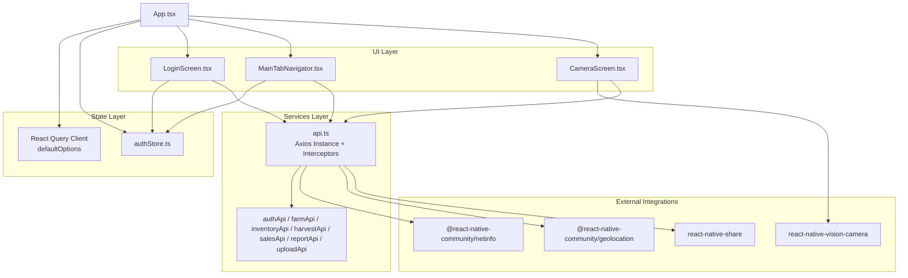

**Diagram sources**
- [App.tsx](file://App.tsx#L14-L22)
- [authStore.ts](file://src/store/authStore.ts#L29-L115)
- [api.ts](file://src/services/api.ts#L6-L14)
- [AppNavigator.tsx](file://src/navigation/AppNavigator.tsx#L28-L59)
- [MainTabNavigator.tsx](file://src/navigation/MainTabNavigator.tsx#L315-L350)
- [LoginScreen.tsx](file://src/screens/auth/LoginScreen.tsx#L38-L82)
- [CameraScreen.tsx](file://src/screens/common/CameraScreen.tsx#L1-L214)

**Section sources**
- [App.tsx](file://App.tsx#L1-L95)
- [package.json](file://package.json#L14-L48)

## Core Components
- Authentication Store (Zustand):
  - Holds user, tokens, and authentication state
  - Provides getters for role checks and setters for login/logout
- API Client (Axios + Interceptors):
  - Adds Authorization header from Zustand store
  - Handles 401 refresh flow and logout fallback
  - Exposes typed endpoints grouped by domain
- React Query Provider:
  - Centralized caching, retries, and invalidation
  - Enables optimistic updates and cache synchronization
- Navigation:
  - Stack navigator routes based on authentication state
  - Bottom tabs filtered by role and badges computed from queries

**Section sources**
- [authStore.ts](file://src/store/authStore.ts#L6-L115)
- [api.ts](file://src/services/api.ts#L16-L65)
- [App.tsx](file://App.tsx#L14-L22)
- [AppNavigator.tsx](file://src/navigation/AppNavigator.tsx#L28-L59)
- [MainTabNavigator.tsx](file://src/navigation/MainTabNavigator.tsx#L49-L60)

## Architecture Overview
The system uses a unidirectional data flow:
- UI triggers actions (form submissions, taps)
- UI invokes Zustand actions or React Query mutations
- API client interceptors attach auth tokens and handle refresh
- Server responds with typed data; UI updates local and server state
- React Query invalidations propagate changes across screens

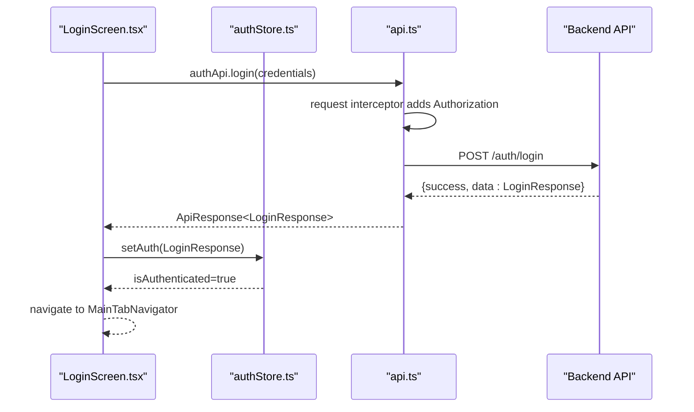

**Diagram sources**
- [LoginScreen.tsx](file://src/screens/auth/LoginScreen.tsx#L43-L82)
- [api.ts](file://src/services/api.ts#L68-L89)
- [authStore.ts](file://src/store/authStore.ts#L40-L76)
- [AppNavigator.tsx](file://src/navigation/AppNavigator.tsx#L28-L59)

## Detailed Component Analysis

### Authentication Flow and Navigation
- App initializes React Query and wraps the app with providers.
- AppNavigator renders either Login/Register or MainTabNavigator depending on authentication state from Zustand.
- LoginScreen validates input, calls authApi.login, and upon success sets Zustand state and navigates.

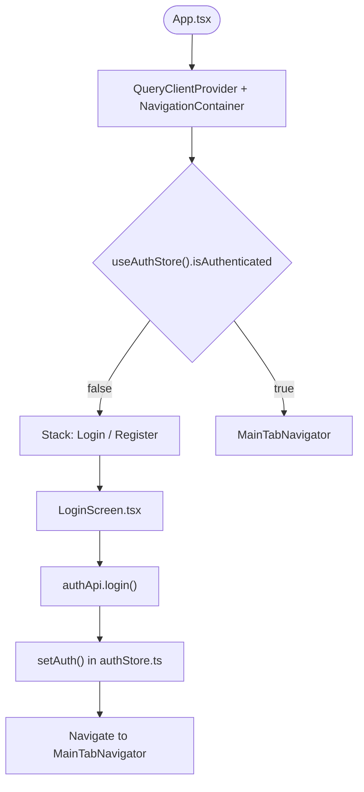

**Diagram sources**
- [App.tsx](file://App.tsx#L55-L71)
- [AppNavigator.tsx](file://src/navigation/AppNavigator.tsx#L28-L59)
- [LoginScreen.tsx](file://src/screens/auth/LoginScreen.tsx#L38-L82)
- [authStore.ts](file://src/store/authStore.ts#L40-L76)

**Section sources**
- [App.tsx](file://App.tsx#L24-L71)
- [AppNavigator.tsx](file://src/navigation/AppNavigator.tsx#L28-L59)
- [LoginScreen.tsx](file://src/screens/auth/LoginScreen.tsx#L38-L82)
- [authStore.ts](file://src/store/authStore.ts#L29-L115)

### API Client and Token Refresh
- Axios instance configured with base URL and timeouts.
- Request interceptor reads token from Zustand and attaches Authorization header.
- Response interceptor detects 401 Unauthorized, attempts refresh, and retries original request; otherwise logs out and rejects.

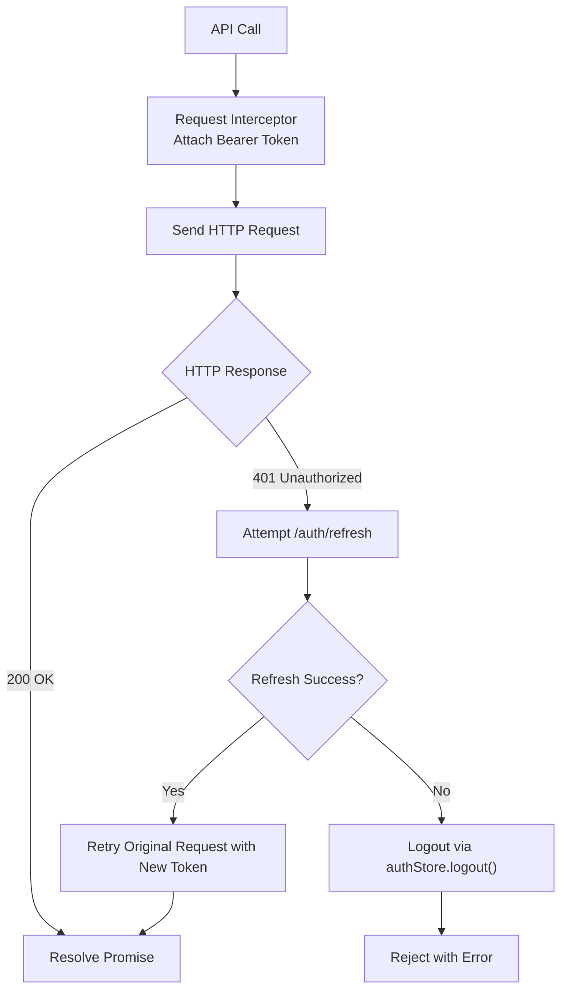

**Diagram sources**
- [api.ts](file://src/services/api.ts#L6-L14)
- [api.ts](file://src/services/api.ts#L16-L65)
- [authStore.ts](file://src/store/authStore.ts#L64-L72)

**Section sources**
- [api.ts](file://src/services/api.ts#L6-L65)
- [authStore.ts](file://src/store/authStore.ts#L40-L76)

### Data Fetching with React Query
- Queries are defined per screen/tab with query keys and enabled conditions based on role and visibility.
- Stale times and refetch policies minimize redundant network calls.
- Mutations invalidate related queries to synchronize UI state.

Examples:
- MainTabNavigator computes tab badges by querying batches, farms, and pending inspections.
- InventoryScreen fetches active batches and pending gate passes with enabled guards.
- UserApprovalScreen fetches users and approves with mutation + invalidation.

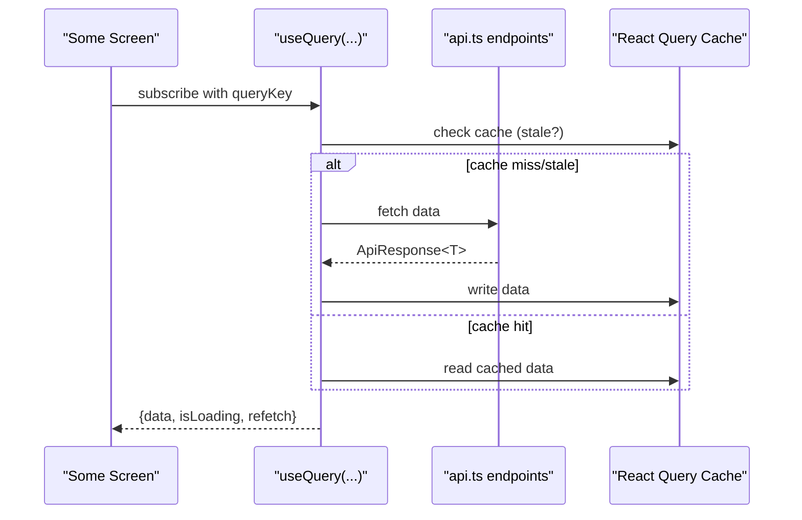

**Diagram sources**
- [MainTabNavigator.tsx](file://src/navigation/MainTabNavigator.tsx#L158-L200)
- [MainTabNavigator.tsx](file://src/navigation/MainTabNavigator.tsx#L208-L281)
- [App.tsx](file://App.tsx#L14-L22)

**Section sources**
- [MainTabNavigator.tsx](file://src/navigation/MainTabNavigator.tsx#L158-L281)
- [App.tsx](file://App.tsx#L14-L22)

### Optimistic Updates and State Synchronization
- Mutations update UI immediately (optimistic) and then reconcile with server.
- After success, invalidate related query keys to force refetch and align UI with server state.
- Example: SubmitHarvestScreen updates batch status optimistically and invalidates multiple caches.

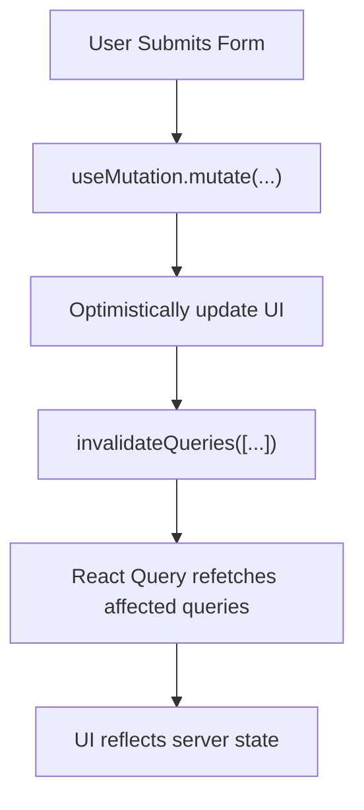

**Diagram sources**
- [SubmitHarvestScreen.tsx](file://src/screens/harvest/SubmitHarvestScreen.tsx#L42-L73)

**Section sources**
- [SubmitHarvestScreen.tsx](file://src/screens/harvest/SubmitHarvestScreen.tsx#L42-L73)

### Error Propagation and Loading States
- UI surfaces loading via component-local state and React Query’s isLoading.
- Toast notifications display user-friendly messages for success/error.
- API client centralizes error handling; screens catch and present errors.

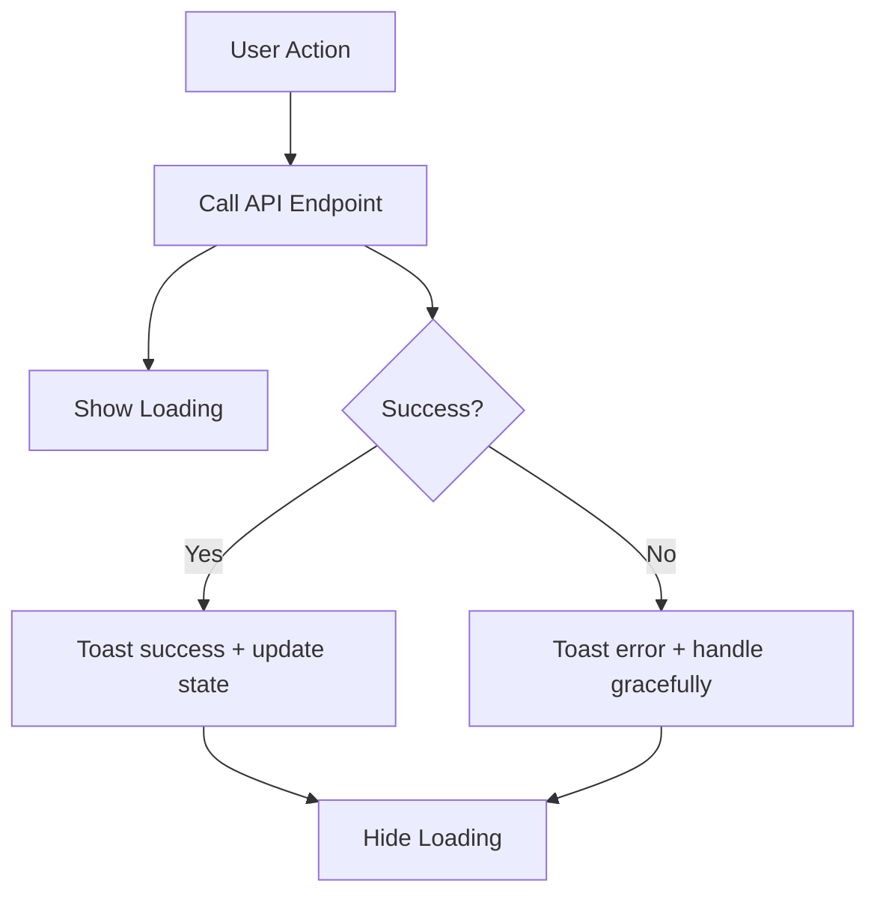

**Diagram sources**
- [LoginScreen.tsx](file://src/screens/auth/LoginScreen.tsx#L38-L82)
- [UserApprovalScreen.tsx](file://src/screens/admin/UserApprovalScreen.tsx#L36-L55)

**Section sources**
- [LoginScreen.tsx](file://src/screens/auth/LoginScreen.tsx#L38-L82)
- [UserApprovalScreen.tsx](file://src/screens/admin/UserApprovalScreen.tsx#L36-L55)

### Event-Driven Architecture and Real-Time Updates
- While not a pub/sub system, the app achieves near real-time state synchronization via:
  - React Query invalidations on mutations
  - Role-based tab filtering and badge computation
  - Shared query keys across components to ensure consistent views
- Example: Batch status changes trigger invalidations that refresh dependent screens.

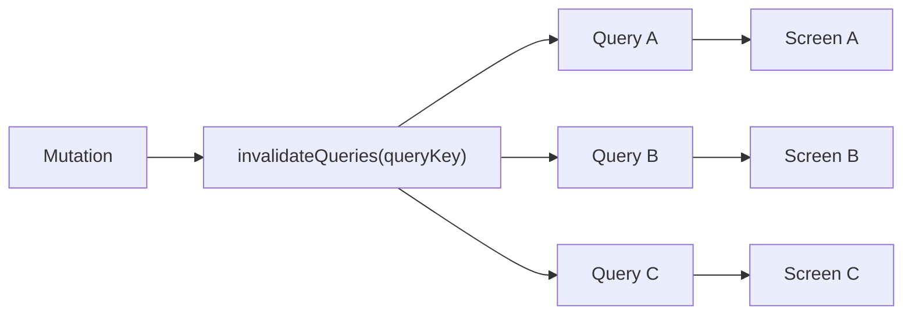

**Diagram sources**
- [MainTabNavigator.tsx](file://src/navigation/MainTabNavigator.tsx#L158-L200)
- [BatchLifecycleScreen.tsx](file://src/screens/batches/BatchLifecycleScreen.tsx#L153-L174)

**Section sources**
- [MainTabNavigator.tsx](file://src/navigation/MainTabNavigator.tsx#L158-L200)
- [BatchLifecycleScreen.tsx](file://src/screens/batches/BatchLifecycleScreen.tsx#L153-L174)

### Mobile-Specific Integrations (Camera, Permissions, Uploads)
- CameraScreen integrates react-native-vision-camera:
  - Checks and requests camera permission
  - Captures photo, previews, and confirms usage
  - Navigates back with captured URI or invokes callback
- Uploads use uploadApi endpoints with multipart/form-data and optional inspectionId parameters.
- Additional mobile packages include geolocation, netinfo, and sharing.

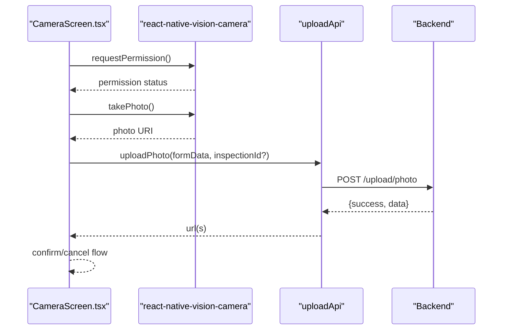

**Diagram sources**
- [CameraScreen.tsx](file://src/screens/common/CameraScreen.tsx#L13-L79)
- [api.ts](file://src/services/api.ts#L291-L323)

**Section sources**
- [CameraScreen.tsx](file://src/screens/common/CameraScreen.tsx#L13-L79)
- [api.ts](file://src/services/api.ts#L291-L323)
- [package.json](file://package.json#L16-L46)

### Data Movement Between Local State (Zustand), Server State (React Query), and UI
- Local state (Zustand):
  - Stores user, tokens, and authentication flags
  - Used by AppNavigator to decide which screens to render
- Server state (React Query):
  - Queries cache data keyed by domain and feature
  - Enabled conditions depend on role and visibility
- UI:
  - Renders based on Zustand state and React Query data
  - Triggers mutations and invalidations to keep state consistent

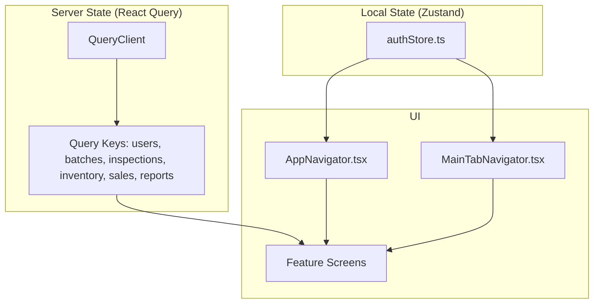

**Diagram sources**
- [authStore.ts](file://src/store/authStore.ts#L29-L115)
- [App.tsx](file://App.tsx#L14-L22)
- [AppNavigator.tsx](file://src/navigation/AppNavigator.tsx#L28-L59)
- [MainTabNavigator.tsx](file://src/navigation/MainTabNavigator.tsx#L158-L200)

**Section sources**
- [authStore.ts](file://src/store/authStore.ts#L29-L115)
- [App.tsx](file://App.tsx#L14-L22)
- [AppNavigator.tsx](file://src/navigation/AppNavigator.tsx#L28-L59)
- [MainTabNavigator.tsx](file://src/navigation/MainTabNavigator.tsx#L158-L200)

## Dependency Analysis
- External libraries:
  - Zustand for lightweight local state
  - React Query for caching, retries, and invalidations
  - Axios for HTTP requests with interceptors
  - react-native-vision-camera for camera
  - Navigation libraries for routing
- Internal dependencies:
  - Screens depend on services (api.ts) and Zustand store
  - Navigation depends on Zustand for authentication state
  - Types define shared contracts across services and screens

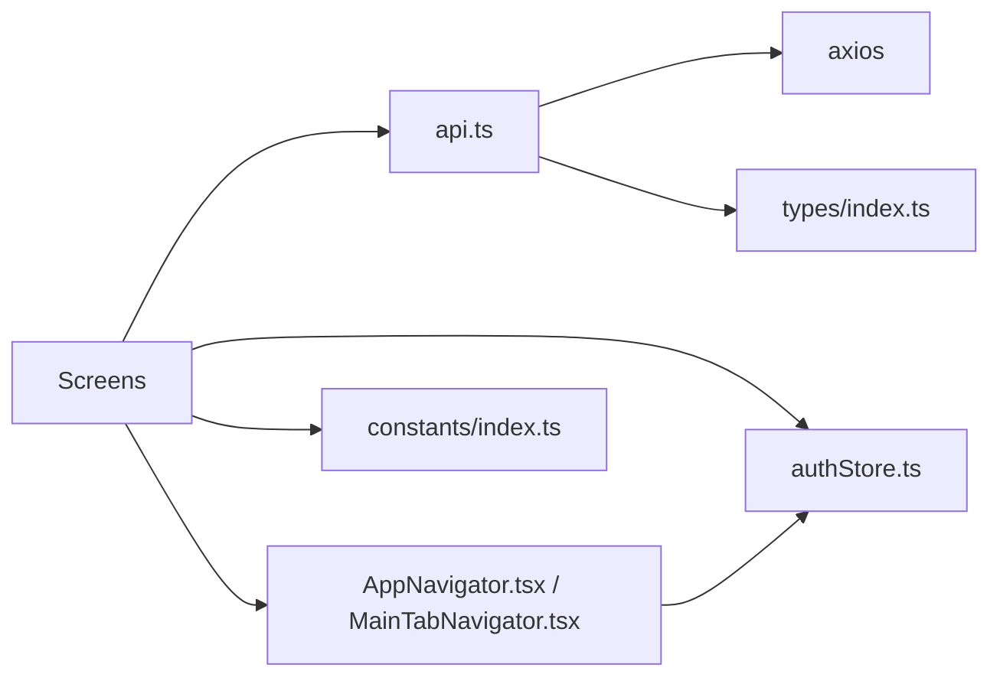

**Diagram sources**
- [api.ts](file://src/services/api.ts#L1-L14)
- [authStore.ts](file://src/store/authStore.ts#L1-L4)
- [AppNavigator.tsx](file://src/navigation/AppNavigator.tsx#L1-L26)
- [MainTabNavigator.tsx](file://src/navigation/MainTabNavigator.tsx#L1-L64)
- [index.ts (types)](file://src/types/index.ts#L1-L429)
- [index.ts (constants)](file://src/constants/index.ts#L1-L363)

**Section sources**
- [package.json](file://package.json#L14-L48)
- [api.ts](file://src/services/api.ts#L1-L14)
- [authStore.ts](file://src/store/authStore.ts#L1-L4)
- [AppNavigator.tsx](file://src/navigation/AppNavigator.tsx#L1-L26)
- [MainTabNavigator.tsx](file://src/navigation/MainTabNavigator.tsx#L1-L64)
- [index.ts (types)](file://src/types/index.ts#L1-L429)
- [index.ts (constants)](file://src/constants/index.ts#L1-L363)

## Performance Considerations
- React Query defaults:
  - Retry attempts and staleTime configured to balance freshness and performance
  - Disabled refetch on window focus to reduce unnecessary network activity
- Query scoping:
  - enabled guards prevent unnecessary requests for unauthorized roles
  - Shared query keys across components ensure consistent views without duplication
- Local state persistence:
  - Zustand persist middleware stores tokens and user to AsyncStorage for resilience across sessions

[No sources needed since this section provides general guidance]

## Troubleshooting Guide
Common issues and resolutions:
- Authentication failures:
  - 401 Unauthorized triggers automatic token refresh; if refresh fails, user is logged out
  - Verify token presence in Zustand and ensure interceptors are attached
- Network errors:
  - Check API_BASE_URL and API_TIMEOUT
  - Inspect error messages from API responses and display via Toast
- Camera permissions:
  - Ensure camera permission is granted; CameraScreen handles permission requests
  - On Android, handle “Never ask again” scenario by directing users to settings
- Uploads:
  - Ensure multipart/form-data headers and optional inspectionId parameters are set
  - Validate file types and sizes before upload

**Section sources**
- [api.ts](file://src/services/api.ts#L16-L65)
- [CameraScreen.tsx](file://src/screens/common/CameraScreen.tsx#L31-L85)
- [api.ts](file://src/services/api.ts#L291-L323)
- [index.ts (constants)](file://src/constants/index.ts#L6-L7)

## Conclusion
The application implements a clean separation of concerns:
- UI components trigger actions and render based on Zustand and React Query
- API client centralizes authentication and error handling
- Role-based navigation and tab filtering ensure appropriate feature access
- React Query invalidations synchronize state across screens without complex subscriptions
- Mobile integrations are encapsulated in dedicated screens and services

This architecture enables predictable data flow, robust error handling, and scalable feature additions while maintaining a responsive user experience.