# Navigation Architecture

<cite>
**Referenced Files in This Document**
- [App.tsx](file://App.tsx)
- [AppNavigator.tsx](file://src/navigation/AppNavigator.tsx)
- [MainTabNavigator.tsx](file://src/navigation/MainTabNavigator.tsx)
- [authStore.ts](file://src/store/authStore.ts)
- [index.ts](file://src/types/index.ts)
- [index.ts](file://src/constants/index.ts)
- [LoginScreen.tsx](file://src/screens/auth/LoginScreen.tsx)
- [DashboardScreen.tsx](file://src/screens/dashboard/DashboardScreen.tsx)
- [BatchesScreen.tsx](file://src/screens/batches/BatchesScreen.tsx)
- [HarvestScreen.tsx](file://src/screens/harvest/HarvestScreen.tsx)
- [InspectionsScreen.tsx](file://src/screens/inspections/InspectionsScreen.tsx)
- [api.ts](file://src/services/api.ts)
</cite>

## Table of Contents
1. [Introduction](#introduction)
2. [Project Structure](#project-structure)
3. [Core Components](#core-components)
4. [Architecture Overview](#architecture-overview)
5. [Detailed Component Analysis](#detailed-component-analysis)
6. [Dependency Analysis](#dependency-analysis)
7. [Performance Considerations](#performance-considerations)
8. [Troubleshooting Guide](#troubleshooting-guide)
9. [Conclusion](#conclusion)

## Introduction
This document explains the navigation architecture of the Harvest app, focusing on the hierarchical structure from the root container to the main tab navigator. It details the role-based visibility system for tabs, route configuration, parameter passing, navigation state management, authentication guards, and the custom tab bar integration with the design system. The goal is to help developers understand how navigation works across different user roles and how to extend or modify the navigation patterns safely.

## Project Structure
The navigation system is organized around three key files:
- App.tsx: Root container that initializes providers and wraps the app with NavigationContainer.
- AppNavigator.tsx: Top-level stack navigator controlling authentication and main routes.
- MainTabNavigator.tsx: Custom bottom tab navigator with role-based visibility and dynamic badges.

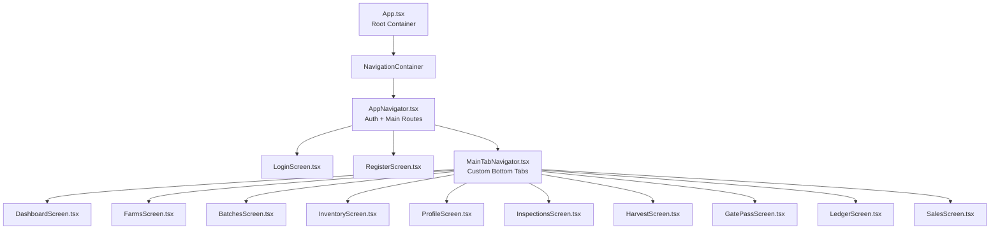

**Diagram sources**
- [App.tsx](file://App.tsx#L55-L71)
- [AppNavigator.tsx](file://src/navigation/AppNavigator.tsx#L28-L59)
- [MainTabNavigator.tsx](file://src/navigation/MainTabNavigator.tsx#L315-L350)

**Section sources**
- [App.tsx](file://App.tsx#L1-L95)
- [AppNavigator.tsx](file://src/navigation/AppNavigator.tsx#L1-L60)
- [MainTabNavigator.tsx](file://src/navigation/MainTabNavigator.tsx#L1-L414)

## Core Components
- Root container: Provides providers (Query Client, Safe Area, Gesture Handler) and wraps the app with NavigationContainer.
- AppNavigator: Conditional stack routing based on authentication state; exposes routes for main tabs and auxiliary screens.
- MainTabNavigator: Custom bottom tab bar with role-based visibility, dynamic badges, and initial route selection per role.

Key responsibilities:
- Authentication guard: AppNavigator conditionally renders Login/Register or Main based on isAuthenticated.
- Role-based visibility: MainTabNavigator filters tabs based on user role.
- Parameter passing: Route parameters are strongly typed via RootStackParamList and used across screens.
- State management: Authentication state is centralized in authStore, consumed by navigators and screens.

**Section sources**
- [App.tsx](file://App.tsx#L24-L72)
- [AppNavigator.tsx](file://src/navigation/AppNavigator.tsx#L28-L59)
- [MainTabNavigator.tsx](file://src/navigation/MainTabNavigator.tsx#L315-L350)
- [authStore.ts](file://src/store/authStore.ts#L29-L116)
- [index.ts](file://src/types/index.ts#L20-L34)

## Architecture Overview
The navigation architecture follows a layered approach:
- App.tsx initializes providers and renders NavigationContainer.
- AppNavigator manages authentication flow and main routes.
- MainTabNavigator encapsulates tab-level navigation with custom tab bar and role-aware visibility.

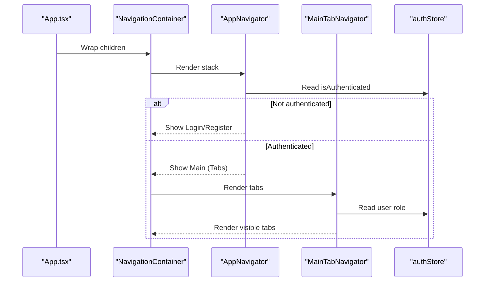

**Diagram sources**
- [App.tsx](file://App.tsx#L55-L71)
- [AppNavigator.tsx](file://src/navigation/AppNavigator.tsx#L28-L59)
- [MainTabNavigator.tsx](file://src/navigation/MainTabNavigator.tsx#L315-L350)
- [authStore.ts](file://src/store/authStore.ts#L29-L116)

## Detailed Component Analysis

### App.tsx: Root Container
- Initializes Query Client with retry and staleTime policies.
- Wraps the app with SafeAreaProvider, GestureHandlerRootView, and NavigationContainer.
- Uses useAuthStore to determine readiness and render the AppNavigator.

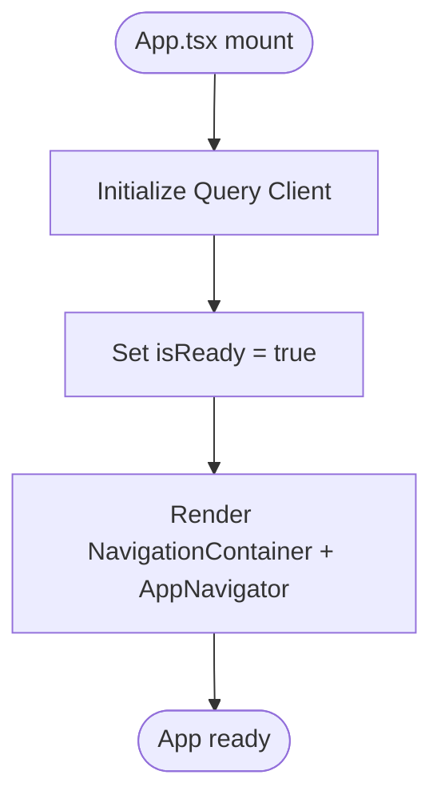

**Diagram sources**
- [App.tsx](file://App.tsx#L14-L42)
- [App.tsx](file://App.tsx#L55-L71)

**Section sources**
- [App.tsx](file://App.tsx#L1-L95)

### AppNavigator: Main Stack Configuration
- Imports all screens and the MainTabNavigator.
- Uses useAuthStore to decide whether to show Login/Register or Main.
- Defines routes for main tabs and auxiliary screens with parameter types from RootStackParamList.

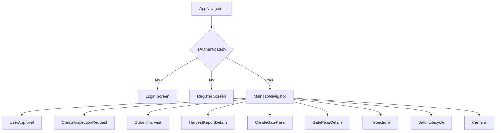

**Diagram sources**
- [AppNavigator.tsx](file://src/navigation/AppNavigator.tsx#L28-L59)

**Section sources**
- [AppNavigator.tsx](file://src/navigation/AppNavigator.tsx#L1-L60)
- [index.ts](file://src/types/index.ts#L20-L34)

### MainTabNavigator: Custom Bottom Tab Implementation
- Defines a constant TAB_ITEMS array mapping tab names, icons, labels, and allowed roles.
- Implements a custom tab bar with animated buttons, badges, and role-based visibility.
- Computes badge counts for Farms, Batches, Harvest, GatePass, and Inspections based on API queries and user role.
- Sets initialRouteName based on user role.

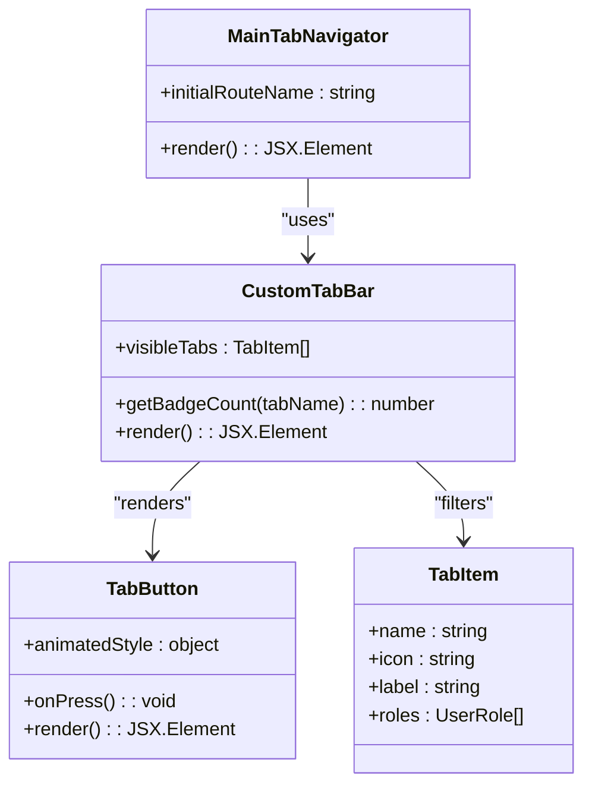

**Diagram sources**
- [MainTabNavigator.tsx](file://src/navigation/MainTabNavigator.tsx#L315-L350)
- [MainTabNavigator.tsx](file://src/navigation/MainTabNavigator.tsx#L152-L313)
- [MainTabNavigator.tsx](file://src/navigation/MainTabNavigator.tsx#L90-L150)
- [MainTabNavigator.tsx](file://src/navigation/MainTabNavigator.tsx#L42-L60)

**Section sources**
- [MainTabNavigator.tsx](file://src/navigation/MainTabNavigator.tsx#L1-L414)
- [index.ts](file://src/types/index.ts#L2-L7)

### Role-Based Navigation Visibility
- TAB_ITEMS defines allowed roles for each tab.
- CustomTabBar filters visible tabs using user role from authStore.
- Initial route selection is role-aware.

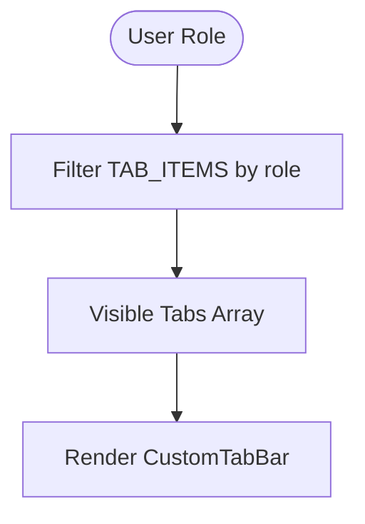

**Diagram sources**
- [MainTabNavigator.tsx](file://src/navigation/MainTabNavigator.tsx#L284-L286)
- [MainTabNavigator.tsx](file://src/navigation/MainTabNavigator.tsx#L319-L328)

**Section sources**
- [MainTabNavigator.tsx](file://src/navigation/MainTabNavigator.tsx#L49-L60)
- [MainTabNavigator.tsx](file://src/navigation/MainTabNavigator.tsx#L284-L286)
- [MainTabNavigator.tsx](file://src/navigation/MainTabNavigator.tsx#L319-L328)

### Route Configuration and Parameter Passing
- RootStackParamList defines all routes and their parameters.
- Strongly typed navigation props are used in screens to navigate and pass parameters.
- Examples:
  - Navigating to BatchLifecycle with a batch object parameter.
  - Navigating to Inspections with optional photo parameter.

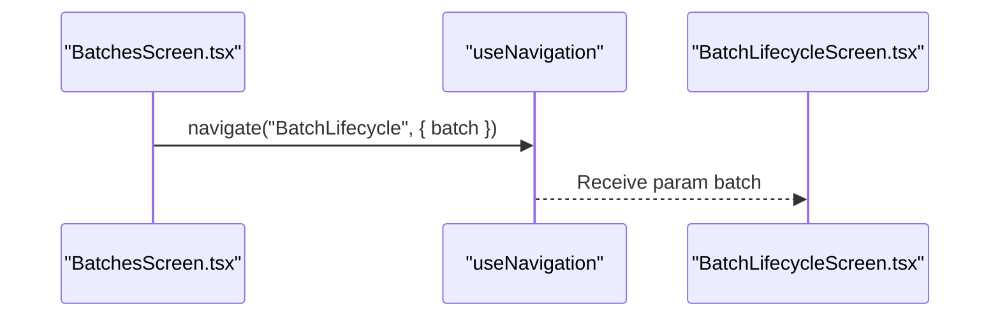

**Diagram sources**
- [BatchesScreen.tsx](file://src/screens/batches/BatchesScreen.tsx#L116-L117)
- [index.ts](file://src/types/index.ts#L20-L34)

**Section sources**
- [index.ts](file://src/types/index.ts#L20-L34)
- [BatchesScreen.tsx](file://src/screens/batches/BatchesScreen.tsx#L116-L117)
- [InspectionsScreen.tsx](file://src/screens/inspections/InspectionsScreen.tsx#L91-L91)

### Navigation State Management and Authentication Guards
- Authentication state is managed in authStore with persisted storage.
- AppNavigator conditionally renders authentication screens or main tabs based on isAuthenticated.
- API interceptors handle token refresh and logout on 401 responses.

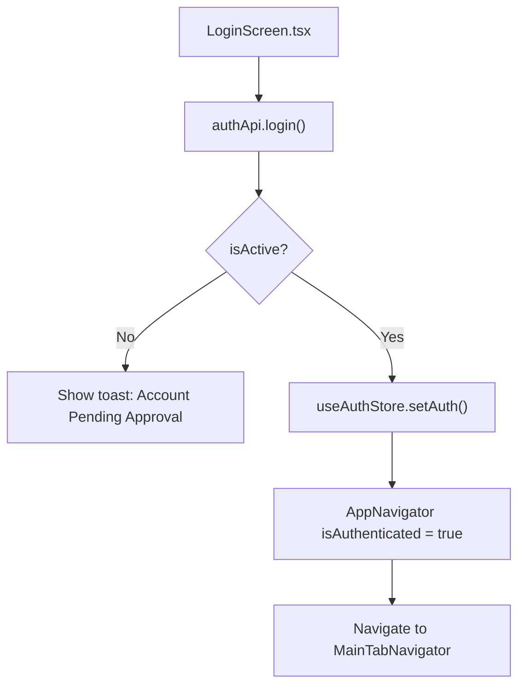

**Diagram sources**
- [LoginScreen.tsx](file://src/screens/auth/LoginScreen.tsx#L43-L82)
- [authStore.ts](file://src/store/authStore.ts#L40-L76)
- [AppNavigator.tsx](file://src/navigation/AppNavigator.tsx#L38-L56)
- [api.ts](file://src/services/api.ts#L30-L65)

**Section sources**
- [authStore.ts](file://src/store/authStore.ts#L29-L116)
- [LoginScreen.tsx](file://src/screens/auth/LoginScreen.tsx#L38-L82)
- [AppNavigator.tsx](file://src/navigation/AppNavigator.tsx#L28-L59)
- [api.ts](file://src/services/api.ts#L16-L65)

### Custom Tab Bar Integration with Design System
- Uses COLORS, SPACING, and GLASS effects from constants for styling.
- Implements animated scaling and active indicators for interactive feedback.
- Badge rendering uses status colors and positioning for visual prominence.

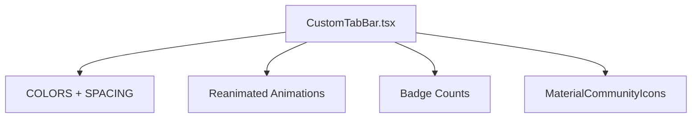

**Diagram sources**
- [MainTabNavigator.tsx](file://src/navigation/MainTabNavigator.tsx#L352-L413)
- [index.ts](file://src/constants/index.ts#L21-L138)

**Section sources**
- [MainTabNavigator.tsx](file://src/navigation/MainTabNavigator.tsx#L352-L413)
- [index.ts](file://src/constants/index.ts#L1-L363)

### Navigation Patterns and User Workflow
- Authentication-first flow: Non-authenticated users see Login/Register; authenticated users see Main tabs.
- Role-driven tab visibility: Super Admin sees Farms, Batches, Inventory, Sales; Manager mirrors Admin minus Sales; Vendor sees Inspections, Harvest, Ledger; Store Keeper sees Inventory and GatePass.
- Parameterized navigation: Screens pass data (e.g., batch objects) to detail screens.
- Auto-refresh on focus: Screens invalidate queries when they come into focus to keep data fresh.

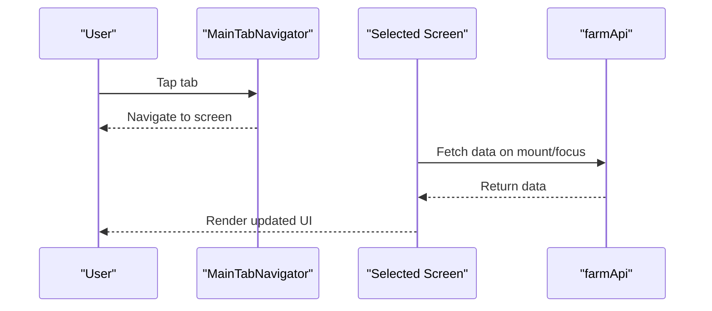

**Diagram sources**
- [MainTabNavigator.tsx](file://src/navigation/MainTabNavigator.tsx#L315-L350)
- [DashboardScreen.tsx](file://src/screens/dashboard/DashboardScreen.tsx#L49-L57)
- [HarvestScreen.tsx](file://src/screens/harvest/HarvestScreen.tsx#L49-L61)

**Section sources**
- [MainTabNavigator.tsx](file://src/navigation/MainTabNavigator.tsx#L49-L60)
- [DashboardScreen.tsx](file://src/screens/dashboard/DashboardScreen.tsx#L49-L57)
- [HarvestScreen.tsx](file://src/screens/harvest/HarvestScreen.tsx#L49-L61)

## Dependency Analysis
- App.tsx depends on NavigationContainer and AppNavigator.
- AppNavigator depends on authStore and all screen components.
- MainTabNavigator depends on authStore, constants, and multiple screen components.
- Screens depend on services (api.ts) and react-query for data fetching.

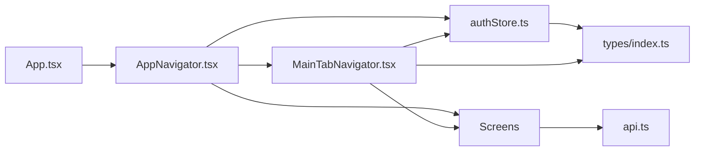

**Diagram sources**
- [App.tsx](file://App.tsx#L9-L11)
- [AppNavigator.tsx](file://src/navigation/AppNavigator.tsx#L3-L15)
- [MainTabNavigator.tsx](file://src/navigation/MainTabNavigator.tsx#L11-L25)
- [authStore.ts](file://src/store/authStore.ts#L1-L4)
- [api.ts](file://src/services/api.ts#L1-L4)

**Section sources**
- [App.tsx](file://App.tsx#L1-L95)
- [AppNavigator.tsx](file://src/navigation/AppNavigator.tsx#L1-L60)
- [MainTabNavigator.tsx](file://src/navigation/MainTabNavigator.tsx#L1-L414)
- [authStore.ts](file://src/store/authStore.ts#L1-L116)
- [api.ts](file://src/services/api.ts#L1-L200)

## Performance Considerations
- Query caching: Query Client configured with retry and staleTime to minimize network calls.
- Conditional queries: Queries are enabled only when relevant (e.g., pending inspections for approvers).
- Badge computation: Badge counts are computed from existing batch/farm data to avoid extra network calls.
- Auto-refresh on focus: useFocusEffect invalidates queries to keep UI fresh without manual pull-to-refresh.

[No sources needed since this section provides general guidance]

## Troubleshooting Guide
Common issues and resolutions:
- Authentication loop: Ensure authStore persists tokens and isAuthenticated is correctly set after login.
- Missing tabs: Verify user role in authStore and TAB_ITEMS role arrays.
- Stale data: Use useFocusEffect to invalidate queries on screen focus.
- Navigation parameter errors: Confirm RootStackParamList includes all route parameters and types match screen expectations.

**Section sources**
- [authStore.ts](file://src/store/authStore.ts#L29-L116)
- [MainTabNavigator.tsx](file://src/navigation/MainTabNavigator.tsx#L284-L286)
- [DashboardScreen.tsx](file://src/screens/dashboard/DashboardScreen.tsx#L49-L57)
- [index.ts](file://src/types/index.ts#L20-L34)

## Conclusion
The navigation architecture cleanly separates concerns: App.tsx handles initialization, AppNavigator controls authentication flow, and MainTabNavigator provides a role-aware, visually integrated tab experience. Strong typing, reactive data fetching, and authentication guards ensure robust navigation across user roles. Extending the system involves adding routes to RootStackParamList, updating TAB_ITEMS for new tabs, and wiring up screens with parameterized navigation and query invalidation patterns.