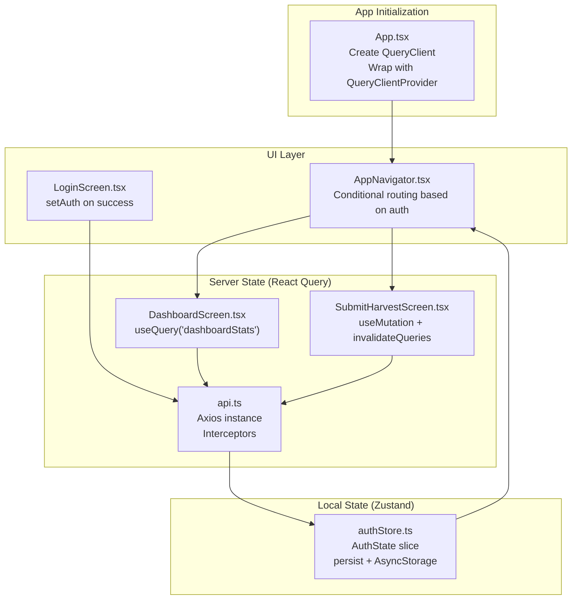
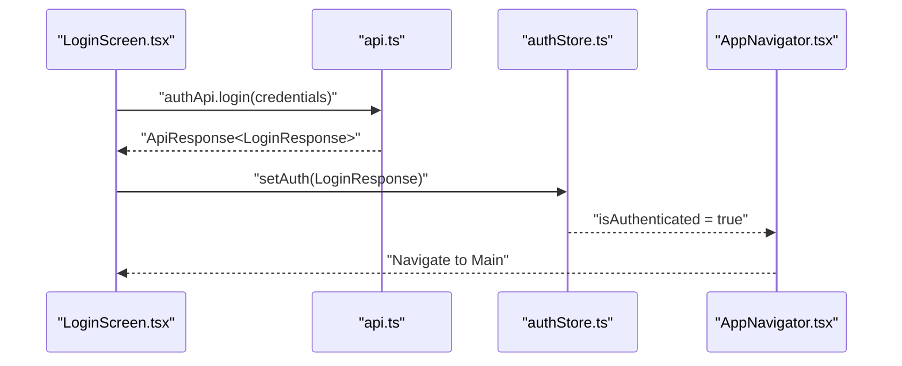
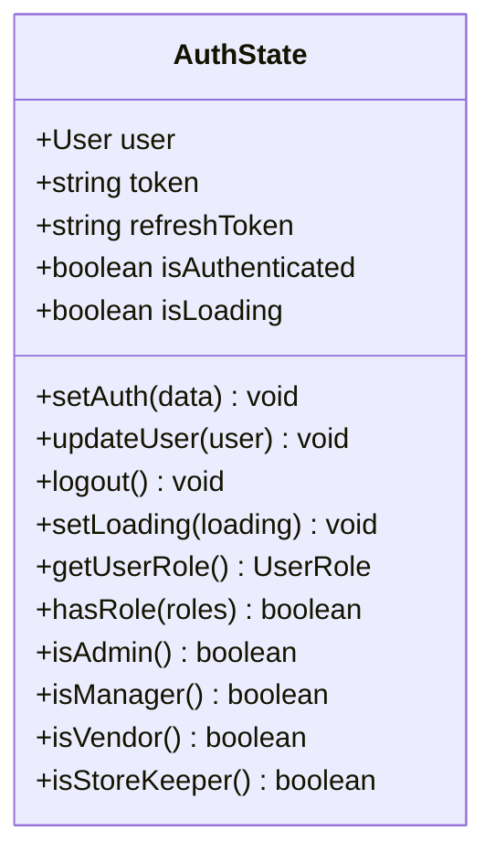
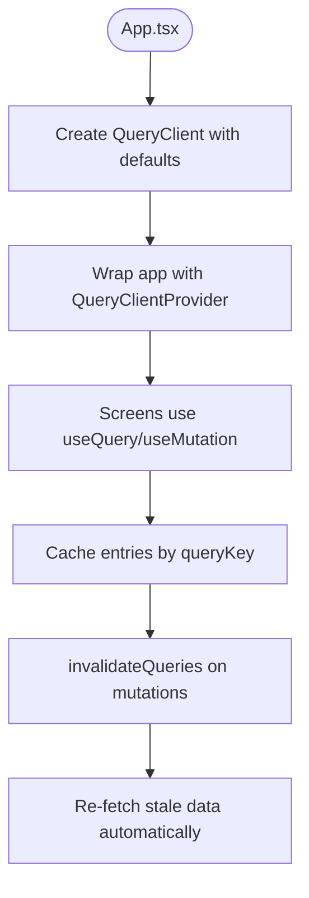
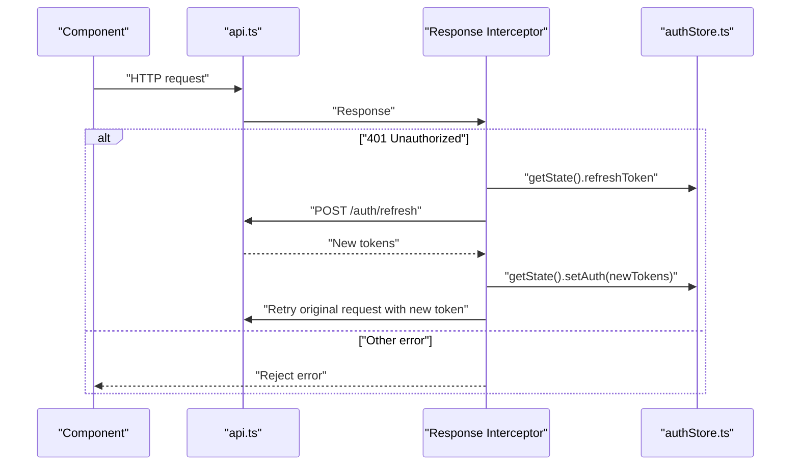
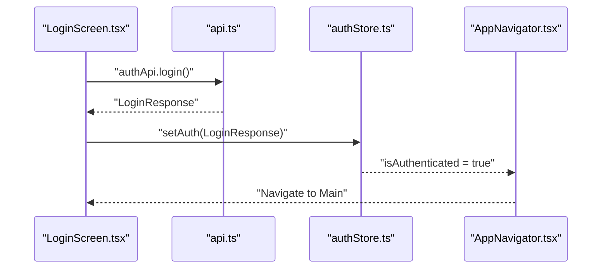
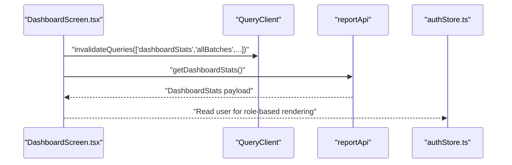
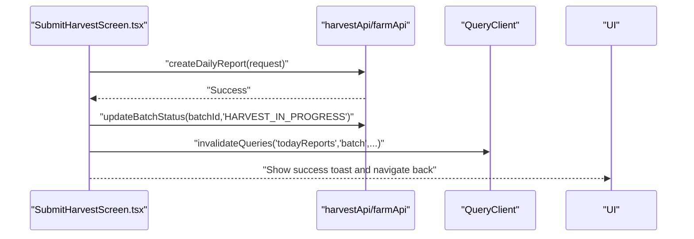
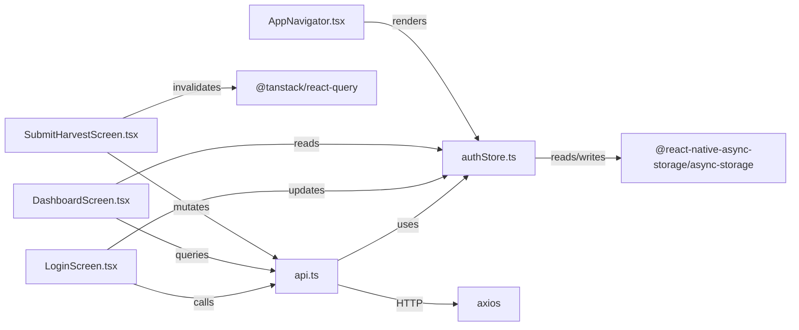

# State Management Architecture

<cite>
**Referenced Files in This Document**
- [App.tsx](file://App.tsx)
- [authStore.ts](file://src/store/authStore.ts)
- [api.ts](file://src/services/api.ts)
- [LoginScreen.tsx](file://src/screens/auth/LoginScreen.tsx)
- [DashboardScreen.tsx](file://src/screens/dashboard/DashboardScreen.tsx)
- [SubmitHarvestScreen.tsx](file://src/screens/harvest/SubmitHarvestScreen.tsx)
- [AppNavigator.tsx](file://src/navigation/AppNavigator.tsx)
- [index.ts](file://src/types/index.ts)
- [index.ts](file://src/constants/index.ts)
- [package.json](file://package.json)
</cite>

## Table of Contents
1. [Introduction](#introduction)
2. [Project Structure](#project-structure)
3. [Core Components](#core-components)
4. [Architecture Overview](#architecture-overview)
5. [Detailed Component Analysis](#detailed-component-analysis)
6. [Dependency Analysis](#dependency-analysis)
7. [Performance Considerations](#performance-considerations)
8. [Troubleshooting Guide](#troubleshooting-guide)
9. [Conclusion](#conclusion)

## Introduction
This document explains the state management architecture that combines Zustand for local application state and React Query for server state. It covers how authentication, user preferences, and UI state are managed locally with Zustand’s minimal boilerplate and lightweight approach. It also documents how React Query handles server state, caching, background synchronization, and optimistic updates. The integration between local and server state is demonstrated through API responses updating the global store and how local changes are synchronized with the backend via cache invalidation and mutations. Examples of state selectors, middleware usage, and persistence mechanisms are included, along with benefits for mobile applications such as performance optimization and offline readiness.

## Project Structure
The application initializes React Query globally and wraps the app with a provider. Authentication state is stored in a Zustand store with persistence to AsyncStorage. API clients and typed endpoints are centralized under a single module. Screens consume both local Zustand state and React Query hooks to manage UI state and server state.

**Diagram sources**
- [App.tsx](file://App.tsx#L14-L22)
- [authStore.ts](file://src/store/authStore.ts#L29-L115)
- [api.ts](file://src/services/api.ts#L6-L65)
- [DashboardScreen.tsx](file://src/screens/dashboard/DashboardScreen.tsx#L58-L64)
- [SubmitHarvestScreen.tsx](file://src/screens/harvest/SubmitHarvestScreen.tsx#L42-L73)
- [AppNavigator.tsx](file://src/navigation/AppNavigator.tsx#L28-L58)
- [LoginScreen.tsx](file://src/screens/auth/LoginScreen.tsx#L43-L82)

**Section sources**
- [App.tsx](file://App.tsx#L14-L22)
- [authStore.ts](file://src/store/authStore.ts#L29-L115)
- [api.ts](file://src/services/api.ts#L6-L65)
- [AppNavigator.tsx](file://src/navigation/AppNavigator.tsx#L28-L58)

## Core Components
- Zustand store for authentication and UI flags:
  - Stores user, tokens, authentication status, and loading state.
  - Provides actions to set auth, update user, logout, and set loading.
  - Exposes getters for role checks and convenience helpers.
  - Persisted to AsyncStorage with selective serialization.
- React Query client configured globally with default caching and retry policies.
- API service with Axios instance and interceptors:
  - Adds Authorization header from Zustand store.
  - Handles 401 Unauthorized by refreshing tokens and retrying requests.
  - Centralized API endpoints grouped by domain (auth, farm, inventory, harvest, sales, reports, uploads).
- Screens consuming both local and server state:
  - Login screen updates Zustand after successful API call.
  - Dashboard screen fetches and displays server state with React Query.
  - Submit harvest screen performs mutations and invalidates related queries.

**Section sources**
- [authStore.ts](file://src/store/authStore.ts#L6-L27)
- [authStore.ts](file://src/store/authStore.ts#L29-L115)
- [App.tsx](file://App.tsx#L14-L22)
- [api.ts](file://src/services/api.ts#L6-L65)
- [api.ts](file://src/services/api.ts#L67-L326)
- [LoginScreen.tsx](file://src/screens/auth/LoginScreen.tsx#L43-L82)
- [DashboardScreen.tsx](file://src/screens/dashboard/DashboardScreen.tsx#L58-L64)
- [SubmitHarvestScreen.tsx](file://src/screens/harvest/SubmitHarvestScreen.tsx#L42-L73)

## Architecture Overview
The architecture follows a hybrid pattern:
- Local state (Zustand): Lightweight, synchronous, persisted, and suitable for UI flags, user identity, and short-lived preferences.
- Server state (React Query): Asynchronous, cached, stale-while-revalidate, and optimized for network resilience and background synchronization.

**Diagram sources**
- [LoginScreen.tsx](file://src/screens/auth/LoginScreen.tsx#L43-L82)
- [api.ts](file://src/services/api.ts#L67-L89)
- [authStore.ts](file://src/store/authStore.ts#L39-L76)
- [AppNavigator.tsx](file://src/navigation/AppNavigator.tsx#L28-L58)

## Detailed Component Analysis

### Zustand Authentication Store
- State shape includes user identity, tokens, authentication flag, and loading indicator.
- Actions:
  - setAuth: transforms LoginResponse into User and writes tokens.
  - updateUser: updates user profile.
  - logout: clears tokens and resets state.
  - setLoading: toggles loading state.
- Getters:
  - getUserRole, hasRole, and role-specific helpers (admin, manager, vendor, store keeper).
- Persistence:
  - Uses persist with AsyncStorage and JSON storage.
  - Partializes state to avoid persisting transient flags.
- Selectors and usage:
  - Screens read isAuthenticated and user via store selectors.
  - Interceptors read token directly from store state for Authorization header.

**Diagram sources**
- [authStore.ts](file://src/store/authStore.ts#L6-L27)

**Section sources**
- [authStore.ts](file://src/store/authStore.ts#L29-L115)

### React Query Client Setup
- Global QueryClient configured with:
  - Default retry attempts.
  - Stale time of 5 minutes.
  - Disabled refetch on window focus to reduce unnecessary network usage on mobile.
- Provider wraps the entire app to enable hooks across screens.

**Diagram sources**
- [App.tsx](file://App.tsx#L14-L22)

**Section sources**
- [App.tsx](file://App.tsx#L14-L22)

### API Client and Interceptors
- Axios instance with base URL and timeout.
- Request interceptor reads token from Zustand store and attaches Authorization header.
- Response interceptor handles 401 Unauthorized:
  - Attempts token refresh using refreshToken from Zustand.
  - On success, updates Zustand with new tokens and retries original request.
  - On failure, logs out the user by clearing auth state.

**Diagram sources**
- [api.ts](file://src/services/api.ts#L16-L65)
- [authStore.ts](file://src/store/authStore.ts#L40-L76)

**Section sources**
- [api.ts](file://src/services/api.ts#L6-L65)

### Login Flow and Store Update
- LoginScreen triggers authApi.login and validates response.
- On success, sets auth in Zustand and navigates to main view.
- AppNavigator conditionally renders auth or main screens based on isAuthenticated.

**Diagram sources**
- [LoginScreen.tsx](file://src/screens/auth/LoginScreen.tsx#L43-L82)
- [api.ts](file://src/services/api.ts#L67-L89)
- [authStore.ts](file://src/store/authStore.ts#L40-L57)
- [AppNavigator.tsx](file://src/navigation/AppNavigator.tsx#L28-L58)

**Section sources**
- [LoginScreen.tsx](file://src/screens/auth/LoginScreen.tsx#L43-L82)
- [AppNavigator.tsx](file://src/navigation/AppNavigator.tsx#L28-L58)

### Dashboard: Fetching Server State with React Query
- DashboardScreen uses useQuery with queryKey 'dashboardStats'.
- On screen focus, invalidates related queries to keep data fresh across navigation.
- Displays stats fetched from reportApi.getDashboardStats.

**Diagram sources**
- [DashboardScreen.tsx](file://src/screens/dashboard/DashboardScreen.tsx#L49-L64)
- [reportApi](file://src/services/api.ts#L267-L289)
- [authStore.ts](file://src/store/authStore.ts#L78-L102)

**Section sources**
- [DashboardScreen.tsx](file://src/screens/dashboard/DashboardScreen.tsx#L49-L64)
- [reportApi](file://src/services/api.ts#L267-L289)

### Submit Harvest: Mutations and Cache Invalidation
- SubmitHarvestScreen uses useMutation to post daily harvest reports.
- On success:
  - Optionally updates batch status via farmApi.
  - Invalidates multiple query keys to synchronize UI with backend changes.
  - Navigates back to previous screen.
- Includes validation logic and user feedback via toast messages.

**Diagram sources**
- [SubmitHarvestScreen.tsx](file://src/screens/harvest/SubmitHarvestScreen.tsx#L42-L73)
- [harvestApi](file://src/services/api.ts#L169-L189)
- [farmApi](file://src/services/api.ts#L91-L144)

**Section sources**
- [SubmitHarvestScreen.tsx](file://src/screens/harvest/SubmitHarvestScreen.tsx#L42-L73)
- [harvestApi](file://src/services/api.ts#L169-L189)
- [farmApi](file://src/services/api.ts#L91-L144)

### State Selectors, Middleware, and Persistence
- Selectors:
  - Role getters (getUserRole, hasRole, isAdmin, isManager, isVendor, isStoreKeeper) encapsulate access patterns.
- Middleware:
  - persist with AsyncStorage and JSON storage persists selected fields.
  - partialize ensures only relevant fields are saved.
- Persistence:
  - Token and user data are persisted to enable seamless re-authentication after app restart.

**Section sources**
- [authStore.ts](file://src/store/authStore.ts#L78-L102)
- [authStore.ts](file://src/store/authStore.ts#L104-L114)

### Integration Between Local and Server State
- Local-to-Server:
  - LoginScreen updates Zustand with LoginResponse, enabling immediate navigation and UI updates.
  - API interceptors read token from Zustand to sign requests.
- Server-to-Local:
  - On 401, refresh flow updates Zustand with new tokens and retries the request.
  - After mutations, invalidating queries ensures subsequent reads reflect server-side changes.

**Section sources**
- [LoginScreen.tsx](file://src/screens/auth/LoginScreen.tsx#L43-L82)
- [api.ts](file://src/services/api.ts#L16-L65)
- [SubmitHarvestScreen.tsx](file://src/screens/harvest/SubmitHarvestScreen.tsx#L59-L63)

## Dependency Analysis
- Zustand store depends on AsyncStorage for persistence and types for user and auth payloads.
- API client depends on Zustand store for token retrieval and on Axios for HTTP.
- Screens depend on both Zustand store and React Query hooks.
- Navigation depends on Zustand to decide which screens to render.

**Diagram sources**
- [authStore.ts](file://src/store/authStore.ts#L2-L4)
- [api.ts](file://src/services/api.ts#L1-L4)
- [LoginScreen.tsx](file://src/screens/auth/LoginScreen.tsx#L22-L25)
- [DashboardScreen.tsx](file://src/screens/dashboard/DashboardScreen.tsx#L13-L19)
- [SubmitHarvestScreen.tsx](file://src/screens/harvest/SubmitHarvestScreen.tsx#L15-L24)
- [AppNavigator.tsx](file://src/navigation/AppNavigator.tsx#L3-L4)

**Section sources**
- [authStore.ts](file://src/store/authStore.ts#L2-L4)
- [api.ts](file://src/services/api.ts#L1-L4)
- [LoginScreen.tsx](file://src/screens/auth/LoginScreen.tsx#L22-L25)
- [DashboardScreen.tsx](file://src/screens/dashboard/DashboardScreen.tsx#L13-L19)
- [SubmitHarvestScreen.tsx](file://src/screens/harvest/SubmitHarvestScreen.tsx#L15-L24)
- [AppNavigator.tsx](file://src/navigation/AppNavigator.tsx#L3-L4)

## Performance Considerations
- Caching and staleness:
  - Stale time of 5 minutes balances freshness and performance.
  - Disabled refetch on window focus reduces unnecessary network usage on mobile.
- Offline readiness:
  - Persisted authentication state enables immediate UI rendering after restart.
  - Token refresh flow mitigates session expiration during brief connectivity loss.
- Optimistic updates:
  - Not currently implemented in the codebase; can be considered for write-heavy flows to improve perceived performance.
- Network efficiency:
  - Centralized API client with interceptors avoids redundant token handling across components.
  - Selective partialization in persistence minimizes storage footprint.

[No sources needed since this section provides general guidance]

## Troubleshooting Guide
- 401 Unauthorized:
  - The response interceptor attempts token refresh using refreshToken from Zustand. If refresh fails, the user is logged out. Verify refreshToken presence and endpoint availability.
- Token not applied to requests:
  - Ensure Zustand store is initialized before making requests and that the request interceptor reads the current token.
- Cache not updating after mutations:
  - Confirm invalidateQueries is called with correct query keys after successful mutations.
- Navigation stuck on login:
  - Check isAuthenticated getter and ensure setAuth is invoked on successful login.

**Section sources**
- [api.ts](file://src/services/api.ts#L35-L61)
- [authStore.ts](file://src/store/authStore.ts#L40-L76)
- [SubmitHarvestScreen.tsx](file://src/screens/harvest/SubmitHarvestScreen.tsx#L59-L63)
- [LoginScreen.tsx](file://src/screens/auth/LoginScreen.tsx#L43-L82)

## Conclusion
This hybrid state management architecture leverages Zustand for efficient, persistent local state and React Query for robust server state handling. The combination delivers responsive UI updates, resilient caching, and streamlined authentication flows. The integration ensures that API responses update the global store and that local changes are synchronized with the backend through targeted cache invalidation. This approach is well-suited for mobile environments, offering performance benefits and improved offline readiness.