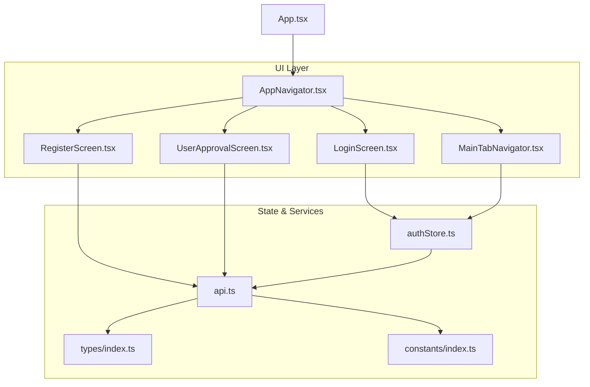
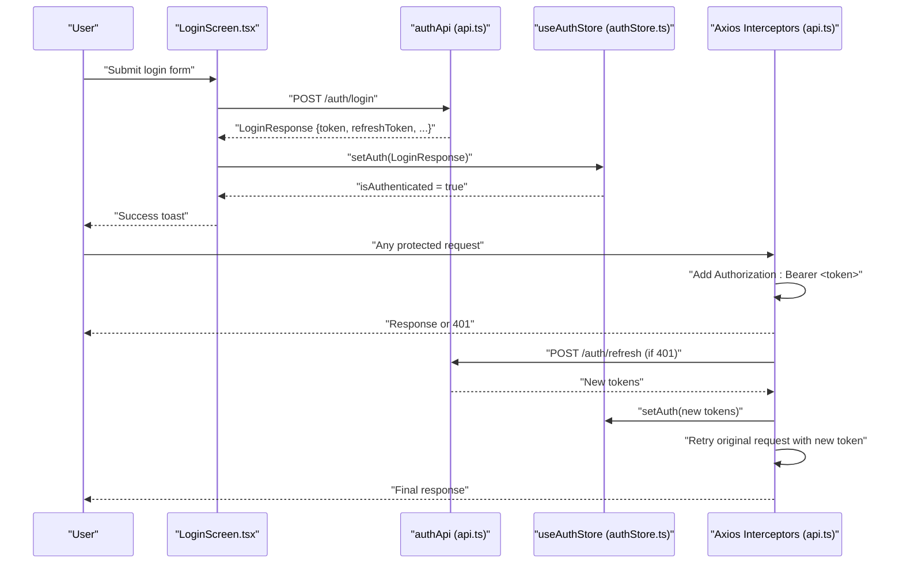
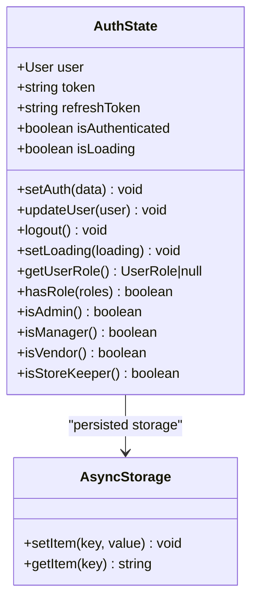
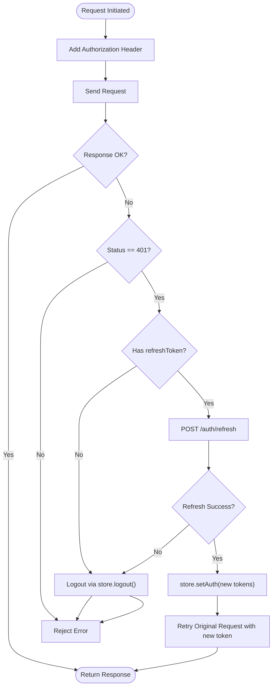
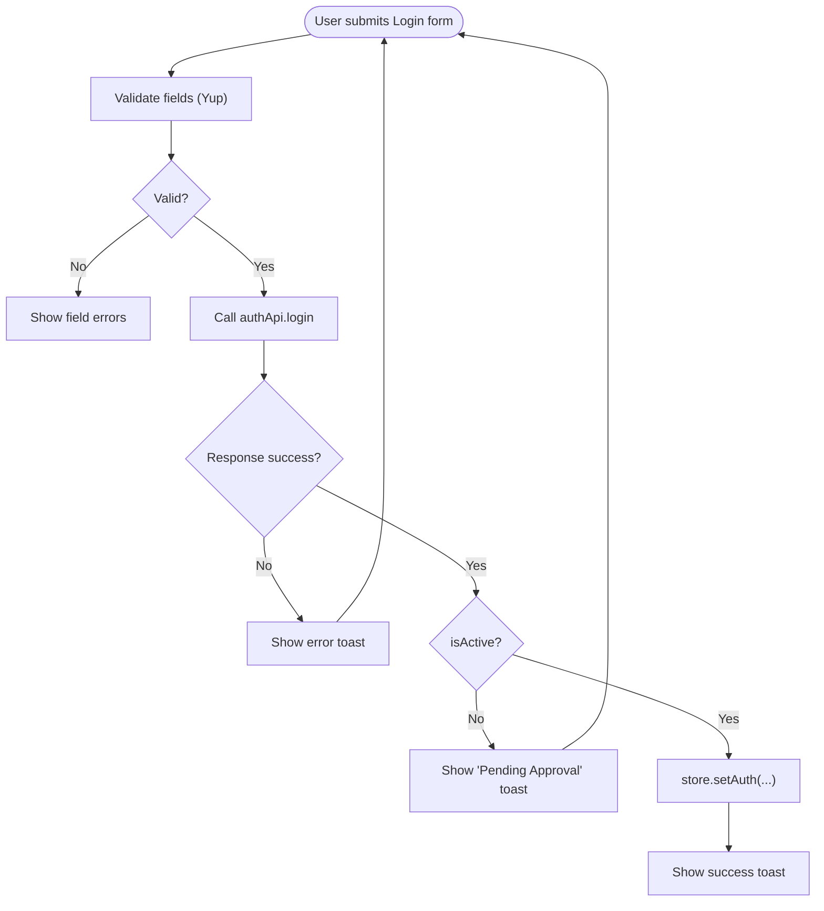
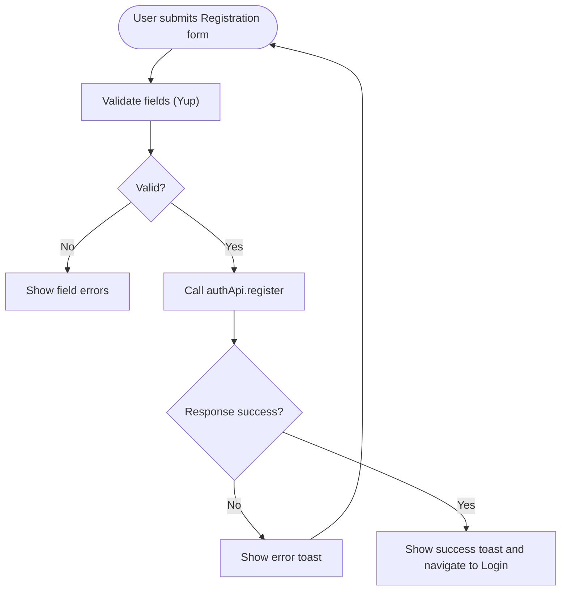
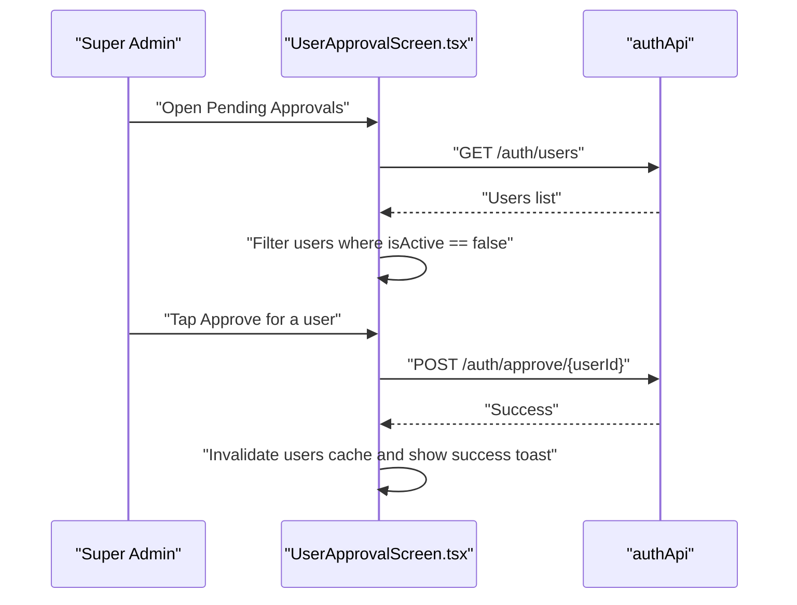
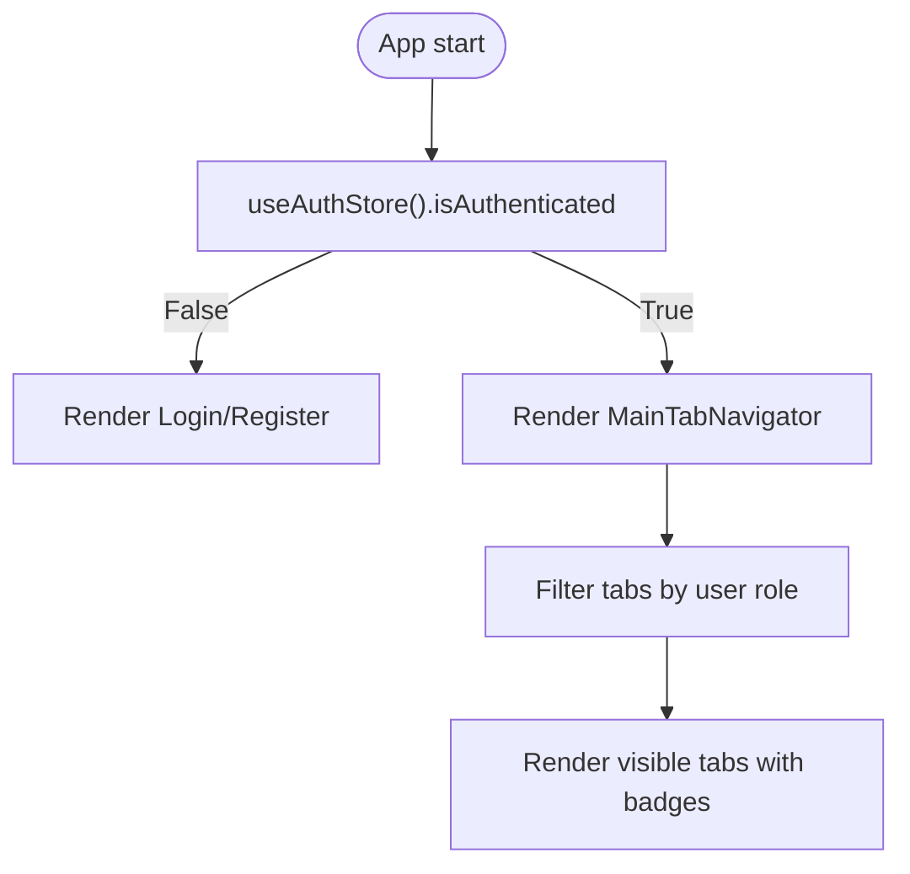
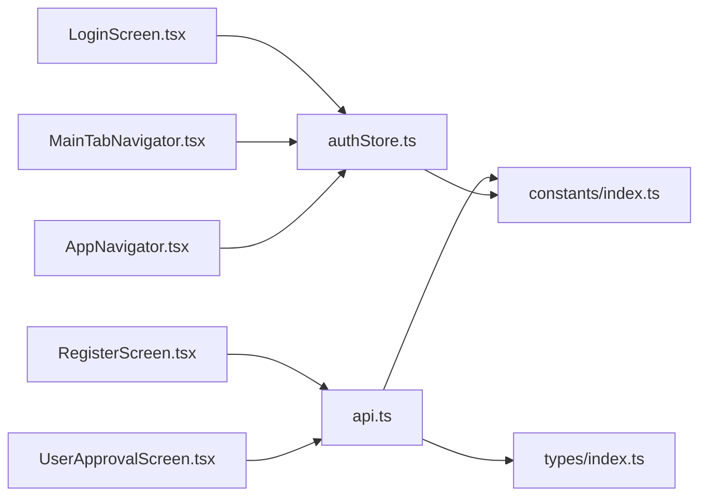

# Authentication & Authorization

<cite>
**Referenced Files in This Document**
- [App.tsx](file://App.tsx)
- [AppNavigator.tsx](file://src/navigation/AppNavigator.tsx)
- [MainTabNavigator.tsx](file://src/navigation/MainTabNavigator.tsx)
- [authStore.ts](file://src/store/authStore.ts)
- [api.ts](file://src/services/api.ts)
- [LoginScreen.tsx](file://src/screens/auth/LoginScreen.tsx)
- [RegisterScreen.tsx](file://src/screens/auth/RegisterScreen.tsx)
- [UserApprovalScreen.tsx](file://src/screens/admin/UserApprovalScreen.tsx)
- [index.ts](file://src/types/index.ts)
- [index.ts](file://src/constants/index.ts)
</cite>

## Table of Contents
1. [Introduction](#introduction)
2. [Project Structure](#project-structure)
3. [Core Components](#core-components)
4. [Architecture Overview](#architecture-overview)
5. [Detailed Component Analysis](#detailed-component-analysis)
6. [Dependency Analysis](#dependency-analysis)
7. [Performance Considerations](#performance-considerations)
8. [Troubleshooting Guide](#troubleshooting-guide)
9. [Conclusion](#conclusion)
10. [Appendices](#appendices)

## Introduction
This document describes the authentication and authorization system for the Banana Harvest App. It covers the multi-role authentication model (Super Admin, Manager, Vendor, Store Keeper), the login and registration flows, JWT and refresh token handling, automatic logout on token expiration, the user approval workflow for new vendors, Zustand-based state management for persistence, Formik/Yup validation, and role-based UI rendering and navigation protection.

## Project Structure
The authentication and authorization logic spans several modules:
- State management via a Zustand store with persisted AsyncStorage
- API client with request/response interceptors for token injection and refresh
- Auth screens (login and registration) with Formik/Yup validation
- Admin user approval screen for pending vendor accounts
- Navigation guard and role-based tab visibility
- Type definitions for roles, requests/responses, and API responses

**Diagram sources**
- [App.tsx](file://App.tsx#L24-L72)
- [AppNavigator.tsx](file://src/navigation/AppNavigator.tsx#L28-L59)
- [MainTabNavigator.tsx](file://src/navigation/MainTabNavigator.tsx#L315-L350)
- [authStore.ts](file://src/store/authStore.ts#L29-L115)
- [api.ts](file://src/services/api.ts#L67-L89)
- [LoginScreen.tsx](file://src/screens/auth/LoginScreen.tsx#L38-L82)
- [RegisterScreen.tsx](file://src/screens/auth/RegisterScreen.tsx#L55-L88)
- [UserApprovalScreen.tsx](file://src/screens/admin/UserApprovalScreen.tsx#L23-L72)
- [index.ts](file://src/types/index.ts#L1-L7)
- [index.ts](file://src/constants/index.ts#L6-L16)

**Section sources**
- [App.tsx](file://App.tsx#L24-L72)
- [AppNavigator.tsx](file://src/navigation/AppNavigator.tsx#L28-L59)
- [authStore.ts](file://src/store/authStore.ts#L29-L115)
- [api.ts](file://src/services/api.ts#L67-L89)

## Core Components
- Authentication state store (Zustand):
  - Holds user, tokens, authentication status, and loading state
  - Provides setters for login, user updates, logout, and loading
  - Exposes getters for role checks and role membership
  - Persisted to AsyncStorage with selective serialization
- API client (Axios):
  - Adds Authorization header using the current token
  - Handles 401 Unauthorized by attempting a token refresh
  - On refresh success, retries the original request; otherwise logs out
- Auth screens:
  - Login: Formik/Yup validation, submission to auth API, success/error feedback, and state update
  - Registration: Formik/Yup validation, role selection, submission to auth API, and success feedback
- Admin user approval:
  - Lists all users, filters pending (inactive) users, approves selected users
- Navigation:
  - Route guard: renders auth screens when not authenticated; main tabs when authenticated
  - Role-based tab visibility and initial route selection

**Section sources**
- [authStore.ts](file://src/store/authStore.ts#L6-L27)
- [authStore.ts](file://src/store/authStore.ts#L29-L115)
- [api.ts](file://src/services/api.ts#L16-L65)
- [LoginScreen.tsx](file://src/screens/auth/LoginScreen.tsx#L29-L36)
- [LoginScreen.tsx](file://src/screens/auth/LoginScreen.tsx#L43-L82)
- [RegisterScreen.tsx](file://src/screens/auth/RegisterScreen.tsx#L34-L53)
- [RegisterScreen.tsx](file://src/screens/auth/RegisterScreen.tsx#L59-L88)
- [UserApprovalScreen.tsx](file://src/screens/admin/UserApprovalScreen.tsx#L26-L72)
- [AppNavigator.tsx](file://src/navigation/AppNavigator.tsx#L28-L59)
- [MainTabNavigator.tsx](file://src/navigation/MainTabNavigator.tsx#L284-L328)

## Architecture Overview
The authentication flow integrates UI, state, and network layers. On successful login, tokens are stored in the Zustand store and injected into outgoing requests. When a request fails due to an expired token, the client attempts a refresh and retries automatically. If refresh fails, the user is logged out.

**Diagram sources**
- [LoginScreen.tsx](file://src/screens/auth/LoginScreen.tsx#L43-L82)
- [api.ts](file://src/services/api.ts#L69-L89)
- [authStore.ts](file://src/store/authStore.ts#L40-L76)
- [api.ts](file://src/services/api.ts#L16-L65)

## Detailed Component Analysis

### Authentication State Management (Zustand)
The store encapsulates:
- State: user, token, refreshToken, isAuthenticated, isLoading
- Actions: setAuth, updateUser, logout, setLoading
- Getters: getUserRole, hasRole, isAdmin, isManager, isVendor, isStoreKeeper
- Persistence: selective serialization of user, tokens, and status to AsyncStorage

**Diagram sources**
- [authStore.ts](file://src/store/authStore.ts#L6-L27)
- [authStore.ts](file://src/store/authStore.ts#L29-L115)

**Section sources**
- [authStore.ts](file://src/store/authStore.ts#L29-L115)

### API Client and Token Refresh
The Axios client:
- Injects Authorization header using the current token from the store
- On 401 Unauthorized, attempts to refresh the token using refreshToken
- On success, updates the store with new tokens and retries the original request
- On failure, triggers logout and rejects the error

**Diagram sources**
- [api.ts](file://src/services/api.ts#L16-L27)
- [api.ts](file://src/services/api.ts#L29-L65)
- [authStore.ts](file://src/store/authStore.ts#L64-L72)

**Section sources**
- [api.ts](file://src/services/api.ts#L16-L65)

### Login Screen and Validation
- Formik/Yup validation enforces:
  - Email presence and validity
  - Password minimum length and presence
- Submission:
  - Calls authApi.login
  - On success, checks user isActive; if inactive, shows “Account Pending Approval”
  - Updates store via setAuth and shows success toast
- Error handling:
  - Displays error toasts for failures and exceptions

**Diagram sources**
- [LoginScreen.tsx](file://src/screens/auth/LoginScreen.tsx#L29-L36)
- [LoginScreen.tsx](file://src/screens/auth/LoginScreen.tsx#L43-L82)
- [api.ts](file://src/services/api.ts#L69-L70)
- [authStore.ts](file://src/store/authStore.ts#L40-L58)

**Section sources**
- [LoginScreen.tsx](file://src/screens/auth/LoginScreen.tsx#L29-L82)

### Registration Screen and Validation
- Formik/Yup validation enforces:
  - Full name min length
  - Email validity
  - Phone optional 10-digit format
  - Password min length and confirmation match
  - Role selection among Manager, Vendor, Store Keeper
- Submission:
  - Calls authApi.register
  - On success, shows success toast and navigates to Login
  - On error, shows error toast

**Diagram sources**
- [RegisterScreen.tsx](file://src/screens/auth/RegisterScreen.tsx#L34-L53)
- [RegisterScreen.tsx](file://src/screens/auth/RegisterScreen.tsx#L59-L88)
- [api.ts](file://src/services/api.ts#L72-L73)

**Section sources**
- [RegisterScreen.tsx](file://src/screens/auth/RegisterScreen.tsx#L34-L88)

### User Approval Workflow (Admin)
- Fetches all users and filters those with isActive=false
- Presents a list of pending users
- Approves a user via authApi.approveUser
- On success, invalidates user list cache and shows success toast

**Diagram sources**
- [UserApprovalScreen.tsx](file://src/screens/admin/UserApprovalScreen.tsx#L26-L55)
- [api.ts](file://src/services/api.ts#L81-L89)

**Section sources**
- [UserApprovalScreen.tsx](file://src/screens/admin/UserApprovalScreen.tsx#L26-L72)
- [api.ts](file://src/services/api.ts#L87-L89)

### Role-Based UI Rendering and Navigation Protection
- Route protection:
  - AppNavigator conditionally renders Login/Register when not authenticated; otherwise renders MainTabNavigator and other protected screens
- Role-based tab visibility:
  - MainTabNavigator defines TAB_ITEMS with allowed roles per tab
  - CustomTabBar filters visible tabs by user role and computes badges
- Initial route selection:
  - MainTabNavigator selects initial route based on role

**Diagram sources**
- [AppNavigator.tsx](file://src/navigation/AppNavigator.tsx#L28-L59)
- [MainTabNavigator.tsx](file://src/navigation/MainTabNavigator.tsx#L284-L328)
- [MainTabNavigator.tsx](file://src/navigation/MainTabNavigator.tsx#L49-L60)

**Section sources**
- [AppNavigator.tsx](file://src/navigation/AppNavigator.tsx#L28-L59)
- [MainTabNavigator.tsx](file://src/navigation/MainTabNavigator.tsx#L49-L60)
- [MainTabNavigator.tsx](file://src/navigation/MainTabNavigator.tsx#L284-L328)

### Types and Constants
- Roles: SUPER_ADMIN, MANAGER, VENDOR, STORE_KEEPER
- Requests/Responses: LoginRequest, RegisterRequest, LoginResponse, RefreshTokenRequest
- API response wrapper: ApiResponse<T>
- Storage keys and role-based navigation items

**Section sources**
- [index.ts](file://src/types/index.ts#L2-L7)
- [index.ts](file://src/types/index.ts#L36-L63)
- [index.ts](file://src/types/index.ts#L412-L418)
- [index.ts](file://src/constants/index.ts#L12-L16)
- [index.ts](file://src/constants/index.ts#L329-L334)

## Dependency Analysis
- UI depends on:
  - Auth store for state and actions
  - API client for authenticated requests
  - Navigation for route protection
- API client depends on:
  - Auth store for token retrieval and refresh updates
  - Types for request/response shapes
  - Constants for base URL and timeouts
- Navigation depends on:
  - Auth store for authentication state
  - Types for role enums

**Diagram sources**
- [LoginScreen.tsx](file://src/screens/auth/LoginScreen.tsx#L38-L41)
- [RegisterScreen.tsx](file://src/screens/auth/RegisterScreen.tsx#L22-L24)
- [UserApprovalScreen.tsx](file://src/screens/admin/UserApprovalScreen.tsx#L20-L21)
- [MainTabNavigator.tsx](file://src/navigation/MainTabNavigator.tsx#L11-L13)
- [AppNavigator.tsx](file://src/navigation/AppNavigator.tsx#L3-L3)
- [api.ts](file://src/services/api.ts#L3-L4)
- [index.ts](file://src/constants/index.ts#L6-L7)

**Section sources**
- [api.ts](file://src/services/api.ts#L1-L14)
- [authStore.ts](file://src/store/authStore.ts#L1-L4)
- [AppNavigator.tsx](file://src/navigation/AppNavigator.tsx#L1-L6)
- [MainTabNavigator.tsx](file://src/navigation/MainTabNavigator.tsx#L1-L13)

## Performance Considerations
- Token refresh retry is handled once per 401 to avoid infinite loops
- Query caching and stale times are configured at the app level for data fetching
- Badge computations are lightweight and depend on filtered lists; keep lists minimal to reduce computation
- Persisted store reduces re-authentication overhead across app restarts

[No sources needed since this section provides general guidance]

## Troubleshooting Guide
Common issues and resolutions:
- Session expired or unauthorized:
  - Symptom: 401 errors on protected requests
  - Behavior: Automatic refresh attempt; if unsuccessful, logout occurs
  - Resolution: Re-login; ensure refreshToken is present in store
- Login fails with “Account Pending Approval”:
  - Cause: Backend returned token but user.isActive is false
  - Resolution: Wait for Super Admin approval; check UserApproval screen
- Registration success but no email sent:
  - Symptom: Success toast appears
  - Resolution: Backend may not send emails; inform user to wait for admin approval
- Role-based tab not visible:
  - Cause: User role not included in TAB_ITEMS for that tab
  - Resolution: Verify role assignment and TAB_ITEMS configuration
- Toast messages not appearing:
  - Cause: Toast component not rendered in the app shell
  - Resolution: Ensure Toast is mounted in the root component

**Section sources**
- [api.ts](file://src/services/api.ts#L29-L65)
- [LoginScreen.tsx](file://src/screens/auth/LoginScreen.tsx#L48-L58)
- [RegisterScreen.tsx](file://src/screens/auth/RegisterScreen.tsx#L65-L78)
- [MainTabNavigator.tsx](file://src/navigation/MainTabNavigator.tsx#L284-L328)
- [App.tsx](file://App.tsx#L67-L68)

## Conclusion
The Banana Harvest App implements a robust, role-aware authentication system:
- Multi-role support with clear role checks and UI filtering
- Secure token handling with automatic refresh and logout on expiration
- Admin-driven user approval for new vendors
- Persistent state via Zustand with AsyncStorage
- Form validation with Formik and Yup
- Role-based navigation and tab visibility

[No sources needed since this section summarizes without analyzing specific files]

## Appendices

### Security Considerations
- Password policies:
  - Enforced via Yup validation (minimum length and confirmation match)
- Token storage:
  - Tokens are persisted in AsyncStorage via Zustand persistence
  - Consider platform-specific secure storage for production
- Session timeout handling:
  - 401 Unauthorized triggers refresh; repeated failures lead to logout
- Secure transport:
  - API base URL and timeouts configured centrally

**Section sources**
- [RegisterScreen.tsx](file://src/screens/auth/RegisterScreen.tsx#L44-L49)
- [authStore.ts](file://src/store/authStore.ts#L104-L114)
- [api.ts](file://src/services/api.ts#L6-L14)
- [api.ts](file://src/services/api.ts#L29-L65)

### Example: Role-Based UI Rendering
- Tabs visible depend on user role:
  - Super Admin: all tabs
  - Manager: most features except vendor-specific
  - Vendor: inspections, harvest, ledger, and profile
  - Store Keeper: inventory and gate passes
- Initial route selection:
  - Vendor starts at Inspections
  - Store Keeper starts at Inventory
  - Others start at Dashboard

**Section sources**
- [MainTabNavigator.tsx](file://src/navigation/MainTabNavigator.tsx#L49-L60)
- [MainTabNavigator.tsx](file://src/navigation/MainTabNavigator.tsx#L319-L328)