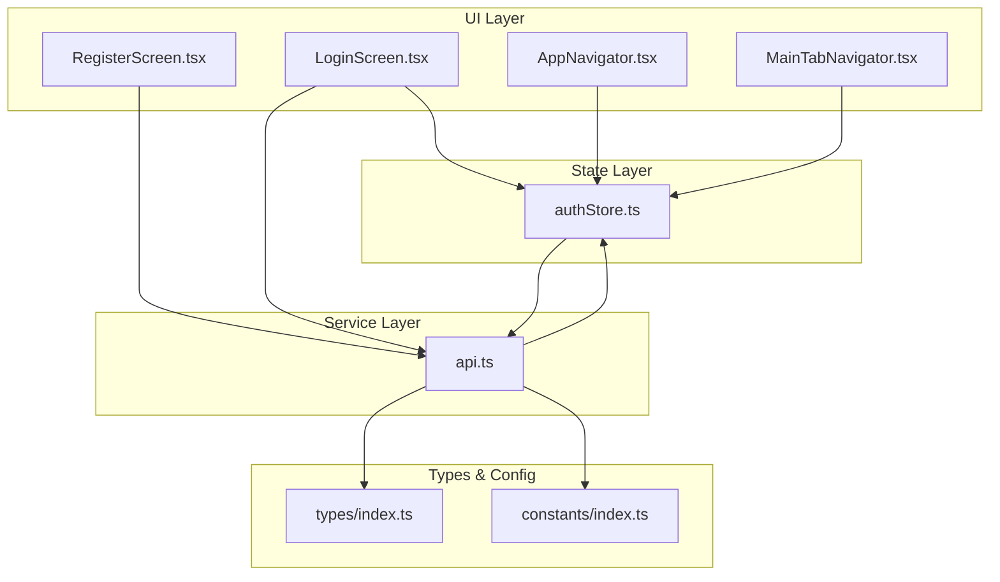
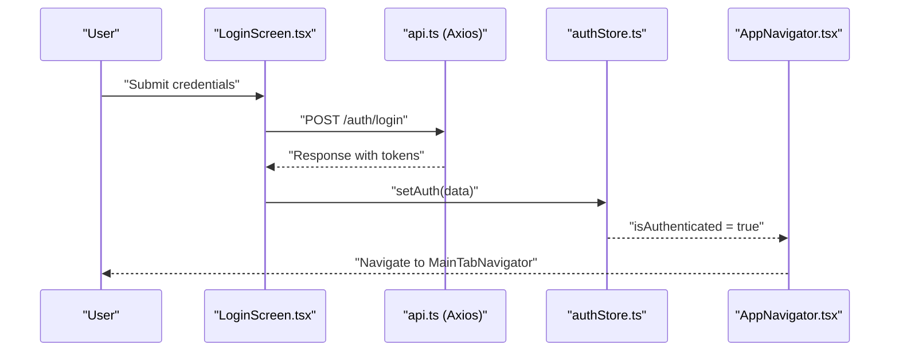
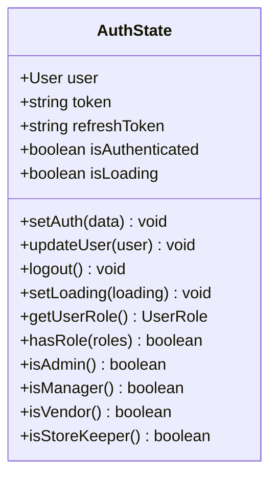
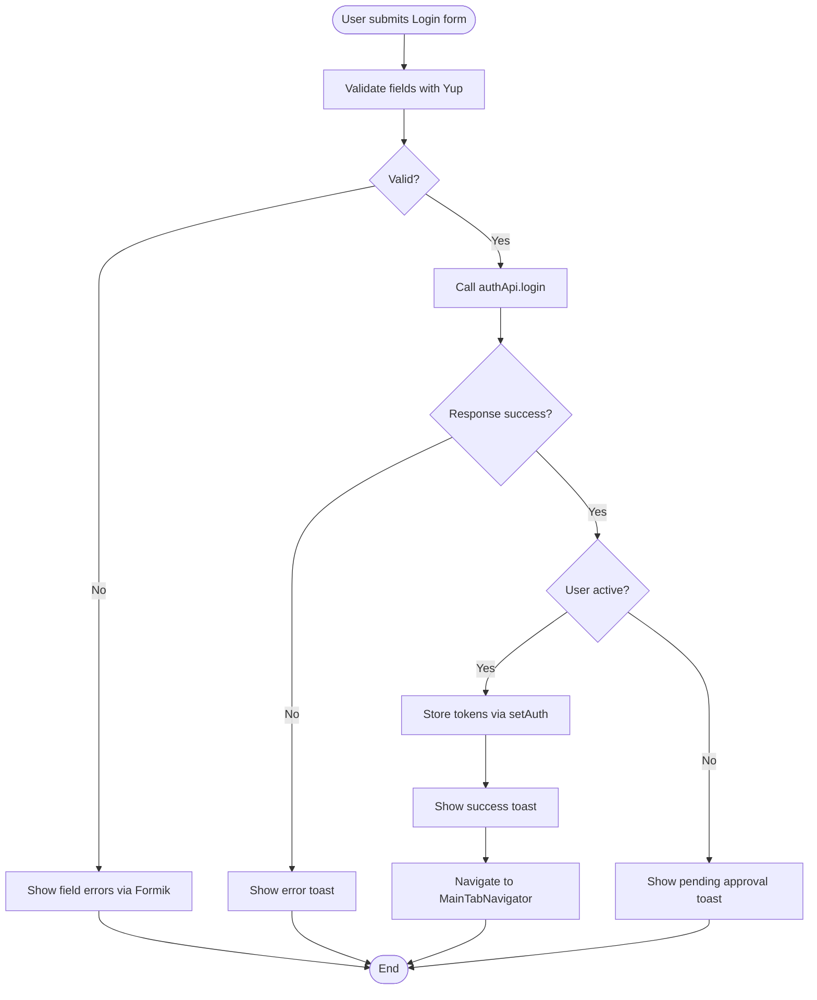
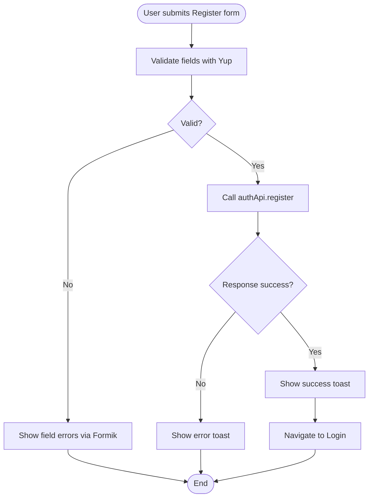
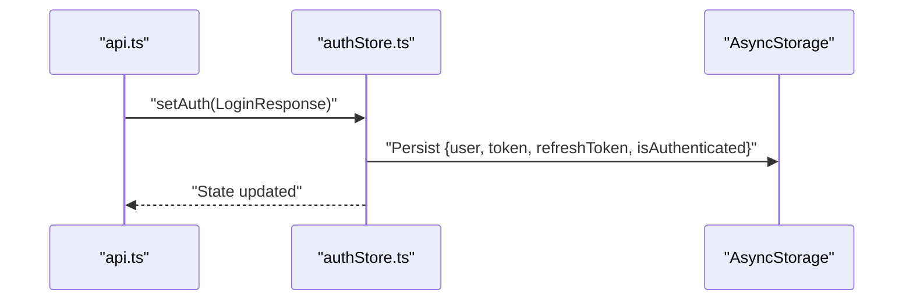
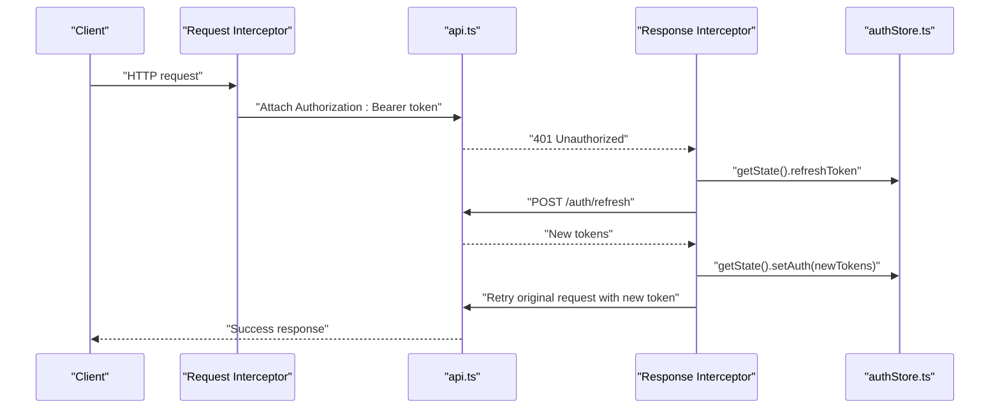
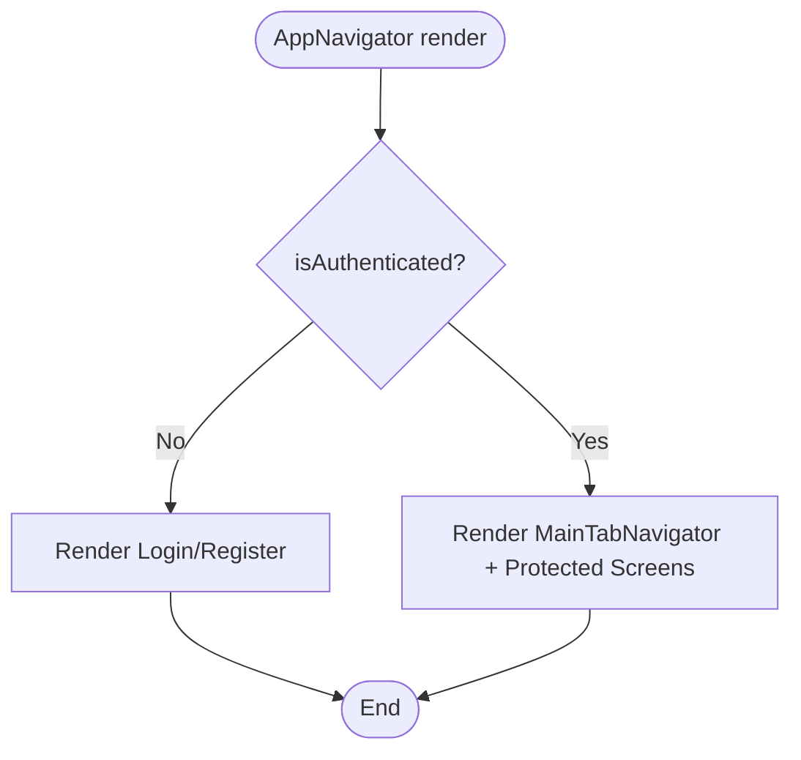
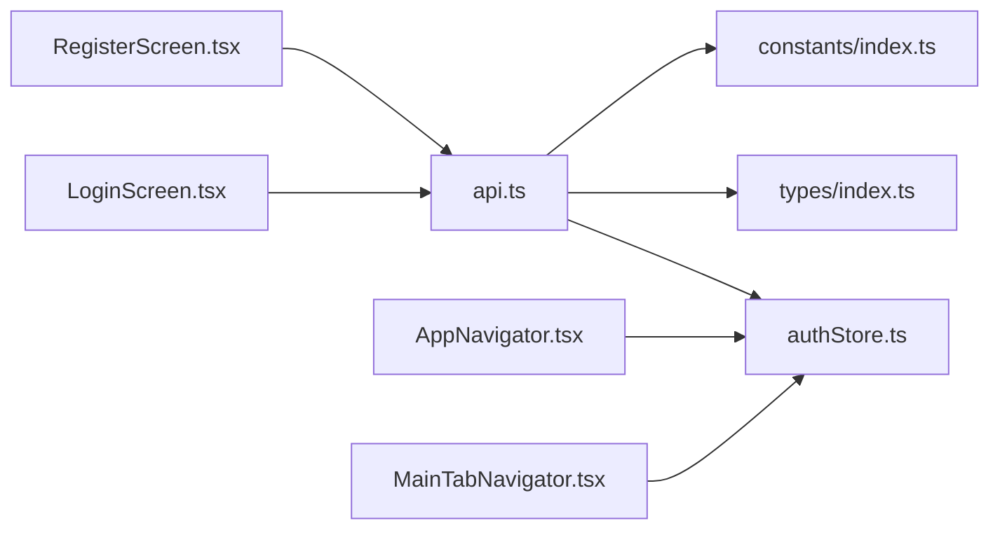

# Authentication Flow

<cite>
**Referenced Files in This Document**
- [authStore.ts](file://src/store/authStore.ts)
- [api.ts](file://src/services/api.ts)
- [LoginScreen.tsx](file://src/screens/auth/LoginScreen.tsx)
- [RegisterScreen.tsx](file://src/screens/auth/RegisterScreen.tsx)
- [AppNavigator.tsx](file://src/navigation/AppNavigator.tsx)
- [MainTabNavigator.tsx](file://src/navigation/MainTabNavigator.tsx)
- [App.tsx](file://App.tsx)
- [index.ts](file://src/types/index.ts)
- [index.ts](file://src/constants/index.ts)
</cite>

## Table of Contents
1. [Introduction](#introduction)
2. [Project Structure](#project-structure)
3. [Core Components](#core-components)
4. [Architecture Overview](#architecture-overview)
5. [Detailed Component Analysis](#detailed-component-analysis)
6. [Dependency Analysis](#dependency-analysis)
7. [Performance Considerations](#performance-considerations)
8. [Troubleshooting Guide](#troubleshooting-guide)
9. [Conclusion](#conclusion)

## Introduction
This document explains the authentication flow in the Banana Harvest App, covering login and registration, JWT token handling, state management with Zustand, persistence via AsyncStorage, error handling, loading states, and route protection. It also documents the automatic token refresh mechanism and how the app redirects unauthenticated users to the login screen.

## Project Structure
The authentication system spans several layers:
- UI screens for login and registration using Formik/Yup for validation
- API service with Axios interceptors for request signing and automatic token refresh
- Zustand store for authentication state and persistence
- Navigation guard that conditionally renders public vs protected routes

**Diagram sources**
- [LoginScreen.tsx](file://src/screens/auth/LoginScreen.tsx#L1-L259)
- [RegisterScreen.tsx](file://src/screens/auth/RegisterScreen.tsx#L1-L357)
- [AppNavigator.tsx](file://src/navigation/AppNavigator.tsx#L1-L60)
- [MainTabNavigator.tsx](file://src/navigation/MainTabNavigator.tsx#L1-L414)
- [authStore.ts](file://src/store/authStore.ts#L1-L116)
- [api.ts](file://src/services/api.ts#L1-L326)
- [index.ts](file://src/types/index.ts#L1-L429)
- [index.ts](file://src/constants/index.ts#L1-L363)

**Section sources**
- [LoginScreen.tsx](file://src/screens/auth/LoginScreen.tsx#L1-L259)
- [RegisterScreen.tsx](file://src/screens/auth/RegisterScreen.tsx#L1-L357)
- [authStore.ts](file://src/store/authStore.ts#L1-L116)
- [api.ts](file://src/services/api.ts#L1-L326)
- [AppNavigator.tsx](file://src/navigation/AppNavigator.tsx#L1-L60)
- [MainTabNavigator.tsx](file://src/navigation/MainTabNavigator.tsx#L1-L414)
- [index.ts](file://src/types/index.ts#L1-L429)
- [index.ts](file://src/constants/index.ts#L1-L363)

## Core Components
- Authentication Store (Zustand)
  - Holds user, tokens, authentication status, and loading state
  - Provides actions to set auth, update user, logout, and set loading
  - Persists selected fields to AsyncStorage via a partializer
- API Client (Axios)
  - Adds Authorization header using the current token
  - Handles 401 Unauthorized by refreshing the token and retrying
  - Exposes auth endpoints: login, register, refresh, current user, approvals
- Login Screen
  - Form validation with Yup
  - Submission handled via authApi.login
  - Toast notifications for success/error
  - Redirects to main tabs after successful login
- Registration Screen
  - Form validation with Yup including role selection
  - Submission handled via authApi.register
  - Toast notifications for success/error
  - Redirects to login after registration
- Navigation Guard
  - Renders Login/Register when not authenticated
  - Renders MainTabNavigator when authenticated

**Section sources**
- [authStore.ts](file://src/store/authStore.ts#L1-L116)
- [api.ts](file://src/services/api.ts#L1-L326)
- [LoginScreen.tsx](file://src/screens/auth/LoginScreen.tsx#L1-L259)
- [RegisterScreen.tsx](file://src/screens/auth/RegisterScreen.tsx#L1-L357)
- [AppNavigator.tsx](file://src/navigation/AppNavigator.tsx#L1-L60)

## Architecture Overview
The authentication flow integrates UI, state, and service layers with automatic token refresh and route protection.

**Diagram sources**
- [LoginScreen.tsx](file://src/screens/auth/LoginScreen.tsx#L43-L82)
- [api.ts](file://src/services/api.ts#L68-L89)
- [authStore.ts](file://src/store/authStore.ts#L40-L76)
- [AppNavigator.tsx](file://src/navigation/AppNavigator.tsx#L28-L58)

## Detailed Component Analysis

### Authentication State Management (Zustand)
The store defines the state shape, actions, getters, and persistence configuration:
- State fields: user, token, refreshToken, isAuthenticated, isLoading
- Actions: setAuth, updateUser, logout, setLoading
- Getters: getUserRole, hasRole, isAdmin, isManager, isVendor, isStoreKeeper
- Persistence: partializes user, token, refreshToken, isAuthenticated to AsyncStorage

**Diagram sources**
- [authStore.ts](file://src/store/authStore.ts#L6-L27)

**Section sources**
- [authStore.ts](file://src/store/authStore.ts#L1-L116)

### Login Workflow (Form Validation, Submission, Feedback)
- Form validation uses Yup for email, password, and optional phone
- Submission calls authApi.login and handles success/error
- On success: defensive check for user isActive, then setAuth and show success toast
- On failure: show error toast with server-provided message or fallback
- Loading state managed locally and via store

**Diagram sources**
- [LoginScreen.tsx](file://src/screens/auth/LoginScreen.tsx#L29-L36)
- [LoginScreen.tsx](file://src/screens/auth/LoginScreen.tsx#L43-L82)
- [api.ts](file://src/services/api.ts#L68-L70)
- [authStore.ts](file://src/store/authStore.ts#L40-L76)

**Section sources**
- [LoginScreen.tsx](file://src/screens/auth/LoginScreen.tsx#L1-L259)
- [index.ts](file://src/types/index.ts#L36-L59)

### Registration Workflow (Form Validation, Submission, Feedback)
- Form validation includes fullName, email, optional phone, password, confirmPassword, and role
- Submission excludes confirmPassword and calls authApi.register
- Success navigates to Login; failures display error toasts
- Role selection is enforced via Yup and UI controls

**Diagram sources**
- [RegisterScreen.tsx](file://src/screens/auth/RegisterScreen.tsx#L34-L53)
- [RegisterScreen.tsx](file://src/screens/auth/RegisterScreen.tsx#L59-L88)
- [api.ts](file://src/services/api.ts#L72-L73)

**Section sources**
- [RegisterScreen.tsx](file://src/screens/auth/RegisterScreen.tsx#L1-L357)
- [index.ts](file://src/types/index.ts#L41-L47)

### Token Extraction, Storage, and Persistence
- On successful login, the response payload contains token, refreshToken, and user metadata
- setAuth creates a normalized User object and stores token, refreshToken, user, and isAuthenticated
- Persistence is configured to store user, token, refreshToken, and isAuthenticated in AsyncStorage
- The store partializer ensures only relevant fields are persisted

**Diagram sources**
- [authStore.ts](file://src/store/authStore.ts#L40-L76)
- [authStore.ts](file://src/store/authStore.ts#L104-L114)

**Section sources**
- [authStore.ts](file://src/store/authStore.ts#L1-L116)

### Automatic Token Refresh and Retry Mechanism
- Request interceptor reads token from store and attaches Authorization header
- Response interceptor handles 401 Unauthorized:
  - Attempts to refresh token using refreshToken
  - On success, updates store with new tokens and retries original request
  - On failure, logs out the user by clearing state

**Diagram sources**
- [api.ts](file://src/services/api.ts#L16-L27)
- [api.ts](file://src/services/api.ts#L29-L65)
- [authStore.ts](file://src/store/authStore.ts#L40-L76)

**Section sources**
- [api.ts](file://src/services/api.ts#L1-L326)
- [authStore.ts](file://src/store/authStore.ts#L1-L116)

### Route Protection and Navigation Guards
- AppNavigator conditionally renders Login/Register when not authenticated
- When authenticated, renders MainTabNavigator and protected screens
- MainTabNavigator further filters tabs by user role

**Diagram sources**
- [AppNavigator.tsx](file://src/navigation/AppNavigator.tsx#L28-L58)
- [authStore.ts](file://src/store/authStore.ts#L32-L37)

**Section sources**
- [AppNavigator.tsx](file://src/navigation/AppNavigator.tsx#L1-L60)
- [MainTabNavigator.tsx](file://src/navigation/MainTabNavigator.tsx#L1-L414)

### Error Handling and User Feedback
- Login/Registration screens:
  - Local loading state toggled during submissions
  - Toast notifications for success and error messages
  - Error messages derived from server response or defaults
- API layer:
  - 401 Unauthorized triggers automatic refresh; on failure, logout is triggered
  - Other errors propagate with original Axios error handling

**Section sources**
- [LoginScreen.tsx](file://src/screens/auth/LoginScreen.tsx#L43-L82)
- [RegisterScreen.tsx](file://src/screens/auth/RegisterScreen.tsx#L59-L88)
- [api.ts](file://src/services/api.ts#L29-L65)

## Dependency Analysis
The authentication system exhibits clear separation of concerns:
- UI depends on Zustand store and API service
- API service depends on store for token retrieval and refresh
- Navigation guard depends on store for authentication state
- Types and constants provide shared contracts and configuration

**Diagram sources**
- [LoginScreen.tsx](file://src/screens/auth/LoginScreen.tsx#L1-L259)
- [RegisterScreen.tsx](file://src/screens/auth/RegisterScreen.tsx#L1-L357)
- [AppNavigator.tsx](file://src/navigation/AppNavigator.tsx#L1-L60)
- [MainTabNavigator.tsx](file://src/navigation/MainTabNavigator.tsx#L1-L414)
- [authStore.ts](file://src/store/authStore.ts#L1-L116)
- [api.ts](file://src/services/api.ts#L1-L326)
- [index.ts](file://src/types/index.ts#L1-L429)
- [index.ts](file://src/constants/index.ts#L1-L363)

**Section sources**
- [api.ts](file://src/services/api.ts#L1-L326)
- [authStore.ts](file://src/store/authStore.ts#L1-L116)
- [AppNavigator.tsx](file://src/navigation/AppNavigator.tsx#L1-L60)

## Performance Considerations
- Token refresh avoids redundant requests by using a retry flag and updating the Authorization header before retry
- Zustand persistence reduces unnecessary re-renders by storing only essential fields
- Loading states prevent repeated submissions and improve UX
- Consider caching frequently accessed user data (e.g., profile) to minimize network calls

## Troubleshooting Guide
Common issues and resolutions:
- Invalid credentials
  - Symptom: Error toast appears after login attempt
  - Resolution: Verify email/password; ensure user is active
- Network errors
  - Symptom: Toast indicates network/server error
  - Resolution: Check connectivity; retry submission
- Session expired
  - Symptom: 401 Unauthorized triggers refresh; on failure, logout occurs
  - Resolution: Re-login; ensure refreshToken is present
- Account pending approval
  - Symptom: Success login toast with pending approval message
  - Resolution: Inform user to wait for admin approval

**Section sources**
- [LoginScreen.tsx](file://src/screens/auth/LoginScreen.tsx#L43-L82)
- [api.ts](file://src/services/api.ts#L29-L65)
- [index.ts](file://src/constants/index.ts#L339-L347)

## Conclusion
The Banana Harvest App implements a robust authentication flow with:
- Form validation using Formik and Yup
- Secure token handling with Zustand and AsyncStorage
- Automatic token refresh and retry on 401
- Clear route protection and role-based navigation
- Comprehensive error handling and user feedback

This design ensures a smooth user experience while maintaining security and reliability across login, registration, and protected routing.