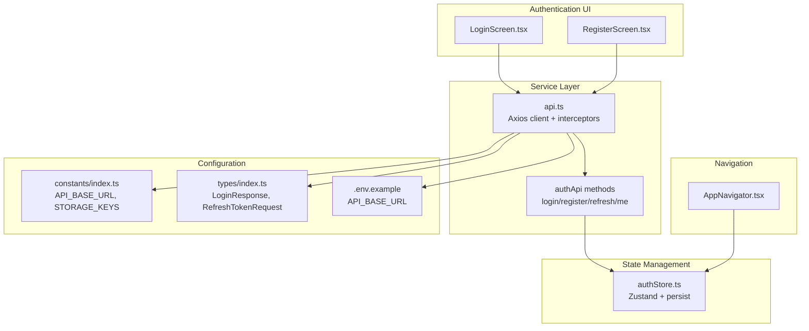
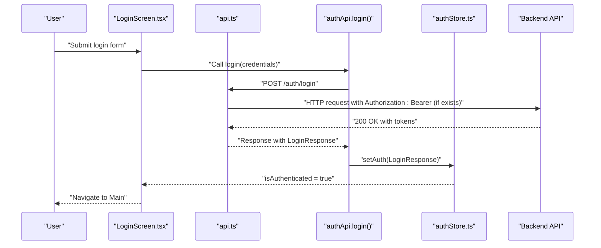
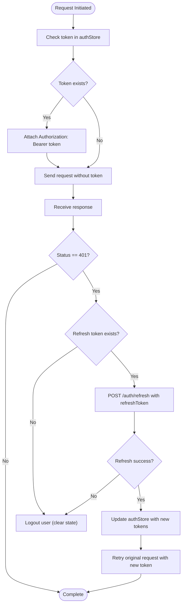
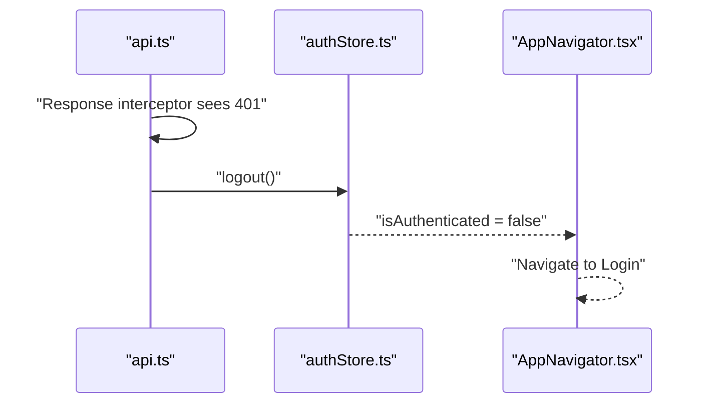
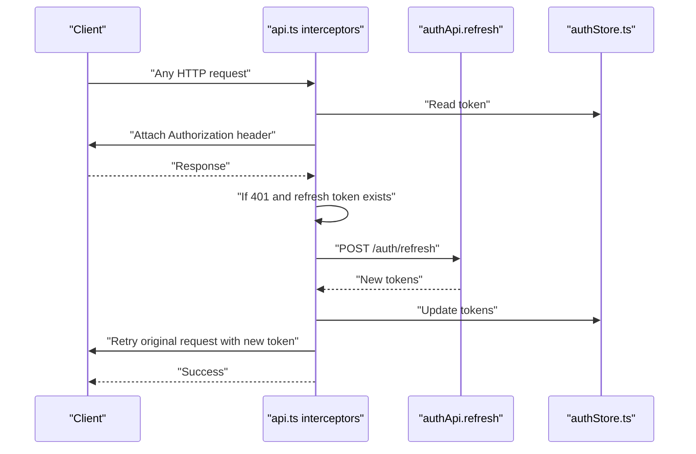
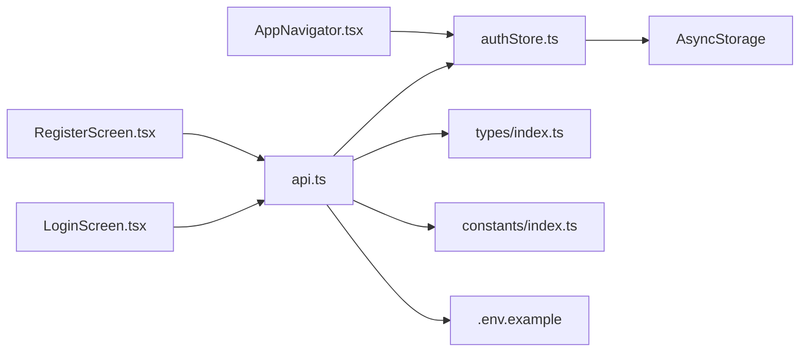

# Security Implementation

<cite>
**Referenced Files in This Document**
- [api.ts](file://src/services/api.ts)
- [authStore.ts](file://src/store/authStore.ts)
- [LoginScreen.tsx](file://src/screens/auth/LoginScreen.tsx)
- [RegisterScreen.tsx](file://src/screens/auth/RegisterScreen.tsx)
- [index.ts (constants)](file://src/constants/index.ts)
- [index.ts (types)](file://src/types/index.ts)
- [AppNavigator.tsx](file://src/navigation/AppNavigator.tsx)
- [AndroidManifest.xml](file://android/app/src/main/AndroidManifest.xml)
- [Info.plist](file://scaffold/ios/scaffold/Info.plist)
- [.env.example](file://.env.example)
- [package.json](file://package.json)
</cite>

## Table of Contents
1. [Introduction](#introduction)
2. [Project Structure](#project-structure)
3. [Core Components](#core-components)
4. [Architecture Overview](#architecture-overview)
5. [Detailed Component Analysis](#detailed-component-analysis)
6. [Dependency Analysis](#dependency-analysis)
7. [Performance Considerations](#performance-considerations)
8. [Troubleshooting Guide](#troubleshooting-guide)
9. [Conclusion](#conclusion)
10. [Appendices](#appendices)

## Introduction
This document provides comprehensive security documentation for the Banana Harvest App authentication system. It covers JWT token security (storage, transmission, validation), secure storage mechanisms using AsyncStorage, session management (automatic logout on token expiration, session timeout handling, and concurrent session considerations), input validation and sanitization for authentication forms, CORS policy configuration, CSRF protection measures, API security integration (bearer token injection and automatic token refresh), password security policies, and best practices for mobile applications, secure communication protocols, and protection against common vulnerabilities such as XSS and injection attacks. It also includes guidelines for secure development practices and security testing procedures.

## Project Structure
The authentication and security-related code is organized around three primary areas:
- Authentication service layer: centralized HTTP client with interceptors for token injection and refresh
- Authentication store: persistent state management using AsyncStorage via Zustand with persistence middleware
- Authentication UI: login and registration screens with client-side validation

**Diagram sources**
- [LoginScreen.tsx](file://src/screens/auth/LoginScreen.tsx#L1-L259)
- [RegisterScreen.tsx](file://src/screens/auth/RegisterScreen.tsx#L1-L357)
- [api.ts](file://src/services/api.ts#L1-L326)
- [authStore.ts](file://src/store/authStore.ts#L1-L116)
- [AppNavigator.tsx](file://src/navigation/AppNavigator.tsx#L1-L60)
- [index.ts (constants)](file://src/constants/index.ts#L1-L363)
- [index.ts (types)](file://src/types/index.ts#L1-L429)
- [.env.example](file://.env.example#L1-L19)

**Section sources**
- [api.ts](file://src/services/api.ts#L1-L326)
- [authStore.ts](file://src/store/authStore.ts#L1-L116)
- [LoginScreen.tsx](file://src/screens/auth/LoginScreen.tsx#L1-L259)
- [RegisterScreen.tsx](file://src/screens/auth/RegisterScreen.tsx#L1-L357)
- [index.ts (constants)](file://src/constants/index.ts#L1-L363)
- [index.ts (types)](file://src/types/index.ts#L1-L429)
- [AppNavigator.tsx](file://src/navigation/AppNavigator.tsx#L1-L60)
- [.env.example](file://.env.example#L1-L19)

## Core Components
- Axios client with request/response interceptors for bearer token injection and automatic token refresh on 401 Unauthorized
- Zustand store with AsyncStorage persistence for tokens and user metadata
- Login and registration screens with Yup-based validation and safe input handling
- Navigation guard based on authentication state
- Environment-driven API base URL configuration

Key security controls:
- Automatic bearer token injection on every request
- Centralized 401 handling with token refresh retry
- Persistent token storage via AsyncStorage with selective partialization
- Client-side validation for authentication forms

**Section sources**
- [api.ts](file://src/services/api.ts#L1-L326)
- [authStore.ts](file://src/store/authStore.ts#L1-L116)
- [LoginScreen.tsx](file://src/screens/auth/LoginScreen.tsx#L1-L259)
- [RegisterScreen.tsx](file://src/screens/auth/RegisterScreen.tsx#L1-L357)
- [AppNavigator.tsx](file://src/navigation/AppNavigator.tsx#L1-L60)
- [index.ts (constants)](file://src/constants/index.ts#L1-L363)
- [index.ts (types)](file://src/types/index.ts#L1-L429)

## Architecture Overview
The authentication flow integrates UI, service, and state layers with secure transport and storage.

**Diagram sources**
- [LoginScreen.tsx](file://src/screens/auth/LoginScreen.tsx#L43-L82)
- [api.ts](file://src/services/api.ts#L68-L89)
- [authStore.ts](file://src/store/authStore.ts#L40-L76)

**Section sources**
- [LoginScreen.tsx](file://src/screens/auth/LoginScreen.tsx#L1-L259)
- [api.ts](file://src/services/api.ts#L1-L326)
- [authStore.ts](file://src/store/authStore.ts#L1-L116)

## Detailed Component Analysis

### JWT Token Security Implementation
- Transmission: The request interceptor reads the current token from the store and attaches it as an Authorization header for every outgoing request.
- Validation: On receiving a 401 Unauthorized response, the response interceptor triggers a refresh flow using the stored refresh token, updates the store with new tokens, and retries the original request.
- Storage: Tokens are persisted in AsyncStorage via Zustand’s persistence middleware, with selective partialization to avoid storing unnecessary fields.

**Diagram sources**
- [api.ts](file://src/services/api.ts#L16-L65)
- [authStore.ts](file://src/store/authStore.ts#L40-L76)

**Section sources**
- [api.ts](file://src/services/api.ts#L16-L65)
- [authStore.ts](file://src/store/authStore.ts#L104-L114)

### Secure Storage Mechanisms Using AsyncStorage
- Persistence: The Zustand store uses AsyncStorage via a JSON storage wrapper and persists only selected fields (user, token, refreshToken, isAuthenticated).
- Encryption considerations: AsyncStorage is not encrypted by default. To meet production-grade security, consider integrating a secure keystore-backed storage solution (e.g., react-native-encrypted-storage) for sensitive token values.
- Partialization: Only essential fields are persisted to minimize exposure surface.

Recommendations:
- Replace AsyncStorage with an encrypted storage library for production environments.
- Avoid logging token values or enabling verbose logs that might capture tokens.
- Consider clearing sensitive data from memory promptly after use.

**Section sources**
- [authStore.ts](file://src/store/authStore.ts#L104-L114)
- [package.json](file://package.json#L14-L48)

### Session Management
- Automatic logout on token expiration: The response interceptor detects 401 Unauthorized and invokes logout, clearing the store and redirecting the user to the login screen.
- Session timeout handling: There is no explicit client-side idle timeout mechanism. Consider adding an idle timer that triggers logout after inactivity.
- Concurrent sessions: The current implementation stores a single pair of tokens in the store. If multiple concurrent sessions are required, design a session manager that tracks multiple sessions and allows selective revocation.

**Diagram sources**
- [api.ts](file://src/services/api.ts#L35-L61)
- [authStore.ts](file://src/store/authStore.ts#L64-L72)
- [AppNavigator.tsx](file://src/navigation/AppNavigator.tsx#L28-L58)

**Section sources**
- [api.ts](file://src/services/api.ts#L35-L61)
- [authStore.ts](file://src/store/authStore.ts#L64-L72)
- [AppNavigator.tsx](file://src/navigation/AppNavigator.tsx#L28-L58)

### Input Validation and Sanitization for Authentication Forms
- Login form: Validates email format and enforces minimum password length. Uses Formik with Yup for declarative validation.
- Registration form: Enforces name length, email format, optional phone digit pattern, password minimum length, password confirmation match, and role selection.
- Safe input handling: Uses secure text entry for passwords and disables auto-capitalization for emails.

Recommendations:
- Add server-side validation feedback to improve UX and reduce brute-force attempts.
- Implement rate limiting on authentication endpoints.
- Consider adding CAPTCHA for high-risk scenarios.

**Section sources**
- [LoginScreen.tsx](file://src/screens/auth/LoginScreen.tsx#L29-L36)
- [RegisterScreen.tsx](file://src/screens/auth/RegisterScreen.tsx#L34-L53)

### CORS Policy Configuration and CSRF Protection
- CORS: The backend server must configure Access-Control-Allow-Origin, Access-Control-Allow-Methods, Access-Control-Allow-Headers, and Access-Control-Allow-Credentials appropriately. Ensure wildcard origins are avoided in production.
- CSRF: Since the app uses bearer tokens for authentication, CSRF protection is primarily mitigated by not relying on cookies. However, ensure that the backend validates Origin and implements SameSite-like protections for any cookie-based fallback paths.

Note: The frontend does not implement CSRF tokens because bearer tokens are used. Backend configuration remains critical.

**Section sources**
- [api.ts](file://src/services/api.ts#L7-L14)

### API Security Integration: Bearer Token Injection and Automatic Token Refresh
- Bearer injection: The request interceptor automatically attaches the current token to the Authorization header for all requests.
- Automatic refresh: On 401 Unauthorized, the interceptor attempts to refresh the token using the stored refresh token, updates the store, and retries the original request.
- Error handling: Non-401 errors are propagated to the caller; 401 errors trigger refresh or logout.

**Diagram sources**
- [api.ts](file://src/services/api.ts#L16-L65)
- [authStore.ts](file://src/store/authStore.ts#L40-L76)

**Section sources**
- [api.ts](file://src/services/api.ts#L16-L65)
- [authStore.ts](file://src/store/authStore.ts#L40-L76)

### Password Security Policies and Validation Rules
- Minimum length: 6 characters enforced on both login and registration.
- Confirmation matching: Registration requires password confirmation.
- Additional recommendations:
  - Enforce complexity (uppercase, lowercase, digit, special character).
  - Implement rate limiting and lockout policies.
  - Use secure hashing on the backend and avoid storing plain-text passwords.
  - Consider multi-factor authentication (MFA) for privileged roles.

**Section sources**
- [LoginScreen.tsx](file://src/screens/auth/LoginScreen.tsx#L33-L35)
- [RegisterScreen.tsx](file://src/screens/auth/RegisterScreen.tsx#L44-L49)

### Secure Communication Protocols
- iOS: NSAppTransportSecurity disallows arbitrary loads, requiring HTTPS for external communications.
- Android: Internet permission is declared; ensure HTTPS endpoints and certificate pinning where applicable.
- Environment configuration: API base URL is configured via environment variables; use HTTPS in production.

Recommendations:
- Enforce HTTPS-only communication.
- Implement certificate pinning for production builds.
- Avoid cleartext traffic in production.

**Section sources**
- [Info.plist](file://scaffold/ios/scaffold/Info.plist#L27-L34)
- [AndroidManifest.xml](file://android/app/src/main/AndroidManifest.xml#L3-L9)
- [.env.example](file://.env.example#L2)
- [index.ts (constants)](file://src/constants/index.ts#L6-L7)

### Protection Against Common Vulnerabilities
- XSS: Avoid rendering raw user input; sanitize and escape HTML where necessary. The app uses React components and Formik, which generally mitigate XSS risks when used correctly.
- SQL injection: This is a backend concern; ensure the backend validates and sanitizes inputs and uses parameterized queries.
- Token leakage: Do not log tokens; restrict token visibility in UI and network logs.

**Section sources**
- [LoginScreen.tsx](file://src/screens/auth/LoginScreen.tsx#L1-L259)
- [RegisterScreen.tsx](file://src/screens/auth/RegisterScreen.tsx#L1-L357)

### Guidelines for Secure Development Practices
- Secrets management: Store secrets in environment variables or secure keystores; never commit secrets to version control.
- Dependency hygiene: Regularly audit dependencies for vulnerabilities and keep packages updated.
- Input validation: Validate on both client and server; never trust client-side validation alone.
- Logging: Avoid logging sensitive data; redact tokens and personal information.
- Network security: Enforce HTTPS, implement certificate pinning, and configure CORS carefully.

**Section sources**
- [.env.example](file://.env.example#L1-L19)
- [package.json](file://package.json#L14-L48)

### Security Testing Procedures
- Static analysis: Run ESLint and TypeScript checks to catch potential issues early.
- Dynamic analysis: Use tools to test for injection, XSS, and insecure transport.
- Penetration testing: Perform authorized penetration tests targeting authentication flows.
- Token lifecycle testing: Verify token refresh, expiration, and logout behavior under various network conditions.

**Section sources**
- [package.json](file://package.json#L6-L12)

## Dependency Analysis
The authentication stack depends on:
- Axios for HTTP transport and interceptors
- Zustand for state management with AsyncStorage persistence
- Formik/Yup for client-side validation
- Navigation guard for route protection

**Diagram sources**
- [LoginScreen.tsx](file://src/screens/auth/LoginScreen.tsx#L1-L259)
- [RegisterScreen.tsx](file://src/screens/auth/RegisterScreen.tsx#L1-L357)
- [api.ts](file://src/services/api.ts#L1-L326)
- [authStore.ts](file://src/store/authStore.ts#L1-L116)
- [index.ts (types)](file://src/types/index.ts#L1-L429)
- [index.ts (constants)](file://src/constants/index.ts#L1-L363)
- [.env.example](file://.env.example#L1-L19)
- [AppNavigator.tsx](file://src/navigation/AppNavigator.tsx#L1-L60)

**Section sources**
- [api.ts](file://src/services/api.ts#L1-L326)
- [authStore.ts](file://src/store/authStore.ts#L1-L116)
- [LoginScreen.tsx](file://src/screens/auth/LoginScreen.tsx#L1-L259)
- [RegisterScreen.tsx](file://src/screens/auth/RegisterScreen.tsx#L1-L357)
- [AppNavigator.tsx](file://src/navigation/AppNavigator.tsx#L1-L60)
- [index.ts (constants)](file://src/constants/index.ts#L1-L363)
- [index.ts (types)](file://src/types/index.ts#L1-L429)
- [.env.example](file://.env.example#L1-L19)

## Performance Considerations
- Minimize unnecessary re-renders by structuring the store state efficiently.
- Debounce or throttle authentication form submissions to reduce network load.
- Use optimistic UI with proper rollback on failure to improve perceived performance.

[No sources needed since this section provides general guidance]

## Troubleshooting Guide
Common issues and resolutions:
- 401 Unauthorized repeatedly: Indicates token refresh failure; ensure refresh token is valid and backend is reachable.
- Stuck on login: Verify environment API base URL and network connectivity.
- Tokens not persisting: Confirm AsyncStorage availability and permissions on device/emulator.

**Section sources**
- [api.ts](file://src/services/api.ts#L35-L61)
- [index.ts (constants)](file://src/constants/index.ts#L6-L7)
- [AndroidManifest.xml](file://android/app/src/main/AndroidManifest.xml#L3-L9)
- [Info.plist](file://scaffold/ios/scaffold/Info.plist#L27-L34)

## Conclusion
The Banana Harvest App implements a robust client-side authentication flow with bearer token injection, automatic refresh, and persistent storage via AsyncStorage. While the current design provides strong foundational security, production readiness requires additional measures such as encrypted storage, idle timeout handling, CSRF safeguards for any cookie fallbacks, and comprehensive backend CORS/CSRF configuration. Adhering to secure development practices and performing regular security testing will further strengthen the system.

[No sources needed since this section summarizes without analyzing specific files]

## Appendices
- Best practices checklist:
  - Use encrypted storage for tokens
  - Implement idle timeout and lock screen support
  - Enforce HTTPS and certificate pinning
  - Configure CORS and CSRF properly on the backend
  - Audit dependencies regularly
  - Log minimally and securely

[No sources needed since this section provides general guidance]