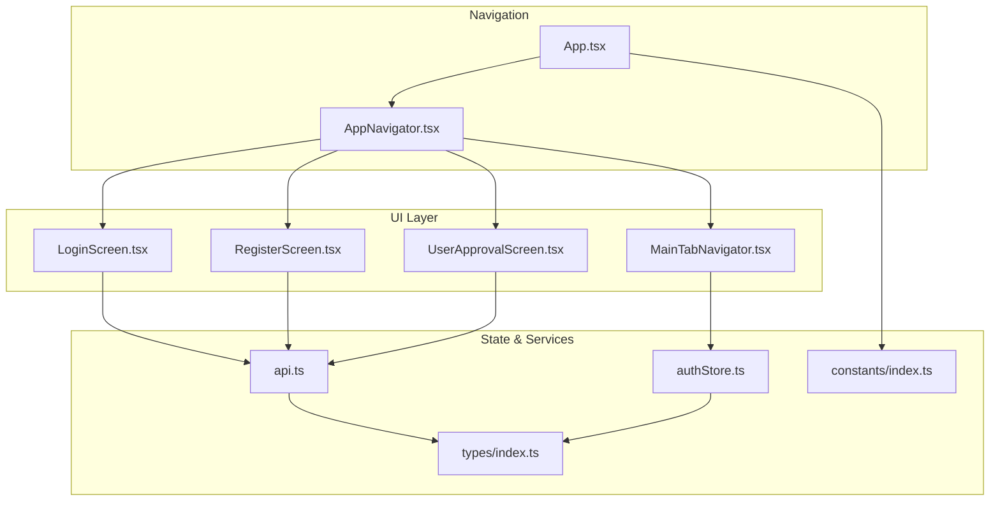
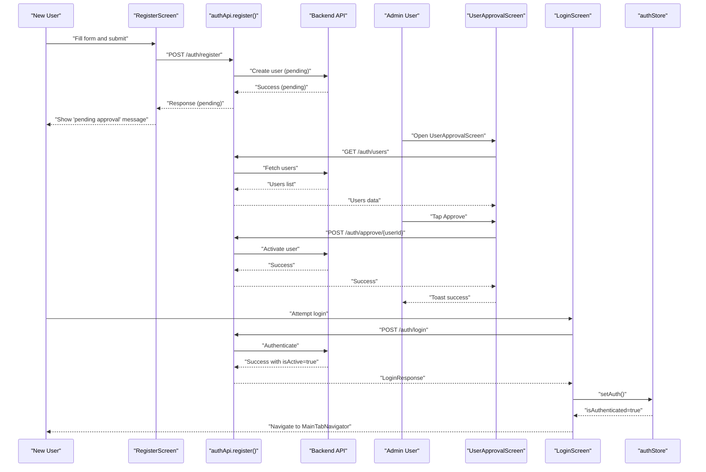
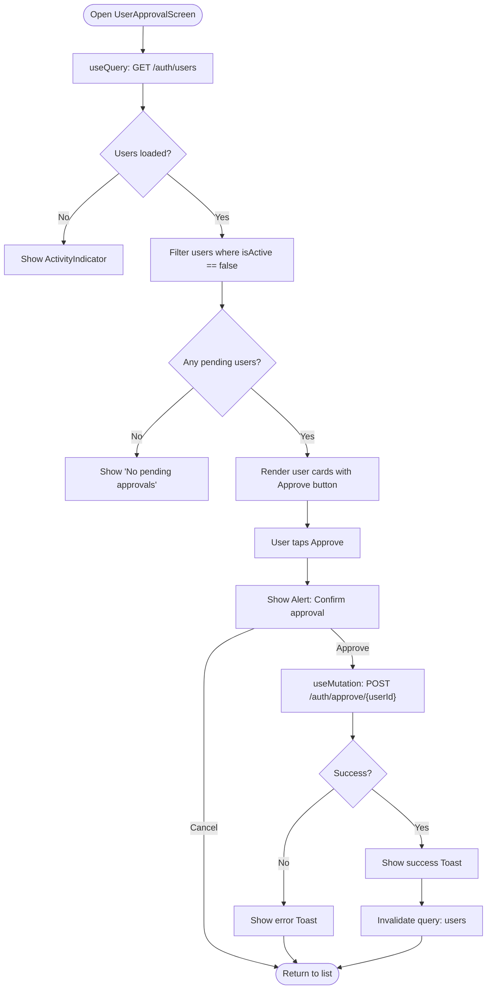
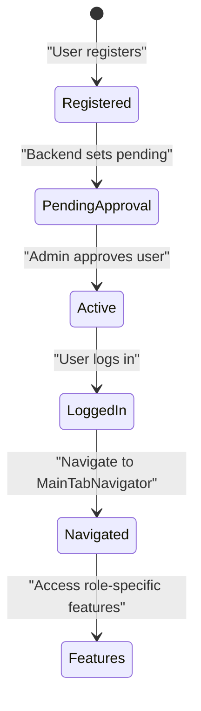
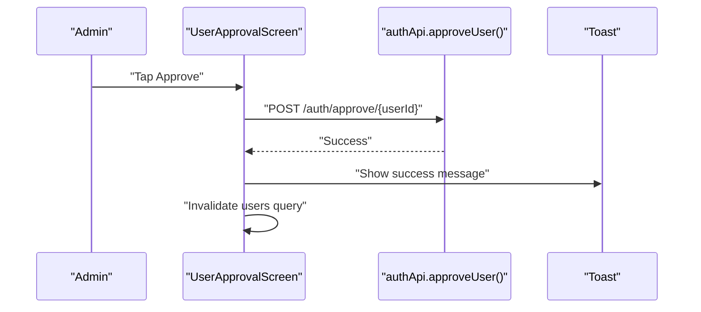
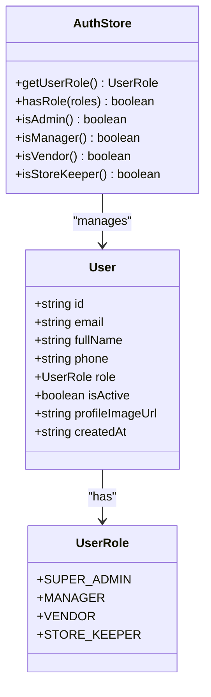
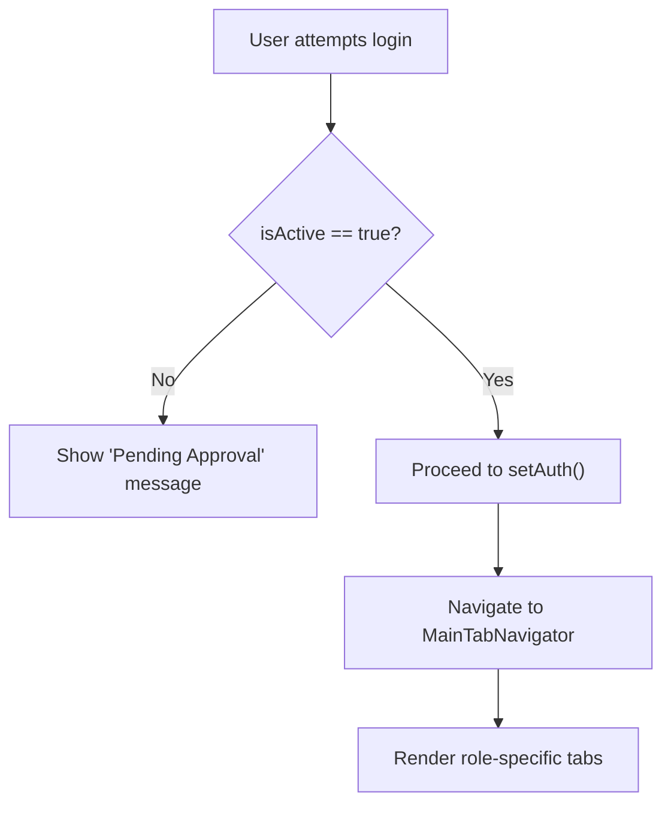
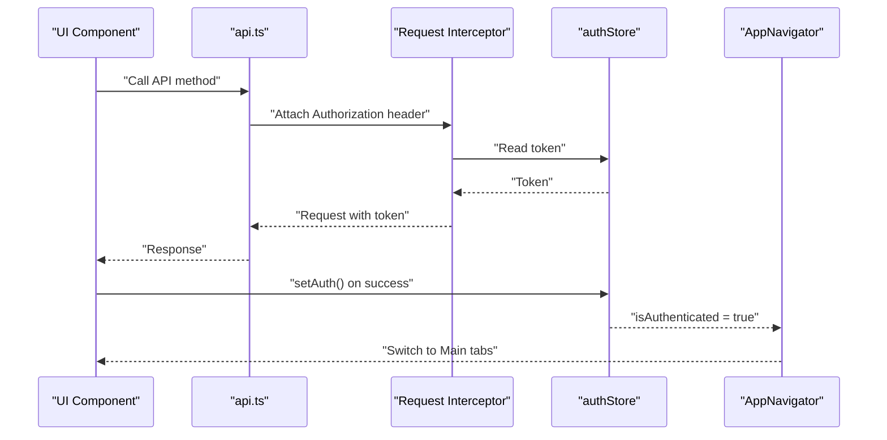
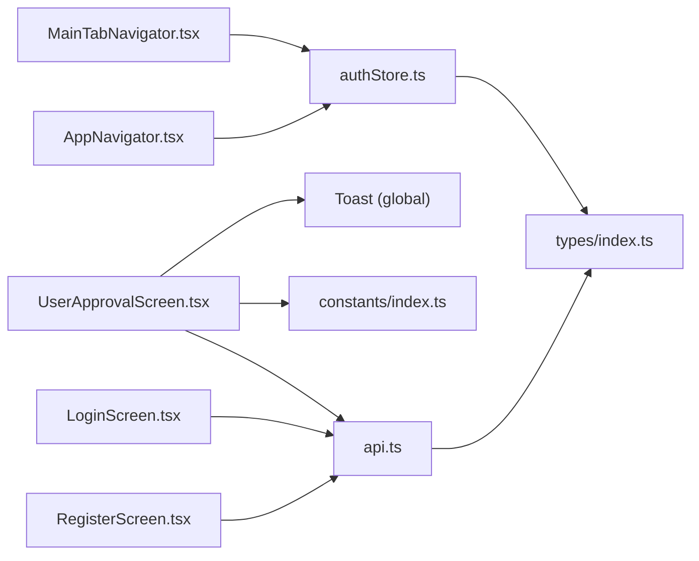

# User Approval Workflow

<cite>
**Referenced Files in This Document**
- [UserApprovalScreen.tsx](file://src/screens/admin/UserApprovalScreen.tsx)
- [authStore.ts](file://src/store/authStore.ts)
- [api.ts](file://src/services/api.ts)
- [index.ts](file://src/types/index.ts)
- [LoginScreen.tsx](file://src/screens/auth/LoginScreen.tsx)
- [RegisterScreen.tsx](file://src/screens/auth/RegisterScreen.tsx)
- [AppNavigator.tsx](file://src/navigation/AppNavigator.tsx)
- [MainTabNavigator.tsx](file://src/navigation/MainTabNavigator.tsx)
- [App.tsx](file://src/App.tsx)
- [index.ts](file://src/constants/index.ts)
</cite>

## Table of Contents
1. [Introduction](#introduction)
2. [Project Structure](#project-structure)
3. [Core Components](#core-components)
4. [Architecture Overview](#architecture-overview)
5. [Detailed Component Analysis](#detailed-component-analysis)
6. [Dependency Analysis](#dependency-analysis)
7. [Performance Considerations](#performance-considerations)
8. [Troubleshooting Guide](#troubleshooting-guide)
9. [Conclusion](#conclusion)

## Introduction
This document explains the user approval workflow in the Banana Harvest App. It covers the vendor registration process, where new users must be approved by administrators before gaining full access. It documents the UserApprovalScreen implementation, including vendor listing, approval/rejection actions, and status management. It details approval state transitions from pending registration to active/vendor status, describes the notification system for approval notifications, and explains role assignment after approval. Finally, it outlines how approved vendors gain access to specific features and how the approval workflow integrates with the overall authentication system.

## Project Structure
The approval workflow spans several layers:
- Authentication screens for registration and login
- API service layer for backend communication
- Store for authentication state and role checks
- Admin screen for managing user approvals
- Navigation integration for role-based access

**Diagram sources**
- [App.tsx](file://src/App.tsx#L1-L95)
- [AppNavigator.tsx](file://src/navigation/AppNavigator.tsx#L1-L60)
- [LoginScreen.tsx](file://src/screens/auth/LoginScreen.tsx#L1-L259)
- [RegisterScreen.tsx](file://src/screens/auth/RegisterScreen.tsx#L1-L357)
- [UserApprovalScreen.tsx](file://src/screens/admin/UserApprovalScreen.tsx#L1-L197)
- [MainTabNavigator.tsx](file://src/navigation/MainTabNavigator.tsx#L1-L414)
- [authStore.ts](file://src/store/authStore.ts#L1-L116)
- [api.ts](file://src/services/api.ts#L1-L326)
- [index.ts](file://src/types/index.ts#L1-L429)
- [index.ts](file://src/constants/index.ts#L1-L363)

**Section sources**
- [App.tsx](file://src/App.tsx#L1-L95)
- [AppNavigator.tsx](file://src/navigation/AppNavigator.tsx#L1-L60)

## Core Components
- UserApprovalScreen: Lists pending users and handles approval actions via API mutations.
- authStore: Manages authentication state, tokens, and role-based getters.
- api.ts: Provides typed API clients for authentication and user management.
- types/index.ts: Defines User, UserRole, and related interfaces.
- LoginScreen and RegisterScreen: Implement registration and login flows with approval-aware behavior.
- AppNavigator and MainTabNavigator: Control navigation and role-based visibility.

**Section sources**
- [UserApprovalScreen.tsx](file://src/screens/admin/UserApprovalScreen.tsx#L1-L197)
- [authStore.ts](file://src/store/authStore.ts#L1-L116)
- [api.ts](file://src/services/api.ts#L1-L326)
- [index.ts](file://src/types/index.ts#L1-L429)
- [LoginScreen.tsx](file://src/screens/auth/LoginScreen.tsx#L1-L259)
- [RegisterScreen.tsx](file://src/screens/auth/RegisterScreen.tsx#L1-L357)
- [AppNavigator.tsx](file://src/navigation/AppNavigator.tsx#L1-L60)
- [MainTabNavigator.tsx](file://src/navigation/MainTabNavigator.tsx#L1-L414)

## Architecture Overview
The approval workflow follows a clear sequence:
- Users register with a selected role.
- Registration is submitted to the backend; the user becomes pending approval.
- Administrators review pending users in the UserApprovalScreen and approve them.
- On approval, the backend activates the user; the frontend receives updated state and navigates accordingly.
- Approved users can log in and access role-specific features.

**Diagram sources**
- [RegisterScreen.tsx](file://src/screens/auth/RegisterScreen.tsx#L55-L88)
- [api.ts](file://src/services/api.ts#L72-L73)
- [UserApprovalScreen.tsx](file://src/screens/admin/UserApprovalScreen.tsx#L27-L55)
- [api.ts](file://src/services/api.ts#L81-L88)
- [LoginScreen.tsx](file://src/screens/auth/LoginScreen.tsx#L43-L82)
- [api.ts](file://src/services/api.ts#L69-L70)
- [authStore.ts](file://src/store/authStore.ts#L40-L58)

## Detailed Component Analysis

### UserApprovalScreen Implementation
- Fetches all users and filters those with isActive=false.
- Renders a list of pending users with basic info and an Approve action.
- Uses a mutation to call the backend approval endpoint.
- Displays success/error notifications and refreshes the user list.

**Diagram sources**
- [UserApprovalScreen.tsx](file://src/screens/admin/UserApprovalScreen.tsx#L23-L146)
- [api.ts](file://src/services/api.ts#L81-L88)

**Section sources**
- [UserApprovalScreen.tsx](file://src/screens/admin/UserApprovalScreen.tsx#L1-L197)
- [api.ts](file://src/services/api.ts#L81-L88)

### Vendor Registration and Approval State Transitions
- Registration: The RegisterScreen submits a request with role selection. The backend creates a user record in a pending state.
- Login gating: The LoginScreen checks the returned isActive flag; if false, it prevents login and shows a pending approval message.
- Approval: The UserApprovalScreen calls the backend to activate the user.
- Post-approval: The user can log in and is placed into the appropriate role.

**Diagram sources**
- [RegisterScreen.tsx](file://src/screens/auth/RegisterScreen.tsx#L55-L88)
- [LoginScreen.tsx](file://src/screens/auth/LoginScreen.tsx#L43-L82)
- [UserApprovalScreen.tsx](file://src/screens/admin/UserApprovalScreen.tsx#L36-L55)
- [authStore.ts](file://src/store/authStore.ts#L40-L58)

**Section sources**
- [RegisterScreen.tsx](file://src/screens/auth/RegisterScreen.tsx#L55-L88)
- [LoginScreen.tsx](file://src/screens/auth/LoginScreen.tsx#L43-L82)
- [UserApprovalScreen.tsx](file://src/screens/admin/UserApprovalScreen.tsx#L36-L55)
- [authStore.ts](file://src/store/authStore.ts#L40-L58)

### Notification System for Approval Notifications
- Toast notifications: Used for approval success/error feedback in UserApprovalScreen.
- Global Toast provider: Configured at the app shell level for consistent messaging.
- No dedicated push notifications or email/SMS integration is present in the frontend code reviewed.

**Diagram sources**
- [UserApprovalScreen.tsx](file://src/screens/admin/UserApprovalScreen.tsx#L36-L55)
- [App.tsx](file://src/App.tsx#L67-L67)

**Section sources**
- [UserApprovalScreen.tsx](file://src/screens/admin/UserApprovalScreen.tsx#L40-L54)
- [App.tsx](file://src/App.tsx#L67-L67)

### Role Assignment and Access Control
- Role model: UserRole includes SUPER_ADMIN, MANAGER, VENDOR, STORE_KEEPER.
- Role getters: authStore exposes helpers like isAdmin(), isManager(), isVendor(), isStoreKeeper().
- Navigation: AppNavigator conditionally renders screens based on authentication state.
- Tab navigation: MainTabNavigator defines role-based tabs and computes badges for actionable items.

**Diagram sources**
- [index.ts](file://src/types/index.ts#L2-L18)
- [authStore.ts](file://src/store/authStore.ts#L78-L102)

**Section sources**
- [index.ts](file://src/types/index.ts#L2-L18)
- [authStore.ts](file://src/store/authStore.ts#L78-L102)
- [AppNavigator.tsx](file://src/navigation/AppNavigator.tsx#L28-L59)
- [MainTabNavigator.tsx](file://src/navigation/MainTabNavigator.tsx#L49-L60)
- [index.ts](file://src/constants/index.ts#L329-L334)

### Conditional UI Rendering Based on Approval Status
- Login gating: LoginScreen prevents login if isActive is false and shows a pending approval message.
- Navigation gating: AppNavigator only shows MainTabNavigator after successful authentication; UserApprovalScreen is available to admins.
- Role-based UI: MainTabNavigator filters visible tabs based on user role.

**Diagram sources**
- [LoginScreen.tsx](file://src/screens/auth/LoginScreen.tsx#L49-L58)
- [authStore.ts](file://src/store/authStore.ts#L40-L58)
- [AppNavigator.tsx](file://src/navigation/AppNavigator.tsx#L28-L59)
- [MainTabNavigator.tsx](file://src/navigation/MainTabNavigator.tsx#L284-L286)

**Section sources**
- [LoginScreen.tsx](file://src/screens/auth/LoginScreen.tsx#L49-L58)
- [authStore.ts](file://src/store/authStore.ts#L40-L58)
- [AppNavigator.tsx](file://src/navigation/AppNavigator.tsx#L28-L59)
- [MainTabNavigator.tsx](file://src/navigation/MainTabNavigator.tsx#L284-L286)

### Integration with Authentication System
- Token lifecycle: api.ts interceptors manage Authorization headers and refresh tokens.
- Auth state persistence: authStore persists user, tokens, and authentication status.
- Navigation integration: AppNavigator switches between Auth screens and Main tabs based on isAuthenticated.

**Diagram sources**
- [api.ts](file://src/services/api.ts#L16-L27)
- [authStore.ts](file://src/store/authStore.ts#L40-L58)
- [AppNavigator.tsx](file://src/navigation/AppNavigator.tsx#L28-L59)

**Section sources**
- [api.ts](file://src/services/api.ts#L16-L65)
- [authStore.ts](file://src/store/authStore.ts#L40-L76)
- [AppNavigator.tsx](file://src/navigation/AppNavigator.tsx#L28-L59)

## Dependency Analysis
- UserApprovalScreen depends on:
  - useQuery/useMutation for data fetching and mutations
  - authApi for user listing and approval
  - Toast for notifications
  - constants for styling and theming
- authStore provides:
  - Authentication state and role getters
  - Persistence via Zustand with AsyncStorage
- api.ts centralizes:
  - Axios instance configuration
  - Request/response interceptors
  - Typed API endpoints for auth and other domains
- Types define:
  - User and UserRole contracts
  - Navigation param lists
- AppNavigator/MainTabNavigator coordinate:
  - Role-based visibility
  - Initial routes per role

**Diagram sources**
- [UserApprovalScreen.tsx](file://src/screens/admin/UserApprovalScreen.tsx#L1-L197)
- [api.ts](file://src/services/api.ts#L1-L326)
- [authStore.ts](file://src/store/authStore.ts#L1-L116)
- [index.ts](file://src/types/index.ts#L1-L429)
- [AppNavigator.tsx](file://src/navigation/AppNavigator.tsx#L1-L60)
- [MainTabNavigator.tsx](file://src/navigation/MainTabNavigator.tsx#L1-L414)
- [index.ts](file://src/constants/index.ts#L1-L363)

**Section sources**
- [UserApprovalScreen.tsx](file://src/screens/admin/UserApprovalScreen.tsx#L1-L197)
- [authStore.ts](file://src/store/authStore.ts#L1-L116)
- [api.ts](file://src/services/api.ts#L1-L326)
- [index.ts](file://src/types/index.ts#L1-L429)
- [AppNavigator.tsx](file://src/navigation/AppNavigator.tsx#L1-L60)
- [MainTabNavigator.tsx](file://src/navigation/MainTabNavigator.tsx#L1-L414)
- [index.ts](file://src/constants/index.ts#L1-L363)

## Performance Considerations
- Query caching and invalidation: UserApprovalScreen invalidates the users query after approval to reflect changes immediately.
- Network retries: The global QueryClient is configured with retry and staleTime defaults to reduce redundant network calls.
- Token refresh: The request interceptor automatically refreshes tokens on 401, minimizing user interruptions.
- UI responsiveness: Loading indicators and disabled states prevent concurrent approvals.

[No sources needed since this section provides general guidance]

## Troubleshooting Guide
- Login blocked with pending approval message:
  - Cause: Backend returned isActive=false during login.
  - Resolution: Wait for admin approval; reattempt login after approval.
- Approval mutation fails:
  - Symptoms: Error toast appears; users list does not update.
  - Resolution: Verify backend connectivity; retry after network stabilization.
- No pending approvals shown:
  - Symptoms: Empty list in UserApprovalScreen.
  - Resolution: Confirm users exist with isActive=false; refresh the list.
- Role-based tab missing:
  - Symptoms: Expected tab not visible.
  - Resolution: Ensure user role is correctly set; verify constants ROLE_NAV_ITEMS.

**Section sources**
- [LoginScreen.tsx](file://src/screens/auth/LoginScreen.tsx#L49-L58)
- [UserApprovalScreen.tsx](file://src/screens/admin/UserApprovalScreen.tsx#L48-L54)
- [MainTabNavigator.tsx](file://src/navigation/MainTabNavigator.tsx#L284-L286)
- [index.ts](file://src/constants/index.ts#L329-L334)

## Conclusion
The Banana Harvest App implements a robust user approval workflow centered around role-based access and administrative oversight. The frontend provides a streamlined approval interface, integrates tightly with the authentication store, and enforces role-based navigation. While the current implementation focuses on toast-based notifications and UI-driven gating, it establishes a solid foundation for extending approval notifications and integrating backend-driven alerts in future iterations.