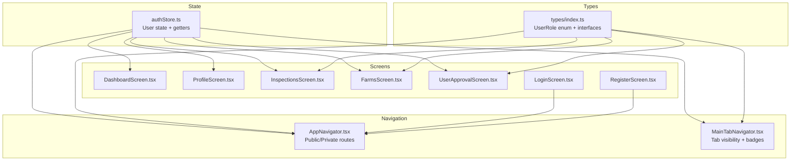
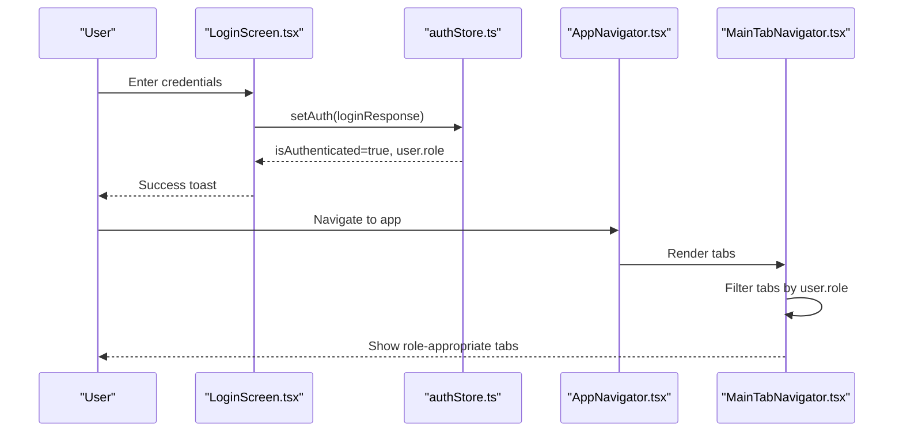
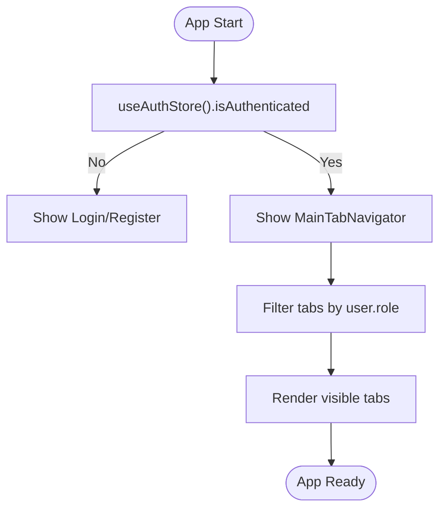
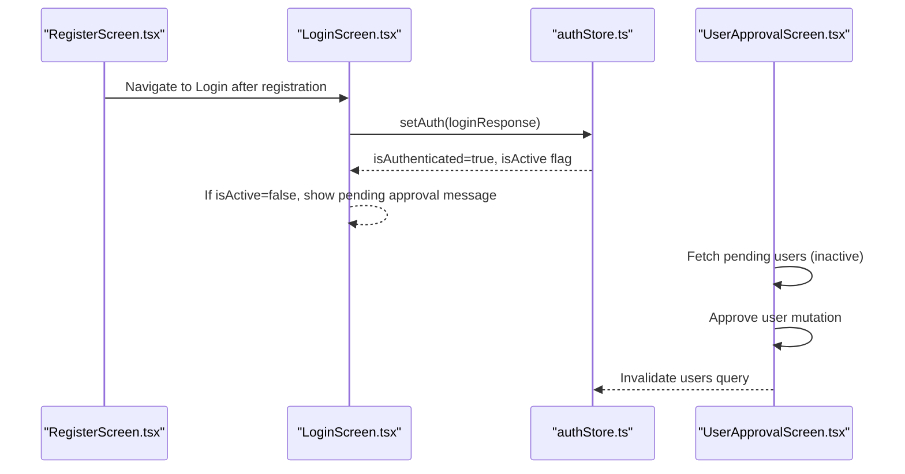
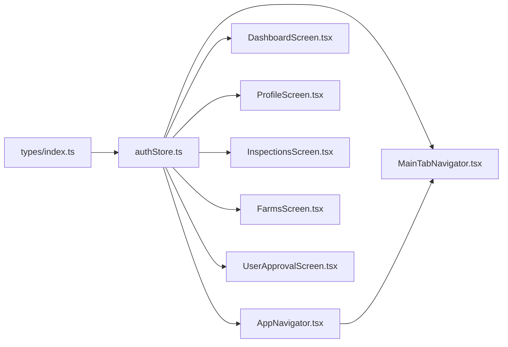

# User Roles & Permissions

<cite>
**Referenced Files in This Document**
- [authStore.ts](file://src/store/authStore.ts)
- [index.ts](file://src/types/index.ts)
- [AppNavigator.tsx](file://src/navigation/AppNavigator.tsx)
- [MainTabNavigator.tsx](file://src/navigation/MainTabNavigator.tsx)
- [UserApprovalScreen.tsx](file://src/screens/admin/UserApprovalScreen.tsx)
- [LoginScreen.tsx](file://src/screens/auth/LoginScreen.tsx)
- [RegisterScreen.tsx](file://src/screens/auth/RegisterScreen.tsx)
- [DashboardScreen.tsx](file://src/screens/dashboard/DashboardScreen.tsx)
- [ProfileScreen.tsx](file://src/screens/profile/ProfileScreen.tsx)
- [InspectionsScreen.tsx](file://src/screens/inspections/InspectionsScreen.tsx)
- [FarmsScreen.tsx](file://src/screens/farms/FarmsScreen.tsx)
</cite>

## Table of Contents
1. [Introduction](#introduction)
2. [Project Structure](#project-structure)
3. [Core Components](#core-components)
4. [Architecture Overview](#architecture-overview)
5. [Detailed Component Analysis](#detailed-component-analysis)
6. [Dependency Analysis](#dependency-analysis)
7. [Performance Considerations](#performance-considerations)
8. [Troubleshooting Guide](#troubleshooting-guide)
9. [Conclusion](#conclusion)

## Introduction
This document explains the user role and permission system in the Banana Harvest App. It covers the four user roles, their permissions and access levels, role-based navigation restrictions, UI element visibility controls, permission checking mechanisms, role inheritance patterns, and the user approval workflow. Practical examples demonstrate how role checks are implemented across the application.

## Project Structure
The role and permission system spans several layers:
- Authentication state and getters live in a centralized store.
- Types define the roles and shared interfaces.
- Navigation defines public/private routes and tab visibility.
- Screens implement role-based rendering and guarded queries.
- Admin screens manage user approvals.

**Diagram sources**
- [authStore.ts](file://src/store/authStore.ts#L1-L116)
- [index.ts](file://src/types/index.ts#L1-L7)
- [AppNavigator.tsx](file://src/navigation/AppNavigator.tsx#L1-L60)
- [MainTabNavigator.tsx](file://src/navigation/MainTabNavigator.tsx#L1-L414)
- [DashboardScreen.tsx](file://src/screens/dashboard/DashboardScreen.tsx#L1-L402)
- [ProfileScreen.tsx](file://src/screens/profile/ProfileScreen.tsx#L1-L270)
- [InspectionsScreen.tsx](file://src/screens/inspections/InspectionsScreen.tsx#L1-L800)
- [FarmsScreen.tsx](file://src/screens/farms/FarmsScreen.tsx#L1-L800)
- [UserApprovalScreen.tsx](file://src/screens/admin/UserApprovalScreen.tsx#L1-L197)
- [LoginScreen.tsx](file://src/screens/auth/LoginScreen.tsx#L1-L259)
- [RegisterScreen.tsx](file://src/screens/auth/RegisterScreen.tsx#L1-L357)

**Section sources**
- [authStore.ts](file://src/store/authStore.ts#L1-L116)
- [index.ts](file://src/types/index.ts#L1-L7)
- [AppNavigator.tsx](file://src/navigation/AppNavigator.tsx#L1-L60)
- [MainTabNavigator.tsx](file://src/navigation/MainTabNavigator.tsx#L1-L414)

## Core Components
- User roles are defined as an enum with four values: Super Admin, Manager, Vendor, and Store Keeper.
- The authentication store holds the logged-in user, JWT tokens, and exposes getters to check roles and presence.
- Navigation enforces authentication and role-based visibility of tabs and screens.
- Screens implement role-based UI rendering and guarded data fetching.

Key implementation references:
- Role enum and interfaces: [index.ts](file://src/types/index.ts#L1-L7)
- Auth store getters and setters: [authStore.ts](file://src/store/authStore.ts#L29-L116)
- Public/private routing: [AppNavigator.tsx](file://src/navigation/AppNavigator.tsx#L28-L59)
- Tab visibility and badges: [MainTabNavigator.tsx](file://src/navigation/MainTabNavigator.tsx#L49-L60), [MainTabNavigator.tsx](file://src/navigation/MainTabNavigator.tsx#L284-L286)

**Section sources**
- [index.ts](file://src/types/index.ts#L1-L7)
- [authStore.ts](file://src/store/authStore.ts#L29-L116)
- [AppNavigator.tsx](file://src/navigation/AppNavigator.tsx#L28-L59)
- [MainTabNavigator.tsx](file://src/navigation/MainTabNavigator.tsx#L49-L60)
- [MainTabNavigator.tsx](file://src/navigation/MainTabNavigator.tsx#L284-L286)

## Architecture Overview
The permission model is enforced at three layers:
- UI layer: Conditional rendering and tab visibility based on user role.
- Navigation layer: Route exposure gated by authentication and role.
- Data layer: Queries enabled only for authorized roles.

**Diagram sources**
- [LoginScreen.tsx](file://src/screens/auth/LoginScreen.tsx#L43-L82)
- [authStore.ts](file://src/store/authStore.ts#L40-L76)
- [AppNavigator.tsx](file://src/navigation/AppNavigator.tsx#L28-L59)
- [MainTabNavigator.tsx](file://src/navigation/MainTabNavigator.tsx#L284-L286)

## Detailed Component Analysis

### Role Definitions and Access Levels
- Super Admin: Full administrative access; can manage users and see all tabs.
- Manager: Administrative oversight; can manage farms/batches and see most tabs.
- Vendor: Field operator; can request inspections, submit reports, and view ledger.
- Store Keeper: Inventory and logistics; can manage inventory and gate passes.

These roles are defined centrally and used across navigation and screens.

**Section sources**
- [index.ts](file://src/types/index.ts#L1-L7)
- [MainTabNavigator.tsx](file://src/navigation/MainTabNavigator.tsx#L49-L60)

### Permission Checking Mechanisms
The store exposes:
- getUserRole(): Returns current user role or null.
- hasRole([roles]): Checks if user belongs to any of the given roles.
- isAdmin(): True for Super Admin.
- isManager(): True for Manager.
- isVendor(): True for Vendor.
- isStoreKeeper(): True for Store Keeper.

Usage examples:
- Dashboard renders role-specific content based on user role.
- Profile shows “Manage Users” only for Super Admin.
- Inspections screen splits logic by role for queries and UI.
- Farms screen filters data and actions based on role.

**Section sources**
- [authStore.ts](file://src/store/authStore.ts#L78-L102)
- [DashboardScreen.tsx](file://src/screens/dashboard/DashboardScreen.tsx#L199-L200)
- [ProfileScreen.tsx](file://src/screens/profile/ProfileScreen.tsx#L91-L93)
- [InspectionsScreen.tsx](file://src/screens/inspections/InspectionsScreen.tsx#L142-L144)
- [FarmsScreen.tsx](file://src/screens/farms/FarmsScreen.tsx#L103-L107)

### Role-Based Navigation Restrictions
- Public routes (Login, Register) are shown when not authenticated.
- After login, Main tab navigator is shown with role-filtered tabs.
- Super Admin can access the User Approval screen from Profile.

**Diagram sources**
- [AppNavigator.tsx](file://src/navigation/AppNavigator.tsx#L28-L59)
- [MainTabNavigator.tsx](file://src/navigation/MainTabNavigator.tsx#L284-L286)

**Section sources**
- [AppNavigator.tsx](file://src/navigation/AppNavigator.tsx#L28-L59)
- [MainTabNavigator.tsx](file://src/navigation/MainTabNavigator.tsx#L284-L286)
- [ProfileScreen.tsx](file://src/screens/profile/ProfileScreen.tsx#L91-L93)

### UI Element Visibility Controls
- Tab visibility: Tabs are filtered to include only those permitted for the current role.
- Conditional menus: Profile shows “Manage Users” only for Super Admin.
- Role-specific dashboards: Different layouts for Super Admin/Manager vs Vendor.
- Badge counts: Tabs display actionable counts based on role (e.g., pending inspections for approvers, pending harvests for vendors).

**Section sources**
- [MainTabNavigator.tsx](file://src/navigation/MainTabNavigator.tsx#L284-L286)
- [ProfileScreen.tsx](file://src/screens/profile/ProfileScreen.tsx#L91-L93)
- [DashboardScreen.tsx](file://src/screens/dashboard/DashboardScreen.tsx#L199-L200)
- [MainTabNavigator.tsx](file://src/navigation/MainTabNavigator.tsx#L208-L281)

### Role Inheritance Patterns and Permission Cascade
There is no explicit inheritance hierarchy in code. Instead, permissions are modeled as:
- Single-role checks via dedicated getters (isAdmin, isManager, isVendor, isStoreKeeper).
- Composite checks via hasRole([...]) for groups (e.g., Super Admin and Manager combined).
- UI and data access controlled by role comparisons.

Practical usage:
- Admin/Manager logic often uses a composite check (e.g., Super Admin or Manager).
- Vendor-specific logic uses isVendor().
- Store Keeper logic uses isStoreKeeper().

**Section sources**
- [authStore.ts](file://src/store/authStore.ts#L83-L102)
- [FarmsScreen.tsx](file://src/screens/farms/FarmsScreen.tsx#L99-L100)
- [InspectionsScreen.tsx](file://src/screens/inspections/InspectionsScreen.tsx#L142-L144)

### Examples of Role-Based Conditional Rendering
- Dashboard: Renders admin stats grid or vendor quick actions based on role.
- Profile: Shows “Manage Users” menu item only for Super Admin.
- Farms: Filters farms list and actions depending on whether the user is Admin/Manager or Vendor.
- Inspections: Enables different queries and UI sections for Vendor vs Admin/Manager.

**Section sources**
- [DashboardScreen.tsx](file://src/screens/dashboard/DashboardScreen.tsx#L199-L200)
- [ProfileScreen.tsx](file://src/screens/profile/ProfileScreen.tsx#L91-L93)
- [FarmsScreen.tsx](file://src/screens/farms/FarmsScreen.tsx#L103-L137)
- [InspectionsScreen.tsx](file://src/screens/inspections/InspectionsScreen.tsx#L181-L231)

### Navigation Guards
- Authentication guard: Non-authenticated users are redirected to Login/Register.
- Role guard: Tabs are hidden for unauthorized roles; only visible tabs are rendered.
- Screen-level guard: Some screens (e.g., User Approval) are only reachable by Super Admin.

**Section sources**
- [AppNavigator.tsx](file://src/navigation/AppNavigator.tsx#L28-L59)
- [MainTabNavigator.tsx](file://src/navigation/MainTabNavigator.tsx#L284-L286)
- [ProfileScreen.tsx](file://src/screens/profile/ProfileScreen.tsx#L91-L93)

### User Approval Workflow
- New users register with a role selection (Manager, Vendor, Store Keeper).
- Registration returns success but marks the user as inactive until approved.
- Super Admin reviews pending users and approves them.
- Approved users become active and can log in.

**Diagram sources**
- [RegisterScreen.tsx](file://src/screens/auth/RegisterScreen.tsx#L59-L88)
- [LoginScreen.tsx](file://src/screens/auth/LoginScreen.tsx#L43-L82)
- [authStore.ts](file://src/store/authStore.ts#L40-L76)
- [UserApprovalScreen.tsx](file://src/screens/admin/UserApprovalScreen.tsx#L26-L55)

**Section sources**
- [RegisterScreen.tsx](file://src/screens/auth/RegisterScreen.tsx#L59-L88)
- [LoginScreen.tsx](file://src/screens/auth/LoginScreen.tsx#L43-L82)
- [UserApprovalScreen.tsx](file://src/screens/admin/UserApprovalScreen.tsx#L26-L72)

### Practical Examples of Implementing Role Checks
- Store getters:
  - [getUserRole](file://src/store/authStore.ts#L79-L81)
  - [hasRole](file://src/store/authStore.ts#L83-L86)
  - [isAdmin](file://src/store/authStore.ts#L88-L90)
  - [isManager](file://src/store/authStore.ts#L92-L94)
  - [isVendor](file://src/store/authStore.ts#L96-L98)
  - [isStoreKeeper](file://src/store/authStore.ts#L100-L102)
- UI rendering:
  - [Dashboard role rendering](file://src/screens/dashboard/DashboardScreen.tsx#L199-L200)
  - [Profile menu visibility](file://src/screens/profile/ProfileScreen.tsx#L91-L93)
- Navigation:
  - [Tab filtering](file://src/navigation/MainTabNavigator.tsx#L284-L286)
  - [Public/private routes](file://src/navigation/AppNavigator.tsx#L28-L59)
- Data fetching guards:
  - [Inspections queries](file://src/screens/inspections/InspectionsScreen.tsx#L181-L231)
  - [Farms pending requests](file://src/screens/farms/FarmsScreen.tsx#L92-L100)

**Section sources**
- [authStore.ts](file://src/store/authStore.ts#L78-L102)
- [DashboardScreen.tsx](file://src/screens/dashboard/DashboardScreen.tsx#L199-L200)
- [ProfileScreen.tsx](file://src/screens/profile/ProfileScreen.tsx#L91-L93)
- [MainTabNavigator.tsx](file://src/navigation/MainTabNavigator.tsx#L284-L286)
- [AppNavigator.tsx](file://src/navigation/AppNavigator.tsx#L28-L59)
- [InspectionsScreen.tsx](file://src/screens/inspections/InspectionsScreen.tsx#L181-L231)
- [FarmsScreen.tsx](file://src/screens/farms/FarmsScreen.tsx#L92-L100)

## Dependency Analysis
The role system depends on:
- Types for role definitions.
- Store for role getters and state.
- Navigation for route and tab visibility.
- Screens for conditional rendering and guarded queries.

**Diagram sources**
- [index.ts](file://src/types/index.ts#L1-L7)
- [authStore.ts](file://src/store/authStore.ts#L1-L116)
- [AppNavigator.tsx](file://src/navigation/AppNavigator.tsx#L1-L60)
- [MainTabNavigator.tsx](file://src/navigation/MainTabNavigator.tsx#L1-L414)
- [DashboardScreen.tsx](file://src/screens/dashboard/DashboardScreen.tsx#L1-L402)
- [ProfileScreen.tsx](file://src/screens/profile/ProfileScreen.tsx#L1-L270)
- [InspectionsScreen.tsx](file://src/screens/inspections/InspectionsScreen.tsx#L1-L800)
- [FarmsScreen.tsx](file://src/screens/farms/FarmsScreen.tsx#L1-L800)
- [UserApprovalScreen.tsx](file://src/screens/admin/UserApprovalScreen.tsx#L1-L197)

**Section sources**
- [index.ts](file://src/types/index.ts#L1-L7)
- [authStore.ts](file://src/store/authStore.ts#L1-L116)
- [AppNavigator.tsx](file://src/navigation/AppNavigator.tsx#L1-L60)
- [MainTabNavigator.tsx](file://src/navigation/MainTabNavigator.tsx#L1-L414)

## Performance Considerations
- Prefer single-role getters (isAdmin/isManager/etc.) to avoid repeated role comparisons.
- Use hasRole for group checks to minimize branching in UI logic.
- Enable queries only for authorized roles to reduce unnecessary network calls.
- Cache frequently accessed role checks in component scope to avoid recomputation.

## Troubleshooting Guide
Common issues and resolutions:
- Login fails with “Account Pending Approval”: The backend returned an inactive user; instruct the user to wait for Super Admin approval.
- Super Admin cannot see “Manage Users”: Ensure the user role is Super Admin and the Profile menu is visible.
- Vendor cannot see pending inspections: Confirm the Vendor role and that the appropriate query is enabled.

**Section sources**
- [LoginScreen.tsx](file://src/screens/auth/LoginScreen.tsx#L49-L58)
- [ProfileScreen.tsx](file://src/screens/profile/ProfileScreen.tsx#L91-L93)
- [InspectionsScreen.tsx](file://src/screens/inspections/InspectionsScreen.tsx#L285-L295)

## Conclusion
The Banana Harvest App implements a clear, centralized role and permission system. Roles are defined in types, enforced in the store, and applied across navigation, UI rendering, and guarded data access. Super Admin manages user approvals, while other roles operate within clearly defined scopes. The provided getters and navigation patterns offer a robust foundation for extending permissions and maintaining consistent access control.