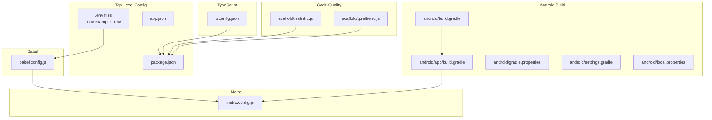
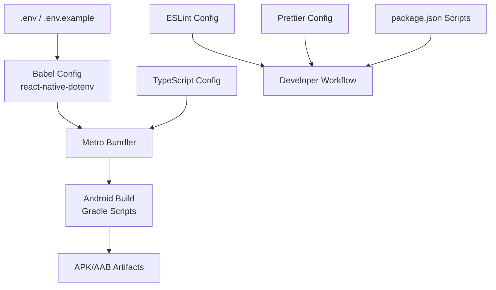
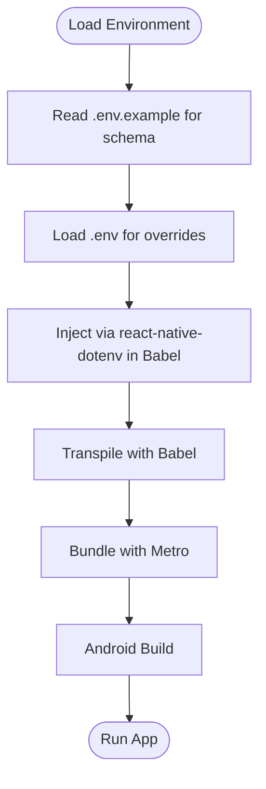
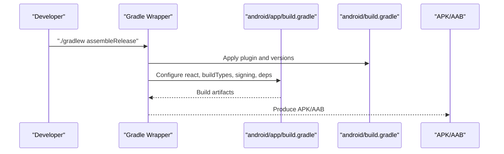
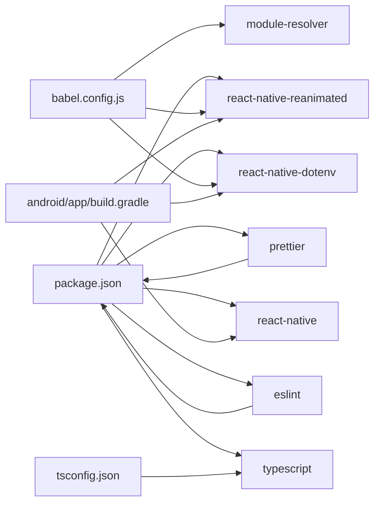

# Configuration & Environment

<cite>
**Referenced Files in This Document**
- [.env.example](file://.env.example)
- [.env](file://.env)
- [app.json](file://app.json)
- [babel.config.js](file://babel.config.js)
- [metro.config.js](file://metro.config.js)
- [tsconfig.json](file://tsconfig.json)
- [package.json](file://package.json)
- [android/app/build.gradle](file://android/app/build.gradle)
- [android/build.gradle](file://android/build.gradle)
- [android/gradle.properties](file://android/gradle.properties)
- [android/settings.gradle](file://android/settings.gradle)
- [android/local.properties](file://android/local.properties)
- [scaffold/.eslintrc.js](file://scaffold/.eslintrc.js)
- [scaffold/.prettierrc.js](file://scaffold/.prettierrc.js)
</cite>

## Table of Contents
1. [Introduction](#introduction)
2. [Project Structure](#project-structure)
3. [Core Components](#core-components)
4. [Architecture Overview](#architecture-overview)
5. [Detailed Component Analysis](#detailed-component-analysis)
6. [Dependency Analysis](#dependency-analysis)
7. [Performance Considerations](#performance-considerations)
8. [Troubleshooting Guide](#troubleshooting-guide)
9. [Conclusion](#conclusion)
10. [Appendices](#appendices)

## Introduction
This document provides comprehensive configuration and environment documentation for the Banana Harvest App. It covers environment variables, React Native app metadata, Android build configuration, Metro bundler settings, Babel transpilation, TypeScript configuration, ESLint and Prettier formatting, development versus production differences, debugging and performance flags, and guidance for CI/CD automation.

## Project Structure
The project follows a standard React Native monorepo-like layout with a top-level frontend and a scaffold module. Key configuration areas include:
- Environment variables for API endpoints, feature flags, and optional integrations
- React Native app metadata via app.json
- Android Gradle build scripts and properties
- Metro bundler configuration
- Babel configuration for transpilation and aliases
- TypeScript configuration and type checking
- Linting and formatting rules

**Diagram sources**
- [app.json](file://app.json#L1-L4)
- [babel.config.js](file://babel.config.js#L1-L35)
- [metro.config.js](file://metro.config.js#L1-L12)
- [tsconfig.json](file://tsconfig.json#L1-L43)
- [package.json](file://package.json#L1-L74)
- [android/app/build.gradle](file://android/app/build.gradle#L1-L120)
- [android/build.gradle](file://android/build.gradle#L1-L32)
- [android/gradle.properties](file://android/gradle.properties#L1-L49)
- [android/settings.gradle](file://android/settings.gradle#L1-L5)
- [android/local.properties](file://android/local.properties#L1-L2)
- [scaffold/.eslintrc.js](file://scaffold/.eslintrc.js#L1-L5)
- [scaffold/.prettierrc.js](file://scaffold/.prettierrc.js#L1-L8)

**Section sources**
- [app.json](file://app.json#L1-L4)
- [package.json](file://package.json#L1-L74)

## Core Components
This section documents the primary configuration components and their roles.

- Environment Variables (.env and .env.example)
  - Purpose: Define API base URL, feature flags, app metadata, and optional service credentials.
  - Example entries include API base URL, analytics and crash reporting toggles, app name/version, and placeholders for Sentry and Firebase configuration.
  - Notes: The example file demonstrates intended keys; the active .env file overrides defaults for local development.

- React Native App Metadata (app.json)
  - Purpose: Provides the internal app name and display name used by the runtime and packaging tools.

- Metro Bundler (metro.config.js)
  - Purpose: Extends the default Metro configuration for bundling and asset handling. The current configuration merges defaults with an empty local config object.

- Babel Transpilation (babel.config.js)
  - Purpose: Defines presets and plugins for transpiling TypeScript/JavaScript and enabling environment variable injection via react-native-dotenv.
  - Notable items: react-native-dotenv configuration pointing to .env, module resolver aliases mapped to the src directory, and reanimated plugin.

- TypeScript Configuration (tsconfig.json)
  - Purpose: Extends the React Native TypeScript configuration and sets strict compiler options, module targets, JSX mode, path aliases, and include/exclude patterns.

- Android Build Configuration
  - Root Gradle (android/build.gradle): Declares SDK versions, Kotlin version, and dependency versions; applies resolution strategy for AndroidX core.
  - App Gradle (android/app/build.gradle): Configures React Native plugin options, build variants, signing configs, dependencies (Hermes/JSC), and native modules.
  - Gradle Properties (android/gradle.properties): JVM args, AndroidX/Jetifier flags, supported architectures, new architecture toggle, Hermes enablement, and Gradle performance flags.
  - Settings and Local Properties: Project name, inclusion of app module, and Android SDK location.

- Code Quality
  - ESLint: Extends the React Native ESLint config.
  - Prettier: Formatting rules for arrow parens, brackets, quotes, and trailing commas.

**Section sources**
- [.env.example](file://.env.example#L1-L19)
- [.env](file://.env#L1-L19)
- [app.json](file://app.json#L1-L4)
- [metro.config.js](file://metro.config.js#L1-L12)
- [babel.config.js](file://babel.config.js#L1-L35)
- [tsconfig.json](file://tsconfig.json#L1-L43)
- [android/app/build.gradle](file://android/app/build.gradle#L1-L120)
- [android/build.gradle](file://android/build.gradle#L1-L32)
- [android/gradle.properties](file://android/gradle.properties#L1-L49)
- [android/settings.gradle](file://android/settings.gradle#L1-L5)
- [android/local.properties](file://android/local.properties#L1-L2)
- [scaffold/.eslintrc.js](file://scaffold/.eslintrc.js#L1-L5)
- [scaffold/.prettierrc.js](file://scaffold/.prettierrc.js#L1-L8)

## Architecture Overview
The configuration architecture ties together environment-driven behavior, bundling, transpilation, type safety, and Android build outputs.

**Diagram sources**
- [.env](file://.env#L1-L19)
- [babel.config.js](file://babel.config.js#L1-L35)
- [metro.config.js](file://metro.config.js#L1-L12)
- [tsconfig.json](file://tsconfig.json#L1-L43)
- [android/app/build.gradle](file://android/app/build.gradle#L1-L120)
- [scaffold/.eslintrc.js](file://scaffold/.eslintrc.js#L1-L5)
- [scaffold/.prettierrc.js](file://scaffold/.prettierrc.js#L1-L8)
- [package.json](file://package.json#L6-L12)

## Detailed Component Analysis

### Environment Variable System
- Purpose: Centralized configuration for API endpoints, feature flags, and optional integrations.
- Implementation:
  - Keys are consumed via react-native-dotenv in Babel configuration.
  - Example keys include API base URL, analytics and crash reporting flags, app name/version, and optional Sentry/Firebase credentials.
  - Two files are present: .env.example defines the schema, while .env holds active values for local development.
- Recommendations:
  - Keep sensitive keys in .env and exclude from VCS via .gitignore.
  - Maintain parity between .env.example and .env during team onboarding.
  - Use feature flags to gate experimental features across environments.

**Diagram sources**
- [.env.example](file://.env.example#L1-L19)
- [.env](file://.env#L1-L19)
- [babel.config.js](file://babel.config.js#L4-L11)

**Section sources**
- [.env.example](file://.env.example#L1-L19)
- [.env](file://.env#L1-L19)
- [babel.config.js](file://babel.config.js#L4-L11)

### React Native App Metadata (app.json)
- Purpose: Defines the internal app name and display name used by the runtime and packaging tools.
- Notes: Minimal configuration suitable for initial setup; extend as needed for permissions, scheme, and platform-specific settings.

**Section sources**
- [app.json](file://app.json#L1-L4)

### Android Build Configuration
- Root Gradle (android/build.gradle):
  - Declares SDK versions, Kotlin version, and plugin dependencies.
  - Applies resolution strategy to pin AndroidX core to a specific version.
- App Gradle (android/app/build.gradle):
  - React Native plugin options for folders, variants, bundling, and Hermes flags.
  - Build types: debug and release; release currently mirrors debug signing for development convenience.
  - Dependencies: React Native, Flipper integration, and conditional inclusion of Hermes or JSC.
  - Native modules application via Gradle plugin.
- Gradle Properties (android/gradle.properties):
  - JVM arguments, AndroidX/Jetifier flags, multi-arch support, new architecture disabled, Hermes enabled, Gradle performance flags, and Java home.
- Settings and Local Properties:
  - Project name and inclusion of the app module.
  - Android SDK path.

**Diagram sources**
- [android/app/build.gradle](file://android/app/build.gradle#L1-L120)
- [android/build.gradle](file://android/build.gradle#L1-L32)
- [android/gradle.properties](file://android/gradle.properties#L1-L49)
- [android/settings.gradle](file://android/settings.gradle#L1-L5)
- [android/local.properties](file://android/local.properties#L1-L2)

**Section sources**
- [android/app/build.gradle](file://android/app/build.gradle#L1-L120)
- [android/build.gradle](file://android/build.gradle#L1-L32)
- [android/gradle.properties](file://android/gradle.properties#L1-L49)
- [android/settings.gradle](file://android/settings.gradle#L1-L5)
- [android/local.properties](file://android/local.properties#L1-L2)

### Metro Bundler Configuration
- Purpose: Extend default Metro configuration for bundling and asset handling.
- Current state: Merges default config with an empty local config object; no overrides applied.
- Recommendations:
  - Add asset handling rules for images/fonts if needed.
  - Consider adding watchFolders for monorepo layouts.
  - Tune performance flags for development versus production.

**Section sources**
- [metro.config.js](file://metro.config.js#L1-L12)

### Babel Transpilation Settings
- Presets and Plugins:
  - Uses the React Native Babel preset.
  - react-native-dotenv plugin injects environment variables from .env with module name @env.
  - react-native-reanimated/plugin for animations.
  - module-resolver plugin with aliases for cleaner imports and root path mapping.
- Recommendations:
  - Keep module-resolver aligned with project structure.
  - Ensure .env is present and properly formatted to avoid undefined values.

**Section sources**
- [babel.config.js](file://babel.config.js#L1-L35)

### TypeScript Configuration Options
- Extends the React Native TypeScript configuration.
- Compiler options emphasize strictness, ES2020 targets, React Native JSX, path aliases, and JSON resolution.
- Include/exclude patterns focus on source and app entry while excluding build and tooling files.

**Section sources**
- [tsconfig.json](file://tsconfig.json#L1-L43)

### ESLint and Prettier Setup
- ESLint:
  - Extends the React Native ESLint config for consistent linting across the project.
- Prettier:
  - Enforces formatting rules including arrow parens, bracket alignment, spacing, and trailing commas.

**Section sources**
- [scaffold/.eslintrc.js](file://scaffold/.eslintrc.js#L1-L5)
- [scaffold/.prettierrc.js](file://scaffold/.prettierrc.js#L1-L8)

## Dependency Analysis
This section maps key dependencies and their configuration touchpoints.

**Diagram sources**
- [package.json](file://package.json#L14-L68)
- [babel.config.js](file://babel.config.js#L1-L35)
- [tsconfig.json](file://tsconfig.json#L1-L43)
- [android/app/build.gradle](file://android/app/build.gradle#L107-L117)

**Section sources**
- [package.json](file://package.json#L14-L68)
- [babel.config.js](file://babel.config.js#L1-L35)
- [tsconfig.json](file://tsconfig.json#L1-L43)
- [android/app/build.gradle](file://android/app/build.gradle#L107-L117)

## Performance Considerations
- Android Build
  - Hermes is enabled; consider disabling for debugging or enabling ProGuard/R8 in release builds for minification.
  - Gradle performance flags are enabled (daemon, parallel, configure-on-demand).
  - JVM args are increased to improve build memory.
- Metro
  - No custom cache or watch settings; consider adding watchFolders and cache options for large workspaces.
- Babel
  - Module resolver improves build locality; ensure aliases remain accurate to avoid unnecessary rebuilds.
- TypeScript
  - Strict checks improve correctness; keep type definitions updated to prevent incremental slowdowns.

[No sources needed since this section provides general guidance]

## Troubleshooting Guide
- Environment Variables Not Loaded
  - Verify .env exists and keys match those expected by the app.
  - Confirm react-native-dotenv is configured in Babel and moduleName is @env.
- Android Signing Issues
  - Debug signing is used for release in development; replace with a proper keystore for production.
  - Ensure keystore paths and passwords are correct in signingConfigs.
- Metro Bundling Errors
  - Clear Metro cache and reset; confirm module-resolver aliases align with actual file locations.
- TypeScript Errors
  - Run type check script to catch issues early; update type definitions as dependencies change.
- ESLint/Prettier Conflicts
  - Run lint and fix scripts; ensure editor integrates with ESLint and Prettier for consistent formatting.

**Section sources**
- [babel.config.js](file://babel.config.js#L4-L11)
- [android/app/build.gradle](file://android/app/build.gradle#L85-L104)
- [package.json](file://package.json#L6-L12)

## Conclusion
The Banana Harvest App’s configuration establishes a robust foundation for environment-driven behavior, efficient bundling, strict type safety, and maintainable Android builds. By following the documented practices—keeping environment files secure, aligning Babel and Metro settings with project needs, leveraging TypeScript strictness, and optimizing Android build flags—you can streamline development and production workflows.

[No sources needed since this section summarizes without analyzing specific files]

## Appendices

### Development vs Production Configuration Highlights
- Environment Variables
  - Use .env.example as the authoritative schema; .env overrides for local development.
- Android Build Types
  - Debug and release are configured; adjust signing and minification for production.
- Metro
  - Default configuration; extend for performance tuning in production builds.
- TypeScript
  - Strict mode enabled; maintain strictness for reliability.

**Section sources**
- [.env.example](file://.env.example#L1-L19)
- [.env](file://.env#L1-L19)
- [android/app/build.gradle](file://android/app/build.gradle#L93-L104)
- [metro.config.js](file://metro.config.js#L1-L12)
- [tsconfig.json](file://tsconfig.json#L8-L19)

### CI/CD Pipeline Guidance
- Environment Management
  - Store secrets in CI/secure variables; populate .env during build if needed.
- Android Builds
  - Configure keystore and passwords in CI securely; use release signing in CI pipelines.
  - Cache Gradle and NPM to speed up builds.
- Metro and Type Checking
  - Run type-check and lint as pre-release gates.
- Babel and Metro
  - Ensure deterministic builds by pinning versions and avoiding dynamic environment assumptions.

[No sources needed since this section provides general guidance]