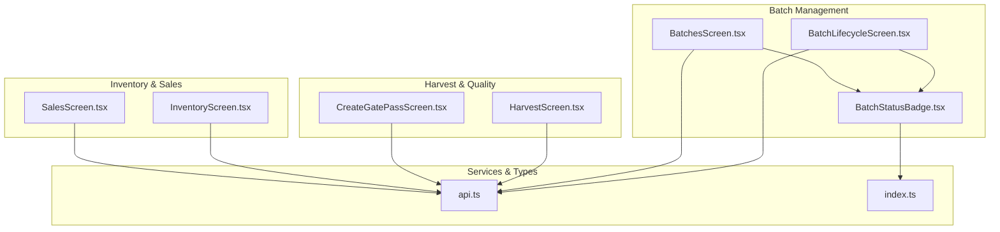
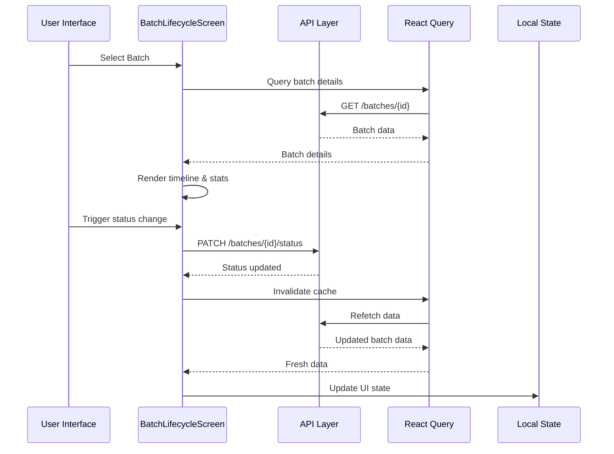
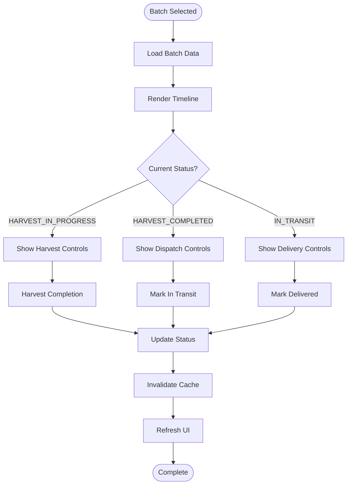
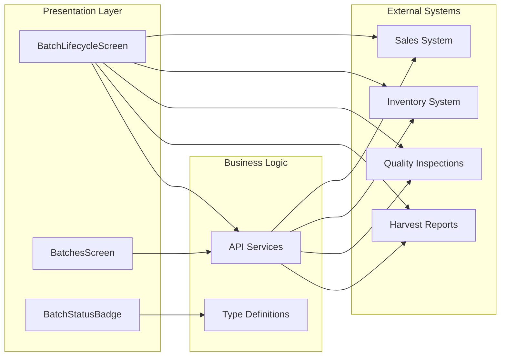

# Batch Lifecycle Management

<cite>
**Referenced Files in This Document**
- [BatchLifecycleScreen.tsx](file://src/screens/batches/BatchLifecycleScreen.tsx)
- [BatchesScreen.tsx](file://src/screens/batches/BatchesScreen.tsx)
- [BatchStatusBadge.tsx](file://src/components/common/BatchStatusBadge.tsx)
- [HarvestScreen.tsx](file://src/screens/harvest/HarvestScreen.tsx)
- [CreateGatePassScreen.tsx](file://src/screens/harvest/CreateGatePassScreen.tsx)
- [InventoryScreen.tsx](file://src/screens/inventory/InventoryScreen.tsx)
- [SalesScreen.tsx](file://src/screens/sales/SalesScreen.tsx)
- [api.ts](file://src/services/api.ts)
- [index.ts](file://src/types/index.ts)
</cite>

## Table of Contents
1. [Introduction](#introduction)
2. [Project Structure](#project-structure)
3. [Core Components](#core-components)
4. [Architecture Overview](#architecture-overview)
5. [Detailed Component Analysis](#detailed-component-analysis)
6. [Dependency Analysis](#dependency-analysis)
7. [Performance Considerations](#performance-considerations)
8. [Troubleshooting Guide](#troubleshooting-guide)
9. [Conclusion](#conclusion)

## Introduction
This document provides comprehensive documentation for the Batch Lifecycle Management feature in the Harvest app frontend. It covers the complete batch creation workflow from farm selection to delivery completion, including status tracking, progress monitoring, milestone visualization, and integration with harvest reporting, quality inspection data, and inventory allocation systems. The documentation also addresses batch details views, manager oversight capabilities, automated status transitions, and reporting functionalities.

## Project Structure
The Batch Lifecycle Management feature spans several screens and shared components:
- Batch lifecycle visualization and controls
- Batch listing and filtering
- Status badge rendering
- Harvest reporting integration
- Gate pass creation and dispatch tracking
- Inventory allocation and receiving
- Sales and invoicing integration

**Diagram sources**
- [BatchLifecycleScreen.tsx](file://src/screens/batches/BatchLifecycleScreen.tsx#L1-L764)
- [BatchesScreen.tsx](file://src/screens/batches/BatchesScreen.tsx#L1-L462)
- [BatchStatusBadge.tsx](file://src/components/common/BatchStatusBadge.tsx#L1-L98)
- [HarvestScreen.tsx](file://src/screens/harvest/HarvestScreen.tsx#L1-L718)
- [CreateGatePassScreen.tsx](file://src/screens/harvest/CreateGatePassScreen.tsx#L1-L338)
- [InventoryScreen.tsx](file://src/screens/inventory/InventoryScreen.tsx#L1-L687)
- [SalesScreen.tsx](file://src/screens/sales/SalesScreen.tsx#L1-L842)
- [api.ts](file://src/services/api.ts#L1-L326)
- [index.ts](file://src/types/index.ts#L1-L429)

**Section sources**
- [BatchLifecycleScreen.tsx](file://src/screens/batches/BatchLifecycleScreen.tsx#L1-L764)
- [BatchesScreen.tsx](file://src/screens/batches/BatchesScreen.tsx#L1-L462)
- [BatchStatusBadge.tsx](file://src/components/common/BatchStatusBadge.tsx#L1-L98)
- [HarvestScreen.tsx](file://src/screens/harvest/HarvestScreen.tsx#L1-L718)
- [CreateGatePassScreen.tsx](file://src/screens/harvest/CreateGatePassScreen.tsx#L1-L338)
- [InventoryScreen.tsx](file://src/screens/inventory/InventoryScreen.tsx#L1-L687)
- [SalesScreen.tsx](file://src/screens/sales/SalesScreen.tsx#L1-L842)
- [api.ts](file://src/services/api.ts#L1-L326)
- [index.ts](file://src/types/index.ts#L1-L429)

## Core Components
The batch lifecycle management system consists of several interconnected components:

### Batch Status Tracking System
The system implements a comprehensive status tracking mechanism with seven distinct states:
- CREATED: Initial batch creation
- HARVEST_IN_PROGRESS: Active harvesting phase
- HARVEST_COMPLETED: Harvesting complete, ready for dispatch
- DISPATCH_IN_PROGRESS: Dispatch process initiated
- DISPATCH_COMPLETED: All boxes dispatched
- IN_TRANSIT: Boxes in transportation
- DELIVERED: Final delivery confirmation

### Real-time Status Resolution
The status badge component provides intelligent status resolution considering:
- Derived statuses based on dispatch vs. received quantities
- Automatic "In Transit" detection when dispatched boxes exceed received boxes
- "Received" status when all dispatched boxes are accounted for

### Progress Monitoring Interface
The lifecycle screen presents a comprehensive progress monitoring interface featuring:
- Timeline visualization with milestone markers
- Real-time progress bars and statistics
- Interactive modals for detailed information
- Automated status transitions based on business rules

**Section sources**
- [BatchStatusBadge.tsx](file://src/components/common/BatchStatusBadge.tsx#L14-L67)
- [index.ts](file://src/types/index.ts#L142-L176)
- [BatchLifecycleScreen.tsx](file://src/screens/batches/BatchLifecycleScreen.tsx#L200-L245)

## Architecture Overview
The batch lifecycle management follows a reactive architecture pattern with real-time data synchronization:

**Diagram sources**
- [BatchLifecycleScreen.tsx](file://src/screens/batches/BatchLifecycleScreen.tsx#L44-L49)
- [api.ts](file://src/services/api.ts#L123-L127)

The architecture leverages:
- React Query for automatic caching and synchronization
- Real-time status updates through optimistic UI patterns
- Modular component design for maintainability
- Type-safe API interactions

**Section sources**
- [BatchLifecycleScreen.tsx](file://src/screens/batches/BatchLifecycleScreen.tsx#L18-L33)
- [api.ts](file://src/services/api.ts#L1-L326)

## Detailed Component Analysis

### Batch Lifecycle Screen
The central component orchestrating the entire batch lifecycle experience:

#### Timeline Visualization
The screen implements a sophisticated timeline system with four main milestones:
1. **Inspection Phase**: Quality approval and preparation
2. **Harvesting Phase**: Active harvesting with progress tracking
3. **Dispatch Phase**: Box dispatch and shipping
4. **In Transit Phase**: Transportation monitoring

Each timeline step includes:
- Visual milestone indicators with status colors
- Interactive cards with expandable details
- Real-time progress statistics
- Action buttons for status transitions

#### Progress Monitoring Features
- **Harvest Progress**: Real-time calculation of completion percentage
- **Box Tracking**: Detailed breakdown of harvested, wasted, and remaining boxes
- **Dispatch Analytics**: Summary of shipped boxes and vehicle information
- **Quality Metrics**: Integration with inspection data and photos

#### Action Workflows
The screen provides direct actions for authorized users:
- **Harvest Completion**: Marks batch as completed when all allocations are processed
- **In Transit Marking**: Updates status during transportation
- **Delivery Confirmation**: Final delivery acknowledgment

**Diagram sources**
- [BatchLifecycleScreen.tsx](file://src/screens/batches/BatchLifecycleScreen.tsx#L121-L197)

**Section sources**
- [BatchLifecycleScreen.tsx](file://src/screens/batches/BatchLifecycleScreen.tsx#L200-L683)

### Batch Listing and Filtering
The batch listing system provides comprehensive filtering and search capabilities:

#### Tab-based Organization
- **Active Batches**: Currently processing batches (CREATED, HARVEST_IN_PROGRESS, HARVEST_COMPLETED, DISPATCH_IN_PROGRESS)
- **Completed Batches**: Finalized batches (DISPATCH_COMPLETED, IN_TRANSIT, DELIVERED)
- **Pending Inspections**: Quality inspection requests awaiting approval

#### Advanced Search Functionality
- **Batch ID Search**: Direct lookup by batch identifier
- **Farm Name Search**: Locate batches by farm location
- **Vendor Search**: Filter by inspection vendor information

#### Status-based Filtering
The system automatically filters batches based on their current lifecycle stage, ensuring users only see relevant information for their role and current workflow.

**Section sources**
- [BatchesScreen.tsx](file://src/screens/batches/BatchesScreen.tsx#L26-L235)

### Status Badge Component
The status badge component provides intelligent status representation:

#### Dynamic Status Resolution
The component calculates derived statuses in real-time:
- **In Transit Detection**: Automatically shows "In Transit" when dispatched boxes exceed received boxes
- **Received Status**: Displays "Received" when all dispatched boxes are accounted for
- **Legacy Support**: Maintains backward compatibility with older status formats

#### Visual Design System
- **Color-coded Status**: Each status has a dedicated color scheme
- **Consistent Styling**: Uniform badge appearance across the application
- **Responsive Design**: Adapts to different screen sizes and orientations

**Section sources**
- [BatchStatusBadge.tsx](file://src/components/common/BatchStatusBadge.tsx#L14-L67)

### Harvest Reporting Integration
The system integrates closely with harvest reporting for accurate progress tracking:

#### Real-time Data Synchronization
- **Harvest Reports**: Live aggregation of daily harvest reports
- **Box Calculation**: Automatic computation of total harvested, wasted, and remaining boxes
- **Progress Percentage**: Dynamic completion percentage based on estimated vs. actual boxes

#### Quality Inspection Integration
- **Inspection Data**: Direct linkage to quality inspection records
- **Photo Gallery**: Visual evidence of inspection conditions
- **Inspector Information**: Track vendor details and inspection dates

**Section sources**
- [HarvestScreen.tsx](file://src/screens/harvest/HarvestScreen.tsx#L63-L92)
- [BatchLifecycleScreen.tsx](file://src/screens/batches/BatchLifecycleScreen.tsx#L298-L368)

### Gate Pass and Dispatch Management
The dispatch system manages the transition from harvest to delivery:

#### Gate Pass Creation
- **Capacity Validation**: Prevents over-allocation beyond available stock
- **Driver Information**: Comprehensive driver and vehicle details
- **Dispatch Tracking**: Real-time monitoring of dispatched boxes

#### In-transit Monitoring
- **Vehicle Tracking**: Multiple vehicle support per batch
- **Delivery Verification**: Receipt confirmation system
- **Status Automation**: Automatic status transitions based on receipt data

**Section sources**
- [CreateGatePassScreen.tsx](file://src/screens/harvest/CreateGatePassScreen.tsx#L65-L104)
- [BatchLifecycleScreen.tsx](file://src/screens/batches/BatchLifecycleScreen.tsx#L370-L483)

### Inventory Allocation Integration
The system maintains inventory accuracy throughout the batch lifecycle:

#### Material Allocation
- **Batch-specific Allocation**: Direct linking of materials to specific batches
- **Stock Reduction**: Automatic inventory updates upon allocation
- **Usage Tracking**: Comprehensive material consumption monitoring

#### Receiving and Verification
- **Gate Pass Integration**: Direct connection to incoming shipment verification
- **Quantity Matching**: Validation of received quantities against dispatched amounts
- **Cost Recording**: Freight and transportation cost tracking

**Section sources**
- [InventoryScreen.tsx](file://src/screens/inventory/InventoryScreen.tsx#L127-L190)

### Sales and Delivery Tracking
The final stage integrates with sales and delivery systems:

#### Delivery Completion
- **Final Status Update**: Automatic transition to DELIVERED status
- **Sales Integration**: Connection to invoicing and sales tracking
- **Audit Trail**: Complete delivery documentation

#### Post-Delivery Analytics
- **Performance Metrics**: Delivery time and efficiency measurements
- **Customer Tracking**: Buyer information and delivery confirmation
- **Financial Integration**: Revenue recognition and accounting integration

**Section sources**
- [SalesScreen.tsx](file://src/screens/sales/SalesScreen.tsx#L49-L56)
- [BatchLifecycleScreen.tsx](file://src/screens/batches/BatchLifecycleScreen.tsx#L176-L197)

## Dependency Analysis
The batch lifecycle management feature exhibits well-structured dependencies:

**Diagram sources**
- [api.ts](file://src/services/api.ts#L91-L209)
- [index.ts](file://src/types/index.ts#L142-L274)

### Component Coupling
- **Low Coupling**: Components communicate primarily through APIs and shared types
- **High Cohesion**: Each component focuses on a specific aspect of batch management
- **Interface Contracts**: Clear boundaries between presentation, business logic, and data layers

### Data Flow Patterns
- **Unidirectional Data Flow**: Predictable data movement from API to UI
- **Event-driven Updates**: Real-time updates through React Query invalidation
- **Caching Strategy**: Intelligent caching with automatic refresh on status changes

**Section sources**
- [api.ts](file://src/services/api.ts#L1-L326)
- [index.ts](file://src/types/index.ts#L1-L429)

## Performance Considerations
The batch lifecycle management system implements several performance optimization strategies:

### Caching and Synchronization
- **Automatic Cache Invalidation**: React Query handles cache updates across related queries
- **Background Refetching**: Seamless data refresh without user intervention
- **Stale Data Management**: Intelligent handling of outdated information

### UI Performance Optimization
- **Layout Animation**: Optimized animations for smooth user experience
- **Conditional Rendering**: Efficient rendering of timeline steps based on status
- **Image Optimization**: Lazy loading for inspection photos and documents

### Network Efficiency
- **Batch API Calls**: Consolidated data fetching for related batch information
- **Query Key Management**: Strategic use of query keys for optimal cache performance
- **Error Handling**: Graceful degradation when network connectivity is poor

## Troubleshooting Guide
Common issues and their resolutions:

### Status Update Failures
**Symptoms**: Status changes not reflecting in the UI
**Causes**: 
- Network connectivity issues
- Cache synchronization delays
- API service unavailability

**Resolutions**:
- Verify network connectivity and retry the operation
- Force refresh using the pull-to-refresh gesture
- Check browser developer tools for API error messages

### Timeline Display Issues
**Symptoms**: Timeline steps not appearing or showing incorrect information
**Causes**:
- Missing batch data from API
- Incorrect status values
- Timeline rendering bugs

**Resolutions**:
- Ensure batch selection is valid and complete
- Verify status values match the expected enumeration
- Clear browser cache and reload the application

### Progress Calculation Errors
**Symptoms**: Incorrect progress percentages or box counts
**Causes**:
- Data inconsistencies in harvest reports
- Missing or malformed batch information
- Calculation logic errors

**Resolutions**:
- Verify all harvest reports are properly recorded
- Check batch allocation and actual harvest data
- Contact system administrator for data validation

### Integration Issues
**Symptoms**: Problems with external system integrations
**Causes**:
- API endpoint failures
- Authentication token expiration
- Data format mismatches

**Resolutions**:
- Check API service health and availability
- Verify authentication tokens and refresh as needed
- Validate data formats match API specifications

**Section sources**
- [BatchLifecycleScreen.tsx](file://src/screens/batches/BatchLifecycleScreen.tsx#L121-L197)
- [api.ts](file://src/services/api.ts#L30-L65)

## Conclusion
The Batch Lifecycle Management feature provides a comprehensive solution for tracking and managing agricultural production batches from farm selection through final delivery. The system's modular architecture, real-time data synchronization, and intuitive user interface create an efficient workflow for producers, managers, and quality inspectors.

Key strengths of the implementation include:
- **Real-time Status Tracking**: Accurate, up-to-date information across all lifecycle stages
- **Intelligent Status Resolution**: Automatic detection of derived states like "In Transit"
- **Comprehensive Integration**: Seamless connections with harvest reporting, quality inspections, inventory, and sales systems
- **User-friendly Interface**: Intuitive timeline visualization and progress monitoring
- **Robust Error Handling**: Graceful degradation and recovery mechanisms

The system successfully addresses the complete batch lifecycle requirements while maintaining scalability and maintainability for future enhancements and additional features.