# Core Features

<cite>
**Referenced Files in This Document**
- [App.tsx](file://App.tsx)
- [AppNavigator.tsx](file://src/navigation/AppNavigator.tsx)
- [MainTabNavigator.tsx](file://src/navigation/MainTabNavigator.tsx)
- [authStore.ts](file://src/store/authStore.ts)
- [api.ts](file://src/services/api.ts)
- [LoginScreen.tsx](file://src/screens/auth/LoginScreen.tsx)
- [DashboardScreen.tsx](file://src/screens/dashboard/DashboardScreen.tsx)
- [FarmsScreen.tsx](file://src/screens/farms/FarmsScreen.tsx)
- [BatchesScreen.tsx](file://src/screens/batches/BatchesScreen.tsx)
- [HarvestScreen.tsx](file://src/screens/harvest/HarvestScreen.tsx)
- [GatePassScreen.tsx](file://src/screens/harvest/GatePassScreen.tsx)
- [InspectionsScreen.tsx](file://src/screens/inspections/InspectionsScreen.tsx)
- [InventoryScreen.tsx](file://src/screens/inventory/InventoryScreen.tsx)
- [SalesScreen.tsx](file://src/screens/sales/SalesScreen.tsx)
- [index.ts](file://src/types/index.ts)
</cite>

## Table of Contents
1. [Introduction](#introduction)
2. [Project Structure](#project-structure)
3. [Core Components](#core-components)
4. [Architecture Overview](#architecture-overview)
5. [Detailed Component Analysis](#detailed-component-analysis)
6. [Dependency Analysis](#dependency-analysis)
7. [Performance Considerations](#performance-considerations)
8. [Troubleshooting Guide](#troubleshooting-guide)
9. [Conclusion](#conclusion)
10. [Appendices](#appendices)

## Introduction
This document provides comprehensive documentation for the core features of the Banana Harvest App, organized by business domain. It covers authentication and user management, dashboard analytics, farm registration and management, batch lifecycle tracking, daily harvest reporting, quality inspection workflows, inventory management, gate pass creation, sales processing, financial ledger management, and user profile functionality. For each feature, we explain business value, user workflows, data models involved, integration points, navigation patterns, form interactions, validation requirements, and mobile-specific considerations such as camera integration and offline-awareness.

## Project Structure
The frontend is a React Native application structured around:
- Navigation: Stack and bottom tab navigators orchestrating screens and deep links
- Screens: Feature-focused views implementing workflows
- Services: Centralized API client with interceptors for auth and token refresh
- Store: Global auth state persisted in storage
- Types: Strongly typed models for domain entities and API responses

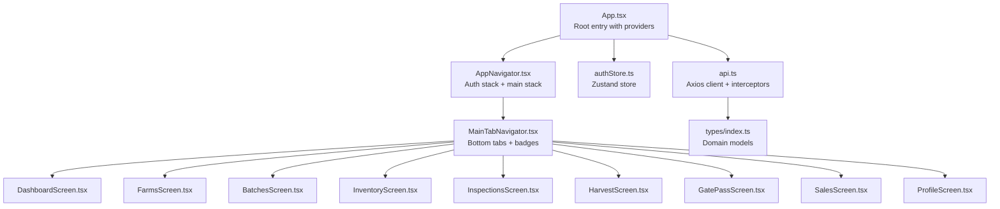

**Diagram sources**
- [App.tsx](file://App.tsx#L1-L95)
- [AppNavigator.tsx](file://src/navigation/AppNavigator.tsx#L1-L60)
- [MainTabNavigator.tsx](file://src/navigation/MainTabNavigator.tsx#L1-L414)
- [authStore.ts](file://src/store/authStore.ts#L1-L116)
- [api.ts](file://src/services/api.ts#L1-L326)
- [index.ts](file://src/types/index.ts#L1-L429)

**Section sources**
- [App.tsx](file://App.tsx#L1-L95)
- [AppNavigator.tsx](file://src/navigation/AppNavigator.tsx#L1-L60)
- [MainTabNavigator.tsx](file://src/navigation/MainTabNavigator.tsx#L1-L414)
- [authStore.ts](file://src/store/authStore.ts#L1-L116)
- [api.ts](file://src/services/api.ts#L1-L326)
- [index.ts](file://src/types/index.ts#L1-L429)

## Core Components
- Authentication and Navigation
  - App initializes providers, navigation container, and global toast
  - AppNavigator routes authenticated users to MainTabNavigator and unauthenticated users to Login/Register
  - Auth state managed by Zustand with persistence and getters for role checks
- API Layer
  - Axios client with request/response interceptors for bearer token injection and automatic token refresh
  - Feature-specific API modules grouped by domain (auth, farm, inventory, harvest, sales, reports)
- Domain Models
  - Strong typing for users, farms, batches, inspections, inventory, harvest reports, gate passes, sales, and reports

**Section sources**
- [App.tsx](file://App.tsx#L1-L95)
- [AppNavigator.tsx](file://src/navigation/AppNavigator.tsx#L1-L60)
- [authStore.ts](file://src/store/authStore.ts#L1-L116)
- [api.ts](file://src/services/api.ts#L1-L326)
- [index.ts](file://src/types/index.ts#L1-L429)

## Architecture Overview
The app follows a layered architecture:
- Presentation layer: Screens and navigators
- Domain services: Feature APIs encapsulated in api.ts
- State management: Zustand store for auth state
- Data fetching: TanStack Query for caching, invalidation, and background refetch
- Offline-awareness: Query stale times and manual refresh controls

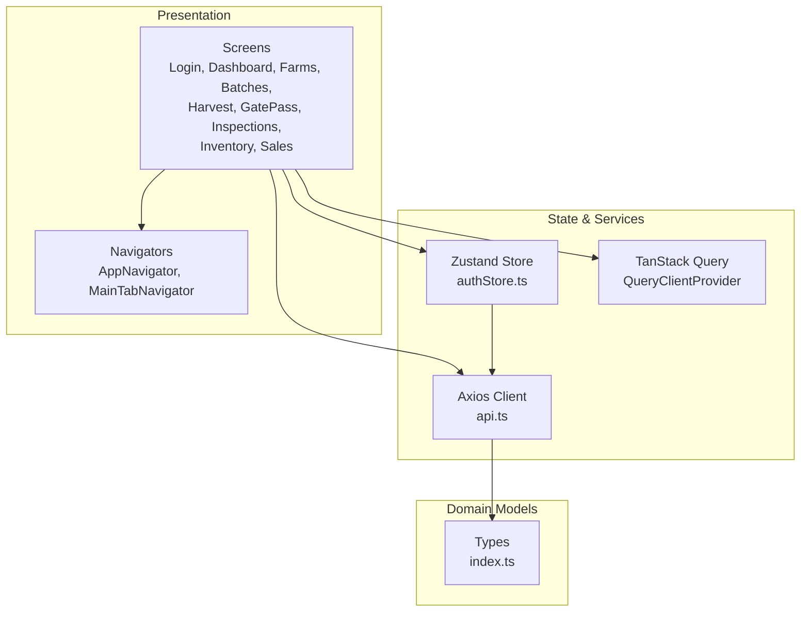

**Diagram sources**
- [App.tsx](file://App.tsx#L1-L95)
- [AppNavigator.tsx](file://src/navigation/AppNavigator.tsx#L1-L60)
- [MainTabNavigator.tsx](file://src/navigation/MainTabNavigator.tsx#L1-L414)
- [authStore.ts](file://src/store/authStore.ts#L1-L116)
- [api.ts](file://src/services/api.ts#L1-L326)
- [index.ts](file://src/types/index.ts#L1-L429)

## Detailed Component Analysis

### Authentication and User Management
- Business value
  - Secure access control and role-based navigation
  - Seamless token refresh and session persistence
- User workflows
  - Login with email/password; on success, store token and redirect to main tabs
  - Logout clears persisted auth state
- Data models
  - User, LoginResponse, UserRole, RootStackParamList
- Integration points
  - Auth API endpoints, token refresh interceptor, navigation stack
- Mobile considerations
  - Persisted auth state survives app restarts
  - Toast feedback for success/error states

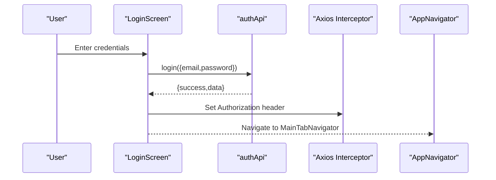

**Diagram sources**
- [LoginScreen.tsx](file://src/screens/auth/LoginScreen.tsx#L1-L259)
- [api.ts](file://src/services/api.ts#L68-L89)
- [AppNavigator.tsx](file://src/navigation/AppNavigator.tsx#L1-L60)

**Section sources**
- [LoginScreen.tsx](file://src/screens/auth/LoginScreen.tsx#L1-L259)
- [authStore.ts](file://src/store/authStore.ts#L1-L116)
- [api.ts](file://src/services/api.ts#L1-L326)
- [index.ts](file://src/types/index.ts#L1-L64)

### Dashboard Analytics
- Business value
  - Role-based KPIs and summaries for operational oversight
- User workflows
  - Admins see totals, revenue, profit, and inventory overview
  - Vendors see quick actions and daily activity placeholders
- Data models
  - DashboardStats
- Integration points
  - reportApi.getDashboardStats
- Mobile considerations
  - Pull-to-refresh and query invalidation on focus

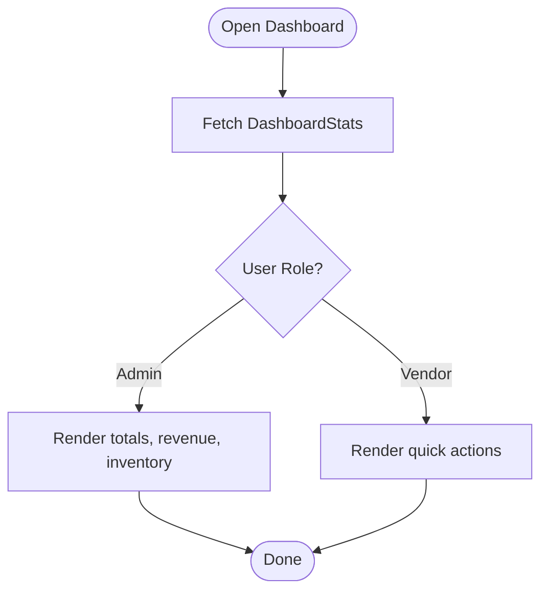

**Diagram sources**
- [DashboardScreen.tsx](file://src/screens/dashboard/DashboardScreen.tsx#L1-L402)
- [api.ts](file://src/services/api.ts#L268-L289)

**Section sources**
- [DashboardScreen.tsx](file://src/screens/dashboard/DashboardScreen.tsx#L1-L402)
- [api.ts](file://src/services/api.ts#L268-L289)
- [index.ts](file://src/types/index.ts#L345-L357)

### Farm Registration and Management
- Business value
  - Central registry of farms, crop types, and inspection requests
- User workflows
  - Create farm with name, location, area, contact, and produce type
  - Request inspections for a farm (assign vendor, add notes)
  - Approve/reject inspection requests (admin/manager)
- Data models
  - Farm, FarmInspectionRequest, InspectionStatus
- Integration points
  - farmApi.createFarm, farmApi.createInspectionRequest, farmApi.getMyInspectionRequests, farmApi.getPendingInspections
- Mobile considerations
  - Dropdown for produce type with “Other” support
  - Search/filter by name/location
  - Toast notifications and modal forms

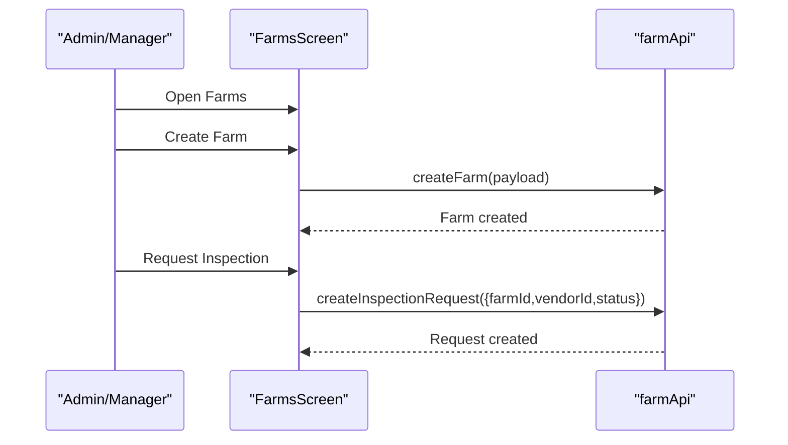

**Diagram sources**
- [FarmsScreen.tsx](file://src/screens/farms/FarmsScreen.tsx#L1-L1164)
- [api.ts](file://src/services/api.ts#L92-L144)

**Section sources**
- [FarmsScreen.tsx](file://src/screens/farms/FarmsScreen.tsx#L1-L1164)
- [api.ts](file://src/services/api.ts#L92-L144)
- [index.ts](file://src/types/index.ts#L66-L90)
- [index.ts](file://src/types/index.ts#L93-L141)

### Batch Lifecycle Tracking
- Business value
  - Visibility into production batches from creation to delivery
- User workflows
  - View active/completed/pending batches
  - Search by batch ID or farm
  - Navigate to lifecycle details
- Data models
  - Batch, BatchStatus
- Integration points
  - farmApi.getAllBatches, farmApi.updateBatchStatus
- Mobile considerations
  - Tabbed view with search and refresh
  - Status badges and derived produce type

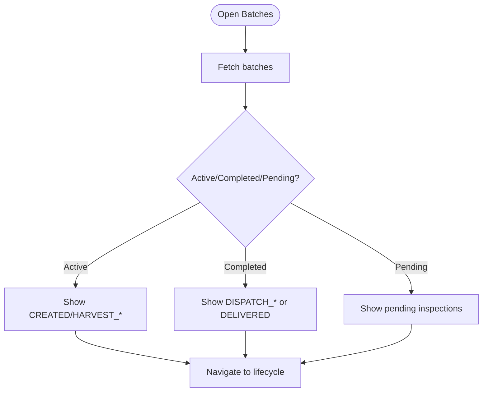

**Diagram sources**
- [BatchesScreen.tsx](file://src/screens/batches/BatchesScreen.tsx#L1-L462)
- [api.ts](file://src/services/api.ts#L120-L128)
- [index.ts](file://src/types/index.ts#L143-L176)

**Section sources**
- [BatchesScreen.tsx](file://src/screens/batches/BatchesScreen.tsx#L1-L462)
- [api.ts](file://src/services/api.ts#L120-L128)
- [index.ts](file://src/types/index.ts#L143-L176)

### Daily Harvest Reporting
- Business value
  - Track daily packed boxes, waste, labor, and costs
- User workflows
  - Select active batch, view today/history reports, submit new report
  - Mark batch as harvest completed (vendor)
- Data models
  - DailyHarvestReport, Batch
- Integration points
  - harvestApi.getReportsByDate, farmApi.updateBatchStatus
- Mobile considerations
  - Today vs history tabs with date picker
  - Horizontal batch selector for quick selection

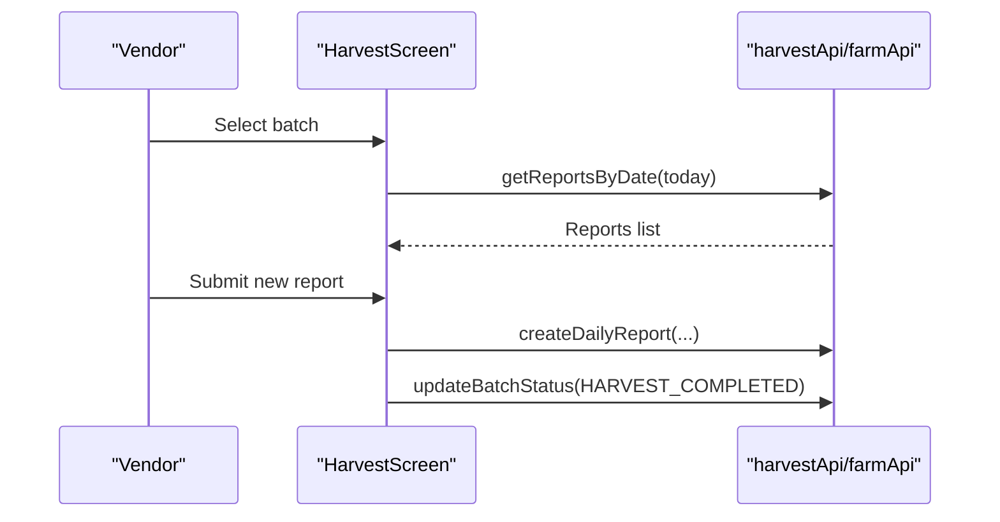

**Diagram sources**
- [HarvestScreen.tsx](file://src/screens/harvest/HarvestScreen.tsx#L1-L718)
- [api.ts](file://src/services/api.ts#L170-L209)
- [api.ts](file://src/services/api.ts#L126-L127)

**Section sources**
- [HarvestScreen.tsx](file://src/screens/harvest/HarvestScreen.tsx#L1-L718)
- [api.ts](file://src/services/api.ts#L170-L209)
- [index.ts](file://src/types/index.ts#L207-L230)
- [index.ts](file://src/types/index.ts#L154-L176)

### Quality Inspection Workflows
- Business value
  - Structured inspection process with media capture and approval
- User workflows
  - Vendors: start from requests, capture photos/videos, submit inspection
  - Admin/Manager: approve/reject pending inspections
- Data models
  - FarmInspection, FarmInspectionRequest, InspectionStatus
- Integration points
  - farmApi.createInspection, farmApi.getPendingInspections, farmApi.approveInspection
- Mobile considerations
  - Camera integration via react-native-image-picker
  - Media gallery with remove actions
  - Request-driven prefill of farm details

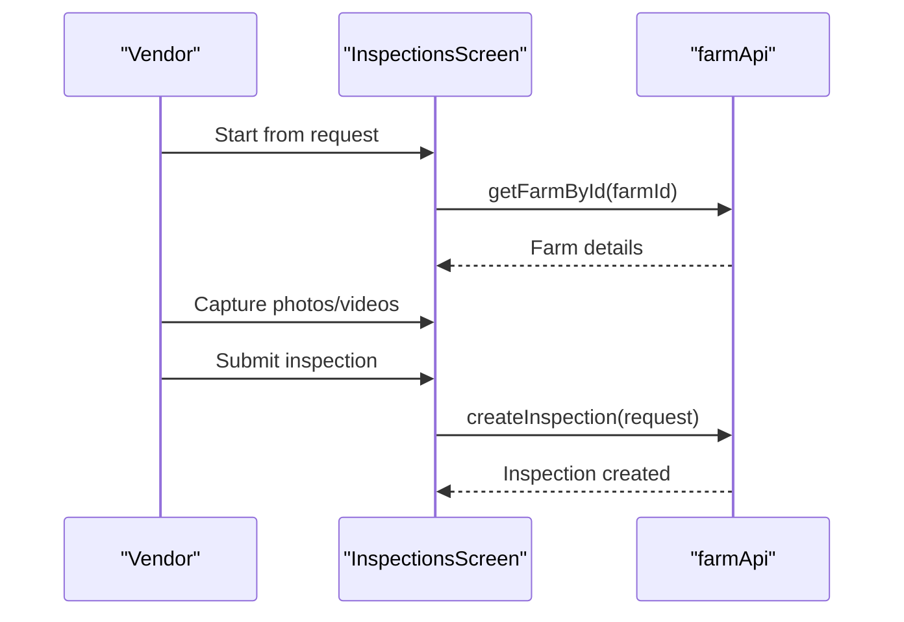

**Diagram sources**
- [InspectionsScreen.tsx](file://src/screens/inspections/InspectionsScreen.tsx#L1-L1524)
- [api.ts](file://src/services/api.ts#L102-L144)
- [api.ts](file://src/services/api.ts#L114-L118)

**Section sources**
- [InspectionsScreen.tsx](file://src/screens/inspections/InspectionsScreen.tsx#L1-L1524)
- [api.ts](file://src/services/api.ts#L102-L144)
- [index.ts](file://src/types/index.ts#L103-L141)

### Inventory Management
- Business value
  - Control stock levels, issue materials to batches, receive inbound deliveries
- User workflows
  - Overview: view items and add stock
  - Allocate: select batch and item, confirm allocation
  - Receive: select gate pass, verify quantity, optionally add freight cost
- Data models
  - InventoryItem, InventoryCategory, InventoryAllocationRequest, GatePass
- Integration points
  - inventoryApi.getAllItems/addStock/allocateInventory, harvestApi.getPendingGatePasses/receiveGatePass/addTransportCost
- Mobile considerations
  - Horizontal scrolling batch/item selectors
  - Validation and warnings for insufficient stock or mismatched quantities

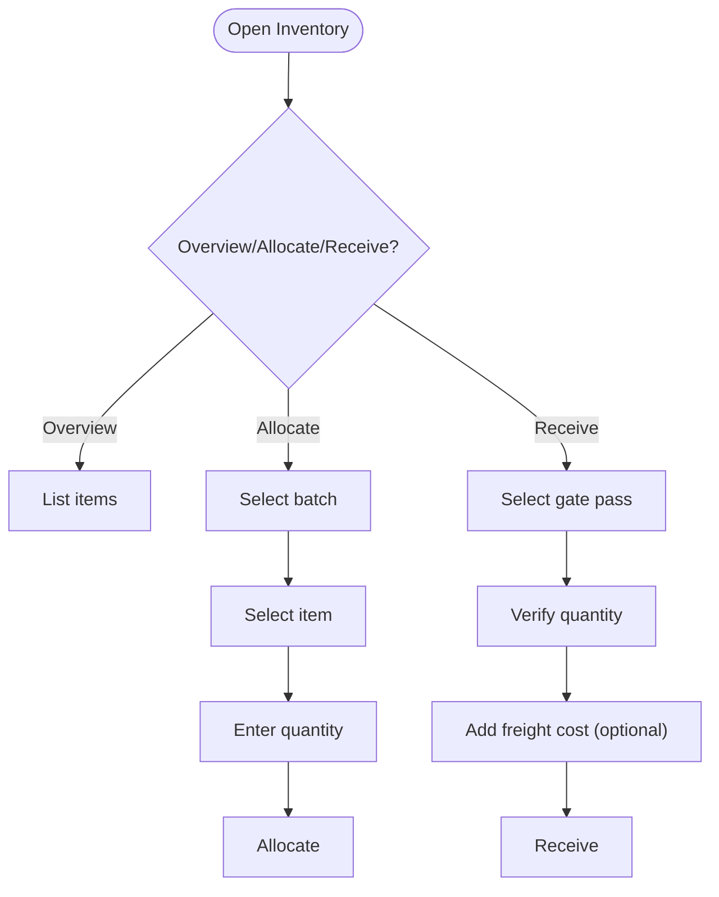

**Diagram sources**
- [InventoryScreen.tsx](file://src/screens/inventory/InventoryScreen.tsx#L1-L687)
- [api.ts](file://src/services/api.ts#L147-L167)
- [api.ts](file://src/services/api.ts#L199-L209)

**Section sources**
- [InventoryScreen.tsx](file://src/screens/inventory/InventoryScreen.tsx#L1-L687)
- [api.ts](file://src/services/api.ts#L147-L167)
- [api.ts](file://src/services/api.ts#L199-L209)
- [index.ts](file://src/types/index.ts#L179-L204)
- [index.ts](file://src/types/index.ts#L249-L274)

### Gate Pass Creation
- Business value
  - Manage outbound dispatches with truck, driver, and box counts
- User workflows
  - Select batch for dispatch, view today/history gate passes, create new gate pass
- Data models
  - GatePass, Batch
- Integration points
  - harvestApi.getGatePassesByDate, farmApi.getAllBatches
- Mobile considerations
  - Today vs history tabs with date picker
  - Horizontal batch selector and summary cards

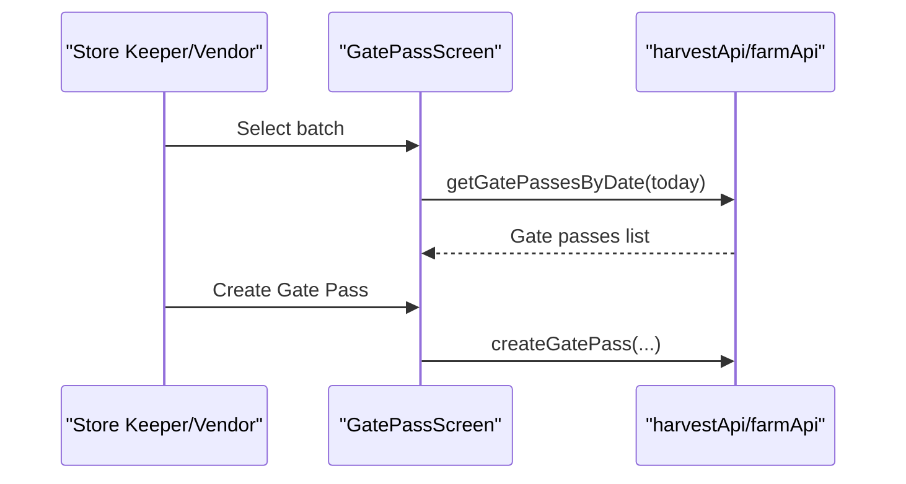

**Diagram sources**
- [GatePassScreen.tsx](file://src/screens/harvest/GatePassScreen.tsx#L1-L667)
- [api.ts](file://src/services/api.ts#L189-L209)
- [api.ts](file://src/services/api.ts#L120-L128)

**Section sources**
- [GatePassScreen.tsx](file://src/screens/harvest/GatePassScreen.tsx#L1-L667)
- [api.ts](file://src/services/api.ts#L189-L209)
- [index.ts](file://src/types/index.ts#L249-L274)

### Sales Processing
- Business value
  - Record domestic/export sales, generate invoices, and share via multiple channels
- User workflows
  - Select completed batch, enter buyer details, compute totals, create invoice
  - Share invoice via WhatsApp, Email, or download PDF
- Data models
  - Sale, SaleRequest, SaleType, PaymentStatus
- Integration points
  - salesApi.createSale, salesApi.downloadInvoicePdf, salesApi.shareInvoiceViaWhatsApp/Email
- Mobile considerations
  - Date picker, tax calculation, share-to-system integrations

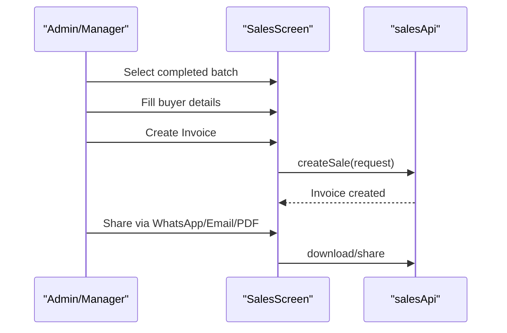

**Diagram sources**
- [SalesScreen.tsx](file://src/screens/sales/SalesScreen.tsx#L1-L842)
- [api.ts](file://src/services/api.ts#L224-L265)
- [index.ts](file://src/types/index.ts#L306-L342)

**Section sources**
- [SalesScreen.tsx](file://src/screens/sales/SalesScreen.tsx#L1-L842)
- [api.ts](file://src/services/api.ts#L224-L265)
- [index.ts](file://src/types/index.ts#L295-L342)

### Financial Ledger Management
- Business value
  - Track vendor transactions, balances, and profitability metrics
- User workflows
  - View vendor ledger and balance (reports module)
  - Access profitability and daily activity reports
- Data models
  - VendorLedger, VendorBalance, ProfitabilityReport, DailyActivityReport
- Integration points
  - reportApi.getVendorLedger, reportApi.getVendorBalance, reportApi.getProfitabilityReport, reportApi.getDailyActivityReport
- Mobile considerations
  - Role-based dashboards and report summaries

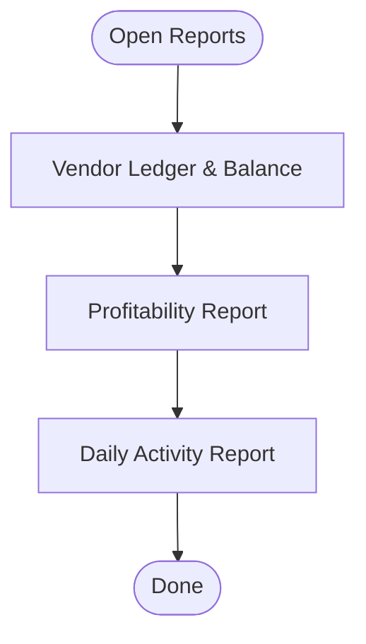

**Diagram sources**
- [DashboardScreen.tsx](file://src/screens/dashboard/DashboardScreen.tsx#L1-L402)
- [api.ts](file://src/services/api.ts#L268-L289)
- [index.ts](file://src/types/index.ts#L359-L409)

**Section sources**
- [DashboardScreen.tsx](file://src/screens/dashboard/DashboardScreen.tsx#L1-L402)
- [api.ts](file://src/services/api.ts#L268-L289)
- [index.ts](file://src/types/index.ts#L359-L409)

### User Profile Functionality
- Business value
  - View and manage personal profile details
- User workflows
  - Access Profile tab from main navigation
  - Update profile (UI present in navigator)
- Integration points
  - Auth store and navigation routing
- Mobile considerations
  - Tab-based access from main navigator

**Section sources**
- [MainTabNavigator.tsx](file://src/navigation/MainTabNavigator.tsx#L1-L414)
- [authStore.ts](file://src/store/authStore.ts#L1-L116)

## Dependency Analysis
- Navigation and Routing
  - AppNavigator determines auth state and routes accordingly
  - MainTabNavigator defines tabs, badges, and role visibility
- State and Persistence
  - authStore persists user session and exposes role checks
- Data Fetching
  - TanStack Query manages caching and refetch strategies
- API Layer
  - Centralized axios client with interceptors for auth and refresh
  - Feature modules encapsulate domain-specific endpoints

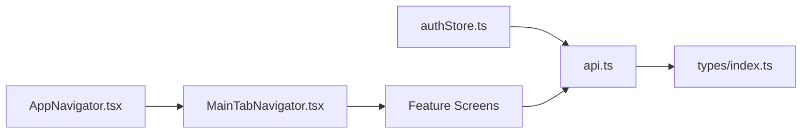

**Diagram sources**
- [authStore.ts](file://src/store/authStore.ts#L1-L116)
- [AppNavigator.tsx](file://src/navigation/AppNavigator.tsx#L1-L60)
- [MainTabNavigator.tsx](file://src/navigation/MainTabNavigator.tsx#L1-L414)
- [api.ts](file://src/services/api.ts#L1-L326)
- [index.ts](file://src/types/index.ts#L1-L429)

**Section sources**
- [authStore.ts](file://src/store/authStore.ts#L1-L116)
- [AppNavigator.tsx](file://src/navigation/AppNavigator.tsx#L1-L60)
- [MainTabNavigator.tsx](file://src/navigation/MainTabNavigator.tsx#L1-L414)
- [api.ts](file://src/services/api.ts#L1-L326)
- [index.ts](file://src/types/index.ts#L1-L429)

## Performance Considerations
- Query caching and staleness
  - Default staleTime configured globally to reduce network requests
  - Per-screen invalidation on focus to keep UI fresh
- Network reliability
  - Automatic token refresh on 401 with retry of original request
- UI responsiveness
  - Loading indicators and disabled states during mutations
  - Horizontal scroll wrappers for compact lists

[No sources needed since this section provides general guidance]

## Troubleshooting Guide
- Authentication failures
  - 401 responses trigger token refresh; if refresh fails, user is logged out automatically
  - Toast messages guide users on invalid credentials or pending approval
- Network issues
  - Pull-to-refresh controls allow manual refetch
  - Toast notifications surface API errors
- Camera/media
  - Permissions requested before capture; errors surfaced via alerts
  - Media gallery supports removal before submission

**Section sources**
- [api.ts](file://src/services/api.ts#L29-L65)
- [LoginScreen.tsx](file://src/screens/auth/LoginScreen.tsx#L38-L82)
- [InspectionsScreen.tsx](file://src/screens/inspections/InspectionsScreen.tsx#L377-L411)

## Conclusion
The Banana Harvest App provides a comprehensive, role-aware solution for managing the entire agricultural supply chain from farm to sale. Its modular architecture, robust API layer, and thoughtful UX deliverables enable efficient operations on mobile devices while maintaining strong data integrity and user control.

[No sources needed since this section summarizes without analyzing specific files]

## Appendices

### Feature Matrix by Business Domain
- Authentication and User Management
  - Login, logout, token refresh, role-based navigation
- Dashboard Analytics
  - Admin KPIs, vendor quick actions
- Farm Registration and Management
  - Create farms, inspection requests, approvals
- Batch Lifecycle Tracking
  - View batches, status transitions, lifecycle details
- Daily Harvest Reporting
  - Submit daily reports, mark completion
- Quality Inspection Workflows
  - Request, capture media, submit, approve/reject
- Inventory Management
  - Stock overview, add stock, allocate to batches, receive inbound
- Gate Pass Creation
  - Dispatch tracking, gate pass creation and history
- Sales Processing
  - Domestic/export sales, invoicing, sharing
- Financial Ledger Management
  - Vendor ledger, balances, profitability, activity reports
- User Profile
  - Profile access from main tabs

[No sources needed since this section aggregates without analyzing specific files]