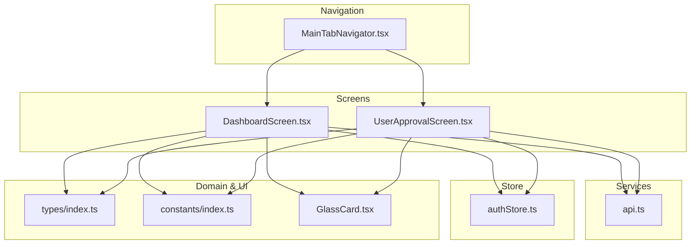
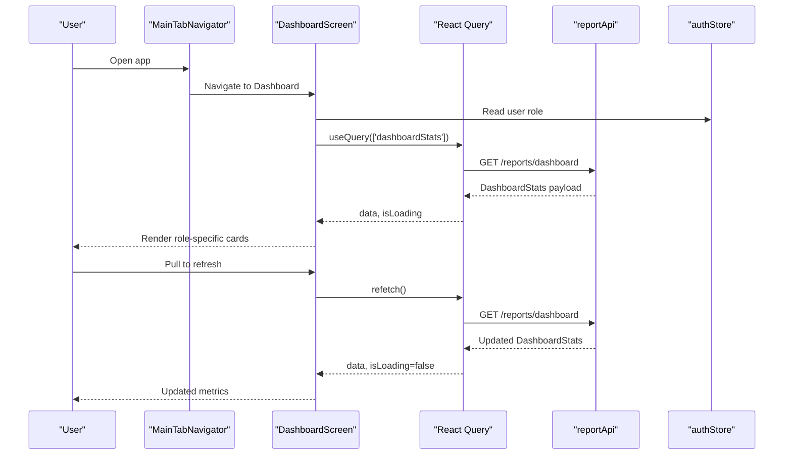
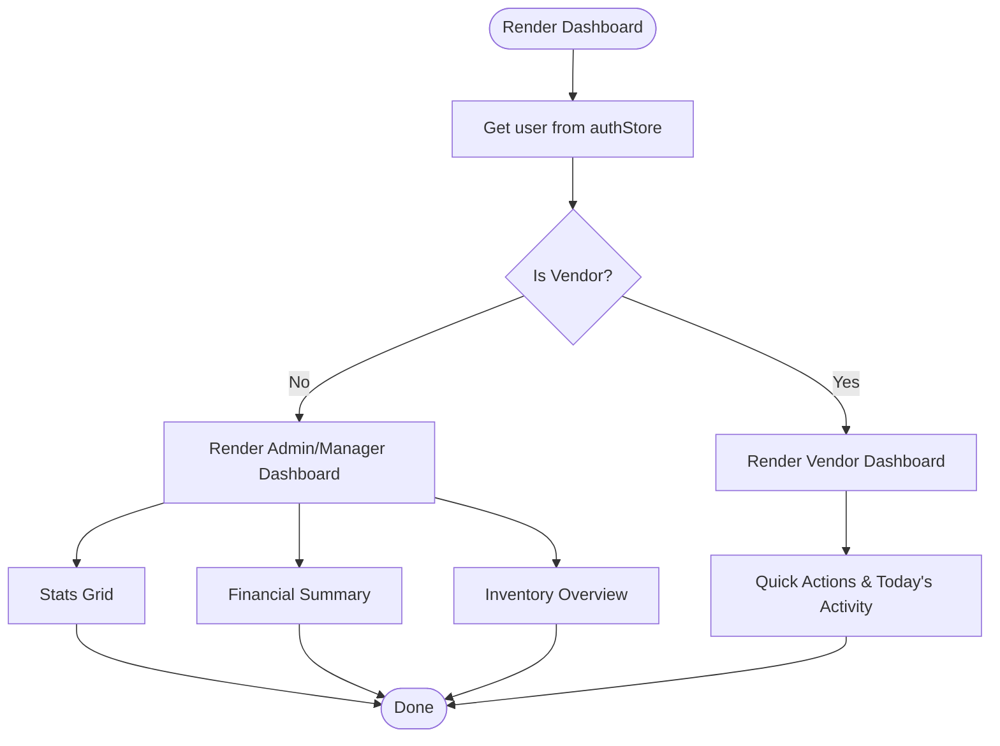
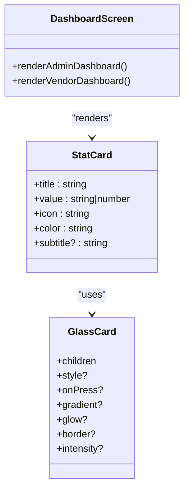
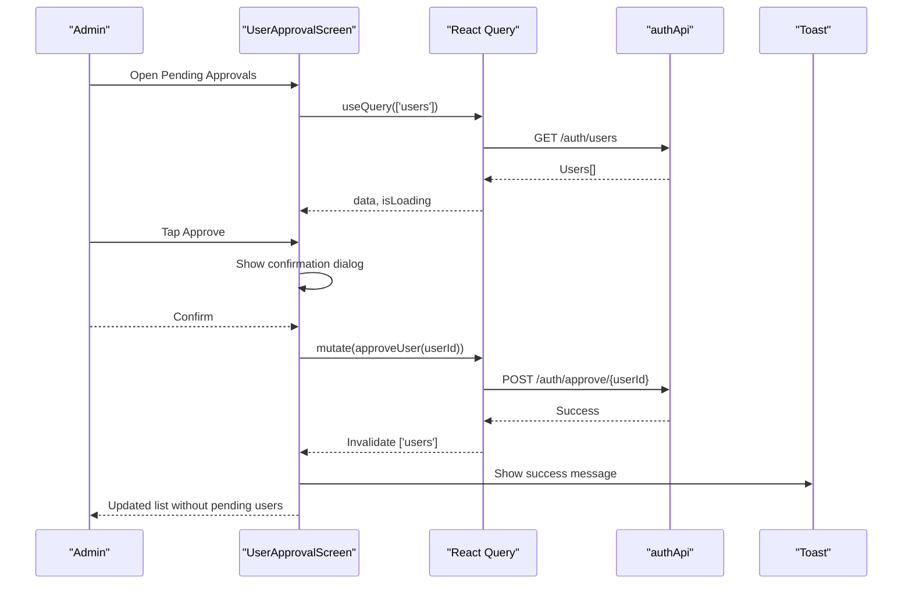
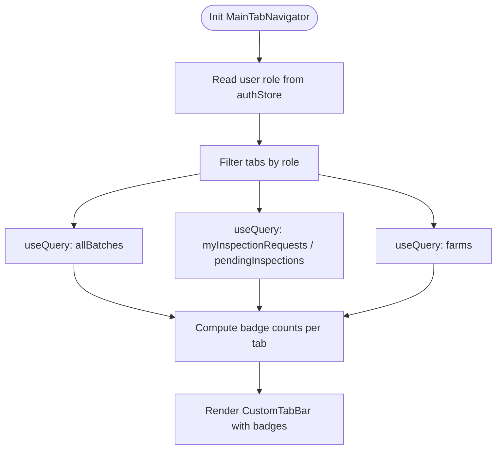
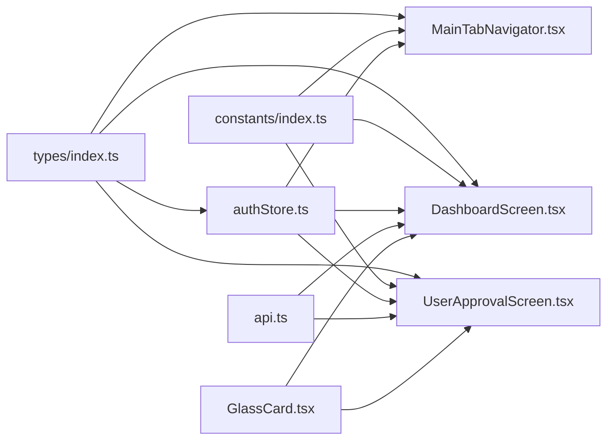

# Dashboard & Analytics

<cite>
**Referenced Files in This Document**
- [DashboardScreen.tsx](file://src/screens/dashboard/DashboardScreen.tsx)
- [UserApprovalScreen.tsx](file://src/screens/admin/UserApprovalScreen.tsx)
- [MainTabNavigator.tsx](file://src/navigation/MainTabNavigator.tsx)
- [authStore.ts](file://src/store/authStore.ts)
- [api.ts](file://src/services/api.ts)
- [index.ts](file://src/types/index.ts)
- [index.ts](file://src/constants/index.ts)
- [GlassCard.tsx](file://src/components/glassmorphism/GlassCard.tsx)
</cite>

## Table of Contents
1. [Introduction](#introduction)
2. [Project Structure](#project-structure)
3. [Core Components](#core-components)
4. [Architecture Overview](#architecture-overview)
5. [Detailed Component Analysis](#detailed-component-analysis)
6. [Dependency Analysis](#dependency-analysis)
7. [Performance Considerations](#performance-considerations)
8. [Troubleshooting Guide](#troubleshooting-guide)
9. [Conclusion](#conclusion)

## Introduction
This document describes the Dashboard & Analytics feature, focusing on role-based dashboards, real-time statistics display, performance metrics cards, and KPI visualization components. It explains how the system aggregates data, integrates with backend APIs, and updates content reactively. It also documents the administrator’s user approval dashboard, navigation integration, data loading states, performance optimization techniques, and responsive design considerations for mobile devices.

## Project Structure
The Dashboard & Analytics feature spans several modules:
- Navigation: Bottom tab navigator routes users to the dashboard and other functional areas.
- Screens: Dashboard screen renders role-specific analytics; user approval screen handles administrative workflows.
- Services: API client encapsulates HTTP requests and integrates with the authentication store.
- Store: Authentication store manages user session and roles.
- Types: Strongly typed domain models and enums for roles, statuses, and reports.
- Constants: Theming, typography, spacing, and role-based navigation items.
- Components: Glass card component provides reusable, animated, glass-morphism UI elements.

**Diagram sources**
- [MainTabNavigator.tsx](file://src/navigation/MainTabNavigator.tsx#L315-L350)
- [DashboardScreen.tsx](file://src/screens/dashboard/DashboardScreen.tsx#L45-L205)
- [UserApprovalScreen.tsx](file://src/screens/admin/UserApprovalScreen.tsx#L23-L146)
- [api.ts](file://src/services/api.ts#L268-L289)
- [authStore.ts](file://src/store/authStore.ts#L29-L115)
- [index.ts](file://src/types/index.ts#L1-L7)
- [index.ts](file://src/constants/index.ts#L1-L138)
- [GlassCard.tsx](file://src/components/glassmorphism/GlassCard.tsx#L11-L101)

**Section sources**
- [MainTabNavigator.tsx](file://src/navigation/MainTabNavigator.tsx#L315-L350)
- [DashboardScreen.tsx](file://src/screens/dashboard/DashboardScreen.tsx#L45-L205)
- [UserApprovalScreen.tsx](file://src/screens/admin/UserApprovalScreen.tsx#L23-L146)
- [api.ts](file://src/services/api.ts#L268-L289)
- [authStore.ts](file://src/store/authStore.ts#L29-L115)
- [index.ts](file://src/types/index.ts#L1-L7)
- [index.ts](file://src/constants/index.ts#L1-L138)
- [GlassCard.tsx](file://src/components/glassmorphism/GlassCard.tsx#L11-L101)

## Core Components
- Role-based dashboard rendering:
  - Super Admin and Manager dashboards show key metrics cards and financial summaries.
  - Vendor dashboard focuses on quick actions and daily activity placeholders.
- Real-time statistics:
  - Dashboard statistics are fetched via a dedicated API endpoint and revalidated on screen focus.
- KPI visualization components:
  - Metrics cards with icons, values, subtitles, and optional glows.
  - Financial summary cards with split breakdowns.
- User approval dashboard:
  - Lists pending users, supports approval with optimistic updates and toast feedback.
- Navigation integration:
  - Bottom tab navigator routes users to the dashboard and other modules.
  - Badge counts computed from shared queries for actionable items.
- Data loading states:
  - Loading indicators and pull-to-refresh controls.
- Performance optimizations:
  - React Query invalidation on focus, shared query keys, and stale times.
  - Reanimated animations for interactive feedback.

**Section sources**
- [DashboardScreen.tsx](file://src/screens/dashboard/DashboardScreen.tsx#L45-L205)
- [UserApprovalScreen.tsx](file://src/screens/admin/UserApprovalScreen.tsx#L23-L146)
- [MainTabNavigator.tsx](file://src/navigation/MainTabNavigator.tsx#L152-L313)
- [GlassCard.tsx](file://src/components/glassmorphism/GlassCard.tsx#L23-L101)

## Architecture Overview
The dashboard architecture follows a layered pattern:
- UI Layer: Screens and components render role-specific content and handle user interactions.
- Domain Layer: Types define roles, statuses, and report models.
- Service Layer: API module centralizes HTTP calls and integrates with the auth store.
- State Layer: React Query manages caching and invalidation; Zustand stores user session.

**Diagram sources**
- [MainTabNavigator.tsx](file://src/navigation/MainTabNavigator.tsx#L315-L350)
- [DashboardScreen.tsx](file://src/screens/dashboard/DashboardScreen.tsx#L58-L64)
- [api.ts](file://src/services/api.ts#L268-L289)
- [authStore.ts](file://src/store/authStore.ts#L29-L115)

## Detailed Component Analysis

### Role-Based Dashboard Implementation
- Super Admin and Manager:
  - Displays a grid of metric cards (e.g., total farms, total batches, active/completed batches).
  - Includes a financial summary card with total revenue, total profit, and average cost per box.
  - Provides an inventory overview card showing empty and filled boxes.
- Vendor:
  - Welcomes the user and presents quick action buttons for inspection and daily report.
  - Shows a “today’s activity” section with a neutral message when empty.
- Store Keeper:
  - The dashboard currently renders the same layout as Super Admin/Manager. The tab navigator sets the initial route for Store Keeper to Inventory, but the Dashboard screen itself does not differentiate by role.

**Diagram sources**
- [DashboardScreen.tsx](file://src/screens/dashboard/DashboardScreen.tsx#L45-L205)
- [authStore.ts](file://src/store/authStore.ts#L29-L115)

**Section sources**
- [DashboardScreen.tsx](file://src/screens/dashboard/DashboardScreen.tsx#L66-L138)
- [DashboardScreen.tsx](file://src/screens/dashboard/DashboardScreen.tsx#L140-L171)
- [DashboardScreen.tsx](file://src/screens/dashboard/DashboardScreen.tsx#L173-L205)

### Real-Time Statistics and KPI Cards
- Data fetching:
  - Uses React Query with a dedicated query key for dashboard statistics.
  - On screen focus, invalidates related queries to ensure freshness.
- Metric cards:
  - Consists of a title, value, icon, and optional subtitle.
  - Uses a glass card component with customizable glow and borders.
- Financial summary:
  - Displays total revenue and profit with a split layout for additional metrics.
- Inventory overview:
  - Shows empty and filled boxes with a divider for readability.

**Diagram sources**
- [DashboardScreen.tsx](file://src/screens/dashboard/DashboardScreen.tsx#L24-L43)
- [GlassCard.tsx](file://src/components/glassmorphism/GlassCard.tsx#L11-L19)
- [DashboardScreen.tsx](file://src/screens/dashboard/DashboardScreen.tsx#L32-L43)

**Section sources**
- [DashboardScreen.tsx](file://src/screens/dashboard/DashboardScreen.tsx#L58-L64)
- [DashboardScreen.tsx](file://src/screens/dashboard/DashboardScreen.tsx#L49-L57)
- [DashboardScreen.tsx](file://src/screens/dashboard/DashboardScreen.tsx#L66-L138)
- [DashboardScreen.tsx](file://src/screens/dashboard/DashboardScreen.tsx#L140-L171)
- [GlassCard.tsx](file://src/components/glassmorphism/GlassCard.tsx#L23-L101)

### User Approval Dashboard (Administrator Workflow)
- Fetches all users and filters those with inactive status.
- Renders a user card with avatar, name, email, role, join date, and an approval button.
- Uses a mutation to approve a user, with optimistic updates and toast notifications.
- Supports pull-to-refresh and loading states.

**Diagram sources**
- [UserApprovalScreen.tsx](file://src/screens/admin/UserApprovalScreen.tsx#L23-L55)
- [UserApprovalScreen.tsx](file://src/screens/admin/UserApprovalScreen.tsx#L57-L69)
- [api.ts](file://src/services/api.ts#L81-L89)

**Section sources**
- [UserApprovalScreen.tsx](file://src/screens/admin/UserApprovalScreen.tsx#L23-L146)
- [api.ts](file://src/services/api.ts#L81-L89)

### Navigation Integration and Badge Counts
- The tab navigator defines which tabs are visible per role and computes badge counts from shared queries.
- Dashboard is included for all roles; Vendor initial route is set to Inspections, while Store Keeper’s initial route is Inventory.
- Badge counts:
  - Farms: recent farms created within a time window.
  - Harvest: batches with specific statuses.
  - GatePass: batches awaiting dispatch.
  - Batches: active batches across lifecycle.
  - Inspections: actionable requests for vendors; pending inspections for admins/managers.

**Diagram sources**
- [MainTabNavigator.tsx](file://src/navigation/MainTabNavigator.tsx#L152-L313)
- [MainTabNavigator.tsx](file://src/navigation/MainTabNavigator.tsx#L315-L350)
- [authStore.ts](file://src/store/authStore.ts#L29-L115)

**Section sources**
- [MainTabNavigator.tsx](file://src/navigation/MainTabNavigator.tsx#L49-L60)
- [MainTabNavigator.tsx](file://src/navigation/MainTabNavigator.tsx#L152-L313)
- [MainTabNavigator.tsx](file://src/navigation/MainTabNavigator.tsx#L315-L350)

### Data Aggregation Mechanisms and Chart Integration Patterns
- Aggregation:
  - Dashboard statistics are aggregated server-side and returned as a single payload.
  - Badge counts are derived client-side from shared query results.
- Chart integration:
  - The current implementation uses glass cards and numeric metrics without external chart libraries.
  - To integrate charts, wrap a glass card around a chart library component and pass aggregated series data from the dashboard stats.

[No sources needed since this section provides general guidance]

### Real-Time Update Mechanisms
- Screen focus triggers query invalidation to refresh dashboard stats and related lists.
- Pull-to-refresh enables manual refresh.
- Badge counts are recomputed from shared queries whenever tabs are rendered.

**Section sources**
- [DashboardScreen.tsx](file://src/screens/dashboard/DashboardScreen.tsx#L49-L57)
- [DashboardScreen.tsx](file://src/screens/dashboard/DashboardScreen.tsx#L184-L186)
- [MainTabNavigator.tsx](file://src/navigation/MainTabNavigator.tsx#L158-L167)
- [MainTabNavigator.tsx](file://src/navigation/MainTabNavigator.tsx#L180-L188)

### Responsive Design and Touch Interactions
- Layout:
  - Stats grid uses percentage-based widths and wrapping to adapt to various screen sizes.
  - Scroll containers provide vertical scrolling with safe area support.
- Touch interactions:
  - Animated scaling feedback on glass card presses.
  - Reanimated animations enhance affordance for interactive elements.

**Section sources**
- [DashboardScreen.tsx](file://src/screens/dashboard/DashboardScreen.tsx#L244-L253)
- [GlassCard.tsx](file://src/components/glassmorphism/GlassCard.tsx#L49-L57)
- [GlassCard.tsx](file://src/components/glassmorphism/GlassCard.tsx#L86-L98)

## Dependency Analysis
- Role-based visibility:
  - Types define user roles; constants define role-based navigation items.
- Navigation routing:
  - Tab navigator imports dashboard and other screens; sets initial routes per role.
- Data fetching:
  - Dashboard uses report API; approval screen uses auth API.
- State management:
  - Auth store persists user session and exposes getters for role checks.
- UI components:
  - Glass card component is reused across dashboard and approval screens.

**Diagram sources**
- [index.ts](file://src/types/index.ts#L1-L7)
- [index.ts](file://src/constants/index.ts#L329-L334)
- [authStore.ts](file://src/store/authStore.ts#L29-L115)
- [MainTabNavigator.tsx](file://src/navigation/MainTabNavigator.tsx#L315-L350)
- [DashboardScreen.tsx](file://src/screens/dashboard/DashboardScreen.tsx#L45-L205)
- [UserApprovalScreen.tsx](file://src/screens/admin/UserApprovalScreen.tsx#L23-L146)
- [api.ts](file://src/services/api.ts#L268-L289)
- [GlassCard.tsx](file://src/components/glassmorphism/GlassCard.tsx#L11-L101)

**Section sources**
- [index.ts](file://src/types/index.ts#L1-L7)
- [index.ts](file://src/constants/index.ts#L329-L334)
- [authStore.ts](file://src/store/authStore.ts#L29-L115)
- [MainTabNavigator.tsx](file://src/navigation/MainTabNavigator.tsx#L315-L350)
- [DashboardScreen.tsx](file://src/screens/dashboard/DashboardScreen.tsx#L45-L205)
- [UserApprovalScreen.tsx](file://src/screens/admin/UserApprovalScreen.tsx#L23-L146)
- [api.ts](file://src/services/api.ts#L268-L289)
- [GlassCard.tsx](file://src/components/glassmorphism/GlassCard.tsx#L11-L101)

## Performance Considerations
- Query invalidation on focus ensures fresh data without manual refresh.
- Shared query keys across components reduce redundant network calls.
- Stale times limit unnecessary refetches for frequently accessed lists.
- Reanimated animations are lightweight and optimized for gesture-driven interactions.
- Pull-to-refresh provides immediate user feedback during network operations.

[No sources needed since this section provides general guidance]

## Troubleshooting Guide
- Unauthorized or expired tokens:
  - The API client intercepts 401 responses and attempts token refresh; on failure, logs out the user.
- Approval failures:
  - The approval screen displays error messages via toast and alerts; confirm before mutation.
- Empty states:
  - Vendor dashboard shows a neutral message when no activity is present.
  - Approval screen shows a success icon and message when no pending approvals remain.

**Section sources**
- [api.ts](file://src/services/api.ts#L29-L65)
- [UserApprovalScreen.tsx](file://src/screens/admin/UserApprovalScreen.tsx#L48-L54)
- [DashboardScreen.tsx](file://src/screens/dashboard/DashboardScreen.tsx#L168-L169)
- [UserApprovalScreen.tsx](file://src/screens/admin/UserApprovalScreen.tsx#L133-L138)

## Conclusion
The Dashboard & Analytics feature delivers a cohesive, role-aware analytics experience with real-time updates, robust navigation integration, and responsive design. Super Admin and Manager dashboards emphasize KPIs and financial insights, while Vendor dashboards highlight actionable tasks. Administrators can efficiently manage user approvals through a streamlined workflow. The architecture leverages shared queries, reactive invalidation, and glass-morphism UI components to provide a modern, performant mobile experience.