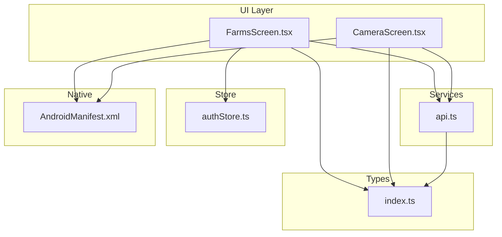
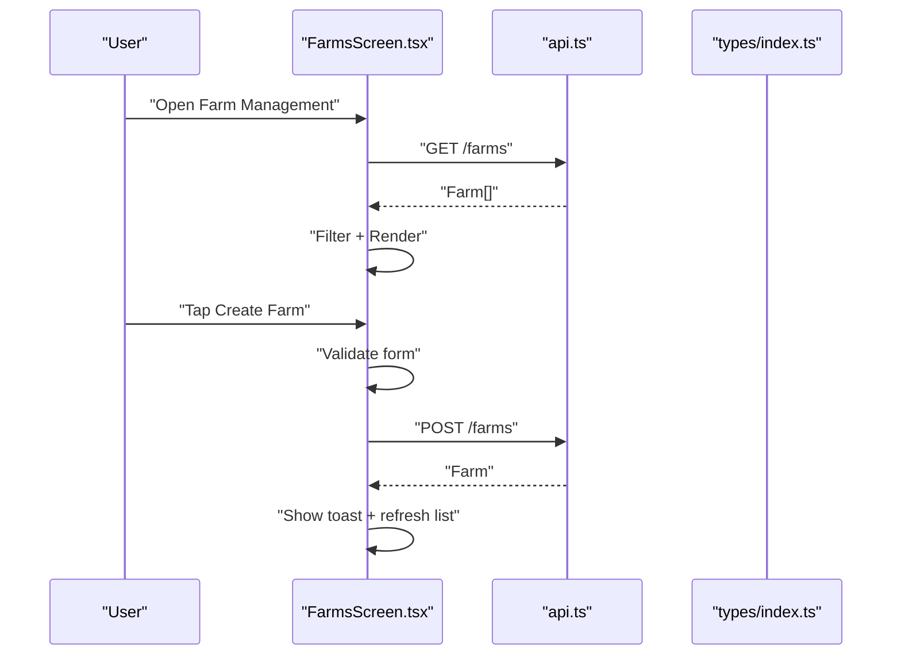
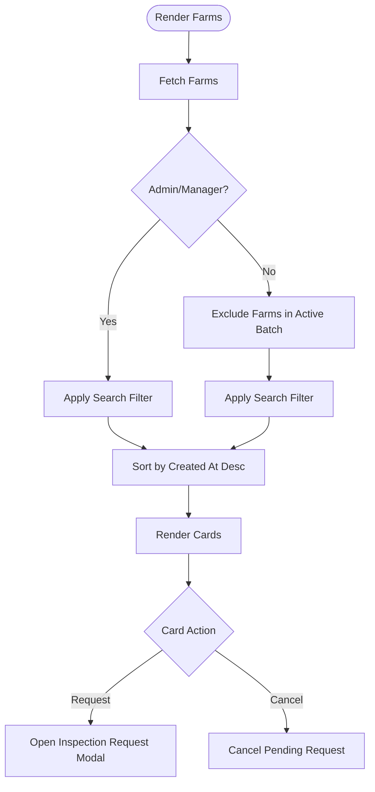
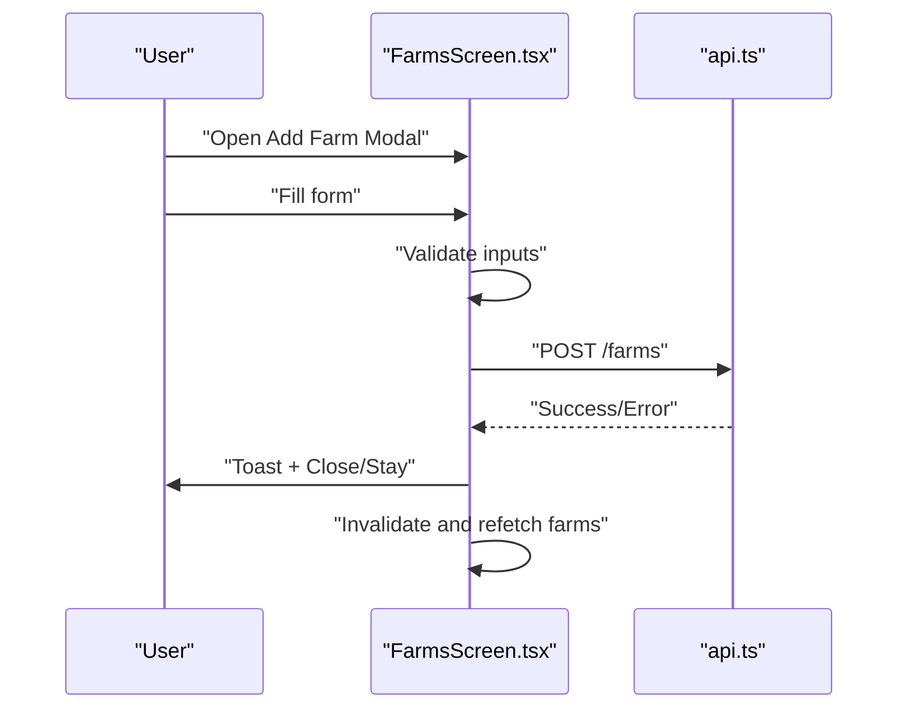
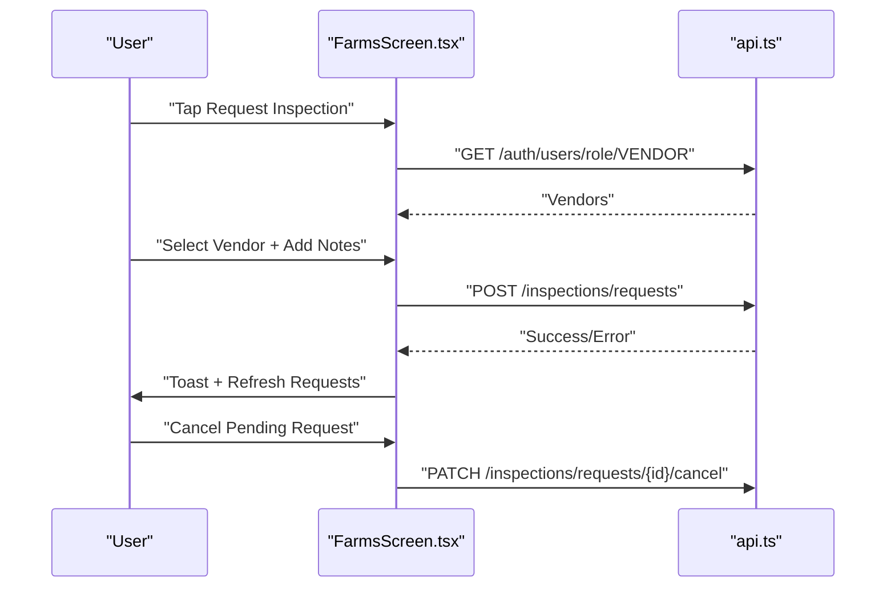
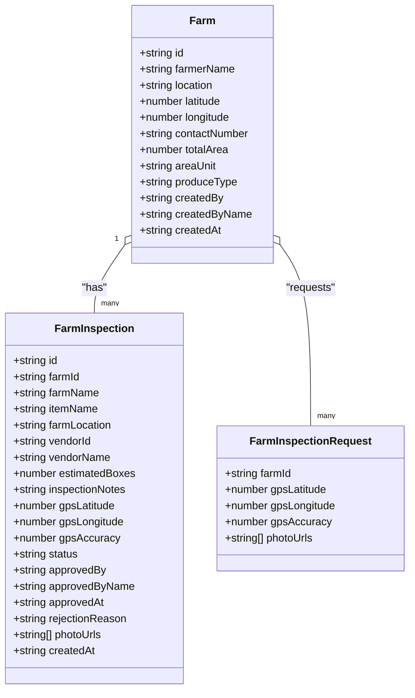
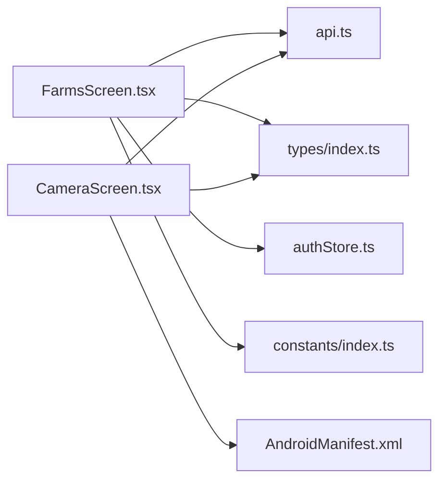

# Farm Management

<cite>
**Referenced Files in This Document**
- [FarmsScreen.tsx](file://src/screens/farms/FarmsScreen.tsx)
- [api.ts](file://src/services/api.ts)
- [index.ts](file://src/types/index.ts)
- [CameraScreen.tsx](file://src/screens/common/CameraScreen.tsx)
- [AndroidManifest.xml](file://android/app/src/main/AndroidManifest.xml)
- [index.ts](file://src/constants/index.ts)
- [authStore.ts](file://src/store/authStore.ts)
</cite>

## Table of Contents
1. [Introduction](#introduction)
2. [Project Structure](#project-structure)
3. [Core Components](#core-components)
4. [Architecture Overview](#architecture-overview)
5. [Detailed Component Analysis](#detailed-component-analysis)
6. [Dependency Analysis](#dependency-analysis)
7. [Performance Considerations](#performance-considerations)
8. [Troubleshooting Guide](#troubleshooting-guide)
9. [Conclusion](#conclusion)
10. [Appendices](#appendices)

## Introduction
This document describes the Farm Management feature of the application. It covers the farm registration process, the farm listing interface with search and filtering, the inspection request workflow, and the integration points for camera-based media uploads. It also outlines the data models for farms and inspections, and highlights mobile-specific capabilities such as camera permissions and photo capture.

Important note: The current codebase does not include explicit GPS location capture, geofencing, mapping service integration, or offline synchronization logic. The farm entity includes latitude and longitude fields, but the UI and APIs do not implement GPS acquisition, mapping overlays, or offline-first persistence. The following documentation reflects what is present in the repository and provides recommendations for extending the feature set.

## Project Structure
The Farm Management feature spans several layers:
- Screen layer: Farm listing and creation UI
- Services layer: API client and typed endpoints
- Types layer: Domain models and enums
- Store layer: Authentication state
- Native layer: Android permissions for camera and location



**Diagram sources**
- [FarmsScreen.tsx](file://src/screens/farms/FarmsScreen.tsx#L1-L120)
- [api.ts](file://src/services/api.ts#L91-L144)
- [index.ts](file://src/types/index.ts#L65-L90)
- [CameraScreen.tsx](file://src/screens/common/CameraScreen.tsx#L1-L139)
- [authStore.ts](file://src/store/authStore.ts#L1-L116)
- [AndroidManifest.xml](file://android/app/src/main/AndroidManifest.xml#L1-L50)

**Section sources**
- [FarmsScreen.tsx](file://src/screens/farms/FarmsScreen.tsx#L1-L120)
- [api.ts](file://src/services/api.ts#L91-L144)
- [index.ts](file://src/types/index.ts#L65-L90)
- [CameraScreen.tsx](file://src/screens/common/CameraScreen.tsx#L1-L139)
- [authStore.ts](file://src/store/authStore.ts#L1-L116)
- [AndroidManifest.xml](file://android/app/src/main/AndroidManifest.xml#L1-L50)

## Core Components
- Farm listing and search/filtering: Implemented in the farm screen with real-time filtering and role-aware visibility.
- Farm registration: UI form with validation and submission via API mutations.
- Inspection request workflow: Modal-driven selection of vendor and notes, with request submission and cancellation.
- Camera integration: Dedicated camera screen with permission handling and photo capture flow.
- Data models: Strongly typed farm, inspection, and inspection request structures.

**Section sources**
- [FarmsScreen.tsx](file://src/screens/farms/FarmsScreen.tsx#L65-L137)
- [FarmsScreen.tsx](file://src/screens/farms/FarmsScreen.tsx#L140-L228)
- [api.ts](file://src/services/api.ts#L91-L144)
- [index.ts](file://src/types/index.ts#L65-L90)
- [index.ts](file://src/types/index.ts#L103-L135)
- [CameraScreen.tsx](file://src/screens/common/CameraScreen.tsx#L13-L139)

## Architecture Overview
The farm management UI interacts with typed API endpoints to fetch and mutate farm and inspection data. Authentication state is persisted and injected into requests. The camera screen integrates with native camera devices and permissions.



**Diagram sources**
- [FarmsScreen.tsx](file://src/screens/farms/FarmsScreen.tsx#L65-L197)
- [api.ts](file://src/services/api.ts#L91-L97)
- [index.ts](file://src/types/index.ts#L65-L79)

## Detailed Component Analysis

### Farm Listing and Search/Filtering
- Fetches all farms and renders a card per farm with key details and status badges.
- Supports search by farmer name or location for admin/manager roles.
- Filters out farms that are currently in an active harvest batch for other roles.
- Provides action buttons: “Request Inspection” or “Cancel Pending Request”.



**Diagram sources**
- [FarmsScreen.tsx](file://src/screens/farms/FarmsScreen.tsx#L65-L137)
- [FarmsScreen.tsx](file://src/screens/farms/FarmsScreen.tsx#L230-L347)

**Section sources**
- [FarmsScreen.tsx](file://src/screens/farms/FarmsScreen.tsx#L65-L137)
- [FarmsScreen.tsx](file://src/screens/farms/FarmsScreen.tsx#L230-L347)

### Farm Registration Form
- Captures farmer name, location, area, contact number, and produce type (with “Other” support).
- Validates required fields and custom produce type.
- Submits via mutation to create a new farm.



**Diagram sources**
- [FarmsScreen.tsx](file://src/screens/farms/FarmsScreen.tsx#L140-L197)
- [api.ts](file://src/services/api.ts#L91-L97)

**Section sources**
- [FarmsScreen.tsx](file://src/screens/farms/FarmsScreen.tsx#L55-L63)
- [FarmsScreen.tsx](file://src/screens/farms/FarmsScreen.tsx#L140-L197)
- [api.ts](file://src/services/api.ts#L91-L97)

### Inspection Request Workflow
- Opens a modal to select a vendor and add notes.
- Submits a request with status “PENDING”.
- Allows cancellation of pending requests.



**Diagram sources**
- [FarmsScreen.tsx](file://src/screens/farms/FarmsScreen.tsx#L73-L81)
- [FarmsScreen.tsx](file://src/screens/farms/FarmsScreen.tsx#L153-L228)
- [api.ts](file://src/services/api.ts#L84-L89)
- [api.ts](file://src/services/api.ts#L129-L143)

**Section sources**
- [FarmsScreen.tsx](file://src/screens/farms/FarmsScreen.tsx#L73-L81)
- [FarmsScreen.tsx](file://src/screens/farms/FarmsScreen.tsx#L153-L228)
- [api.ts](file://src/services/api.ts#L84-L89)
- [api.ts](file://src/services/api.ts#L129-L143)

### Camera Integration for Farm Photos
- Dedicated camera screen with front/back toggle, flash control, and capture confirmation.
- Handles camera permission requests and device availability.
- Emits captured photo path for downstream use (e.g., attaching to inspection media).

```mermaid
sequenceDiagram
participant U as "User"
participant CS as "CameraScreen.tsx"
participant AND as "AndroidManifest.xml"
U->>CS : "Open Camera"
CS->>AND : "Check Camera Permission"
AND-->>CS : "Granted/Denied"
CS->>CS : "Select Device (front/back)"
U->>CS : "Press Capture"
CS-->>U : "Preview + Retake/Use"
U->>CS : "Use Photo"
CS-->>Caller : "Photo Path"
```

**Diagram sources**
- [CameraScreen.tsx](file://src/screens/common/CameraScreen.tsx#L13-L139)
- [AndroidManifest.xml](file://android/app/src/main/AndroidManifest.xml#L6-L17)

**Section sources**
- [CameraScreen.tsx](file://src/screens/common/CameraScreen.tsx#L13-L139)
- [AndroidManifest.xml](file://android/app/src/main/AndroidManifest.xml#L6-L17)

### Data Models and Types
- Farm: Includes identifiers, farmer details, location, area, unit, optional contact, and produce type.
- Inspection: Links farm and vendor, includes GPS coordinates and accuracy, status, and media URLs.
- Inspection Request: Captures farm/vendor association, notes, and GPS metadata.



**Diagram sources**
- [index.ts](file://src/types/index.ts#L65-L79)
- [index.ts](file://src/types/index.ts#L103-L135)

**Section sources**
- [index.ts](file://src/types/index.ts#L65-L79)
- [index.ts](file://src/types/index.ts#L103-L135)

## Dependency Analysis
- FarmsScreen depends on:
  - API client for fetching farms, batches, and inspection requests
  - Auth store for role-based visibility and actions
  - Constants for theming and layout
  - Types for shape validation and rendering
- CameraScreen depends on:
  - Vision camera library for device access
  - Permissions and manifest entries
  - Types for navigation and media handling



**Diagram sources**
- [FarmsScreen.tsx](file://src/screens/farms/FarmsScreen.tsx#L1-L30)
- [api.ts](file://src/services/api.ts#L1-L14)
- [index.ts](file://src/types/index.ts#L1-L10)
- [authStore.ts](file://src/store/authStore.ts#L1-L10)
- [index.ts](file://src/constants/index.ts#L1-L20)
- [CameraScreen.tsx](file://src/screens/common/CameraScreen.tsx#L1-L11)
- [AndroidManifest.xml](file://android/app/src/main/AndroidManifest.xml#L1-L17)

**Section sources**
- [FarmsScreen.tsx](file://src/screens/farms/FarmsScreen.tsx#L1-L30)
- [api.ts](file://src/services/api.ts#L1-L14)
- [index.ts](file://src/types/index.ts#L1-L10)
- [authStore.ts](file://src/store/authStore.ts#L1-L10)
- [index.ts](file://src/constants/index.ts#L1-L20)
- [CameraScreen.tsx](file://src/screens/common/CameraScreen.tsx#L1-L11)
- [AndroidManifest.xml](file://android/app/src/main/AndroidManifest.xml#L1-L17)

## Performance Considerations
- UI rendering: The farm list uses a flat list with memoized filtering to avoid unnecessary re-renders.
- Network: Queries are cached via React Query; mutations invalidate related keys to keep views fresh.
- Camera: Preview and capture are handled efficiently; ensure image sizes are controlled to reduce memory pressure.
- Theming and layout: Centralized constants minimize style recomputation.

[No sources needed since this section provides general guidance]

## Troubleshooting Guide
- Network errors: The API client centralizes error handling and token refresh; unauthorized responses trigger logout.
- Validation errors: Form validation prevents invalid submissions and surfaces user-friendly messages.
- Camera permission denied: The camera screen requests permission and displays a message when unavailable.
- Toast notifications: Success/error messages are surfaced via a toast utility after API operations.

**Section sources**
- [api.ts](file://src/services/api.ts#L16-L65)
- [FarmsScreen.tsx](file://src/screens/farms/FarmsScreen.tsx#L140-L151)
- [FarmsScreen.tsx](file://src/screens/farms/FarmsScreen.tsx#L153-L168)
- [CameraScreen.tsx](file://src/screens/common/CameraScreen.tsx#L31-L35)

## Conclusion
The Farm Management feature provides a robust foundation for listing, registering, and requesting inspections for farms. The UI is role-aware, the API is typed, and camera integration is present. To fully realize GPS verification, mapping services, geofencing, and offline synchronization, additional native and backend integrations would be required.

[No sources needed since this section summarizes without analyzing specific files]

## Appendices

### API Surface for Farm Management
- Farms: create, list, get by id
- Batches: list, get by id, update status
- Inspections: create, list, get by id, approve, list pending/my/all
- Inspection Requests: create, list my/all, cancel
- Users: list by role
- Uploads: photo(s) and video upload helpers

**Section sources**
- [api.ts](file://src/services/api.ts#L91-L144)
- [api.ts](file://src/services/api.ts#L291-L323)

### Mobile Permissions Checklist
- Camera: Required for taking farm photos
- Location: Present in manifest; GPS capture is not implemented in the current UI
- Storage: Required for camera and media handling

**Section sources**
- [AndroidManifest.xml](file://android/app/src/main/AndroidManifest.xml#L6-L17)