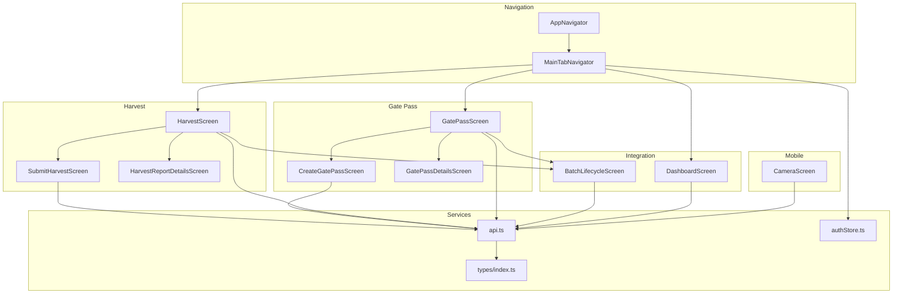
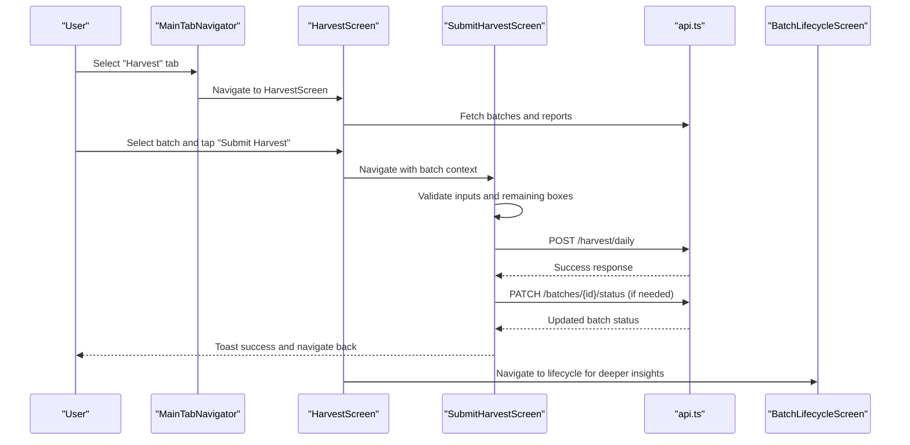
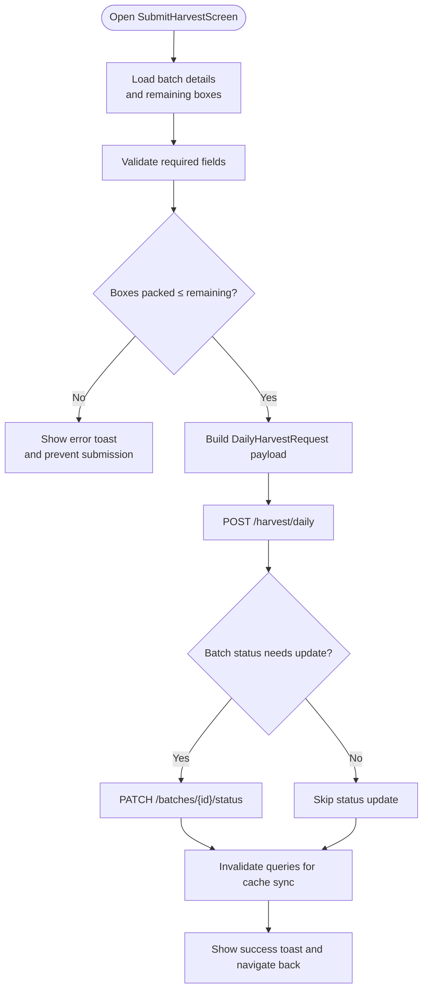
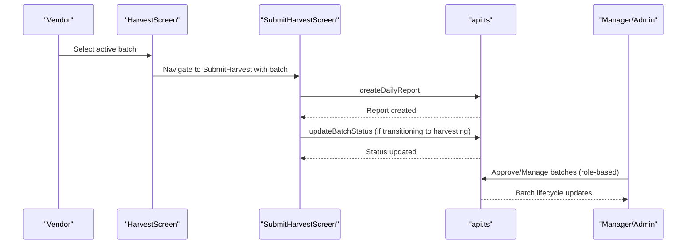
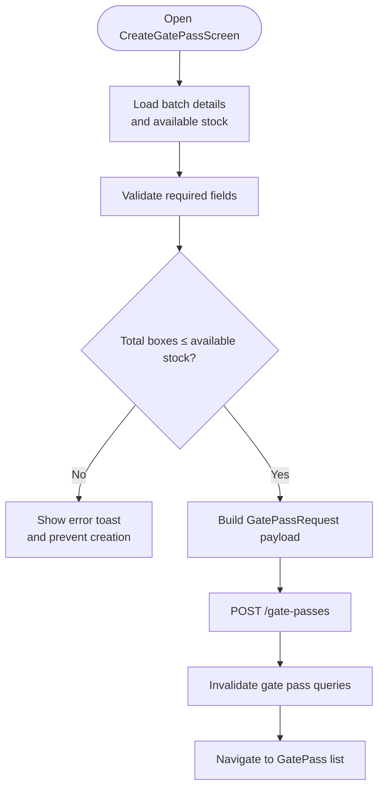
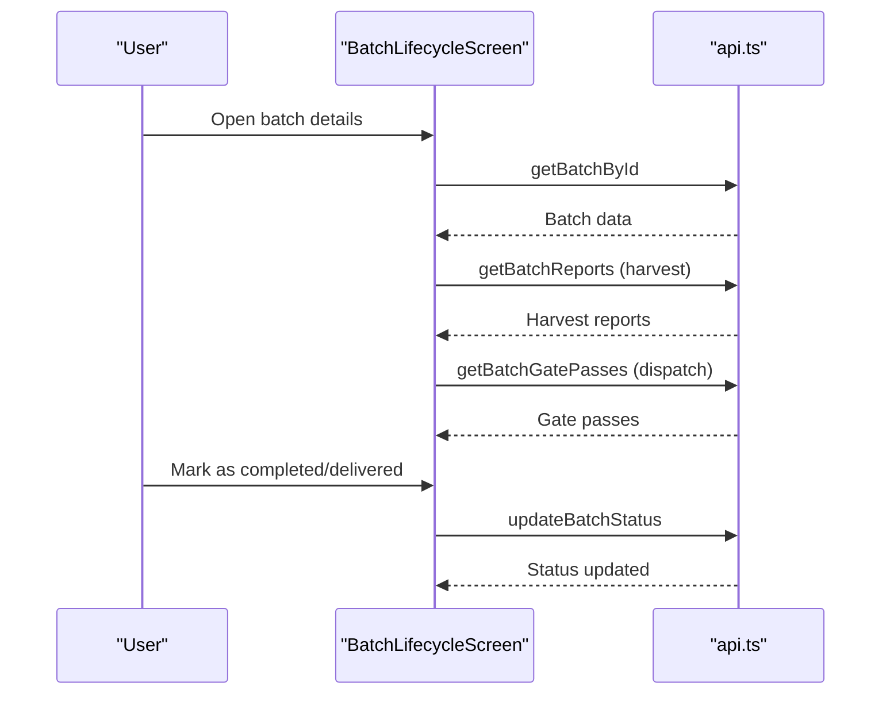
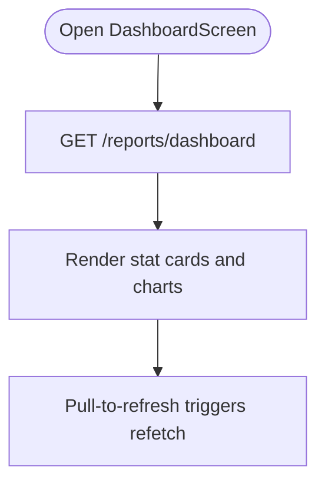
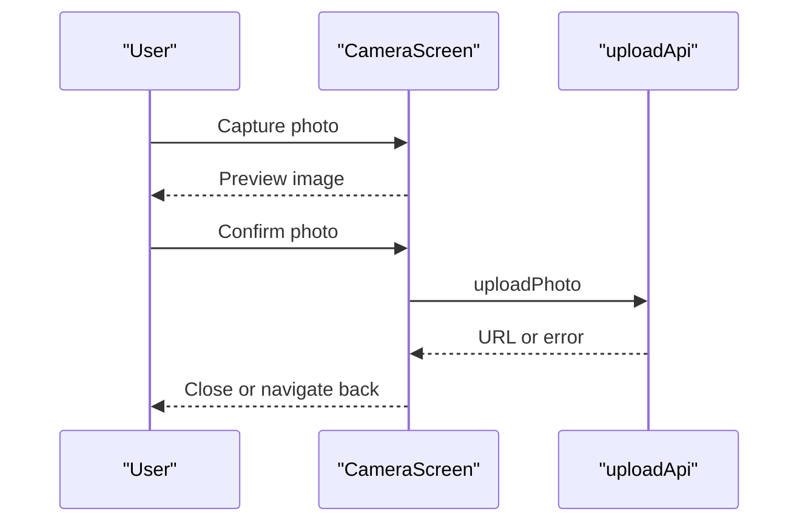
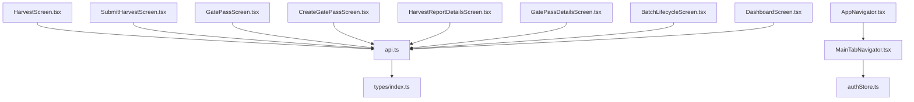

# Harvest Operations

<cite>
**Referenced Files in This Document**
- [HarvestScreen.tsx](file://src/screens/harvest/HarvestScreen.tsx)
- [SubmitHarvestScreen.tsx](file://src/screens/harvest/SubmitHarvestScreen.tsx)
- [CreateGatePassScreen.tsx](file://src/screens/harvest/CreateGatePassScreen.tsx)
- [GatePassScreen.tsx](file://src/screens/harvest/GatePassScreen.tsx)
- [GatePassDetailsScreen.tsx](file://src/screens/harvest/GatePassDetailsScreen.tsx)
- [HarvestReportDetailsScreen.tsx](file://src/screens/harvest/HarvestReportDetailsScreen.tsx)
- [BatchLifecycleScreen.tsx](file://src/screens/batches/BatchLifecycleScreen.tsx)
- [DashboardScreen.tsx](file://src/screens/dashboard/DashboardScreen.tsx)
- [AppNavigator.tsx](file://src/navigation/AppNavigator.tsx)
- [MainTabNavigator.tsx](file://src/navigation/MainTabNavigator.tsx)
- [api.ts](file://src/services/api.ts)
- [index.ts](file://src/types/index.ts)
- [authStore.ts](file://src/store/authStore.ts)
- [BatchStatusBadge.tsx](file://src/components/common/BatchStatusBadge.tsx)
- [CameraScreen.tsx](file://src/screens/common/CameraScreen.tsx)
</cite>

## Table of Contents
1. [Introduction](#introduction)
2. [Project Structure](#project-structure)
3. [Core Components](#core-components)
4. [Architecture Overview](#architecture-overview)
5. [Detailed Component Analysis](#detailed-component-analysis)
6. [Dependency Analysis](#dependency-analysis)
7. [Performance Considerations](#performance-considerations)
8. [Troubleshooting Guide](#troubleshooting-guide)
9. [Conclusion](#conclusion)

## Introduction
This document provides comprehensive documentation for the Harvest Operations feature, covering the complete end-to-end workflow from daily harvest reporting to gate pass creation and delivery coordination. It explains box counting, weight tracking, quality assessment, submission and approval processes, vendor verification, manager approvals, and integration with batch lifecycle management, inventory allocation, and sales processing. Mobile-specific capabilities such as barcode scanning, GPS verification, and offline data entry are addressed alongside labor cost tracking, productivity metrics, and real-time dashboards.

## Project Structure
The Harvest Operations feature spans several screens under the `src/screens/harvest` directory, integrated with navigation, services, types, and shared components. The main screens include:
- Harvest reporting: HarvestScreen, SubmitHarvestScreen, HarvestReportDetailsScreen
- Gate pass management: GatePassScreen, CreateGatePassScreen, GatePassDetailsScreen
- Integration: BatchLifecycleScreen, DashboardScreen
- Navigation and authentication: AppNavigator, MainTabNavigator, authStore
- Services and types: api.ts, index.ts
- Mobile capabilities: CameraScreen

**Diagram sources**
- [AppNavigator.tsx](file://src/navigation/AppNavigator.tsx#L28-L58)
- [MainTabNavigator.tsx](file://src/navigation/MainTabNavigator.tsx#L315-L349)
- [HarvestScreen.tsx](file://src/screens/harvest/HarvestScreen.tsx#L37-L435)
- [SubmitHarvestScreen.tsx](file://src/screens/harvest/SubmitHarvestScreen.tsx#L28-L251)
- [HarvestReportDetailsScreen.tsx](file://src/screens/harvest/HarvestReportDetailsScreen.tsx#L20-L139)
- [GatePassScreen.tsx](file://src/screens/harvest/GatePassScreen.tsx#L32-L387)
- [CreateGatePassScreen.tsx](file://src/screens/harvest/CreateGatePassScreen.tsx#L28-L242)
- [GatePassDetailsScreen.tsx](file://src/screens/harvest/GatePassDetailsScreen.tsx#L20-L137)
- [BatchLifecycleScreen.tsx](file://src/screens/batches/BatchLifecycleScreen.tsx#L35-L682)
- [DashboardScreen.tsx](file://src/screens/dashboard/DashboardScreen.tsx#L45-L204)
- [api.ts](file://src/services/api.ts#L169-L209)
- [index.ts](file://src/types/index.ts#L20-L34)
- [authStore.ts](file://src/store/authStore.ts#L29-L115)
- [CameraScreen.tsx](file://src/screens/common/CameraScreen.tsx#L13-L139)

**Section sources**
- [AppNavigator.tsx](file://src/navigation/AppNavigator.tsx#L28-L58)
- [MainTabNavigator.tsx](file://src/navigation/MainTabNavigator.tsx#L315-L349)

## Core Components
- HarvestScreen: Central hub for selecting active batches, viewing daily reports, and submitting harvest data. Includes batch selection, filtering, and tabbed views for today/history.
- SubmitHarvestScreen: Form-based interface for entering boxes packed, wasted, labor count, labor cost, and notes; validates against remaining allocations; updates batch status to harvesting when appropriate.
- GatePassScreen: Manages gate pass creation and dispatch tracking; filters batches eligible for dispatch; supports today/history tabs and batch selection.
- CreateGatePassScreen: Creates gate passes with driver/truck details and validates against available stock.
- GatePassDetailsScreen: Displays gate pass details including status, received boxes, and transport information.
- HarvestReportDetailsScreen: Presents detailed breakdown of harvest reports including boxes packed/wasted, labor metrics, and notes.
- BatchLifecycleScreen: Integrates with batch status tracking, harvest reports, and gate passes to visualize the entire lifecycle.
- DashboardScreen: Provides real-time statistics and KPIs for administrators and vendors.
- Services and Types: api.ts encapsulates backend endpoints for harvest, gate passes, batches, and reports; types/index.ts defines data contracts.
- Authentication Store: authStore.ts manages user roles and permissions impacting visibility and actions across screens.

**Section sources**
- [HarvestScreen.tsx](file://src/screens/harvest/HarvestScreen.tsx#L37-L435)
- [SubmitHarvestScreen.tsx](file://src/screens/harvest/SubmitHarvestScreen.tsx#L28-L251)
- [GatePassScreen.tsx](file://src/screens/harvest/GatePassScreen.tsx#L32-L387)
- [CreateGatePassScreen.tsx](file://src/screens/harvest/CreateGatePassScreen.tsx#L28-L242)
- [GatePassDetailsScreen.tsx](file://src/screens/harvest/GatePassDetailsScreen.tsx#L20-L137)
- [HarvestReportDetailsScreen.tsx](file://src/screens/harvest/HarvestReportDetailsScreen.tsx#L20-L139)
- [BatchLifecycleScreen.tsx](file://src/screens/batches/BatchLifecycleScreen.tsx#L35-L682)
- [DashboardScreen.tsx](file://src/screens/dashboard/DashboardScreen.tsx#L45-L204)
- [api.ts](file://src/services/api.ts#L169-L209)
- [index.ts](file://src/types/index.ts#L206-L274)
- [authStore.ts](file://src/store/authStore.ts#L29-L115)

## Architecture Overview
The Harvest Operations feature follows a modular React Native architecture with:
- Navigation-driven routing via AppNavigator and MainTabNavigator
- Screen-level state management with React hooks and React Query for caching and synchronization
- Service layer abstraction via api.ts for backend communication
- Strong typing via TypeScript interfaces and enums
- Role-based access control through authStore.ts influencing UI availability and actions

**Diagram sources**
- [MainTabNavigator.tsx](file://src/navigation/MainTabNavigator.tsx#L330-L349)
- [HarvestScreen.tsx](file://src/screens/harvest/HarvestScreen.tsx#L422-L431)
- [SubmitHarvestScreen.tsx](file://src/screens/harvest/SubmitHarvestScreen.tsx#L75-L111)
- [api.ts](file://src/services/api.ts#L170-L172)
- [BatchLifecycleScreen.tsx](file://src/screens/batches/BatchLifecycleScreen.tsx#L35-L682)

## Detailed Component Analysis

### Daily Harvest Reporting System
The daily harvest reporting system enables vendors to log boxes packed, wasted, labor count, and labor cost while ensuring adherence to remaining allocations per batch.

**Diagram sources**
- [SubmitHarvestScreen.tsx](file://src/screens/harvest/SubmitHarvestScreen.tsx#L75-L111)
- [SubmitHarvestScreen.tsx](file://src/screens/harvest/SubmitHarvestScreen.tsx#L42-L73)
- [api.ts](file://src/services/api.ts#L170-L172)
- [api.ts](file://src/services/api.ts#L126-L127)

Key behaviors:
- Remaining box validation prevents oversubmission based on allocated vs. harvested quantities.
- On successful submission, batch status transitions to harvesting if applicable.
- Real-time UI updates via React Query invalidate affected caches.

**Section sources**
- [SubmitHarvestScreen.tsx](file://src/screens/harvest/SubmitHarvestScreen.tsx#L28-L251)
- [HarvestReportDetailsScreen.tsx](file://src/screens/harvest/HarvestReportDetailsScreen.tsx#L20-L139)
- [HarvestScreen.tsx](file://src/screens/harvest/HarvestScreen.tsx#L94-L114)

### Harvest Submission and Approval Workflows
Harvest submissions are vendor-driven and validated against batch allocations. Approval workflows are role-based:
- Vendors can submit reports and mark batches as completed.
- Managers and admins oversee batch lifecycle and can update statuses accordingly.

**Diagram sources**
- [HarvestScreen.tsx](file://src/screens/harvest/HarvestScreen.tsx#L128-L148)
- [SubmitHarvestScreen.tsx](file://src/screens/harvest/SubmitHarvestScreen.tsx#L42-L73)
- [api.ts](file://src/services/api.ts#L170-L172)
- [api.ts](file://src/services/api.ts#L126-L127)

**Section sources**
- [HarvestScreen.tsx](file://src/screens/harvest/HarvestScreen.tsx#L37-L162)
- [authStore.ts](file://src/store/authStore.ts#L29-L115)

### Gate Pass Creation and Delivery Coordination
Gate pass creation integrates driver and vehicle information with inventory tracking to coordinate dispatch.

**Diagram sources**
- [CreateGatePassScreen.tsx](file://src/screens/harvest/CreateGatePassScreen.tsx#L65-L104)
- [CreateGatePassScreen.tsx](file://src/screens/harvest/CreateGatePassScreen.tsx#L42-L63)
- [api.ts](file://src/services/api.ts#L188-L189)

Post-creation, GatePassScreen displays today/history lists with batch summaries and allows navigation to detailed views.

**Section sources**
- [GatePassScreen.tsx](file://src/screens/harvest/GatePassScreen.tsx#L32-L387)
- [GatePassDetailsScreen.tsx](file://src/screens/harvest/GatePassDetailsScreen.tsx#L20-L137)
- [CreateGatePassScreen.tsx](file://src/screens/harvest/CreateGatePassScreen.tsx#L28-L242)

### Batch Lifecycle Management Integration
BatchLifecycleScreen consolidates inspection, harvest, dispatch, and delivery stages, providing a comprehensive view of the batch journey.

**Diagram sources**
- [BatchLifecycleScreen.tsx](file://src/screens/batches/BatchLifecycleScreen.tsx#L44-L63)
- [BatchLifecycleScreen.tsx](file://src/screens/batches/BatchLifecycleScreen.tsx#L121-L151)
- [BatchLifecycleScreen.tsx](file://src/screens/batches/BatchLifecycleScreen.tsx#L176-L197)
- [api.ts](file://src/services/api.ts#L123-L127)

**Section sources**
- [BatchLifecycleScreen.tsx](file://src/screens/batches/BatchLifecycleScreen.tsx#L35-L682)

### Real-Time Dashboards and Productivity Metrics
DashboardScreen aggregates KPIs for administrators and vendors, including totals, revenues, profits, and inventory status.

**Diagram sources**
- [DashboardScreen.tsx](file://src/screens/dashboard/DashboardScreen.tsx#L58-L64)
- [api.ts](file://src/services/api.ts#L268-L270)

**Section sources**
- [DashboardScreen.tsx](file://src/screens/dashboard/DashboardScreen.tsx#L45-L204)

### Mobile-Specific Features
Mobile capabilities include:
- Camera-based photo capture for inspections and supporting evidence.
- Barcode scanning for batch identification (via CameraScreen integration).
- Offline data entry via local state and cache synchronization upon connectivity restoration.

**Diagram sources**
- [CameraScreen.tsx](file://src/screens/common/CameraScreen.tsx#L37-L61)
- [api.ts](file://src/services/api.ts#L292-L297)

**Section sources**
- [CameraScreen.tsx](file://src/screens/common/CameraScreen.tsx#L13-L139)
- [api.ts](file://src/services/api.ts#L292-L323)

## Dependency Analysis
Harvest Operations relies on:
- Navigation: AppNavigator and MainTabNavigator orchestrate screen transitions and role-based visibility.
- Services: api.ts exposes endpoints for harvest, gate passes, batches, reports, and uploads.
- Types: Strongly typed interfaces define request/response contracts for harvest reports, gate passes, and batch lifecycle.
- Authentication: authStore.ts governs role-based access and influences UI availability and actions.

**Diagram sources**
- [HarvestScreen.tsx](file://src/screens/harvest/HarvestScreen.tsx#L30-L31)
- [SubmitHarvestScreen.tsx](file://src/screens/harvest/SubmitHarvestScreen.tsx#L23-L24)
- [GatePassScreen.tsx](file://src/screens/harvest/GatePassScreen.tsx#L25-L26)
- [CreateGatePassScreen.tsx](file://src/screens/harvest/CreateGatePassScreen.tsx#L23-L24)
- [HarvestReportDetailsScreen.tsx](file://src/screens/harvest/HarvestReportDetailsScreen.tsx#L15-L16)
- [GatePassDetailsScreen.tsx](file://src/screens/harvest/GatePassDetailsScreen.tsx#L15-L16)
- [BatchLifecycleScreen.tsx](file://src/screens/batches/BatchLifecycleScreen.tsx#L26-L27)
- [DashboardScreen.tsx](file://src/screens/dashboard/DashboardScreen.tsx#L18-L19)
- [api.ts](file://src/services/api.ts#L169-L209)
- [index.ts](file://src/types/index.ts#L206-L274)
- [authStore.ts](file://src/store/authStore.ts#L29-L115)
- [MainTabNavigator.tsx](file://src/navigation/MainTabNavigator.tsx#L315-L349)
- [AppNavigator.tsx](file://src/navigation/AppNavigator.tsx#L28-L58)

**Section sources**
- [api.ts](file://src/services/api.ts#L169-L209)
- [index.ts](file://src/types/index.ts#L206-L274)
- [authStore.ts](file://src/store/authStore.ts#L29-L115)
- [MainTabNavigator.tsx](file://src/navigation/MainTabNavigator.tsx#L315-L349)

## Performance Considerations
- Query invalidation and caching: React Query invalidates related queries after mutations to keep UI synchronized (e.g., after harvest submission or gate pass creation).
- Role-based rendering: MainTabNavigator computes badge counts and filters tabs by user role to minimize unnecessary renders.
- Local date handling: Screens use local date strings to avoid server timezone discrepancies when fetching daily reports.
- Memoization: Selectable batches and filtered lists leverage useMemo to optimize rendering during search/filter operations.

[No sources needed since this section provides general guidance]

## Troubleshooting Guide
Common issues and resolutions:
- Submission limit exceeded: Ensure boxes packed does not exceed remaining boxes for the batch; validation prevents oversubmission.
- Status update failures: Verify network connectivity and token validity; the API client handles token refresh automatically.
- Gate pass stock mismatch: Confirm available stock equals harvested minus dispatched boxes; adjust dispatch quantity accordingly.
- Navigation errors: Confirm user role permissions and that required batch data is loaded before navigating to dependent screens.

**Section sources**
- [SubmitHarvestScreen.tsx](file://src/screens/harvest/SubmitHarvestScreen.tsx#L85-L98)
- [CreateGatePassScreen.tsx](file://src/screens/harvest/CreateGatePassScreen.tsx#L71-L91)
- [api.ts](file://src/services/api.ts#L16-L65)

## Conclusion
The Harvest Operations feature delivers a robust, role-aware system for managing daily harvest reporting, gate pass creation, and end-to-end batch lifecycle tracking. With strong integrations to batch management, inventory, and sales, it supports real-time dashboards, productivity metrics, and mobile-first capabilities including camera capture and barcode scanning. The modular architecture ensures maintainability, scalability, and seamless user experiences across platforms.