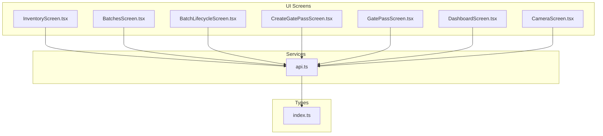
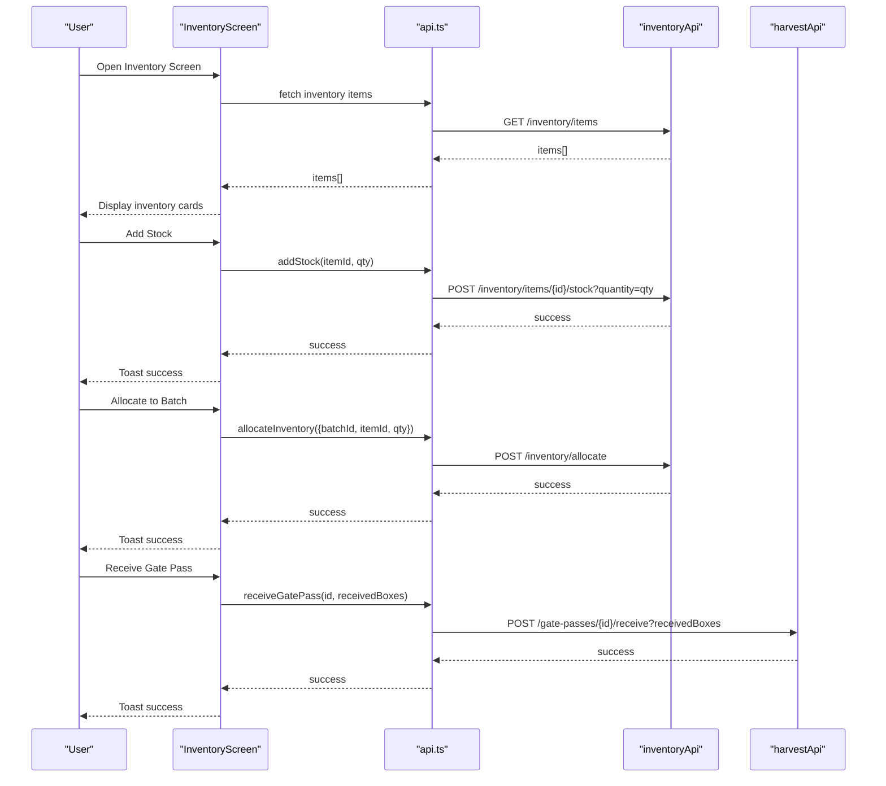
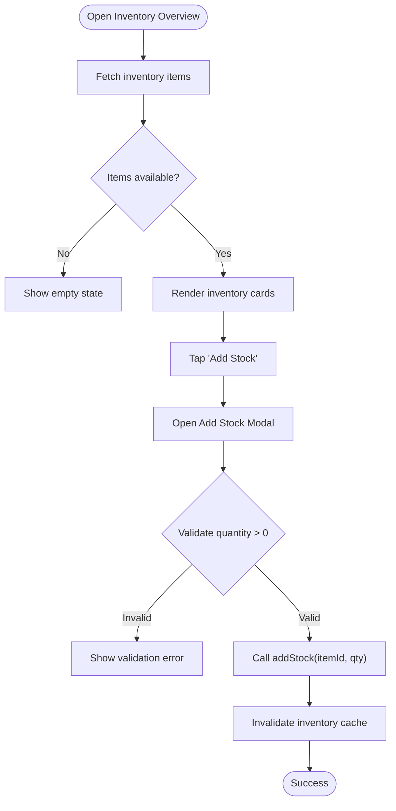
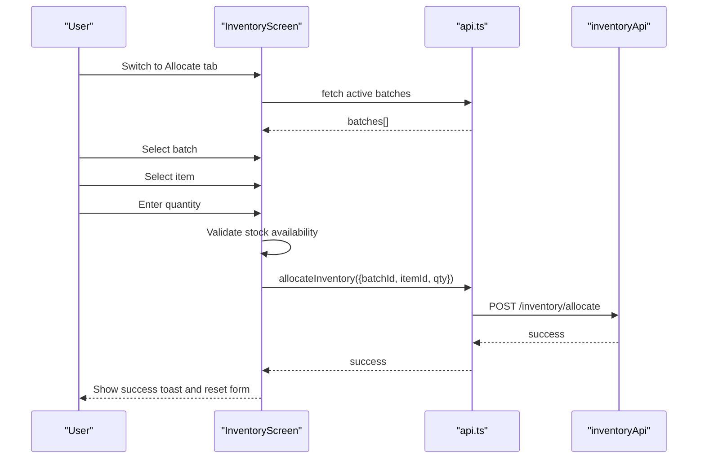
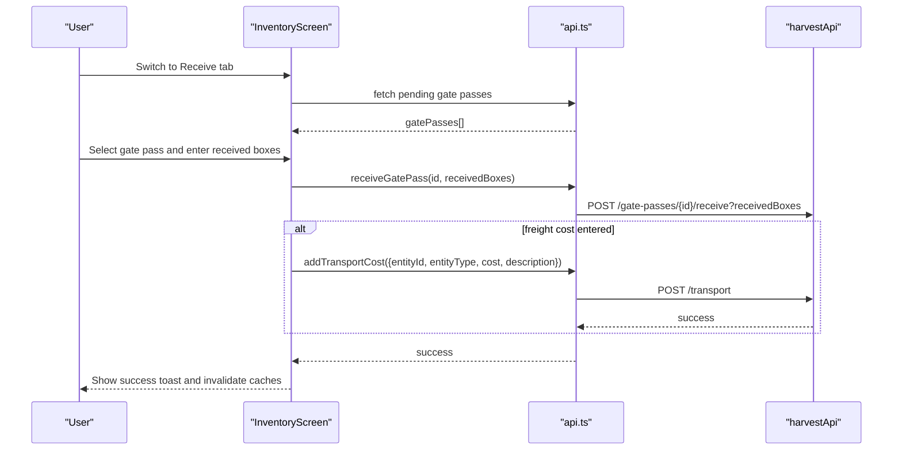
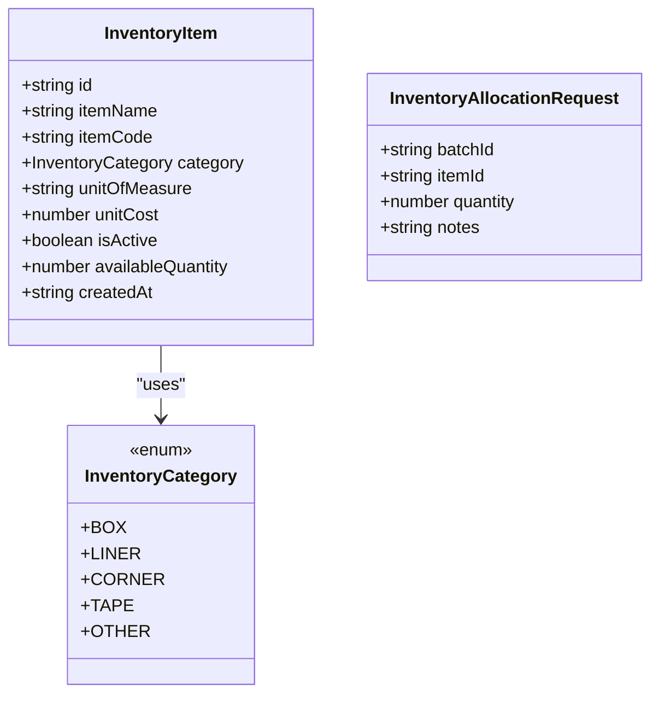
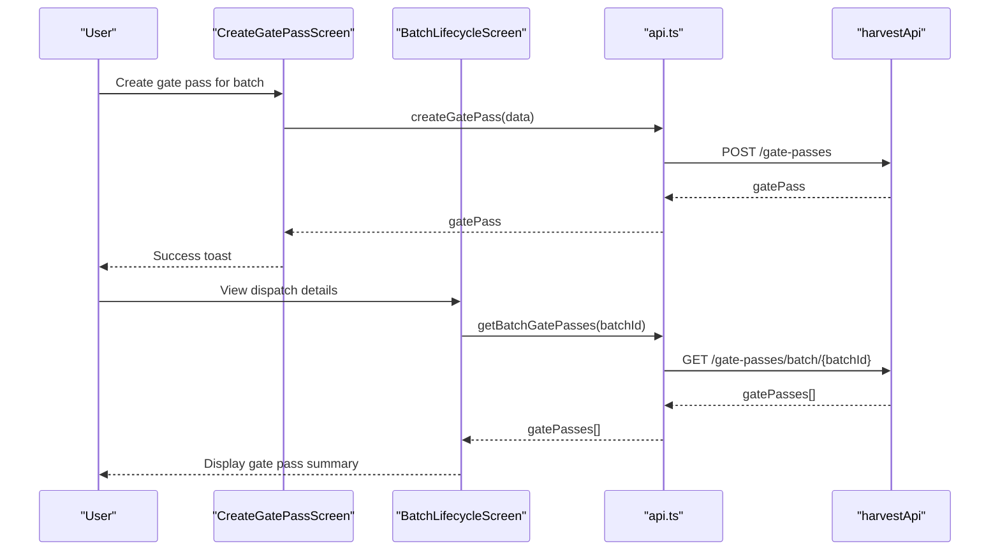
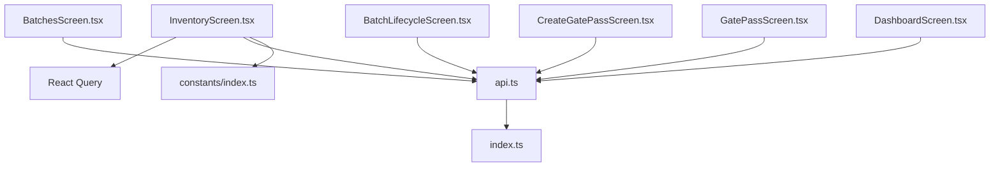

# Inventory Management

<cite>
**Referenced Files in This Document**
- [InventoryScreen.tsx](file://src/screens/inventory/InventoryScreen.tsx)
- [api.ts](file://src/services/api.ts)
- [index.ts](file://src/types/index.ts)
- [BatchesScreen.tsx](file://src/screens/batches/BatchesScreen.tsx)
- [BatchLifecycleScreen.tsx](file://src/screens/batches/BatchLifecycleScreen.tsx)
- [CreateGatePassScreen.tsx](file://src/screens/harvest/CreateGatePassScreen.tsx)
- [GatePassScreen.tsx](file://src/screens/harvest/GatePassScreen.tsx)
- [DashboardScreen.tsx](file://src/screens/dashboard/DashboardScreen.tsx)
- [CameraScreen.tsx](file://src/screens/common/CameraScreen.tsx)
- [index.ts](file://src/constants/index.ts)
</cite>

## Table of Contents
1. [Introduction](#introduction)
2. [Project Structure](#project-structure)
3. [Core Components](#core-components)
4. [Architecture Overview](#architecture-overview)
5. [Detailed Component Analysis](#detailed-component-analysis)
6. [Dependency Analysis](#dependency-analysis)
7. [Performance Considerations](#performance-considerations)
8. [Troubleshooting Guide](#troubleshooting-guide)
9. [Conclusion](#conclusion)

## Introduction
This document provides comprehensive documentation for the Inventory Management feature of the Banana Harvest application. It covers the stock tracking system, item categorization, batch allocation, inventory valuation, adjustments, transfers, reconciliation, integration with harvest operations and sales, reporting capabilities, and mobile-specific features such as barcode scanning and offline synchronization. The goal is to enable both technical and non-technical stakeholders to understand how inventory is managed end-to-end within the application.

## Project Structure
The Inventory Management feature spans several screens and services:
- Inventory overview and management: InventoryScreen
- Batch lifecycle and allocation: BatchesScreen, BatchLifecycleScreen
- Gate pass creation and receipt: CreateGatePassScreen, GatePassScreen
- API integrations: api.ts
- Type definitions: index.ts
- Mobile camera integration: CameraScreen.tsx
- Dashboard inventory overview: DashboardScreen.tsx
- Constants and styling: constants/index.ts

**Diagram sources**
- [InventoryScreen.tsx](file://src/screens/inventory/InventoryScreen.tsx#L29-L601)
- [api.ts](file://src/services/api.ts#L146-L209)
- [index.ts](file://src/types/index.ts#L178-L264)

**Section sources**
- [InventoryScreen.tsx](file://src/screens/inventory/InventoryScreen.tsx#L29-L601)
- [api.ts](file://src/services/api.ts#L146-L209)
- [index.ts](file://src/types/index.ts#L178-L264)

## Core Components
The Inventory Management feature centers around three primary workflows:
- Inventory Overview and Stock Tracking: Users can view current inventory levels, add stock, and manage items.
- Batch Allocation: Materials are allocated from inventory to active batches during harvesting.
- Gate Pass Receiving: Incoming deliveries are recorded against pending gate passes, with optional freight cost recording.

Key UI components and their responsibilities:
- InventoryScreen: Hosts three tabs (Overview, Receive, Allocate) and orchestrates queries/mutations for inventory operations.
- API Layer: Provides typed endpoints for inventory, harvest, and transport operations.
- Types: Define inventory items, categories, batches, gate passes, and related enums.

**Section sources**
- [InventoryScreen.tsx](file://src/screens/inventory/InventoryScreen.tsx#L29-L601)
- [api.ts](file://src/services/api.ts#L146-L209)
- [index.ts](file://src/types/index.ts#L178-L264)

## Architecture Overview
The inventory feature integrates with the broader system through a layered architecture:
- Presentation Layer: React Native screens and components.
- Service Layer: API client with typed endpoints for inventory, harvest, transport, and sales.
- Domain Types: Strongly-typed models for inventory items, batches, gate passes, and categories.
- Integration Points: Real-time queries for active batches and pending gate passes; mutations for stock additions, allocations, and receipts.

**Diagram sources**
- [InventoryScreen.tsx](file://src/screens/inventory/InventoryScreen.tsx#L59-L190)
- [api.ts](file://src/services/api.ts#L146-L209)

## Detailed Component Analysis

### Inventory Overview and Stock Tracking
The Inventory Overview tab displays current inventory levels and enables adding stock to existing items. It uses React Query for data fetching and optimistic updates via query invalidation.

Key behaviors:
- Fetch inventory items with pagination-friendly structure.
- Validate user input for stock quantities.
- Provide empty-state guidance for new users.
- Support quick-add stock via modal.

**Diagram sources**
- [InventoryScreen.tsx](file://src/screens/inventory/InventoryScreen.tsx#L59-L125)

**Section sources**
- [InventoryScreen.tsx](file://src/screens/inventory/InventoryScreen.tsx#L59-L125)

### Batch Allocation Workflow
The Allocate tab connects inventory to active batches. It filters batches by status suitable for receiving materials and ensures stock availability before allocation.

Key behaviors:
- Fetch active batches filtered by status.
- Allow selection of batch and item.
- Validate allocation quantity against available stock.
- Submit allocation request and reset form.

**Diagram sources**
- [InventoryScreen.tsx](file://src/screens/inventory/InventoryScreen.tsx#L67-L143)
- [api.ts](file://src/services/api.ts#L146-L167)

**Section sources**
- [InventoryScreen.tsx](file://src/screens/inventory/InventoryScreen.tsx#L67-L143)
- [api.ts](file://src/services/api.ts#L146-L167)

### Gate Pass Receiving and Freight Cost Recording
The Receive tab lists pending gate passes and supports verifying received quantities and optionally recording inward freight costs.

Key behaviors:
- Fetch pending gate passes.
- Allow selecting a gate pass and verifying received boxes.
- Optionally add transport cost via separate endpoint.
- Invalidate caches to reflect updated inventory and gate pass status.

**Diagram sources**
- [InventoryScreen.tsx](file://src/screens/inventory/InventoryScreen.tsx#L80-L190)
- [api.ts](file://src/services/api.ts#L169-L209)

**Section sources**
- [InventoryScreen.tsx](file://src/screens/inventory/InventoryScreen.tsx#L80-L190)
- [api.ts](file://src/services/api.ts#L169-L209)

### Item Categorization and Data Models
Inventory items are categorized and tracked with essential attributes. The types define categories, item properties, and allocation requests.

**Diagram sources**
- [index.ts](file://src/types/index.ts#L178-L204)

**Section sources**
- [index.ts](file://src/types/index.ts#L178-L204)

### Integration with Harvest Operations
The system integrates inventory with harvest and dispatch operations through gate passes and batch lifecycle.

- Gate Pass Creation: Creates outbound gate passes linked to batches.
- Gate Pass Receiving: Records inbound receipts against pending gate passes.
- Batch Lifecycle: Tracks dispatch and transit stages, linking to inventory movements.

**Diagram sources**
- [CreateGatePassScreen.tsx](file://src/screens/harvest/CreateGatePassScreen.tsx#L28-L63)
- [BatchLifecycleScreen.tsx](file://src/screens/batches/BatchLifecycleScreen.tsx#L58-L63)
- [api.ts](file://src/services/api.ts#L169-L198)

**Section sources**
- [CreateGatePassScreen.tsx](file://src/screens/harvest/CreateGatePassScreen.tsx#L28-L63)
- [BatchLifecycleScreen.tsx](file://src/screens/batches/BatchLifecycleScreen.tsx#L58-L63)
- [api.ts](file://src/services/api.ts#L169-L198)

### Inventory Valuation Methods
Current implementation tracks available quantities and unit costs at the item level. Valuation can be computed as:
- Total Inventory Value = Σ(item.availableQuantity × item.unitCost)
- Per-item valuation supports batch-level cost calculations via the cost module.

Note: Unit cost is part of the item model and can be used for valuation computations.

**Section sources**
- [index.ts](file://src/types/index.ts#L187-L197)
- [api.ts](file://src/services/api.ts#L211-L221)

### Low Stock Alerts and Reporting
The current UI does not implement automated low stock alerts. However, the dashboard exposes inventory statistics that can inform manual monitoring:
- Empty Boxes and Filled Boxes balances are available in dashboard metrics.

Recommendations:
- Implement server-side thresholds and push notifications for low stock.
- Extend dashboard to display low-stock warnings.

**Section sources**
- [DashboardScreen.tsx](file://src/screens/dashboard/DashboardScreen.tsx#L119-L136)

### Inventory Adjustments and Transfers
- Adjustments: The system supports adding stock via addStock endpoint.
- Transfers: Not implemented in the current codebase; would require dedicated endpoints and UI.

**Section sources**
- [api.ts](file://src/services/api.ts#L157-L160)

### Inventory Reconciliation Procedures
- Reconciliation can be performed by comparing physical counts against system records.
- The receive workflow validates received quantities and can be used to reconcile discrepancies.

**Section sources**
- [InventoryScreen.tsx](file://src/screens/inventory/InventoryScreen.tsx#L250-L276)

### Sales Processing Integration
- Sales data is available via the sales API and can be integrated with inventory to track sales-driven stock reductions.
- Invoice generation and sharing are supported.

**Section sources**
- [api.ts](file://src/services/api.ts#L223-L265)

### Inventory Reporting and Analytics
- Dashboard provides high-level inventory metrics (empty/filled boxes).
- Additional reporting endpoints exist for profitability and daily activity.

**Section sources**
- [DashboardScreen.tsx](file://src/screens/dashboard/DashboardScreen.tsx#L119-L136)
- [api.ts](file://src/services/api.ts#L267-L289)

### Mobile-Specific Features
- Camera Integration: The CameraScreen component supports photo capture and can be embedded in inspection workflows.
- Offline Synchronization: Not implemented in the current codebase; would require a local database and sync queue.

**Section sources**
- [CameraScreen.tsx](file://src/screens/common/CameraScreen.tsx#L13-L139)

## Dependency Analysis
The inventory feature depends on:
- React Query for caching and optimistic updates.
- Typed API endpoints for inventory, harvest, and transport operations.
- Strongly-typed domain models for items, batches, and gate passes.

**Diagram sources**
- [InventoryScreen.tsx](file://src/screens/inventory/InventoryScreen.tsx#L16-L25)
- [api.ts](file://src/services/api.ts#L1-L326)
- [index.ts](file://src/types/index.ts#L1-L429)
- [index.ts](file://src/constants/index.ts#L1-L363)

**Section sources**
- [InventoryScreen.tsx](file://src/screens/inventory/InventoryScreen.tsx#L16-L25)
- [api.ts](file://src/services/api.ts#L1-L326)
- [index.ts](file://src/types/index.ts#L1-L429)
- [index.ts](file://src/constants/index.ts#L1-L363)

## Performance Considerations
- Use React Query’s query keys to minimize unnecessary refetches.
- Implement optimistic updates for immediate feedback on stock additions and allocations.
- Debounce search/filter operations where applicable.
- Paginate inventory and gate pass lists to reduce payload sizes.

## Troubleshooting Guide
Common issues and resolutions:
- Network errors: The API client handles 401 Unauthorized by refreshing tokens; ensure proper authentication state.
- Validation errors: UI validations prevent invalid submissions; check toast messages for specific errors.
- Cache inconsistencies: Use query invalidation to refresh inventory and gate pass lists after mutations.

**Section sources**
- [api.ts](file://src/services/api.ts#L17-L65)
- [InventoryScreen.tsx](file://src/screens/inventory/InventoryScreen.tsx#L194-L248)

## Conclusion
The Inventory Management feature provides a solid foundation for tracking stock levels, allocating materials to batches, and reconciling incoming deliveries. It integrates seamlessly with harvest and dispatch workflows and offers dashboard insights. Future enhancements should focus on low stock alerts, inventory adjustments/transfers, sales integration, and mobile offline synchronization to improve operational efficiency and accuracy.