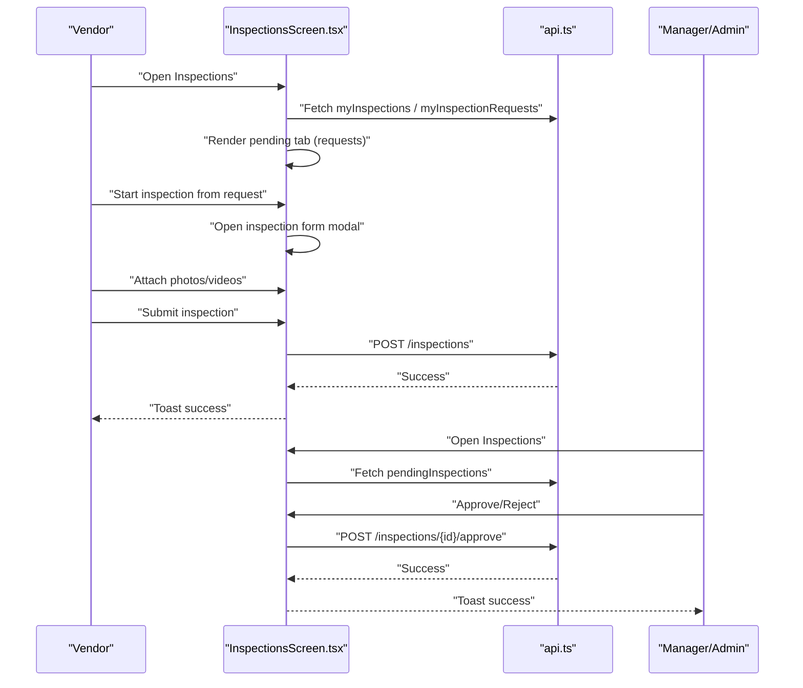
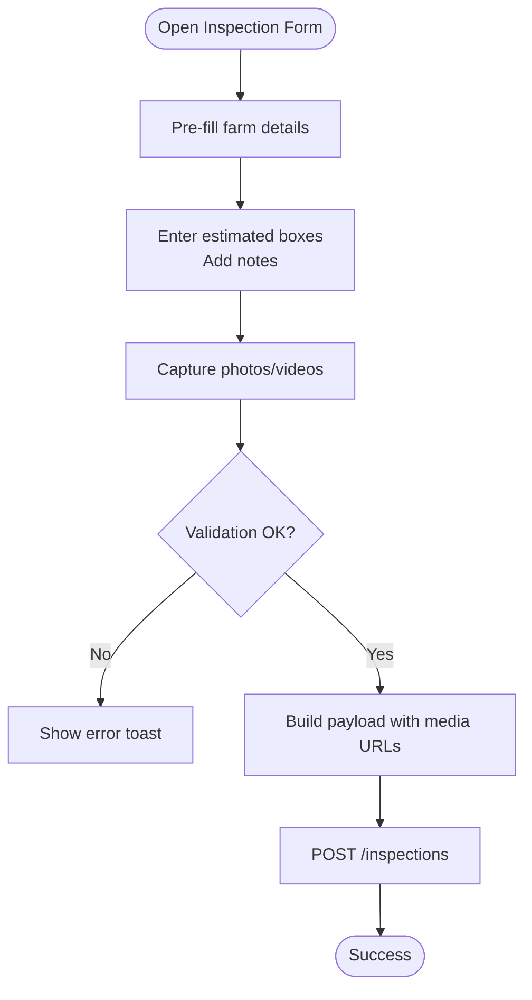
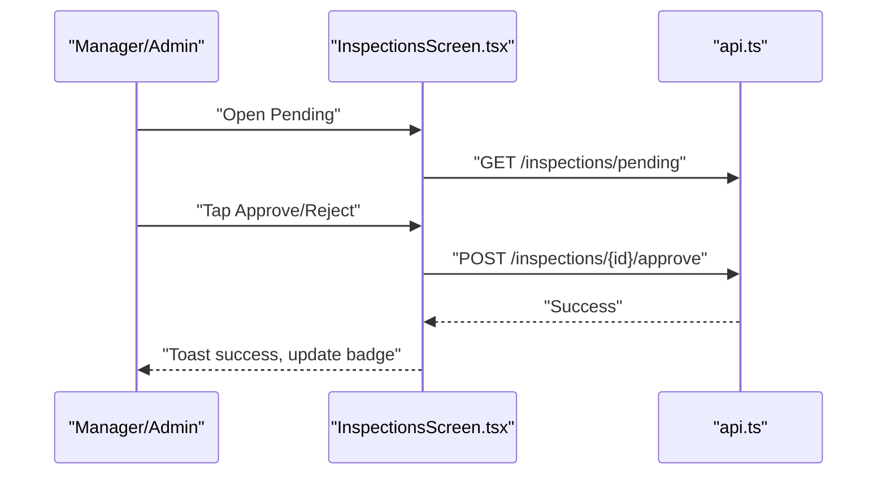
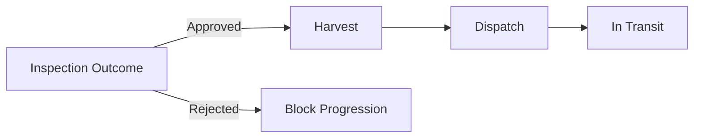
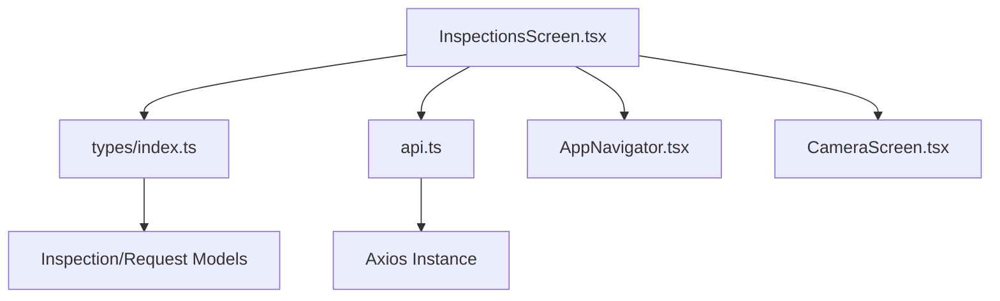
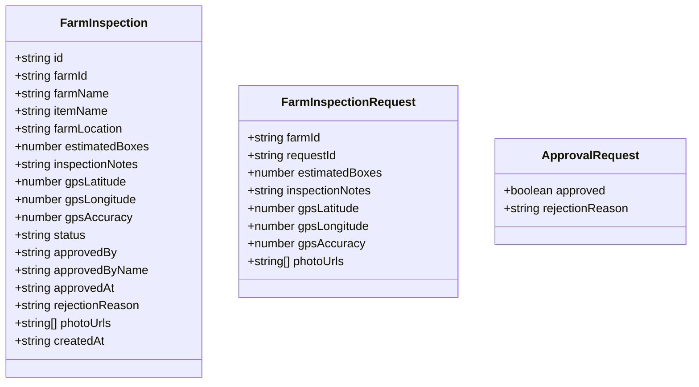

# Quality Inspections

<cite>
**Referenced Files in This Document**
- [CreateInspectionRequestScreen.tsx](file://src/screens/inspections/CreateInspectionRequestScreen.tsx)
- [InspectionsScreen.tsx](file://src/screens/inspections/InspectionsScreen.tsx)
- [CameraScreen.tsx](file://src/screens/common/CameraScreen.tsx)
- [api.ts](file://src/services/api.ts)
- [index.ts](file://src/types/index.ts)
- [AppNavigator.tsx](file://src/navigation/AppNavigator.tsx)
- [MainTabNavigator.tsx](file://src/navigation/MainTabNavigator.tsx)
- [BatchLifecycleScreen.tsx](file://src/screens/batches/BatchLifecycleScreen.tsx)
- [BatchesScreen.tsx](file://src/screens/batches/BatchesScreen.tsx)
- [index.ts](file://src/constants/index.ts)
</cite>

## Table of Contents
1. [Introduction](#introduction)
2. [Project Structure](#project-structure)
3. [Core Components](#core-components)
4. [Architecture Overview](#architecture-overview)
5. [Detailed Component Analysis](#detailed-component-analysis)
6. [Dependency Analysis](#dependency-analysis)
7. [Performance Considerations](#performance-considerations)
8. [Troubleshooting Guide](#troubleshooting-guide)
9. [Conclusion](#conclusion)
10. [Appendices](#appendices)

## Introduction
This document describes the Quality Inspections feature of the Harvest app. It covers the end-to-end workflow from inspection request creation to approval, including photo documentation, optional GPS location capture, and integration with batch lifecycle and sales quality assurance. It also documents mobile-specific capabilities such as camera integration and offline-friendly data capture, along with inspection history tracking, manager review processes, and automated decision-making hooks.

## Project Structure
The Quality Inspections feature spans several screens, services, and shared types:
- Inspection request creation and management
- On-site inspection capture (photos/videos)
- Manager review and approval
- Integration with batch lifecycle and sales
- Mobile camera capture and permissions handling

```mermaid
graph TB
subgraph "Navigation"
AppNav["AppNavigator.tsx"]
MainNav["MainTabNavigator.tsx"]
end
subgraph "Inspection Screens"
CreateReq["CreateInspectionRequestScreen.tsx"]
Inspections["InspectionsScreen.tsx"]
Camera["CameraScreen.tsx"]
end
subgraph "Services"
API["api.ts"]
end
subgraph "Types"
Types["types/index.ts"]
end
subgraph "Integration Screens"
BatchLife["BatchLifecycleScreen.tsx"]
Batches["BatchesScreen.tsx"]
end
AppNav --> MainNav
MainNav --> Inspections
CreateReq --> API
Inspections --> API
Inspections --> Camera
Inspections --> Types
BatchLife --> API
Batches --> API
```

**Diagram sources**
- [AppNavigator.tsx](file://src/navigation/AppNavigator.tsx#L28-L58)
- [MainTabNavigator.tsx](file://src/navigation/MainTabNavigator.tsx#L249-L281)
- [CreateInspectionRequestScreen.tsx](file://src/screens/inspections/CreateInspectionRequestScreen.tsx#L18-L174)
- [InspectionsScreen.tsx](file://src/screens/inspections/InspectionsScreen.tsx#L89-L1218)
- [CameraScreen.tsx](file://src/screens/common/CameraScreen.tsx#L13-L139)
- [api.ts](file://src/services/api.ts#L92-L144)
- [index.ts](file://src/types/index.ts#L92-L141)
- [BatchLifecycleScreen.tsx](file://src/screens/batches/BatchLifecycleScreen.tsx#L550-L644)
- [BatchesScreen.tsx](file://src/screens/batches/BatchesScreen.tsx#L97-L199)

**Section sources**
- [AppNavigator.tsx](file://src/navigation/AppNavigator.tsx#L28-L58)
- [MainTabNavigator.tsx](file://src/navigation/MainTabNavigator.tsx#L249-L281)
- [CreateInspectionRequestScreen.tsx](file://src/screens/inspections/CreateInspectionRequestScreen.tsx#L18-L174)
- [InspectionsScreen.tsx](file://src/screens/inspections/InspectionsScreen.tsx#L89-L1218)
- [CameraScreen.tsx](file://src/screens/common/CameraScreen.tsx#L13-L139)
- [api.ts](file://src/services/api.ts#L92-L144)
- [index.ts](file://src/types/index.ts#L92-L141)
- [BatchLifecycleScreen.tsx](file://src/screens/batches/BatchLifecycleScreen.tsx#L550-L644)
- [BatchesScreen.tsx](file://src/screens/batches/BatchesScreen.tsx#L97-L199)

## Core Components
- Inspection request creation: Allows vendors to request an inspection for a selected farm and vendor.
- Inspection capture: Enables vendors to record inspection details, estimate boxes, and attach photos/videos.
- Manager review: Provides managers/super admins with a pending queue and approval/rejection actions.
- Batch lifecycle integration: Links inspection outcomes to batch progression and displays inspection evidence.
- Mobile camera: Handles camera permissions, capture, and preview for photo evidence.
- API surface: Centralized endpoints for requests, inspections, approvals, and related data.

**Section sources**
- [CreateInspectionRequestScreen.tsx](file://src/screens/inspections/CreateInspectionRequestScreen.tsx#L18-L174)
- [InspectionsScreen.tsx](file://src/screens/inspections/InspectionsScreen.tsx#L170-L320)
- [api.ts](file://src/services/api.ts#L92-L144)
- [index.ts](file://src/types/index.ts#L92-L141)

## Architecture Overview
The inspection feature follows a layered architecture:
- UI layer: React Native screens for request creation, inspection capture, and review.
- Service layer: API module encapsulates HTTP calls to backend endpoints.
- Type layer: Strong TypeScript types define inspection, request, and status models.
- Navigation layer: Stack and tab navigators orchestrate screen transitions.



**Diagram sources**
- [InspectionsScreen.tsx](file://src/screens/inspections/InspectionsScreen.tsx#L181-L320)
- [api.ts](file://src/services/api.ts#L102-L118)
- [MainTabNavigator.tsx](file://src/navigation/MainTabNavigator.tsx#L249-L281)

## Detailed Component Analysis

### Inspection Request Creation Workflow
- Vendors select a farm and vendor, optionally add notes, and submit a request.
- The request is persisted via the inspection requests endpoint.
- Pending requests are surfaced to vendors in the “To Do” list and badge counts.

```mermaid
sequenceDiagram
participant V as "Vendor"
participant Create as "CreateInspectionRequestScreen.tsx"
participant API as "api.ts"
V->>Create : "Select farm/vendor"
V->>Create : "Add notes"
V->>Create : "Submit"
Create->>API : "POST /inspections/requests"
API-->>Create : "Success"
Create-->>V : "Toast success, navigate back"
```

**Diagram sources**
- [CreateInspectionRequestScreen.tsx](file://src/screens/inspections/CreateInspectionRequestScreen.tsx#L46-L81)
- [api.ts](file://src/services/api.ts#L129-L143)

**Section sources**
- [CreateInspectionRequestScreen.tsx](file://src/screens/inspections/CreateInspectionRequestScreen.tsx#L18-L174)
- [api.ts](file://src/services/api.ts#L129-L143)

### On-Site Inspection Capture and Photo Documentation
- Vendors can start an inspection from a pending request, pre-filling farm details.
- The inspection form collects estimated boxes, notes, and media.
- Photos are captured via a dedicated camera component; videos can be recorded.
- Media attachments are supported; submission payload includes coordinates and media URLs.



**Diagram sources**
- [InspectionsScreen.tsx](file://src/screens/inspections/InspectionsScreen.tsx#L477-L512)
- [CameraScreen.tsx](file://src/screens/common/CameraScreen.tsx#L37-L61)

**Section sources**
- [InspectionsScreen.tsx](file://src/screens/inspections/InspectionsScreen.tsx#L322-L374)
- [InspectionsScreen.tsx](file://src/screens/inspections/InspectionsScreen.tsx#L415-L475)
- [InspectionsScreen.tsx](file://src/screens/inspections/InspectionsScreen.tsx#L477-L512)
- [CameraScreen.tsx](file://src/screens/common/CameraScreen.tsx#L13-L139)

### GPS Verification and Location Handling
- The inspection form previously included GPS capture logic; current implementation allows submission without strict GPS presence.
- Submission logic falls back to farm coordinates if present; otherwise uses defaults.
- GPS-related code was removed per user request.

**Section sources**
- [InspectionsScreen.tsx](file://src/screens/inspections/InspectionsScreen.tsx#L160-L168)
- [InspectionsScreen.tsx](file://src/screens/inspections/InspectionsScreen.tsx#L481-L508)

### Manager Review and Automated Decision Hooks
- Managers and super admins see a “Pending” tab with actionable items.
- They can approve or reject inspections directly from the review modal.
- Approve/reject mutations update the UI optimistically and invalidate queries for consistency.



**Diagram sources**
- [InspectionsScreen.tsx](file://src/screens/inspections/InspectionsScreen.tsx#L285-L320)
- [api.ts](file://src/services/api.ts#L114-L118)
- [MainTabNavigator.tsx](file://src/navigation/MainTabNavigator.tsx#L249-L281)

**Section sources**
- [InspectionsScreen.tsx](file://src/screens/inspections/InspectionsScreen.tsx#L285-L320)
- [InspectionsScreen.tsx](file://src/screens/inspections/InspectionsScreen.tsx#L1152-L1179)
- [api.ts](file://src/services/api.ts#L105-L118)
- [MainTabNavigator.tsx](file://src/navigation/MainTabNavigator.tsx#L249-L281)

### Inspection History Tracking and Compliance Reporting
- The “History” tab filters and displays only approved or rejected inspections.
- Users can search by farm name; the list is paginated conceptually via query keys.
- Compliance reporting can leverage historical inspection records for trend analysis.

**Section sources**
- [InspectionsScreen.tsx](file://src/screens/inspections/InspectionsScreen.tsx#L797-L822)
- [InspectionsScreen.tsx](file://src/screens/inspections/InspectionsScreen.tsx#L804-L813)

### Integration with Batch Lifecycle Management
- The batch lifecycle timeline highlights inspection as a prerequisite step.
- Approved inspections unlock subsequent stages (harvest, dispatch, transit).
- Inspection media thumbnails are displayed within the batch lifecycle screen.



**Diagram sources**
- [BatchLifecycleScreen.tsx](file://src/screens/batches/BatchLifecycleScreen.tsx#L550-L644)
- [BatchLifecycleScreen.tsx](file://src/screens/batches/BatchLifecycleScreen.tsx#L279-L296)

**Section sources**
- [BatchLifecycleScreen.tsx](file://src/screens/batches/BatchLifecycleScreen.tsx#L550-L644)
- [BatchLifecycleScreen.tsx](file://src/screens/batches/BatchLifecycleScreen.tsx#L279-L296)

### Sales Quality Assurance Integration
- Batch-level inspection status influences downstream operations such as dispatch and delivery.
- Historical inspection outcomes can inform sales decisions and quality metrics.

**Section sources**
- [BatchLifecycleScreen.tsx](file://src/screens/batches/BatchLifecycleScreen.tsx#L585-L644)

### Mobile-Specific Features
- Camera integration: Dedicated camera screen handles permissions, capture, and preview.
- Permissions: Android camera permission request and settings redirection.
- Offline-friendly UX: Validation occurs before network submission; media is staged locally until upload.

**Section sources**
- [CameraScreen.tsx](file://src/screens/common/CameraScreen.tsx#L13-L139)
- [InspectionsScreen.tsx](file://src/screens/inspections/InspectionsScreen.tsx#L377-L411)
- [InspectionsScreen.tsx](file://src/screens/inspections/InspectionsScreen.tsx#L415-L475)

### Quality Threshold Management, Rejection Workflows, and Re-Inspection Processes
- Thresholds: Not explicitly modeled in the frontend; backend thresholds would govern approval decisions.
- Rejection: Managers can reject inspections with reasons; the system updates status accordingly.
- Re-inspection: After rejection, vendors can re-open the inspection form and resubmit evidence.

**Section sources**
- [InspectionsScreen.tsx](file://src/screens/inspections/InspectionsScreen.tsx#L1152-L1179)
- [InspectionsScreen.tsx](file://src/screens/inspections/InspectionsScreen.tsx#L322-L374)

## Dependency Analysis
- UI depends on:
  - React Query for caching and optimistic updates
  - React Navigation for routing
  - Vision Camera for mobile capture
- Services depend on:
  - Axios instance with interceptors for auth and refresh
  - Centralized endpoints for inspections, requests, and approvals
- Types define inspection models and statuses used across screens.



**Diagram sources**
- [InspectionsScreen.tsx](file://src/screens/inspections/InspectionsScreen.tsx#L181-L320)
- [api.ts](file://src/services/api.ts#L67-L89)
- [index.ts](file://src/types/index.ts#L92-L141)
- [AppNavigator.tsx](file://src/navigation/AppNavigator.tsx#L28-L58)
- [CameraScreen.tsx](file://src/screens/common/CameraScreen.tsx#L13-L139)

**Section sources**
- [InspectionsScreen.tsx](file://src/screens/inspections/InspectionsScreen.tsx#L181-L320)
- [api.ts](file://src/services/api.ts#L67-L89)
- [index.ts](file://src/types/index.ts#L92-L141)
- [AppNavigator.tsx](file://src/navigation/AppNavigator.tsx#L28-L58)
- [CameraScreen.tsx](file://src/screens/common/CameraScreen.tsx#L13-L139)

## Performance Considerations
- Use optimistic updates for approval actions to improve perceived responsiveness.
- Debounce search/filter operations in history tabs.
- Lazy-load media previews and thumbnails to reduce memory footprint.
- Cache frequently accessed farm and batch data to minimize network calls.

## Troubleshooting Guide
- Network errors: Interceptor handles 401 by refreshing tokens; unauthorized sessions log out the user.
- Camera permissions: Prompt user to enable camera in settings if denied permanently.
- Submission failures: Toast messages indicate validation or backend errors; GPS-related errors are suppressed per user request.

**Section sources**
- [api.ts](file://src/services/api.ts#L16-L65)
- [InspectionsScreen.tsx](file://src/screens/inspections/InspectionsScreen.tsx#L377-L411)
- [InspectionsScreen.tsx](file://src/screens/inspections/InspectionsScreen.tsx#L260-L282)

## Conclusion
The Quality Inspections feature provides a robust, mobile-first workflow for vendors to request and submit inspections, supported by photo/video documentation and integrated review by managers. It connects seamlessly with batch lifecycle progression and supports compliance reporting through inspection history. While GPS verification was removed per user request, the system remains flexible for future enhancements.

## Appendices

### Data Models Overview


**Diagram sources**
- [index.ts](file://src/types/index.ts#L103-L141)