# Sales & Financial Management

<cite>
**Referenced Files in This Document**
- [SalesScreen.tsx](file://src/screens/sales/SalesScreen.tsx)
- [LedgerScreen.tsx](file://src/screens/ledger/LedgerScreen.tsx)
- [DashboardScreen.tsx](file://src/screens/dashboard/DashboardScreen.tsx)
- [AppNavigator.tsx](file://src/navigation/AppNavigator.tsx)
- [MainTabNavigator.tsx](file://src/navigation/MainTabNavigator.tsx)
- [api.ts](file://src/services/api.ts)
- [index.ts](file://src/types/index.ts)
- [index.ts](file://src/constants/index.ts)
- [CameraScreen.tsx](file://src/screens/common/CameraScreen.tsx)
</cite>

## Table of Contents
1. [Introduction](#introduction)
2. [Project Structure](#project-structure)
3. [Core Components](#core-components)
4. [Architecture Overview](#architecture-overview)
5. [Detailed Component Analysis](#detailed-component-analysis)
6. [Dependency Analysis](#dependency-analysis)
7. [Performance Considerations](#performance-considerations)
8. [Troubleshooting Guide](#troubleshooting-guide)
9. [Conclusion](#conclusion)

## Introduction
This document describes the Sales & Financial Management feature of the application, focusing on the sales processing workflow, invoice generation, payment tracking, vendor ledger management, financial reporting, and profitability analysis. It also outlines integrations with inventory management, sales dispatch, and batch lifecycle systems, along with mobile-specific capabilities such as barcode scanning for product lookup, cash payment processing, and offline sales data entry. The documentation covers tax calculation, discount management, and sales commission tracking systems.

## Project Structure
The Sales & Financial Management feature spans several UI screens, navigation components, API services, and shared types/constants. The main entry points are:
- Sales screen for creating invoices and managing sales records
- Ledger screen for vendor financial tracking
- Dashboard screen for financial summaries
- Navigation stack for routing and tab-based access
- API service module for backend integration
- Shared types and constants for data modeling and styling

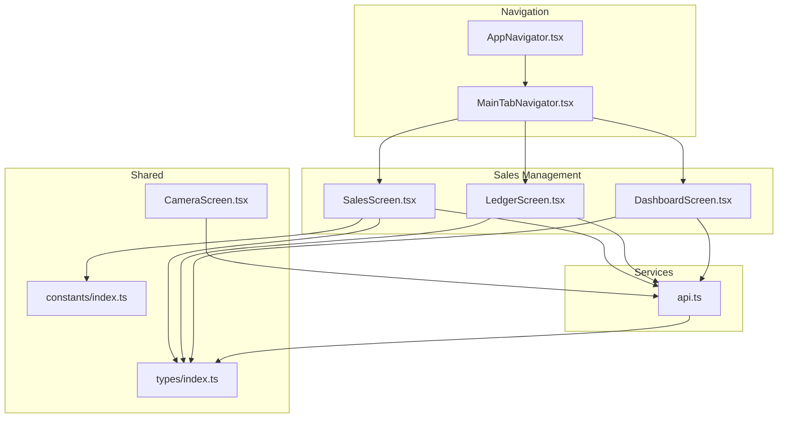

**Diagram sources**
- [AppNavigator.tsx](file://src/navigation/AppNavigator.tsx#L28-L59)
- [MainTabNavigator.tsx](file://src/navigation/MainTabNavigator.tsx#L315-L350)
- [SalesScreen.tsx](file://src/screens/sales/SalesScreen.tsx#L29-L580)
- [LedgerScreen.tsx](file://src/screens/ledger/LedgerScreen.tsx#L20-L183)
- [DashboardScreen.tsx](file://src/screens/dashboard/DashboardScreen.tsx#L45-L138)
- [api.ts](file://src/services/api.ts#L223-L289)
- [index.ts](file://src/types/index.ts#L294-L342)
- [index.ts](file://src/constants/index.ts#L6-L16)

**Section sources**
- [AppNavigator.tsx](file://src/navigation/AppNavigator.tsx#L28-L59)
- [MainTabNavigator.tsx](file://src/navigation/MainTabNavigator.tsx#L315-L350)
- [SalesScreen.tsx](file://src/screens/sales/SalesScreen.tsx#L29-L580)
- [LedgerScreen.tsx](file://src/screens/ledger/LedgerScreen.tsx#L20-L183)
- [DashboardScreen.tsx](file://src/screens/dashboard/DashboardScreen.tsx#L45-L138)
- [api.ts](file://src/services/api.ts#L223-L289)
- [index.ts](file://src/types/index.ts#L294-L342)
- [index.ts](file://src/constants/index.ts#L6-L16)

## Core Components
- Sales Screen: Handles customer selection, order creation, tax calculation, invoice generation, and sharing via PDF, WhatsApp, and email.
- Ledger Screen: Displays vendor financial ledger, balances, stock holdings, and recent transactions.
- Dashboard Screen: Provides financial summaries including total revenue, profit, and inventory overview.
- API Services: Encapsulate backend endpoints for sales, reports, and media uploads.
- Types and Constants: Define enums, interfaces, and styling for consistent UI and data handling.

**Section sources**
- [SalesScreen.tsx](file://src/screens/sales/SalesScreen.tsx#L29-L580)
- [LedgerScreen.tsx](file://src/screens/ledger/LedgerScreen.tsx#L20-L183)
- [DashboardScreen.tsx](file://src/screens/dashboard/DashboardScreen.tsx#L45-L138)
- [api.ts](file://src/services/api.ts#L223-L289)
- [index.ts](file://src/types/index.ts#L294-L342)
- [index.ts](file://src/constants/index.ts#L6-L16)

## Architecture Overview
The Sales & Financial Management feature follows a layered architecture:
- Presentation Layer: React Native screens and navigation components
- Domain Layer: Business logic for sales creation, totals calculation, and sharing
- Data Access Layer: API service module encapsulating HTTP requests
- Shared Layer: Types, constants, and reusable UI components

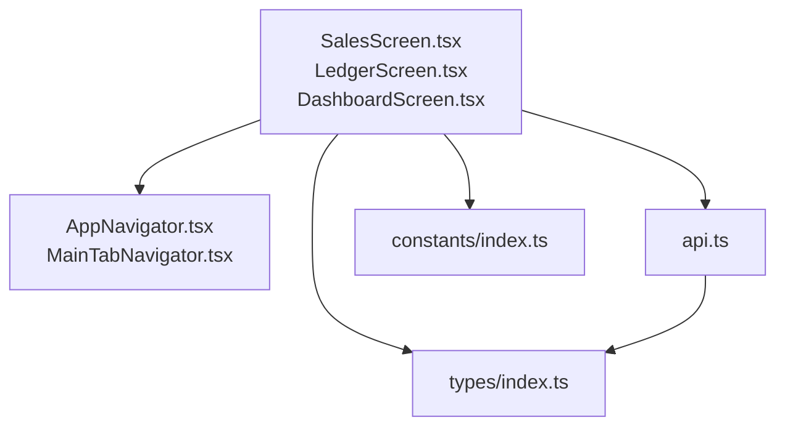

**Diagram sources**
- [SalesScreen.tsx](file://src/screens/sales/SalesScreen.tsx#L29-L580)
- [LedgerScreen.tsx](file://src/screens/ledger/LedgerScreen.tsx#L20-L183)
- [DashboardScreen.tsx](file://src/screens/dashboard/DashboardScreen.tsx#L45-L138)
- [AppNavigator.tsx](file://src/navigation/AppNavigator.tsx#L28-L59)
- [MainTabNavigator.tsx](file://src/navigation/MainTabNavigator.tsx#L315-L350)
- [api.ts](file://src/services/api.ts#L223-L289)
- [index.ts](file://src/types/index.ts#L294-L342)
- [index.ts](file://src/constants/index.ts#L6-L16)

## Detailed Component Analysis

### Sales Processing Workflow
The sales workflow encompasses customer management, order creation, invoice generation, and sharing mechanisms.

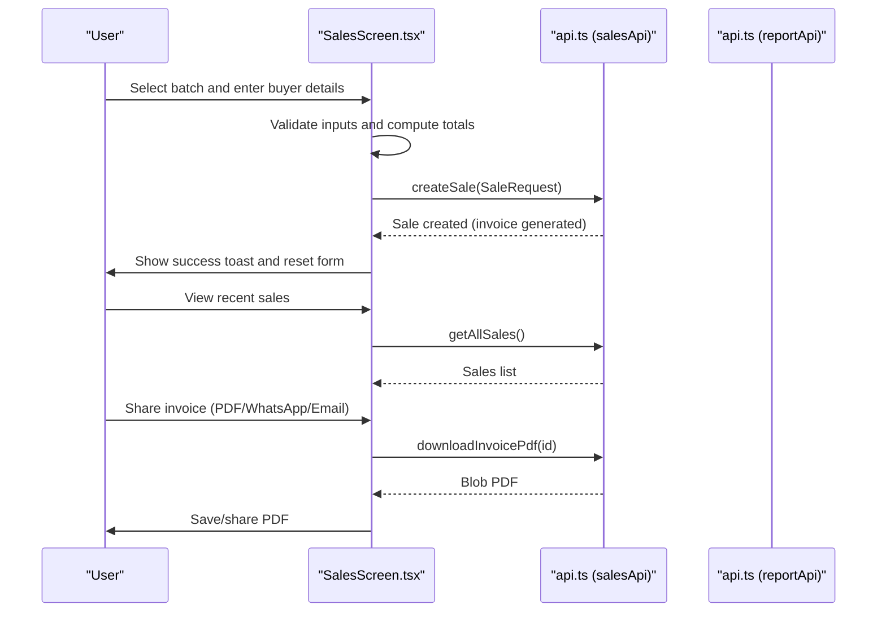

**Diagram sources**
- [SalesScreen.tsx](file://src/screens/sales/SalesScreen.tsx#L67-L127)
- [SalesScreen.tsx](file://src/screens/sales/SalesScreen.tsx#L207-L241)
- [SalesScreen.tsx](file://src/screens/sales/SalesScreen.tsx#L464-L575)
- [api.ts](file://src/services/api.ts#L223-L265)

Key implementation highlights:
- Form state management for buyer details, sale type, pricing, and taxes
- Real-time subtotal, tax, and grand total computation
- Invoice PDF download and sharing via email and WhatsApp
- Toast notifications for success/error feedback

**Section sources**
- [SalesScreen.tsx](file://src/screens/sales/SalesScreen.tsx#L29-L580)
- [api.ts](file://src/services/api.ts#L223-L265)

### Payment Tracking System
Payment tracking integrates with the sales domain model and supports updating payment status.

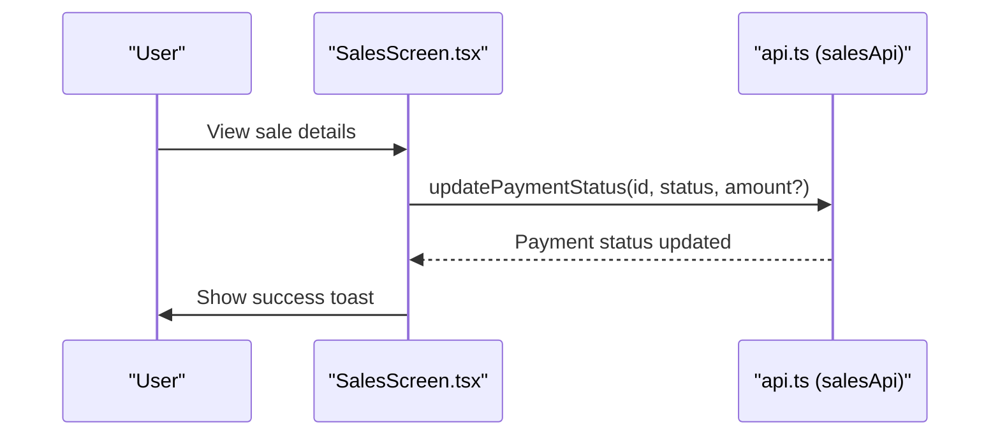

**Diagram sources**
- [SalesScreen.tsx](file://src/screens/sales/SalesScreen.tsx#L464-L575)
- [api.ts](file://src/services/api.ts#L240-L243)

Implementation details:
- Payment status enum supports pending, partial, and paid states
- Endpoint allows updating status with optional paid amount
- UI reflects payment status badges on sales cards

**Section sources**
- [index.ts](file://src/types/index.ts#L300-L304)
- [api.ts](file://src/services/api.ts#L240-L243)

### Revenue Recognition and Profit Margin Calculations
Revenue recognition and profitability analysis are supported through report APIs and dashboard statistics.

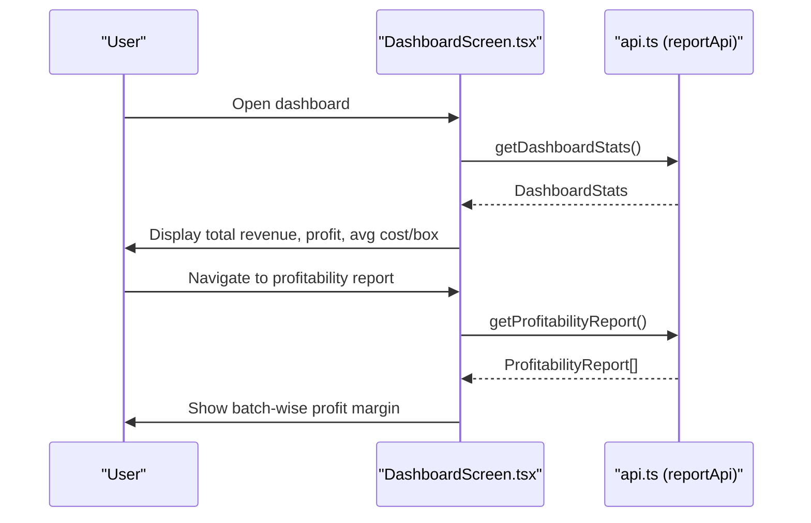

**Diagram sources**
- [DashboardScreen.tsx](file://src/screens/dashboard/DashboardScreen.tsx#L58-L138)
- [api.ts](file://src/services/api.ts#L267-L289)
- [index.ts](file://src/types/index.ts#L344-L395)

**Section sources**
- [DashboardScreen.tsx](file://src/screens/dashboard/DashboardScreen.tsx#L96-L138)
- [api.ts](file://src/services/api.ts#L267-L289)
- [index.ts](file://src/types/index.ts#L344-L395)

### Vendor Ledger Management
Vendor ledger management enables tracking balances, stock holdings, and transaction history.

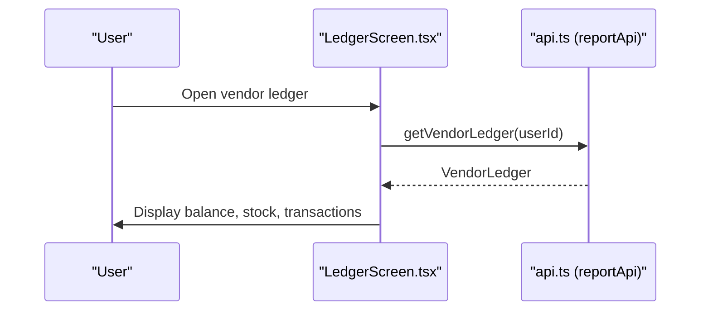

**Diagram sources**
- [LedgerScreen.tsx](file://src/screens/ledger/LedgerScreen.tsx#L23-L34)
- [api.ts](file://src/services/api.ts#L272-L273)

**Section sources**
- [LedgerScreen.tsx](file://src/screens/ledger/LedgerScreen.tsx#L20-L183)
- [api.ts](file://src/services/api.ts#L272-L273)
- [index.ts](file://src/types/index.ts#L359-L372)

### Financial Reporting and Profitability Analysis
Profitability analysis and daily activity reporting are exposed via dedicated endpoints.

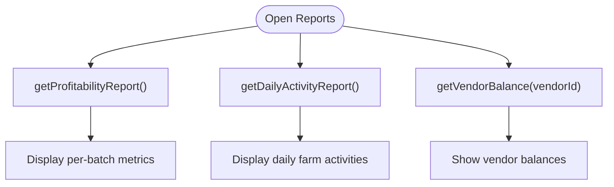

**Diagram sources**
- [api.ts](file://src/services/api.ts#L278-L289)

**Section sources**
- [api.ts](file://src/services/api.ts#L278-L289)
- [index.ts](file://src/types/index.ts#L382-L409)

### Integration with Inventory Management, Dispatch, and Batch Lifecycle
The sales feature integrates with batch lifecycle and dispatch systems to ensure inventory alignment and tracking.

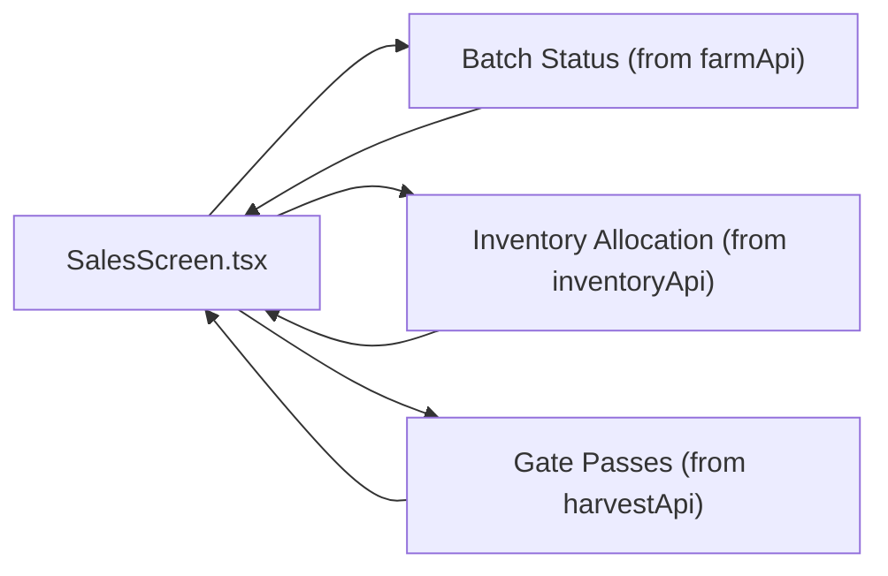

**Diagram sources**
- [SalesScreen.tsx](file://src/screens/sales/SalesScreen.tsx#L49-L65)
- [api.ts](file://src/services/api.ts#L120-L144)
- [api.ts](file://src/services/api.ts#L146-L167)
- [api.ts](file://src/services/api.ts#L169-L209)

**Section sources**
- [SalesScreen.tsx](file://src/screens/sales/SalesScreen.tsx#L49-L65)
- [api.ts](file://src/services/api.ts#L120-L144)
- [api.ts](file://src/services/api.ts#L146-L167)
- [api.ts](file://src/services/api.ts#L169-L209)

### Sales Analytics Dashboard, Revenue Forecasting, and Customer Purchase History
The dashboard aggregates key financial metrics, while customer purchase history can be derived from sales records.

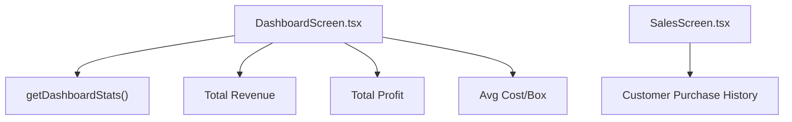

**Diagram sources**
- [DashboardScreen.tsx](file://src/screens/dashboard/DashboardScreen.tsx#L58-L138)
- [api.ts](file://src/services/api.ts#L269-L270)
- [SalesScreen.tsx](file://src/screens/sales/SalesScreen.tsx#L58-L65)

**Section sources**
- [DashboardScreen.tsx](file://src/screens/dashboard/DashboardScreen.tsx#L96-L138)
- [SalesScreen.tsx](file://src/screens/sales/SalesScreen.tsx#L58-L65)
- [api.ts](file://src/services/api.ts#L269-L270)

### Mobile-Specific Features: Barcode Scanning, Cash Payments, Offline Data Entry
Mobile capabilities include camera-based barcode scanning and offline data entry support.

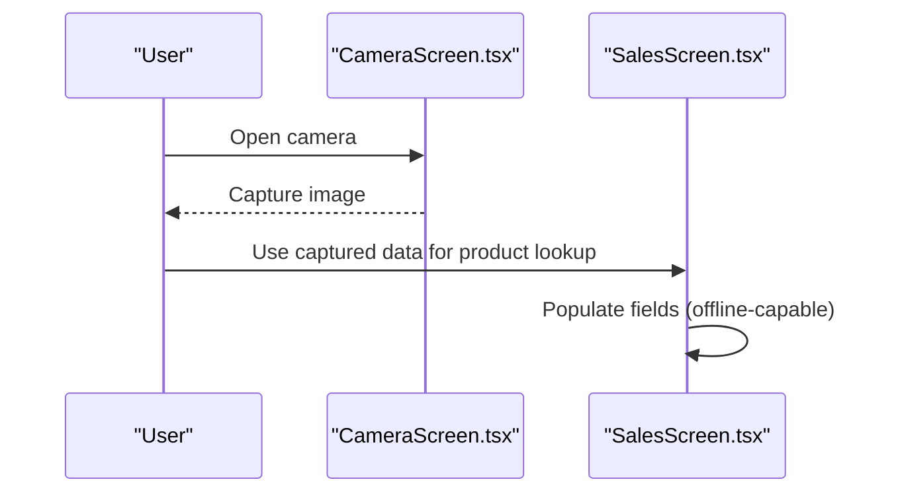

**Diagram sources**
- [CameraScreen.tsx](file://src/screens/common/CameraScreen.tsx#L13-L35)
- [SalesScreen.tsx](file://src/screens/sales/SalesScreen.tsx#L207-L241)

**Section sources**
- [CameraScreen.tsx](file://src/screens/common/CameraScreen.tsx#L13-L35)
- [SalesScreen.tsx](file://src/screens/sales/SalesScreen.tsx#L207-L241)

### Tax Calculation, Discount Management, and Sales Commission Tracking
Tax calculation and discount management are integrated into the sales form and totals computation.

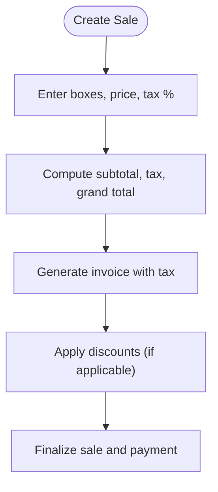

**Diagram sources**
- [SalesScreen.tsx](file://src/screens/sales/SalesScreen.tsx#L243-L256)
- [SalesScreen.tsx](file://src/screens/sales/SalesScreen.tsx#L394-L403)

Sales commission tracking can be modeled via vendor ledger entries and payment updates.

**Section sources**
- [SalesScreen.tsx](file://src/screens/sales/SalesScreen.tsx#L243-L256)
- [SalesScreen.tsx](file://src/screens/sales/SalesScreen.tsx#L394-L403)
- [api.ts](file://src/services/api.ts#L240-L243)

## Dependency Analysis
The Sales & Financial Management feature relies on shared types and constants, and integrates with multiple API endpoints.

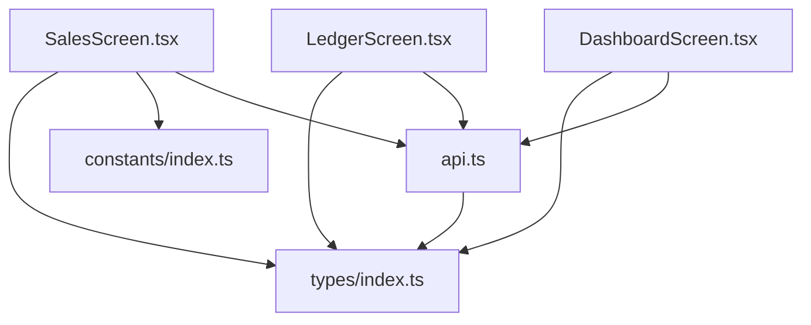

**Diagram sources**
- [SalesScreen.tsx](file://src/screens/sales/SalesScreen.tsx#L25-L26)
- [LedgerScreen.tsx](file://src/screens/ledger/LedgerScreen.tsx#L17-L18)
- [DashboardScreen.tsx](file://src/screens/dashboard/DashboardScreen.tsx#L18-L19)
- [api.ts](file://src/services/api.ts#L3-L4)
- [index.ts](file://src/types/index.ts#L294-L342)
- [index.ts](file://src/constants/index.ts#L6-L16)

**Section sources**
- [SalesScreen.tsx](file://src/screens/sales/SalesScreen.tsx#L25-L26)
- [LedgerScreen.tsx](file://src/screens/ledger/LedgerScreen.tsx#L17-L18)
- [DashboardScreen.tsx](file://src/screens/dashboard/DashboardScreen.tsx#L18-L19)
- [api.ts](file://src/services/api.ts#L3-L4)
- [index.ts](file://src/types/index.ts#L294-L342)
- [index.ts](file://src/constants/index.ts#L6-L16)

## Performance Considerations
- Use React Query for efficient caching and background refetching of sales and batches
- Debounce or throttle input fields for numeric values to avoid excessive re-computation
- Optimize PDF generation and sharing to minimize memory usage
- Leverage native filesystem access for offline invoice storage
- Implement pagination for large sales and ledger lists

## Troubleshooting Guide
Common issues and resolutions:
- Network errors: Verify API base URL and connectivity; handle unauthorized sessions with token refresh
- Toast notifications: Ensure proper error messages are surfaced from API responses
- PDF download failures: Confirm blob handling and file system permissions
- Payment status updates: Validate sale ID and status transitions

**Section sources**
- [index.ts](file://src/constants/index.ts#L339-L347)
- [api.ts](file://src/services/api.ts#L30-L65)
- [SalesScreen.tsx](file://src/screens/sales/SalesScreen.tsx#L87-L94)
- [SalesScreen.tsx](file://src/screens/sales/SalesScreen.tsx#L96-L127)

## Conclusion
The Sales & Financial Management feature provides a comprehensive solution for sales processing, invoice generation, payment tracking, vendor ledger management, and financial reporting. Its integration with inventory, dispatch, and batch lifecycle systems ensures end-to-end visibility and control. Mobile capabilities such as barcode scanning and offline data entry enhance usability in diverse environments. The modular architecture and shared types/constants facilitate maintainability and scalability.