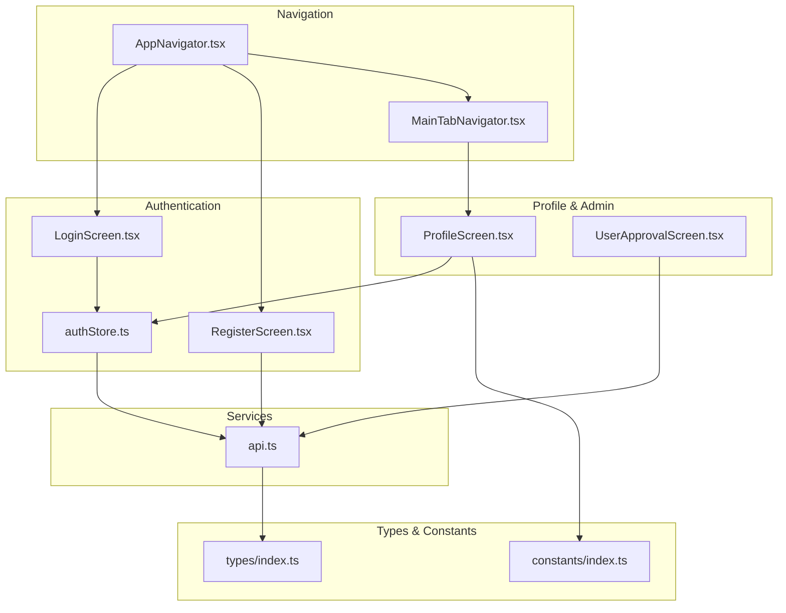
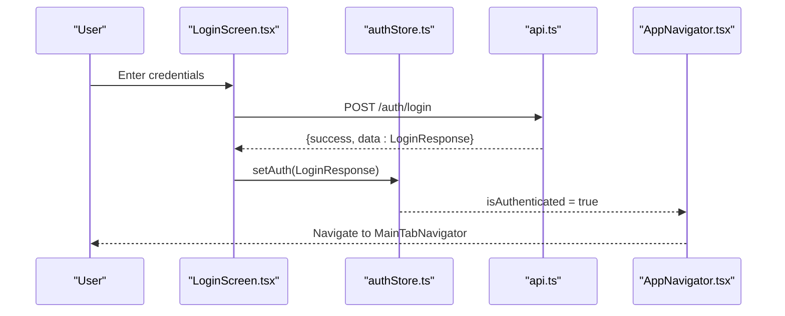
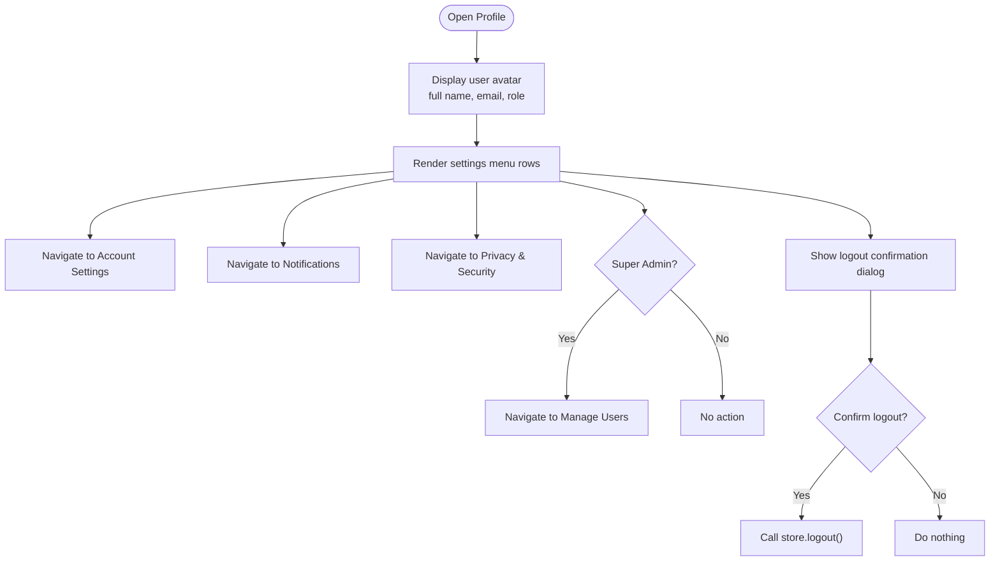
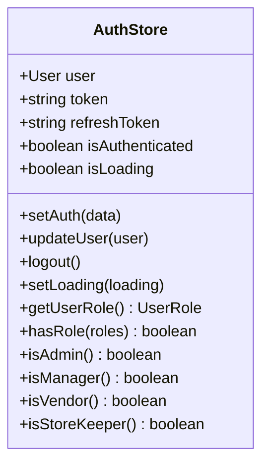
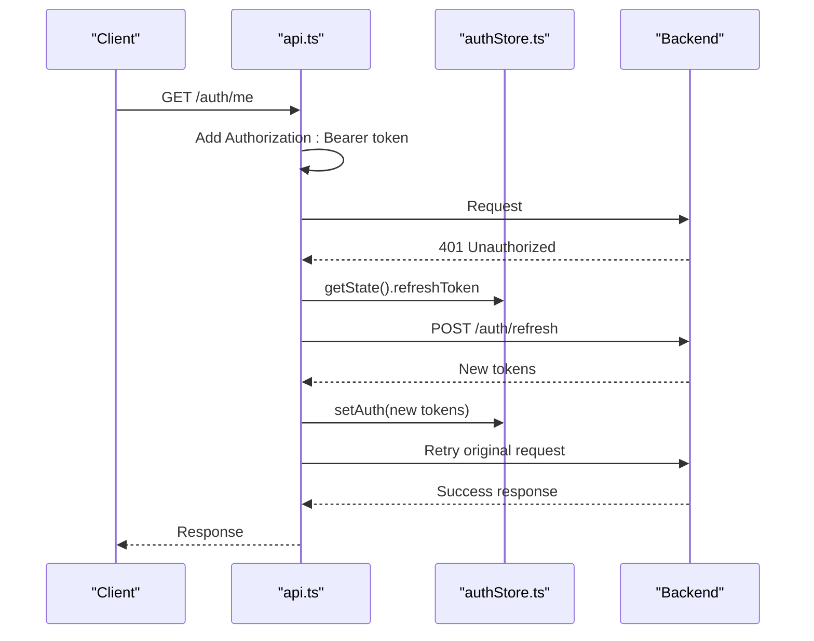
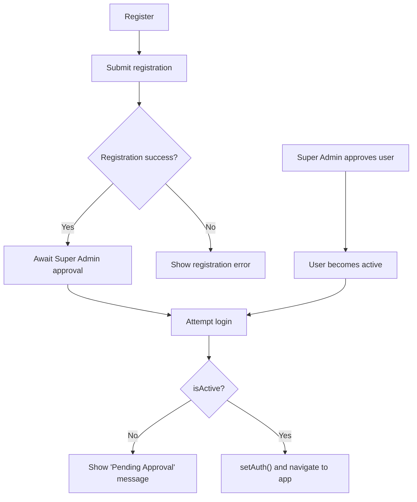
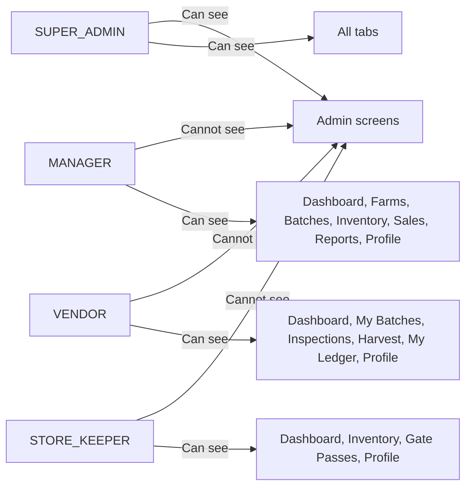
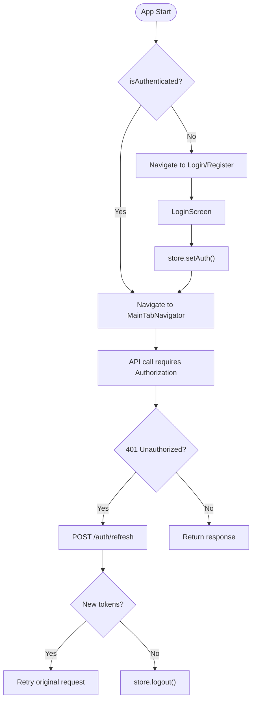
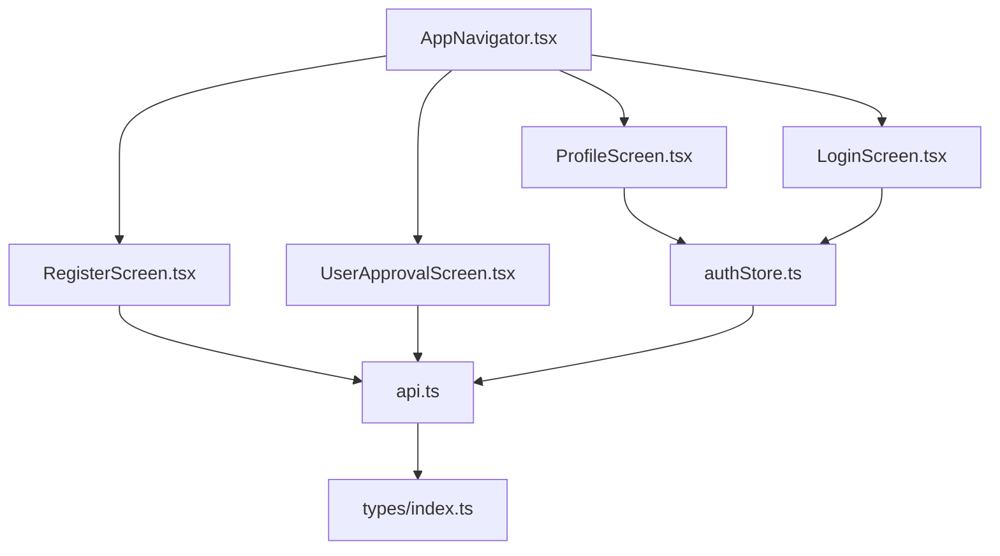

# User Profile & Settings

<cite>
**Referenced Files in This Document**
- [ProfileScreen.tsx](file://src/screens/profile/ProfileScreen.tsx)
- [UserApprovalScreen.tsx](file://src/screens/admin/UserApprovalScreen.tsx)
- [authStore.ts](file://src/store/authStore.ts)
- [api.ts](file://src/services/api.ts)
- [index.ts](file://src/types/index.ts)
- [AppNavigator.tsx](file://src/navigation/AppNavigator.tsx)
- [MainTabNavigator.tsx](file://src/navigation/MainTabNavigator.tsx)
- [LoginScreen.tsx](file://src/screens/auth/LoginScreen.tsx)
- [RegisterScreen.tsx](file://src/screens/auth/RegisterScreen.tsx)
- [index.ts](file://src/constants/index.ts)
</cite>

## Table of Contents
1. [Introduction](#introduction)
2. [Project Structure](#project-structure)
3. [Core Components](#core-components)
4. [Architecture Overview](#architecture-overview)
5. [Detailed Component Analysis](#detailed-component-analysis)
6. [Dependency Analysis](#dependency-analysis)
7. [Performance Considerations](#performance-considerations)
8. [Troubleshooting Guide](#troubleshooting-guide)
9. [Conclusion](#conclusion)

## Introduction
This document describes the User Profile & Settings feature for the frontend application. It covers user profile management, role-based permissions, user approval workflows, administrative user management, integration with the authentication system, session management, and security settings. It also outlines notification preferences, language settings, accessibility options, and mobile-specific features such as biometric authentication, push notifications, and offline profile data synchronization.

## Project Structure
The profile and settings functionality spans several modules:
- Authentication and session management via a centralized store
- API service layer for authentication and user-related operations
- Navigation routing for authenticated and unauthenticated states
- Profile screen UI and administrative screens for user management
- Type definitions for user roles and authentication payloads

**Diagram sources**
- [AppNavigator.tsx](file://src/navigation/AppNavigator.tsx#L28-L59)
- [MainTabNavigator.tsx](file://src/navigation/MainTabNavigator.tsx#L315-L350)
- [authStore.ts](file://src/store/authStore.ts#L29-L115)
- [api.ts](file://src/services/api.ts#L67-L89)
- [ProfileScreen.tsx](file://src/screens/profile/ProfileScreen.tsx#L17-L115)
- [UserApprovalScreen.tsx](file://src/screens/admin/UserApprovalScreen.tsx#L23-L146)
- [LoginScreen.tsx](file://src/screens/auth/LoginScreen.tsx#L38-L82)
- [RegisterScreen.tsx](file://src/screens/auth/RegisterScreen.tsx#L55-L88)
- [index.ts](file://src/types/index.ts#L1-L7)
- [index.ts](file://src/constants/index.ts#L1-L363)

**Section sources**
- [AppNavigator.tsx](file://src/navigation/AppNavigator.tsx#L28-L59)
- [MainTabNavigator.tsx](file://src/navigation/MainTabNavigator.tsx#L315-L350)
- [authStore.ts](file://src/store/authStore.ts#L29-L115)
- [api.ts](file://src/services/api.ts#L67-L89)
- [ProfileScreen.tsx](file://src/screens/profile/ProfileScreen.tsx#L17-L115)
- [UserApprovalScreen.tsx](file://src/screens/admin/UserApprovalScreen.tsx#L23-L146)
- [LoginScreen.tsx](file://src/screens/auth/LoginScreen.tsx#L38-L82)
- [RegisterScreen.tsx](file://src/screens/auth/RegisterScreen.tsx#L55-L88)
- [index.ts](file://src/types/index.ts#L1-L7)
- [index.ts](file://src/constants/index.ts#L1-L363)

## Core Components
- Profile Screen: Displays user identity, role, and quick access to settings categories (Account Settings, Notifications, Privacy & Security). Includes a logout action.
- Authentication Store: Centralized state for user, tokens, authentication status, and role checks.
- API Layer: Provides authentication endpoints and user management operations.
- User Approval Screen: Allows super admins to approve pending users.
- Navigation: Routes users between authentication and main application views, and exposes admin-only screens conditionally.

Key capabilities:
- Personal information display (name, email, role)
- Account settings navigation
- Notifications settings navigation
- Privacy and security settings navigation
- Role-based visibility of admin features
- Session lifecycle management (login, logout, token refresh)
- User registration and approval workflow

**Section sources**
- [ProfileScreen.tsx](file://src/screens/profile/ProfileScreen.tsx#L17-L115)
- [authStore.ts](file://src/store/authStore.ts#L29-L115)
- [api.ts](file://src/services/api.ts#L67-L89)
- [UserApprovalScreen.tsx](file://src/screens/admin/UserApprovalScreen.tsx#L23-L146)
- [AppNavigator.tsx](file://src/navigation/AppNavigator.tsx#L28-L59)

## Architecture Overview
The profile and settings feature integrates tightly with the authentication system and navigation stack. The store manages user state and tokens, while the API layer handles server communication. The navigation layer routes users based on authentication and role.

**Diagram sources**
- [LoginScreen.tsx](file://src/screens/auth/LoginScreen.tsx#L38-L82)
- [authStore.ts](file://src/store/authStore.ts#L29-L76)
- [api.ts](file://src/services/api.ts#L67-L89)
- [AppNavigator.tsx](file://src/navigation/AppNavigator.tsx#L28-L59)

## Detailed Component Analysis

### Profile Screen
The Profile Screen presents the user’s identity and provides quick access to settings and administrative actions for eligible roles.

- Identity display: Avatar placeholder, full name, email, and role badge
- Settings menu: Account Settings, Notifications, Privacy & Security
- Administrative access: Manage Users (visible to Super Admin)
- Logout action with confirmation

**Diagram sources**
- [ProfileScreen.tsx](file://src/screens/profile/ProfileScreen.tsx#L17-L115)
- [authStore.ts](file://src/store/authStore.ts#L64-L72)

**Section sources**
- [ProfileScreen.tsx](file://src/screens/profile/ProfileScreen.tsx#L17-L115)
- [authStore.ts](file://src/store/authStore.ts#L64-L72)

### Authentication Store
The store encapsulates:
- State: user, tokens, authentication status, loading state
- Actions: setAuth, updateUser, logout, setLoading
- Getters: getUserRole, hasRole, isAdmin, isManager, isVendor, isStoreKeeper

**Diagram sources**
- [authStore.ts](file://src/store/authStore.ts#L6-L27)

**Section sources**
- [authStore.ts](file://src/store/authStore.ts#L29-L115)

### API Layer
The API module centralizes HTTP interactions:
- Auth endpoints: login, register, refresh token, get current user, get all users, get users by role, approve user
- Interceptors: automatic Authorization header injection and token refresh on 401 errors
- Media upload endpoints: photo, multiple photos, video, inspection media, delete file

**Diagram sources**
- [api.ts](file://src/services/api.ts#L16-L65)
- [authStore.ts](file://src/store/authStore.ts#L40-L76)

**Section sources**
- [api.ts](file://src/services/api.ts#L67-L89)
- [api.ts](file://src/services/api.ts#L16-L65)
- [authStore.ts](file://src/store/authStore.ts#L40-L76)

### User Registration and Approval Workflow
- Registration: Users select a role and submit credentials; backend approves the account
- Login: On successful login, the app checks the user’s active status; inactive accounts are blocked
- Approval: Super Admins navigate to Manage Users and approve pending users

**Diagram sources**
- [RegisterScreen.tsx](file://src/screens/auth/RegisterScreen.tsx#L55-L88)
- [LoginScreen.tsx](file://src/screens/auth/LoginScreen.tsx#L38-L82)
- [UserApprovalScreen.tsx](file://src/screens/admin/UserApprovalScreen.tsx#L23-L146)
- [authStore.ts](file://src/store/authStore.ts#L40-L76)

**Section sources**
- [RegisterScreen.tsx](file://src/screens/auth/RegisterScreen.tsx#L55-L88)
- [LoginScreen.tsx](file://src/screens/auth/LoginScreen.tsx#L38-L82)
- [UserApprovalScreen.tsx](file://src/screens/admin/UserApprovalScreen.tsx#L23-L146)
- [authStore.ts](file://src/store/authStore.ts#L40-L76)

### Role-Based Permissions and Navigation
- Roles: SUPER_ADMIN, MANAGER, VENDOR, STORE_KEEPER
- Navigation visibility: Different tabs and admin screens are shown based on the user’s role
- Conditional rendering: Profile screen shows Manage Users only for Super Admins

**Diagram sources**
- [index.ts](file://src/types/index.ts#L2-L7)
- [MainTabNavigator.tsx](file://src/navigation/MainTabNavigator.tsx#L49-L60)
- [ProfileScreen.tsx](file://src/screens/profile/ProfileScreen.tsx#L91-L93)

**Section sources**
- [index.ts](file://src/types/index.ts#L2-L7)
- [MainTabNavigator.tsx](file://src/navigation/MainTabNavigator.tsx#L49-L60)
- [ProfileScreen.tsx](file://src/screens/profile/ProfileScreen.tsx#L91-L93)

### Notification Preferences, Language Settings, and Accessibility
- Notification Preferences: Accessible via the Notifications menu row in Profile
- Language Settings: Not implemented in the current codebase; would typically be part of Account Settings
- Accessibility Options: Not implemented in the current codebase; would typically be part of Account Settings

Note: The Profile screen currently contains placeholders for Account Settings, Notifications, and Privacy & Security. These are navigational stubs awaiting implementation.

**Section sources**
- [ProfileScreen.tsx](file://src/screens/profile/ProfileScreen.tsx#L81-L83)

### Session Management and Security Settings
- Session lifecycle: Login sets user and tokens; Logout clears state; Token refresh on 401 errors
- Security settings: Privacy & Security menu row exists as a navigational stub

**Diagram sources**
- [AppNavigator.tsx](file://src/navigation/AppNavigator.tsx#L28-L59)
- [LoginScreen.tsx](file://src/screens/auth/LoginScreen.tsx#L38-L82)
- [authStore.ts](file://src/store/authStore.ts#L40-L76)
- [api.ts](file://src/services/api.ts#L16-L65)

**Section sources**
- [AppNavigator.tsx](file://src/navigation/AppNavigator.tsx#L28-L59)
- [LoginScreen.tsx](file://src/screens/auth/LoginScreen.tsx#L38-L82)
- [authStore.ts](file://src/store/authStore.ts#L40-L76)
- [api.ts](file://src/services/api.ts#L16-L65)

### Mobile-Specific Features
- Biometric Authentication: Not implemented in the current codebase; would typically be integrated at the native layer and exposed via the authentication store
- Push Notifications: Not implemented in the current codebase; would typically be handled by native push providers and coordinated with the backend
- Offline Profile Data Synchronization: Not implemented in the current codebase; would require a local persistence layer and conflict resolution strategy

Note: These features are not present in the current codebase and are therefore not covered by specific file references.

## Dependency Analysis
- Profile Screen depends on the authentication store for user data and logout
- Authentication Store persists tokens and user data using AsyncStorage
- API Layer depends on the store for tokens and performs token refresh automatically
- Navigation routes depend on authentication and role checks to decide which screens are accessible

**Diagram sources**
- [ProfileScreen.tsx](file://src/screens/profile/ProfileScreen.tsx#L17-L115)
- [authStore.ts](file://src/store/authStore.ts#L29-L115)
- [api.ts](file://src/services/api.ts#L67-L89)
- [index.ts](file://src/types/index.ts#L1-L7)
- [AppNavigator.tsx](file://src/navigation/AppNavigator.tsx#L28-L59)

**Section sources**
- [ProfileScreen.tsx](file://src/screens/profile/ProfileScreen.tsx#L17-L115)
- [authStore.ts](file://src/store/authStore.ts#L29-L115)
- [api.ts](file://src/services/api.ts#L67-L89)
- [index.ts](file://src/types/index.ts#L1-L7)
- [AppNavigator.tsx](file://src/navigation/AppNavigator.tsx#L28-L59)

## Performance Considerations
- Token refresh occurs only on 401 responses to minimize unnecessary network calls
- Persisted state reduces redundant re-authentication across sessions
- Role-based navigation prevents unnecessary rendering of inaccessible screens

## Troubleshooting Guide
- Login fails with “Account Pending Approval”: The backend returned a valid token but the user is inactive; the app blocks login and prompts the user to wait for approval
- Session expired: The response interceptor automatically attempts token refresh; if refresh fails, the user is logged out and redirected to the login screen
- Network errors: The constants module defines generic error messages for network, server, unauthorized, forbidden, not found, validation, and unknown errors

Common scenarios and remedies:
- If a user cannot log in after registration, ensure the Super Admin has approved the account
- If the app shows “Session expired,” allow the automatic refresh to complete; if it fails, log in again
- If navigation appears incorrect, verify the user’s role and ensure the appropriate screens are mapped

**Section sources**
- [LoginScreen.tsx](file://src/screens/auth/LoginScreen.tsx#L48-L58)
- [api.ts](file://src/services/api.ts#L35-L65)
- [index.ts](file://src/constants/index.ts#L339-L347)

## Conclusion
The User Profile & Settings feature is built around a robust authentication store, a clean API layer, and role-aware navigation. While the Profile screen currently provides navigational stubs for Account Settings, Notifications, and Privacy & Security, the underlying infrastructure supports extending these areas. The user approval workflow and administrative management are implemented for Super Admins. Additional features such as language settings, accessibility options, biometric authentication, push notifications, and offline synchronization are not present in the current codebase and would require further development aligned with the existing architecture.