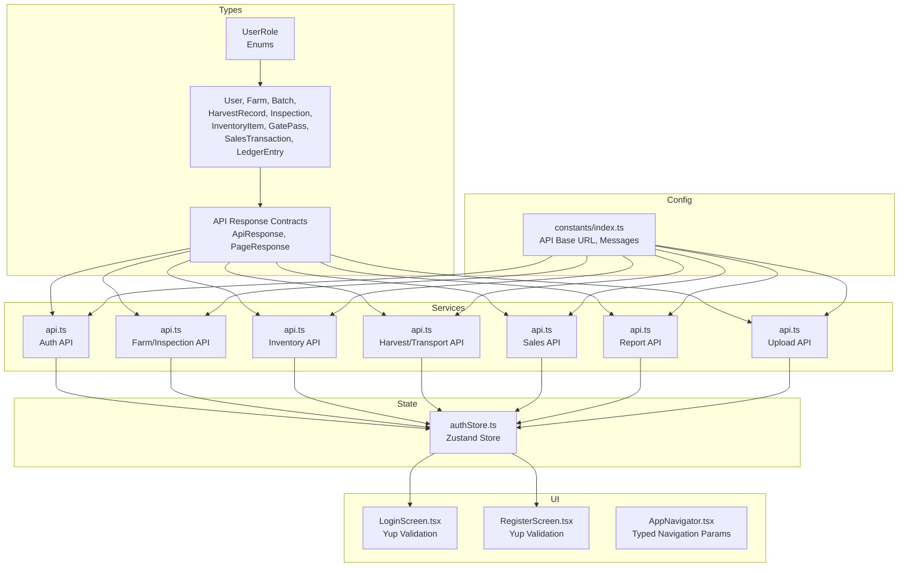
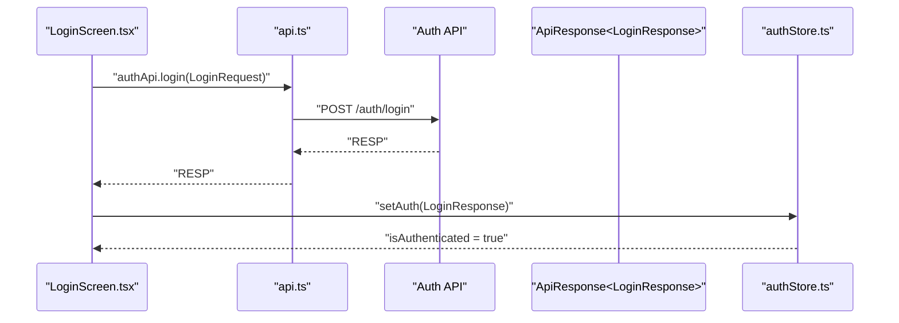
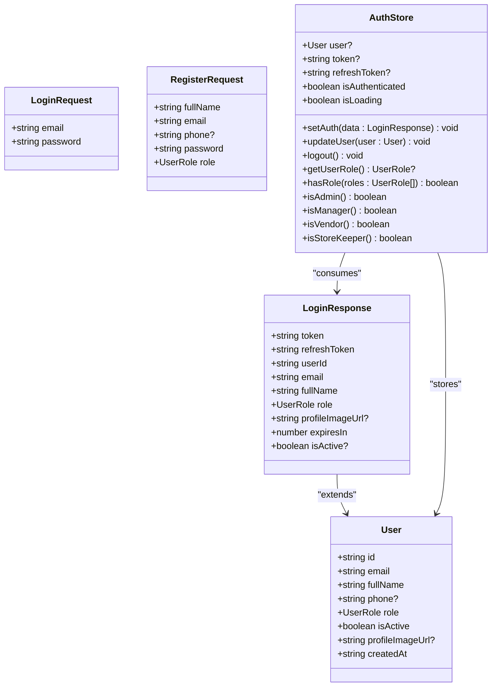
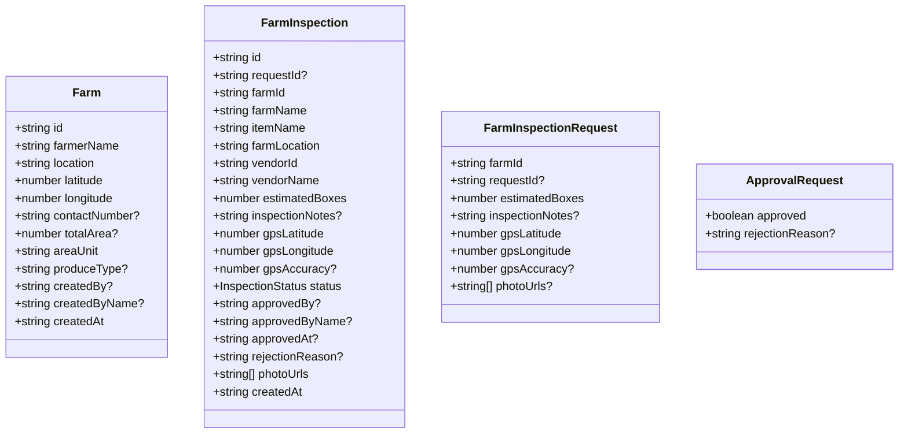
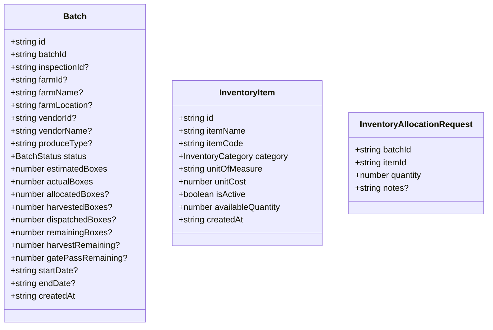
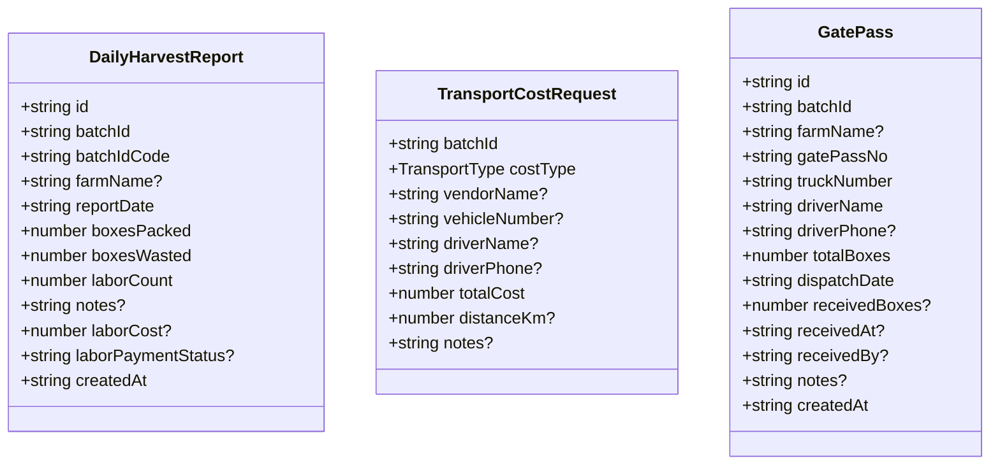
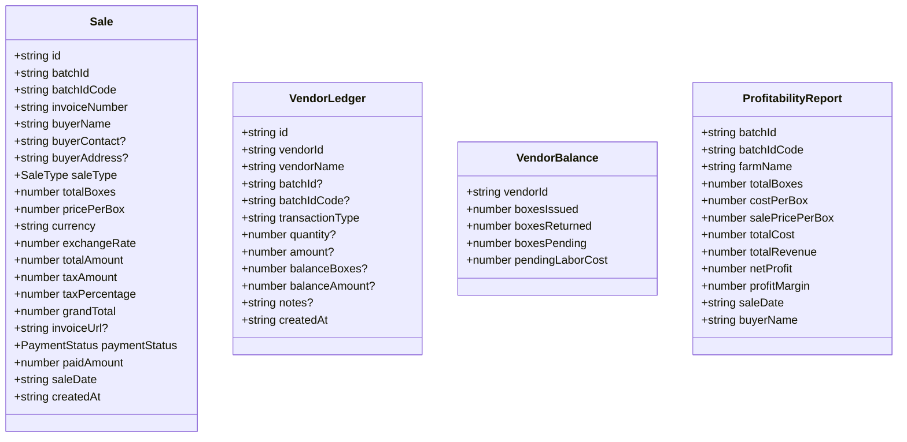
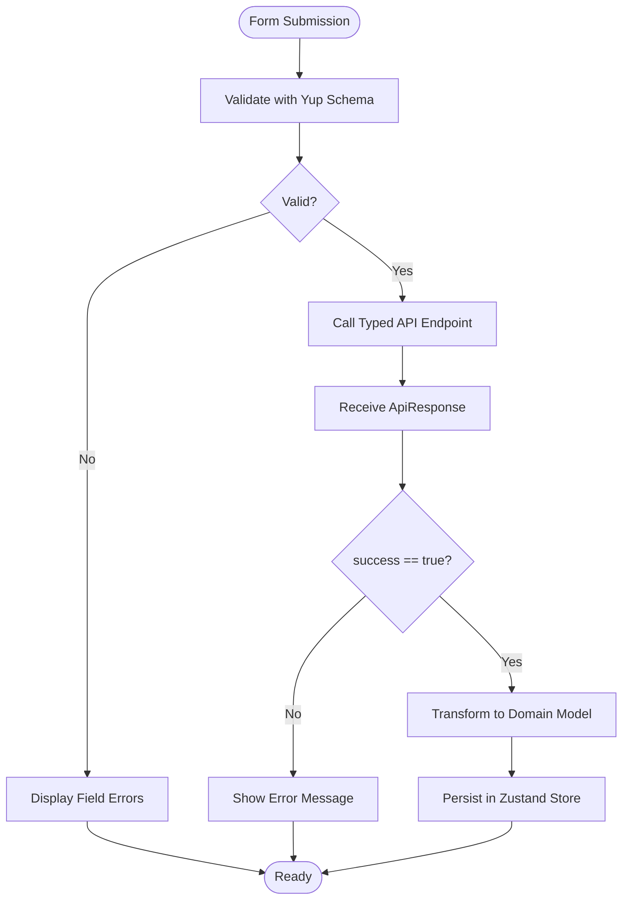
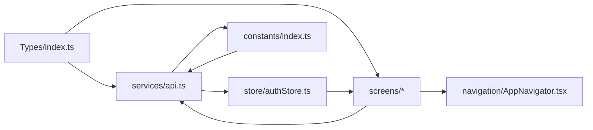

# Data Models & Types

<cite>
**Referenced Files in This Document**
- [index.ts](file://src/types/index.ts)
- [api.ts](file://src/services/api.ts)
- [authStore.ts](file://src/store/authStore.ts)
- [index.ts](file://src/constants/index.ts)
- [LoginScreen.tsx](file://src/screens/auth/LoginScreen.tsx)
- [RegisterScreen.tsx](file://src/screens/auth/RegisterScreen.tsx)
- [AppNavigator.tsx](file://src/navigation/AppNavigator.tsx)
- [package.json](file://package.json)
</cite>

## Table of Contents
1. [Introduction](#introduction)
2. [Project Structure](#project-structure)
3. [Core Components](#core-components)
4. [Architecture Overview](#architecture-overview)
5. [Detailed Component Analysis](#detailed-component-analysis)
6. [Dependency Analysis](#dependency-analysis)
7. [Performance Considerations](#performance-considerations)
8. [Troubleshooting Guide](#troubleshooting-guide)
9. [Conclusion](#conclusion)
10. [Appendices](#appendices)

## Introduction
This document provides comprehensive data model documentation for the Banana Harvest App’s TypeScript interfaces and business entities. It covers core domain models (User, Role, Farm, Batch, HarvestRecord, Inspection, InventoryItem, GatePass, SalesTransaction, LedgerEntry), enum definitions for roles, statuses, and business classifications, and the API response structures, request payload formats, and error response schemas. It also explains TypeScript type safety patterns used across the application, including generic types for API responses and form data, and documents data validation rules using Yup schemas, API endpoint response contracts, and data transformation patterns. Finally, it addresses data consistency requirements, nullable field handling, and type guards used for runtime type checking.

## Project Structure
The frontend is organized around a clear separation of concerns:
- Types and enums define the canonical data models and contracts.
- Services encapsulate API client logic and typed endpoints.
- Stores manage application state with type-safe actions.
- Screens implement UI with Formik/Yup for validation and display.
- Constants centralize configuration and messages.



**Diagram sources**
- [index.ts](file://src/types/index.ts#L1-L429)
- [api.ts](file://src/services/api.ts#L1-L326)
- [authStore.ts](file://src/store/authStore.ts#L1-L116)
- [index.ts](file://src/constants/index.ts#L1-L363)
- [LoginScreen.tsx](file://src/screens/auth/LoginScreen.tsx#L1-L259)
- [RegisterScreen.tsx](file://src/screens/auth/RegisterScreen.tsx#L1-L357)
- [AppNavigator.tsx](file://src/navigation/AppNavigator.tsx#L1-L60)

**Section sources**
- [index.ts](file://src/types/index.ts#L1-L429)
- [api.ts](file://src/services/api.ts#L1-L326)
- [authStore.ts](file://src/store/authStore.ts#L1-L116)
- [index.ts](file://src/constants/index.ts#L1-L363)
- [LoginScreen.tsx](file://src/screens/auth/LoginScreen.tsx#L1-L259)
- [RegisterScreen.tsx](file://src/screens/auth/RegisterScreen.tsx#L1-L357)
- [AppNavigator.tsx](file://src/navigation/AppNavigator.tsx#L1-L60)

## Core Components
This section defines the core data models, enums, and API response contracts used throughout the application.

- User
  - Fields: id (string), email (string), fullName (string), phone? (string), role (UserRole), isActive (boolean), profileImageUrl? (string), createdAt (string)
  - Notes: role is an enum; phone and profileImageUrl are optional; createdAt is ISO timestamp string
  - Related: LoginRequest, RegisterRequest, LoginResponse, UserApprovalScreen

- Role (UserRole)
  - Values: SUPER_ADMIN, MANAGER, VENDOR, STORE_KEEPER
  - Usage: User.role, navigation items, permissions

- Farm
  - Fields: id (string), farmerName (string), location (string), latitude (number), longitude (number), contactNumber? (string), totalArea? (number), areaUnit (string), produceType? (string), createdBy? (string), createdByName? (string), createdAt (string)
  - Notes: Optional fields include contactNumber, totalArea, produceType, createdBy, createdByName; createdAt is ISO timestamp string

- Batch
  - Fields: id (string), batchId (string), inspectionId? (string), farmId? (string), farmName? (string), farmLocation? (string), vendorId? (string), vendorName? (string), produceType? (string), status (BatchStatus), estimatedBoxes (number), actualBoxes (number), allocatedBoxes? (number), harvestedBoxes? (number), dispatchedBoxes? (number), remainingBoxes? (number), harvestRemaining? (number), gatePassRemaining? (number), startDate? (string), endDate? (string), createdAt (string)
  - Notes: Status is an enum; several numeric fields are integers; optional fields indicate derived or computed values; createdAt is ISO timestamp string

- Inspection
  - Fields: id (string), requestId? (string), farmId (string), farmName (string), itemName (string), farmLocation (string), vendorId (string), vendorName (string), estimatedBoxes (number), inspectionNotes? (string), gpsLatitude (number), gpsLongitude (number), gpsAccuracy? (number), status (InspectionStatus), approvedBy? (string), approvedByName? (string), approvedAt? (string), rejectionReason? (string), photoUrls (string[]), createdAt (string)
  - Notes: Status is an enum; photoUrls is an array of URLs; optional fields include notes, approvals, and GPS accuracy; createdAt is ISO timestamp string

- InventoryItem
  - Fields: id (string), itemName (string), itemCode (string), category (InventoryCategory), unitOfMeasure (string), unitCost (number), isActive (boolean), availableQuantity (number), createdAt (string)
  - Notes: Category is an enum; unitCost and availableQuantity are numbers; createdAt is ISO timestamp string

- GatePass
  - Fields: id (string), batchId (string), farmName? (string), gatePassNo (string), truckNumber (string), driverName (string), driverPhone? (string), totalBoxes (number), dispatchDate (string), receivedBoxes? (number), receivedAt? (string), receivedBy? (string), notes? (string), createdAt (string)
  - Notes: Optional fields include driverPhone, receivedBoxes, receivedAt, receivedBy, notes; dispatchDate and createdAt are ISO timestamp strings

- SalesTransaction
  - Fields: id (string), batchId (string), batchIdCode (string), invoiceNumber (string), buyerName (string), buyerContact? (string), buyerAddress? (string), saleType (SaleType), totalBoxes (number), pricePerBox (number), currency (string), exchangeRate (number), totalAmount (number), taxAmount (number), taxPercentage (number), grandTotal (number), invoiceUrl? (string), paymentStatus (PaymentStatus), paidAmount (number), saleDate (string), createdAt (string)
  - Notes: saleType and paymentStatus are enums; saleDate and createdAt are ISO timestamp strings

- LedgerEntry
  - Fields: id (string), vendorId (string), vendorName (string), batchId? (string), batchIdCode? (string), transactionType (string), quantity? (number), amount? (number), balanceBoxes? (number), balanceAmount? (number), notes? (string), createdAt (string)
  - Notes: Optional numeric fields represent balances and quantities; createdAt is ISO timestamp string

- Enums
  - UserRole: SUPER_ADMIN, MANAGER, VENDOR, STORE_KEEPER
  - InspectionStatus: PENDING, APPROVED, REJECTED, ASSIGNED, REQUESTED, IN_PROGRESS
  - BatchStatus: CREATED, HARVEST_IN_PROGRESS, HARVEST_COMPLETED, DISPATCH_IN_PROGRESS, DISPATCH_COMPLETED, IN_TRANSIT, DELIVERED, CANCELLED
  - InventoryCategory: BOX, LINER, CORNER, TAPE, OTHER
  - SaleType: DOMESTIC, EXPORT
  - PaymentStatus: PENDING, PARTIAL, PAID
  - TransportType: OUTWARD, INWARD

- API Response Contracts
  - ApiResponse<T>: success (boolean), message? (string), data (T), timestamp (string), errorCode? (string)
  - PageResponse<T>: content (T[]), pageNumber (number), pageSize (number), totalElements (number), totalPages (number), last (boolean), first (boolean)

Validation and Transformation Patterns
- Form validation via Yup schemas in LoginScreen and RegisterScreen
- Type-safe API endpoints using Axios generics with ApiResponse<T>
- Authentication token injection and refresh flow with typed responses
- Zustand store with strongly-typed actions and getters

**Section sources**
- [index.ts](file://src/types/index.ts#L1-L429)
- [api.ts](file://src/services/api.ts#L1-L326)
- [authStore.ts](file://src/store/authStore.ts#L1-L116)
- [LoginScreen.tsx](file://src/screens/auth/LoginScreen.tsx#L1-L259)
- [RegisterScreen.tsx](file://src/screens/auth/RegisterScreen.tsx#L1-L357)

## Architecture Overview
The application follows a layered architecture:
- Presentation Layer: Screens and navigators with typed parameters
- Domain Layer: Strongly typed models and enums
- Service Layer: Axios-based API client with interceptors and typed endpoints
- State Layer: Zustand store for authentication state and getters
- Configuration Layer: Constants for API base URL, messages, and UI tokens



**Diagram sources**
- [LoginScreen.tsx](file://src/screens/auth/LoginScreen.tsx#L43-L82)
- [api.ts](file://src/services/api.ts#L68-L89)
- [authStore.ts](file://src/store/authStore.ts#L40-L76)

**Section sources**
- [AppNavigator.tsx](file://src/navigation/AppNavigator.tsx#L1-L60)
- [api.ts](file://src/services/api.ts#L1-L326)
- [authStore.ts](file://src/store/authStore.ts#L1-L116)
- [index.ts](file://src/constants/index.ts#L6-L7)

## Detailed Component Analysis

### User Model and Authentication Flow
- User interface defines the canonical user entity with role and timestamps.
- LoginRequest and RegisterRequest define payload shapes for authentication endpoints.
- LoginResponse extends the User shape with JWT tokens and expiration metadata.
- authStore manages token lifecycle and exposes typed getters for role checks.



**Diagram sources**
- [index.ts](file://src/types/index.ts#L9-L18)
- [index.ts](file://src/types/index.ts#L36-L59)
- [index.ts](file://src/types/index.ts#L41-L47)
- [authStore.ts](file://src/store/authStore.ts#L6-L27)
- [authStore.ts](file://src/store/authStore.ts#L29-L115)

**Section sources**
- [index.ts](file://src/types/index.ts#L9-L18)
- [index.ts](file://src/types/index.ts#L36-L59)
- [index.ts](file://src/types/index.ts#L41-L47)
- [authStore.ts](file://src/store/authStore.ts#L1-L116)

### Farm and Inspection Models
- Farm captures geographic and administrative details with optional fields for flexibility.
- FarmInspection ties inspection requests to farms and vendors, capturing GPS and media assets.
- FarmInspectionRequest defines the payload for creating inspection requests.
- ApprovalRequest governs approval/rejection decisions with optional rejection reasons.



**Diagram sources**
- [index.ts](file://src/types/index.ts#L66-L79)
- [index.ts](file://src/types/index.ts#L103-L124)
- [index.ts](file://src/types/index.ts#L126-L135)
- [index.ts](file://src/types/index.ts#L137-L140)

**Section sources**
- [index.ts](file://src/types/index.ts#L66-L79)
- [index.ts](file://src/types/index.ts#L103-L124)
- [index.ts](file://src/types/index.ts#L126-L135)
- [index.ts](file://src/types/index.ts#L137-L140)

### Batch Lifecycle and Inventory Models
- Batch tracks status transitions and box counts across stages.
- InventoryItem defines stockable items with categories and costs.
- InventoryAllocationRequest governs allocation of inventory to batches.



**Diagram sources**
- [index.ts](file://src/types/index.ts#L154-L176)
- [index.ts](file://src/types/index.ts#L187-L197)
- [index.ts](file://src/types/index.ts#L199-L204)

**Section sources**
- [index.ts](file://src/types/index.ts#L154-L176)
- [index.ts](file://src/types/index.ts#L187-L197)
- [index.ts](file://src/types/index.ts#L199-L204)

### Harvest, Transport, and Gate Pass Models
- DailyHarvestReport captures daily production metrics.
- TransportCostRequest supports adding transport costs for batches.
- GatePass manages outbound logistics with receipt tracking.



**Diagram sources**
- [index.ts](file://src/types/index.ts#L207-L220)
- [index.ts](file://src/types/index.ts#L237-L247)
- [index.ts](file://src/types/index.ts#L249-L264)

**Section sources**
- [index.ts](file://src/types/index.ts#L207-L220)
- [index.ts](file://src/types/index.ts#L237-L247)
- [index.ts](file://src/types/index.ts#L249-L264)

### Sales and Reporting Models
- Sale defines invoice and payment metadata with tax calculations.
- VendorLedger and VendorBalance support vendor financial tracking.
- ProfitabilityReport and related stats enable profitability insights.



**Diagram sources**
- [index.ts](file://src/types/index.ts#L306-L328)
- [index.ts](file://src/types/index.ts#L359-L372)
- [index.ts](file://src/types/index.ts#L374-L380)
- [index.ts](file://src/types/index.ts#L382-L395)

**Section sources**
- [index.ts](file://src/types/index.ts#L306-L328)
- [index.ts](file://src/types/index.ts#L359-L372)
- [index.ts](file://src/types/index.ts#L374-L380)
- [index.ts](file://src/types/index.ts#L382-L395)

### API Response Contracts and Typed Endpoints
- ApiResponse<T> standardizes server responses with success flags, messages, data payloads, timestamps, and optional error codes.
- PageResponse<T> standardizes paginated lists with pagination metadata.
- api.ts exports typed endpoints for auth, farm/inspection, inventory, harvest/transport, sales, reports, and uploads.

```mermaid
classDiagram
class ApiResponse~T~ {
+boolean success
+string message?
+T data
+string timestamp
+string errorCode?
}
class PageResponse~T~ {
+T[] content
+number pageNumber
+number pageSize
+number totalElements
+number totalPages
+boolean last
+boolean first
}
class AuthAPI {
+login(LoginRequest) ApiResponse<LoginResponse>
+register(RegisterRequest) ApiResponse<any>
+refreshToken(RefreshTokenRequest) ApiResponse<LoginResponse>
+getCurrentUser() ApiResponse<any>
+getAllUsers() ApiResponse<any[]>
+getUsersByRole(role : string) ApiResponse<any[]>
+approveUser(userId : string) ApiResponse<void>
}
class FarmAPI {
+createFarm(FarmRequest) ApiResponse<any>
+getAllFarms() ApiResponse<any[]>
+getFarmById(id : string) ApiResponse<any>
+createInspection(...) ApiResponse<any>
+getPendingInspections() ApiResponse<any[]>
+getMyInspections() ApiResponse<any[]>
+getAllInspections() ApiResponse<any[]>
+approveInspection(id, data) ApiResponse<any>
+getInspectionById(id) ApiResponse<any>
+getAllBatches() ApiResponse<any[]>
+getBatchById(id) ApiResponse<any>
+updateBatchStatus(id, status) ApiResponse<any>
+createInspectionRequest(...) ApiResponse<any>
+getMyInspectionRequests(status?) ApiResponse<any[]>
+getAllInspectionRequests(status?) ApiResponse<any[]>
+cancelInspectionRequest(id) ApiResponse<any>
}
class InventoryAPI {
+getAllItems() ApiResponse<any[]>
+getItemById(id : string) ApiResponse<any>
+createItem(...) ApiResponse<any>
+addStock(id : string, quantity : number) ApiResponse<void>
+getAvailableStock(id : string) ApiResponse<number>
+allocateInventory(data) ApiResponse<void>
}
class HarvestAPI {
+createDailyReport(...) ApiResponse<any>
+getBatchReports(batchId : string) ApiResponse<any[]>
+getTodayReports() ApiResponse<any[]>
+getReportsByDate(date : string) ApiResponse<any[]>
+addTransportCost(...) ApiResponse<void>
+createGatePass(...) ApiResponse<any>
+receiveGatePass(id : string, receivedBoxes : number) ApiResponse<any>
+getBatchGatePasses(batchId : string) ApiResponse<any[]>
+getPendingGatePasses() ApiResponse<any[]>
+getTodayGatePasses() ApiResponse<any[]>
+getGatePassesByDate(date : string) ApiResponse<any[]>
}
class SalesAPI {
+createSale(SaleRequest) ApiResponse<any>
+getAllSales() ApiResponse<any[]>
+getSaleById(id : string) ApiResponse<any>
+getSaleByInvoiceNumber(invoiceNumber : string) ApiResponse<any>
+getBatchSales(batchId : string) ApiResponse<any[]>
+updatePaymentStatus(id : string, status : string, amount?) ApiResponse<void>
+downloadInvoicePdf(id : string) Blob
+shareInvoiceViaWhatsApp(id : string, phoneNumber : string) ApiResponse<void>
+shareInvoiceViaEmail(id : string, email : string) ApiResponse<void>
+getWhatsAppShareLink(id : string, phoneNumber : string) ApiResponse<string>
}
class ReportAPI {
+getDashboardStats() ApiResponse<any>
+getVendorLedger(vendorId : string) ApiResponse<any>
+getVendorBalance(vendorId : string) ApiResponse<any>
+getProfitabilityReport() ApiResponse<any[]>
+getDailyActivityReport() ApiResponse<any>
+getMyLedger() ApiResponse<any[]>
+getMyBalance() ApiResponse<any>
}
class UploadAPI {
+uploadPhoto(file : FormData, inspectionId?) ApiResponse<string>
+uploadMultiplePhotos(files : FormData, inspectionId?) ApiResponse<string[]>
+uploadVideo(file : FormData, inspectionId?) ApiResponse<string>
+uploadInspectionMedia(photos : FormData, video : FormData) ApiResponse<{photoUrls : string[], videoUrl : string}>
+deleteFile(fileUrl : string) ApiResponse<void>
}
ApiResponse <.. AuthAPI
ApiResponse <.. FarmAPI
ApiResponse <.. InventoryAPI
ApiResponse <.. HarvestAPI
ApiResponse <.. SalesAPI
ApiResponse <.. ReportAPI
ApiResponse <.. UploadAPI
```

**Diagram sources**
- [index.ts](file://src/types/index.ts#L411-L428)
- [api.ts](file://src/services/api.ts#L67-L323)

**Section sources**
- [index.ts](file://src/types/index.ts#L411-L428)
- [api.ts](file://src/services/api.ts#L67-L323)

### Form Validation and Type Guards
- LoginScreen.tsx defines a Yup schema for LoginRequest with email and password validations.
- RegisterScreen.tsx defines a Yup schema for RegisterRequest with name, email, phone, password, confirm password, and role validations.
- Type guards and runtime checks:
  - ApiResponse<T> ensures consistent response shape.
  - Optional fields are handled with conditional rendering and defensive checks (e.g., isActive flag).
  - Enum values are validated against known sets (e.g., role selection).



**Diagram sources**
- [LoginScreen.tsx](file://src/screens/auth/LoginScreen.tsx#L29-L36)
- [RegisterScreen.tsx](file://src/screens/auth/RegisterScreen.tsx#L34-L53)
- [api.ts](file://src/services/api.ts#L67-L89)
- [authStore.ts](file://src/store/authStore.ts#L40-L76)

**Section sources**
- [LoginScreen.tsx](file://src/screens/auth/LoginScreen.tsx#L29-L36)
- [RegisterScreen.tsx](file://src/screens/auth/RegisterScreen.tsx#L34-L53)
- [api.ts](file://src/services/api.ts#L67-L89)
- [authStore.ts](file://src/store/authStore.ts#L40-L76)

## Dependency Analysis
- Types depend on enums and interfaces; services depend on types and constants; screens depend on services and types; stores depend on types and services.
- The API client depends on constants for base URL and timeout; interceptors depend on the auth store for token management.
- Navigation parameters are strongly typed via RootStackParamList.



**Diagram sources**
- [index.ts](file://src/types/index.ts#L1-L429)
- [api.ts](file://src/services/api.ts#L1-L326)
- [authStore.ts](file://src/store/authStore.ts#L1-L116)
- [index.ts](file://src/constants/index.ts#L1-L363)
- [AppNavigator.tsx](file://src/navigation/AppNavigator.tsx#L1-L60)

**Section sources**
- [index.ts](file://src/types/index.ts#L1-L429)
- [api.ts](file://src/services/api.ts#L1-L326)
- [authStore.ts](file://src/store/authStore.ts#L1-L116)
- [index.ts](file://src/constants/index.ts#L1-L363)
- [AppNavigator.tsx](file://src/navigation/AppNavigator.tsx#L1-L60)

## Performance Considerations
- Prefer optional fields and nullable types to minimize unnecessary allocations and simplify UI rendering.
- Use ApiResponse<T> and PageResponse<T> to avoid ad-hoc response parsing and reduce runtime overhead.
- Cache frequently accessed data (e.g., user roles, navigation items) in Zustand to avoid recomputation.
- Keep enums small and stable to maintain efficient runtime comparisons.

## Troubleshooting Guide
Common issues and resolutions:
- Network errors: Check API_BASE_URL and API_TIMEOUT in constants; ensure the backend is reachable.
- Authentication failures: Verify token presence and refresh flow; inspect error responses for errorCode and message.
- Validation errors: Confirm Yup schemas align with backend expectations; display user-friendly messages from ERROR_MESSAGES.
- Type mismatches: Ensure all API endpoints use ApiResponse<T> generics consistently; verify enum values are within allowed sets.

**Section sources**
- [index.ts](file://src/constants/index.ts#L6-L7)
- [index.ts](file://src/constants/index.ts#L339-L347)
- [api.ts](file://src/services/api.ts#L29-L65)

## Conclusion
The Banana Harvest App employs a robust, type-safe architecture centered on clearly defined data models, enums, and API response contracts. Strong typing, Yup validation, and a centralized store ensure predictable behavior and maintainable code. The documented models and patterns provide a solid foundation for extending functionality while preserving data consistency and user experience.

## Appendices

### API Endpoint Reference
- Auth
  - POST /auth/login → ApiResponse<LoginResponse>
  - POST /auth/register → ApiResponse<any>
  - POST /auth/refresh → ApiResponse<LoginResponse>
  - GET /auth/me → ApiResponse<any>
  - GET /auth/users → ApiResponse<any[]>
  - GET /auth/users/role/{role} → ApiResponse<any[]>
  - POST /auth/approve/{userId} → ApiResponse<void>
- Farm/Inspection
  - POST /farms → ApiResponse<any>
  - GET /farms → ApiResponse<any[]>
  - GET /farms/{id} → ApiResponse<any>
  - POST /inspections → ApiResponse<any>
  - GET /inspections/pending → ApiResponse<any[]>
  - GET /inspections/my → ApiResponse<any[]>
  - GET /inspections → ApiResponse<any[]>
  - POST /inspections/{id}/approve → ApiResponse<any>
  - GET /inspections/{id} → ApiResponse<any>
  - GET /batches → ApiResponse<any[]>
  - GET /batches/{id} → ApiResponse<any>
  - PATCH /batches/{id}/status → ApiResponse<any>
  - POST /inspections/requests → ApiResponse<any>
  - GET /inspections/requests/my → ApiResponse<any[]>
  - GET /inspections/requests → ApiResponse<any[]>
  - PATCH /inspections/requests/{id}/cancel → ApiResponse<any>
- Inventory
  - GET /inventory/items → ApiResponse<any[]>
  - GET /inventory/items/{id} → ApiResponse<any>
  - POST /inventory/items → ApiResponse<any>
  - POST /inventory/items/{id}/stock → ApiResponse<void>
  - GET /inventory/items/{id}/stock → ApiResponse<number>
  - POST /inventory/allocate → ApiResponse<void>
- Harvest/Transport
  - POST /harvest/daily → ApiResponse<any>
  - GET /harvest/batch/{batchId} → ApiResponse<any[]>
  - GET /harvest/today → ApiResponse<any[]>
  - GET /harvest/reports → ApiResponse<any[]>
  - POST /transport → ApiResponse<void>
  - POST /gate-passes → ApiResponse<any>
  - POST /gate-passes/{id}/receive → ApiResponse<any>
  - GET /gate-passes/batch/{batchId} → ApiResponse<any[]>
  - GET /gate-passes/pending → ApiResponse<any[]>
  - GET /gate-passes/today → ApiResponse<any[]>
  - GET /gate-passes/reports → ApiResponse<any[]>
- Sales
  - POST /sales → ApiResponse<any>
  - GET /sales → ApiResponse<any[]>
  - GET /sales/{id} → ApiResponse<any>
  - GET /sales/invoice/{invoiceNumber} → ApiResponse<any>
  - GET /sales/batch/{batchId} → ApiResponse<any[]>
  - PUT /sales/{id}/payment → ApiResponse<void>
  - GET /sales/{id}/invoice/pdf → Blob
  - POST /sales/{id}/invoice/share/whatsapp → ApiResponse<void>
  - POST /sales/{id}/invoice/share/email → ApiResponse<void>
  - GET /sales/{id}/invoice/share/whatsapp-link → ApiResponse<string>
- Reports
  - GET /reports/dashboard → ApiResponse<any>
  - GET /reports/vendor-ledger/{vendorId} → ApiResponse<any>
  - GET /reports/vendor-balance/{vendorId} → ApiResponse<any>
  - GET /reports/profitability → ApiResponse<any[]>
  - GET /reports/daily-activity → ApiResponse<any>
  - GET /reports/my-ledger → ApiResponse<any[]>
  - GET /reports/my-balance → ApiResponse<any>
- Upload
  - POST /upload/photo → ApiResponse<string>
  - POST /upload/photos → ApiResponse<string[]>
  - POST /upload/video → ApiResponse<string>
  - POST /upload/inspection-media → ApiResponse<{photoUrls: string[], videoUrl: string}>
  - DELETE /upload/file → ApiResponse<void>

**Section sources**
- [api.ts](file://src/services/api.ts#L67-L323)

### Validation Rules Summary
- LoginRequest: email (valid email), password (min 6 chars)
- RegisterRequest: fullName (min 2 chars), email (valid), phone (10 digits optional), password (min 6 chars), confirmPassword (must match), role (one of selectable roles)
- Optional fields: phone, profileImageUrl, contactNumber, totalArea, produceType, createdBy, createdByName, inspectionNotes, gpsAccuracy, approvedBy, approvedByName, approvedAt, rejectionReason, photoUrls, driverPhone, receivedBoxes, receivedAt, receivedBy, notes, invoiceUrl, laborCost, laborPaymentStatus, vendorName, vehicleNumber, driverPhone, driverName, distanceKm, notes, buyerContact, buyerAddress, currency, exchangeRate, taxPercentage, saleDate, calculatedAt

**Section sources**
- [LoginScreen.tsx](file://src/screens/auth/LoginScreen.tsx#L29-L36)
- [RegisterScreen.tsx](file://src/screens/auth/RegisterScreen.tsx#L34-L53)