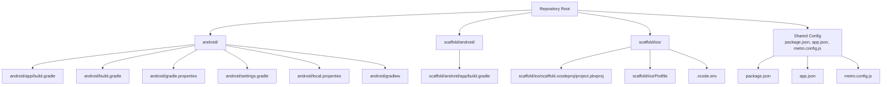
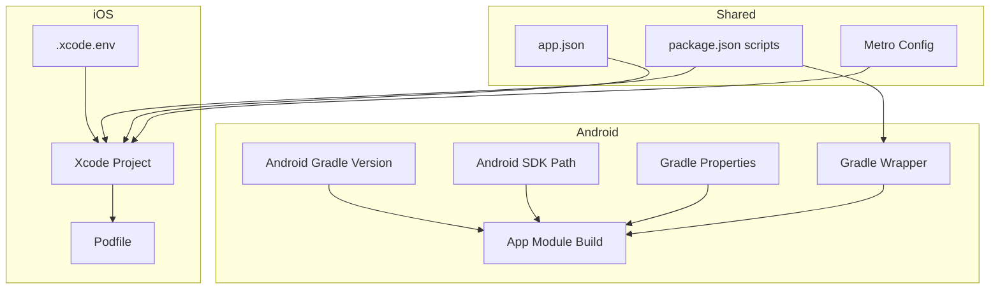
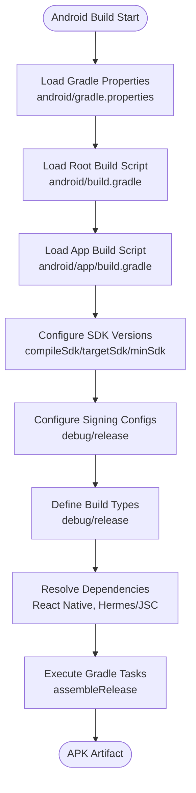
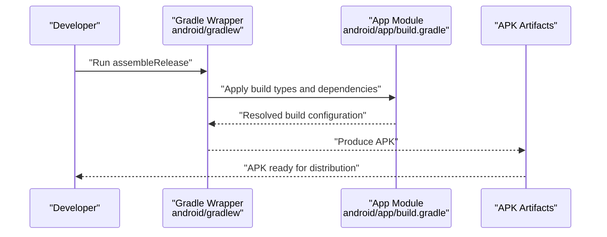
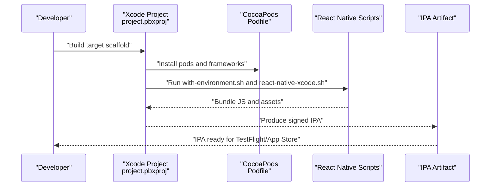
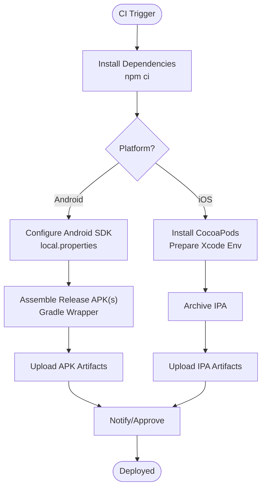
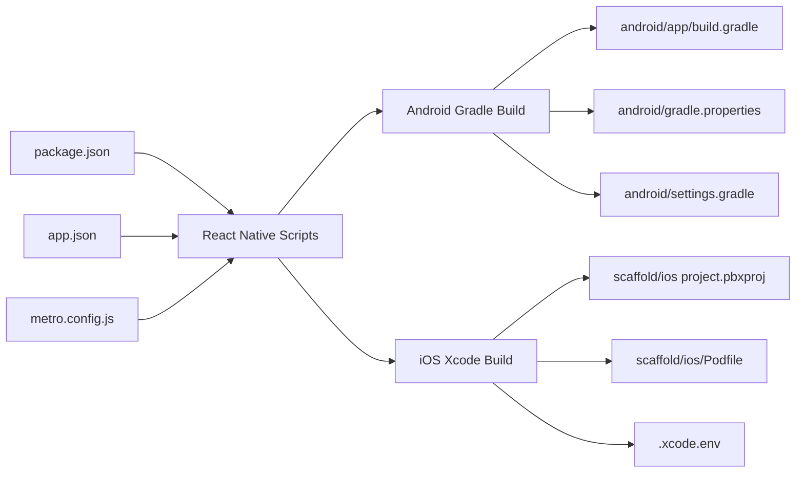

# Deployment & Build

<cite>
**Referenced Files in This Document**
- [android/app/build.gradle](file://android/app/build.gradle)
- [android/build.gradle](file://android/build.gradle)
- [android/gradle.properties](file://android/gradle.properties)
- [android/settings.gradle](file://android/settings.gradle)
- [android/local.properties](file://android/local.properties)
- [android/gradlew](file://android/gradlew)
- [scaffold/android/app/build.gradle](file://scaffold/android/app/build.gradle)
- [scaffold/ios/scaffold.xcodeproj/project.pbxproj](file://scaffold/ios/scaffold.xcodeproj/project.pbxproj)
- [scaffold/ios/Podfile](file://scaffold/ios/Podfile)
- [scaffold/ios/.xcode.env](file://scaffold/ios/.xcode.env)
- [package.json](file://package.json)
- [app.json](file://app.json)
- [metro.config.js](file://metro.config.js)
</cite>

## Table of Contents
1. [Introduction](#introduction)
2. [Project Structure](#project-structure)
3. [Core Components](#core-components)
4. [Architecture Overview](#architecture-overview)
5. [Detailed Component Analysis](#detailed-component-analysis)
6. [Dependency Analysis](#dependency-analysis)
7. [Performance Considerations](#performance-considerations)
8. [Troubleshooting Guide](#troubleshooting-guide)
9. [Conclusion](#conclusion)
10. [Appendices](#appendices)

## Introduction
This document provides comprehensive deployment and build instructions for the Banana Harvest App across Android and iOS. It covers Android Gradle configuration, signing key management, APK generation, and Play Store deployment; iOS Xcode project configuration, provisioning profiles, App Store submission, and TestFlight distribution; CI/CD pipeline setup for automated builds and deployments; version management strategies; and build optimization techniques. Platform-specific considerations such as permissions, background processing, and platform APIs are addressed alongside troubleshooting guidance for common build and deployment failures.

## Project Structure
The repository follows a React Native monorepo-like layout with platform-specific directories for Android and iOS, and a shared root for shared application configuration and scripts.

**Diagram sources**
- [android/app/build.gradle](file://android/app/build.gradle#L1-L120)
- [android/build.gradle](file://android/build.gradle#L1-L32)
- [android/gradle.properties](file://android/gradle.properties#L1-L49)
- [android/settings.gradle](file://android/settings.gradle#L1-L5)
- [android/local.properties](file://android/local.properties#L1-L2)
- [android/gradlew](file://android/gradlew#L1-L250)
- [scaffold/android/app/build.gradle](file://scaffold/android/app/build.gradle#L1-L120)
- [scaffold/ios/scaffold.xcodeproj/project.pbxproj](file://scaffold/ios/scaffold.xcodeproj/project.pbxproj#L1-L685)
- [scaffold/ios/Podfile](file://scaffold/ios/Podfile#L1-L56)
- [scaffold/ios/.xcode.env](file://scaffold/ios/.xcode.env#L1-L12)
- [package.json](file://package.json#L1-L74)
- [app.json](file://app.json#L1-L4)
- [metro.config.js](file://metro.config.js#L1-L12)

**Section sources**
- [android/app/build.gradle](file://android/app/build.gradle#L1-L120)
- [android/build.gradle](file://android/build.gradle#L1-L32)
- [android/gradle.properties](file://android/gradle.properties#L1-L49)
- [android/settings.gradle](file://android/settings.gradle#L1-L5)
- [android/local.properties](file://android/local.properties#L1-L2)
- [android/gradlew](file://android/gradlew#L1-L250)
- [scaffold/android/app/build.gradle](file://scaffold/android/app/build.gradle#L1-L120)
- [scaffold/ios/scaffold.xcodeproj/project.pbxproj](file://scaffold/ios/scaffold.xcodeproj/project.pbxproj#L1-L685)
- [scaffold/ios/Podfile](file://scaffold/ios/Podfile#L1-L56)
- [scaffold/ios/.xcode.env](file://scaffold/ios/.xcode.env#L1-L12)
- [package.json](file://package.json#L1-L74)
- [app.json](file://app.json#L1-L4)
- [metro.config.js](file://metro.config.js#L1-L12)

## Core Components
- Android Gradle configuration defines SDK versions, build types, signing, and dependencies.
- iOS Xcode project integrates React Native build phases and CocoaPods.
- Shared configuration includes package metadata, display name, and Metro bundler defaults.
- Scripts orchestrate development and build tasks via npm/yarn.

Key build and configuration files:
- Android app build: [android/app/build.gradle](file://android/app/build.gradle#L1-L120), [scaffold/android/app/build.gradle](file://scaffold/android/app/build.gradle#L1-L120)
- Android root build: [android/build.gradle](file://android/build.gradle#L1-L32)
- Android properties: [android/gradle.properties](file://android/gradle.properties#L1-L49)
- Android settings: [android/settings.gradle](file://android/settings.gradle#L1-L5)
- Android local SDK path: [android/local.properties](file://android/local.properties#L1-L2)
- Android wrapper: [android/gradlew](file://android/gradlew#L1-L250)
- iOS project: [scaffold/ios/scaffold.xcodeproj/project.pbxproj](file://scaffold/ios/scaffold.xcodeproj/project.pbxproj#L1-L685)
- iOS Podfile: [scaffold/ios/Podfile](file://scaffold/ios/Podfile#L1-L56)
- iOS env for Xcode: [scaffold/ios/.xcode.env](file://scaffold/ios/.xcode.env#L1-L12)
- Shared package config: [package.json](file://package.json#L1-L74)
- App metadata: [app.json](file://app.json#L1-L4)
- Metro config: [metro.config.js](file://metro.config.js#L1-L12)

**Section sources**
- [android/app/build.gradle](file://android/app/build.gradle#L72-L105)
- [android/build.gradle](file://android/build.gradle#L2-L9)
- [android/gradle.properties](file://android/gradle.properties#L23-L49)
- [android/settings.gradle](file://android/settings.gradle#L1-L5)
- [android/local.properties](file://android/local.properties#L1-L2)
- [android/gradlew](file://android/gradlew#L1-L250)
- [scaffold/android/app/build.gradle](file://scaffold/android/app/build.gradle#L72-L105)
- [scaffold/ios/scaffold.xcodeproj/project.pbxproj](file://scaffold/ios/scaffold.xcodeproj/project.pbxproj#L251-L283)
- [scaffold/ios/Podfile](file://scaffold/ios/Podfile#L8-L45)
- [scaffold/ios/.xcode.env](file://scaffold/ios/.xcode.env#L1-L12)
- [package.json](file://package.json#L6-L13)
- [app.json](file://app.json#L1-L4)
- [metro.config.js](file://metro.config.js#L1-L12)

## Architecture Overview
The build pipeline for each platform is orchestrated by platform-specific build tools and React Native scripts.

**Diagram sources**
- [android/build.gradle](file://android/build.gradle#L1-L32)
- [android/local.properties](file://android/local.properties#L1-L2)
- [android/gradle.properties](file://android/gradle.properties#L1-L49)
- [android/app/build.gradle](file://android/app/build.gradle#L1-L120)
- [android/gradlew](file://android/gradlew#L1-L250)
- [scaffold/ios/scaffold.xcodeproj/project.pbxproj](file://scaffold/ios/scaffold.xcodeproj/project.pbxproj#L1-L685)
- [scaffold/ios/Podfile](file://scaffold/ios/Podfile#L1-L56)
- [scaffold/ios/.xcode.env](file://scaffold/ios/.xcode.env#L1-L12)
- [package.json](file://package.json#L6-L13)
- [app.json](file://app.json#L1-L4)
- [metro.config.js](file://metro.config.js#L1-L12)

## Detailed Component Analysis

### Android Build Process
- SDK and toolchain versions are centralized in the root Gradle build file.
- The app module configures namespace, application ID, min/target SDK, version code/name, and signing.
- Build types define debug and release behavior, including optional minification and ProGuard rules.
- Dependencies include React Native runtime and platform-specific engines (Hermes or JSC).
- Gradle wrapper and properties enable parallel builds, memory tuning, and architecture selection.

**Diagram sources**
- [android/gradle.properties](file://android/gradle.properties#L1-L49)
- [android/build.gradle](file://android/build.gradle#L1-L32)
- [android/app/build.gradle](file://android/app/build.gradle#L72-L117)
- [android/gradlew](file://android/gradlew#L1-L250)

**Section sources**
- [android/build.gradle](file://android/build.gradle#L2-L9)
- [android/app/build.gradle](file://android/app/build.gradle#L72-L105)
- [android/app/build.gradle](file://android/app/build.gradle#L107-L117)
- [android/gradle.properties](file://android/gradle.properties#L23-L49)
- [android/settings.gradle](file://android/settings.gradle#L1-L5)
- [android/local.properties](file://android/local.properties#L1-L2)
- [android/gradlew](file://android/gradlew#L1-L250)

#### Signing Key Management
- The app module defines a debug signing config pointing to a debug keystore.
- Production builds currently reuse the debug signing config; for production, replace with a dedicated release keystore and secure credentials.

Recommended actions:
- Generate a release keystore and configure a release signing config.
- Store keystore and passwords in secure CI/CD secrets.
- Reference the release signing config in the release build type.

**Section sources**
- [android/app/build.gradle](file://android/app/build.gradle#L85-L104)
- [scaffold/android/app/build.gradle](file://scaffold/android/app/build.gradle#L85-L104)

#### APK Generation
- Use the Gradle wrapper to assemble the release APK.
- The wrapper script bootstraps Gradle and executes tasks defined in the app module.

**Diagram sources**
- [android/gradlew](file://android/gradlew#L1-L250)
- [android/app/build.gradle](file://android/app/build.gradle#L93-L104)

**Section sources**
- [android/gradlew](file://android/gradlew#L1-L250)
- [android/app/build.gradle](file://android/app/build.gradle#L93-L104)

#### Play Store Deployment
- Prepare a signed release APK as described above.
- Use the Google Play Console to upload and manage releases.
- Recommended steps:
  - Create internal/test tracks for pre-release testing.
  - Promote to production after QA approval.
  - Maintain version code increments and release notes.

Note: This section provides general guidance. Ensure compliance with Google Play policies and store-specific requirements.

### iOS Build Process
- Xcode project integrates React Native build phases and CocoaPods.
- The Podfile configures native modules and Flipper behavior based on environment.
- Xcode environment variables ensure the correct Node binary is used during build phases.

**Diagram sources**
- [scaffold/ios/scaffold.xcodeproj/project.pbxproj](file://scaffold/ios/scaffold.xcodeproj/project.pbxproj#L251-L283)
- [scaffold/ios/Podfile](file://scaffold/ios/Podfile#L8-L45)
- [scaffold/ios/.xcode.env](file://scaffold/ios/.xcode.env#L1-L12)

**Section sources**
- [scaffold/ios/scaffold.xcodeproj/project.pbxproj](file://scaffold/ios/scaffold.xcodeproj/project.pbxproj#L251-L283)
- [scaffold/ios/Podfile](file://scaffold/ios/Podfile#L8-L45)
- [scaffold/ios/.xcode.env](file://scaffold/ios/.xcode.env#L1-L12)

#### Provisioning Profiles and Certificates
- Configure Apple certificates and provisioning profiles in Xcode build settings.
- Ensure the correct team and signing identity are selected for release builds.
- Use automatic signing or manual profiles depending on your workflow.

#### TestFlight Distribution
- Archive the app in Xcode and upload to App Store Connect.
- Create a TestFlight group and invite testers.
- Monitor feedback and iterate using new builds.

#### App Store Submission
- Validate app metadata, screenshots, and privacy policy.
- Submit for review and monitor status in App Store Connect.

### CI/CD Pipeline Setup
Recommended CI/CD stages:
- Install dependencies and prepare environment.
- Android:
  - Restore Gradle cache.
  - Assemble release APK(s) for targeted architectures.
  - Upload artifacts for release.
- iOS:
  - Install CocoaPods dependencies.
  - Build and archive the app.
  - Export IPA for distribution/testing.
- Post-build:
  - Publish artifacts to internal channels or external stores.
  - Trigger notifications and approvals as needed.

**Diagram sources**
- [android/local.properties](file://android/local.properties#L1-L2)
- [android/gradlew](file://android/gradlew#L1-L250)
- [scaffold/ios/.xcode.env](file://scaffold/ios/.xcode.env#L1-L12)
- [scaffold/ios/Podfile](file://scaffold/ios/Podfile#L8-L45)

**Section sources**
- [android/local.properties](file://android/local.properties#L1-L2)
- [android/gradlew](file://android/gradlew#L1-L250)
- [scaffold/ios/.xcode.env](file://scaffold/ios/.xcode.env#L1-L12)
- [scaffold/ios/Podfile](file://scaffold/ios/Podfile#L8-L45)

### Version Management and Release Branching
- Versioning:
  - Application version is defined in package metadata.
  - Android version code/name are defined in the app module.
  - iOS marketing version is defined in Xcode build settings.
- Recommendations:
  - Adopt semantic versioning for major.minor.patch.
  - Increment version code for Android on each release.
  - Maintain separate release branches (e.g., release/vX.Y) and hotfix branches as needed.

**Section sources**
- [package.json](file://package.json#L3-L3)
- [android/app/build.gradle](file://android/app/build.gradle#L82-L83)
- [scaffold/ios/scaffold.xcodeproj/project.pbxproj](file://scaffold/ios/scaffold.xcodeproj/project.pbxproj#L492-L511)

### Build Optimization and Bundle Size Reduction
- Enable Hermes for improved JS performance and smaller bundles.
- Keep Android architectures aligned with supported devices to reduce APK size.
- Use release builds with minification and ProGuard rules where appropriate.
- Optimize image assets and remove unused dependencies.

**Section sources**
- [android/gradle.properties](file://android/gradle.properties#L41-L41)
- [android/gradle.properties](file://android/gradle.properties#L30-L30)
- [android/app/build.gradle](file://android/app/build.gradle#L57-L57)
- [android/app/build.gradle](file://android/app/build.gradle#L101-L102)

### Platform-Specific Considerations
- Permissions:
  - Android: Declare required permissions in the Android manifest within the app module.
  - iOS: Define usage descriptions in Info.plist for camera, location, photos, etc.
- Background Processing:
  - iOS: Configure background modes and capabilities in Xcode.
  - Android: Use foreground services and proper lifecycle handling.
- Platform APIs:
  - Integrate platform-specific plugins and ensure compatibility with current SDK versions.

**Section sources**
- [android/app/build.gradle](file://android/app/build.gradle#L77-L84)
- [scaffold/ios/scaffold.xcodeproj/project.pbxproj](file://scaffold/ios/scaffold.xcodeproj/project.pbxproj#L466-L485)

## Dependency Analysis
The build system relies on shared configuration and platform-specific modules.

**Diagram sources**
- [package.json](file://package.json#L6-L13)
- [app.json](file://app.json#L1-L4)
- [metro.config.js](file://metro.config.js#L1-L12)
- [android/app/build.gradle](file://android/app/build.gradle#L1-L120)
- [android/gradle.properties](file://android/gradle.properties#L1-L49)
- [android/settings.gradle](file://android/settings.gradle#L1-L5)
- [scaffold/ios/scaffold.xcodeproj/project.pbxproj](file://scaffold/ios/scaffold.xcodeproj/project.pbxproj#L1-L685)
- [scaffold/ios/Podfile](file://scaffold/ios/Podfile#L1-L56)
- [scaffold/ios/.xcode.env](file://scaffold/ios/.xcode.env#L1-L12)

**Section sources**
- [package.json](file://package.json#L6-L13)
- [app.json](file://app.json#L1-L4)
- [metro.config.js](file://metro.config.js#L1-L12)
- [android/app/build.gradle](file://android/app/build.gradle#L1-L120)
- [android/gradle.properties](file://android/gradle.properties#L1-L49)
- [android/settings.gradle](file://android/settings.gradle#L1-L5)
- [scaffold/ios/scaffold.xcodeproj/project.pbxproj](file://scaffold/ios/scaffold.xcodeproj/project.pbxproj#L1-L685)
- [scaffold/ios/Podfile](file://scaffold/ios/Podfile#L1-L56)
- [scaffold/ios/.xcode.env](file://scaffold/ios/.xcode.env#L1-L12)

## Performance Considerations
- Use Hermes to improve JS performance and reduce bundle size.
- Tune Gradle JVM memory and enable parallel builds for faster Android builds.
- Limit supported ABIs/architectures to reduce APK size.
- Minimize native dependencies and keep them updated.

[No sources needed since this section provides general guidance]

## Troubleshooting Guide
Common build and deployment issues:

- Android
  - SDK path not found: Verify the SDK path in local properties.
  - Memory errors during build: Increase Gradle JVM heap in properties.
  - Duplicate class or dependency conflicts: Align AndroidX versions and resolve conflicts.
  - Signing failures: Replace debug signing with a release keystore and configure release signing.
  - ProGuard/Hermes issues: Toggle Hermes flag and adjust minification settings.

- iOS
  - CocoaPods mismatch: Ensure Podfile.lock matches installed pods; reinstall if needed.
  - React Native bundling errors: Confirm Node binary path in .xcode.env and rerun scripts.
  - Code signing errors: Select correct team and signing certificate in Xcode.
  - Missing entitlements or capabilities: Enable required capabilities in Xcode.

**Section sources**
- [android/local.properties](file://android/local.properties#L1-L2)
- [android/gradle.properties](file://android/gradle.properties#L13-L13)
- [android/gradle.properties](file://android/gradle.properties#L23-L25)
- [android/app/build.gradle](file://android/app/build.gradle#L85-L104)
- [scaffold/ios/Podfile](file://scaffold/ios/Podfile#L8-L45)
- [scaffold/ios/.xcode.env](file://scaffold/ios/.xcode.env#L1-L12)
- [scaffold/ios/scaffold.xcodeproj/project.pbxproj](file://scaffold/ios/scaffold.xcodeproj/project.pbxproj#L543-L543)

## Conclusion
This guide outlines the end-to-end build and deployment process for the Banana Harvest App on Android and iOS, including configuration, optimization, and CI/CD integration. Adopt semantic versioning, secure signing, and platform-specific provisioning to streamline releases. Use the provided diagrams and references to align your build infrastructure with the repository’s structure and settings.

[No sources needed since this section summarizes without analyzing specific files]

## Appendices
- Environment variables and scripts:
  - Package scripts for running and building the app.
  - Metro configuration for bundling.
  - App display name and metadata.

**Section sources**
- [package.json](file://package.json#L6-L13)
- [metro.config.js](file://metro.config.js#L1-L12)
- [app.json](file://app.json#L1-L4)