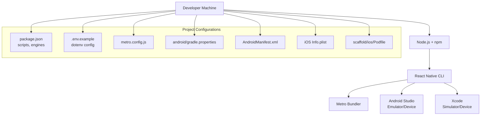

# Getting Started

<cite>
**Referenced Files in This Document**
- [package.json](file://package.json)
- [.env.example](file://.env.example)
- [metro.config.js](file://metro.config.js)
- [android/local.properties](file://android/local.properties)
- [android/gradle.properties](file://android/gradle.properties)
- [scaffold/ios/Podfile](file://scaffold/ios/Podfile)
- [android/app/src/main/AndroidManifest.xml](file://android/app/src/main/AndroidManifest.xml)
- [scaffold/android/app/src/main/AndroidManifest.xml](file://scaffold/android/app/src/main/AndroidManifest.xml)
- [scaffold/ios/scaffold/Info.plist](file://scaffold/ios/scaffold/Info.plist)
- [babel.config.js](file://babel.config.js)
- [tsconfig.json](file://tsconfig.json)
- [index.js](file://index.js)
- [App.tsx](file://App.tsx)
</cite>

## Table of Contents
1. [Introduction](#introduction)
2. [Prerequisites](#prerequisites)
3. [Installation](#installation)
4. [Environment Variables](#environment-variables)
5. [Platform Setup](#platform-setup)
6. [Development Workflow](#development-workflow)
7. [Architecture Overview](#architecture-overview)
8. [Troubleshooting](#troubleshooting)
9. [IDE Setup](#ide-setup)
10. [Initial Verification](#initial-verification)
11. [Conclusion](#conclusion)

## Introduction
This guide helps you set up the Banana Harvest App development environment from scratch. It covers prerequisites, installation, environment configuration, platform-specific setup for Android and iOS, development workflow, debugging tips, and initial verification steps. The project is a React Native application using TypeScript and follows standard React Native conventions.

## Prerequisites
Ensure your machine meets the following requirements before proceeding:
- Node.js: Version 18 or higher
- React Native CLI: Installed globally
- Android Studio: Latest stable channel with Android SDK, Android Emulator, and Android Build Tools
- Xcode: Version 15 or later (for iOS development)
- Java JDK: JDK 17 for Android builds
- CocoaPods: Required for iOS dependency management

These requirements are validated by the project configuration:
- Node.js engine requirement is declared in the project metadata.
- React Native CLI is used via scripts in the project configuration.
- Android and iOS targets are configured for building and running the app.

**Section sources**
- [package.json](file://package.json#L70-L72)

## Installation
Follow these steps to install and prepare the project locally:

1. Clone the repository to your local machine.
2. Open a terminal in the project root directory.
3. Install dependencies using the deterministic lockfile:
   - Run the command to install dependencies as defined in the project scripts.
4. Verify the installation by checking that node_modules is populated and dependencies match the lockfile.

Notes:
- The project uses a lockfile to ensure reproducible installs.
- Scripts for running the app on Android and iOS are defined in the project configuration.

**Section sources**
- [package.json](file://package.json#L6-L12)

## Environment Variables
Configure environment variables for local development:

1. Copy the example environment file to the runtime environment file:
   - Use the example file as a template for your local variables.
2. Set the base URL for the backend API and any optional feature flags or integrations.
3. For iOS builds, ensure the environment variables are accessible during the build phase if needed.

Key considerations:
- The project uses a dotenv plugin to load variables at build time.
- The configuration specifies the path to the environment file and module name for consumption in code.

**Section sources**
- [.env.example](file://.env.example#L1-L19)
- [babel.config.js](file://babel.config.js#L4-L11)

## Platform Setup

### Android
Prepare your Android development environment:

1. Configure the Android SDK path:
   - Update the SDK path in the Android local properties file to match your machine.
2. Review Gradle settings:
   - JVM memory settings, AndroidX compatibility, architectures, and Hermes engine selection are preconfigured.
3. Permissions and manifest:
   - The Android manifest declares permissions for network access, location, camera, audio, storage, and content intents.
4. Build and run:
   - Use the Android script to build and launch the app on a connected device or emulator.

Verification:
- Ensure the emulator or device is running and recognized by adb.
- Confirm the app launches without build errors.

**Section sources**
- [android/local.properties](file://android/local.properties#L1-L2)
- [android/gradle.properties](file://android/gradle.properties#L13-L43)
- [android/app/src/main/AndroidManifest.xml](file://android/app/src/main/AndroidManifest.xml#L3-L9)
- [scaffold/android/app/src/main/AndroidManifest.xml](file://scaffold/android/app/src/main/AndroidManifest.xml#L3-L4)

### iOS
Prepare your iOS development environment:

1. Install iOS dependencies:
   - Use CocoaPods to install native dependencies for the iOS target.
2. Review the Podfile:
   - The Podfile integrates React Native pods and supports Flipper configuration toggles.
3. App transport security and permissions:
   - The Info.plist defines app transport security settings and supported orientations.
4. Build and run:
   - Use the iOS script to build and launch the app on a simulator or connected device.

Verification:
- Ensure Xcode and the selected simulator/device are available.
- Confirm the app builds and runs without linking errors.

**Section sources**
- [scaffold/ios/Podfile](file://scaffold/ios/Podfile#L1-L56)
- [scaffold/ios/scaffold/Info.plist](file://scaffold/ios/scaffold/Info.plist#L27-L34)

## Development Workflow
Run the development server and launch the app on your chosen platform:

1. Start the Metro bundler:
   - Use the start script to launch the bundler and open the React Native Dev Menu.
2. Run on Android:
   - Use the Android script to build and install the app on a connected device or emulator.
3. Run on iOS:
   - Use the iOS script to build and install the app on a simulator or device.
4. Debugging:
   - Shake the device or press the appropriate key in the simulator to open the Dev Menu.
   - Enable remote debugging for JavaScript in Chrome or Flipper for native logs.

Notes:
- The Metro configuration merges defaults with project overrides.
- The entry point registers the app component with the app name from the app manifest.

**Section sources**
- [package.json](file://package.json#L6-L12)
- [metro.config.js](file://metro.config.js#L1-L12)
- [index.js](file://index.js#L5-L9)
- [App.tsx](file://App.tsx#L88-L95)

## Architecture Overview
High-level flow of the development environment:

**Diagram sources**
- [package.json](file://package.json#L6-L12)
- [.env.example](file://.env.example#L1-L19)
- [metro.config.js](file://metro.config.js#L1-L12)
- [android/gradle.properties](file://android/gradle.properties#L13-L43)
- [android/app/src/main/AndroidManifest.xml](file://android/app/src/main/AndroidManifest.xml#L3-L9)
- [scaffold/ios/scaffold/Info.plist](file://scaffold/ios/scaffold/Info.plist#L27-L34)
- [scaffold/ios/Podfile](file://scaffold/ios/Podfile#L1-L56)

## Troubleshooting
Common setup issues and resolutions:

- Node.js version mismatch:
  - Ensure Node.js meets the minimum version requirement declared in the project metadata.
- Android SDK path not found:
  - Update the SDK path in the Android local properties file to match your machine.
- Gradle build failures:
  - Increase JVM memory settings if builds fail due to memory constraints.
  - Verify AndroidX and Hermes settings align with your environment.
- iOS dependency issues:
  - Run the CocoaPods installation command to resolve missing native dependencies.
  - Confirm the iOS target and simulator/device availability.
- Metro bundler errors:
  - Clear Metro cache and reset the bundler if caching causes issues.
- Environment variables not applied:
  - Confirm the environment file path and module name in the Babel configuration.
  - Rebuild the app after updating environment variables.

**Section sources**
- [package.json](file://package.json#L70-L72)
- [android/local.properties](file://android/local.properties#L1-L2)
- [android/gradle.properties](file://android/gradle.properties#L13-L43)
- [scaffold/ios/Podfile](file://scaffold/ios/Podfile#L1-L56)
- [babel.config.js](file://babel.config.js#L4-L11)

## IDE Setup
Recommended IDE and extensions for React Native development:

- IDE:
  - Visual Studio Code is commonly used for React Native development.
- Extensions:
  - ESLint for linting
  - Prettier for code formatting
  - React Native Tools for debugging and device integration
  - Path Intellisense for TypeScript path aliases
  - Bracket Pair Colorizer for improved readability
- TypeScript configuration:
  - The project uses a strict TypeScript configuration with path aliases for clean imports.

**Section sources**
- [tsconfig.json](file://tsconfig.json#L26-L38)

## Initial Verification
Perform these checks to confirm a successful setup:

- Dependencies installed:
  - Verify node_modules exists and matches the lockfile.
- Environment variables:
  - Confirm the environment file is present and variables are accessible.
- Android:
  - Launch an emulator or connect a device and run the Android script.
- iOS:
  - Open the iOS workspace and run the iOS script on a simulator.
- Metro bundler:
  - Start the bundler and ensure it serves the app without errors.
- App entry:
  - Confirm the app component is registered with the correct app name.

**Section sources**
- [package.json](file://package.json#L6-L12)
- [.env.example](file://.env.example#L1-L19)
- [index.js](file://index.js#L5-L9)
- [App.tsx](file://App.tsx#L88-L95)

## Conclusion
You now have the Banana Harvest App development environment ready. Use the provided scripts to start the bundler, run on Android or iOS, and iterate quickly. Keep your environment updated per the troubleshooting section and leverage the IDE recommendations for a smooth development experience.