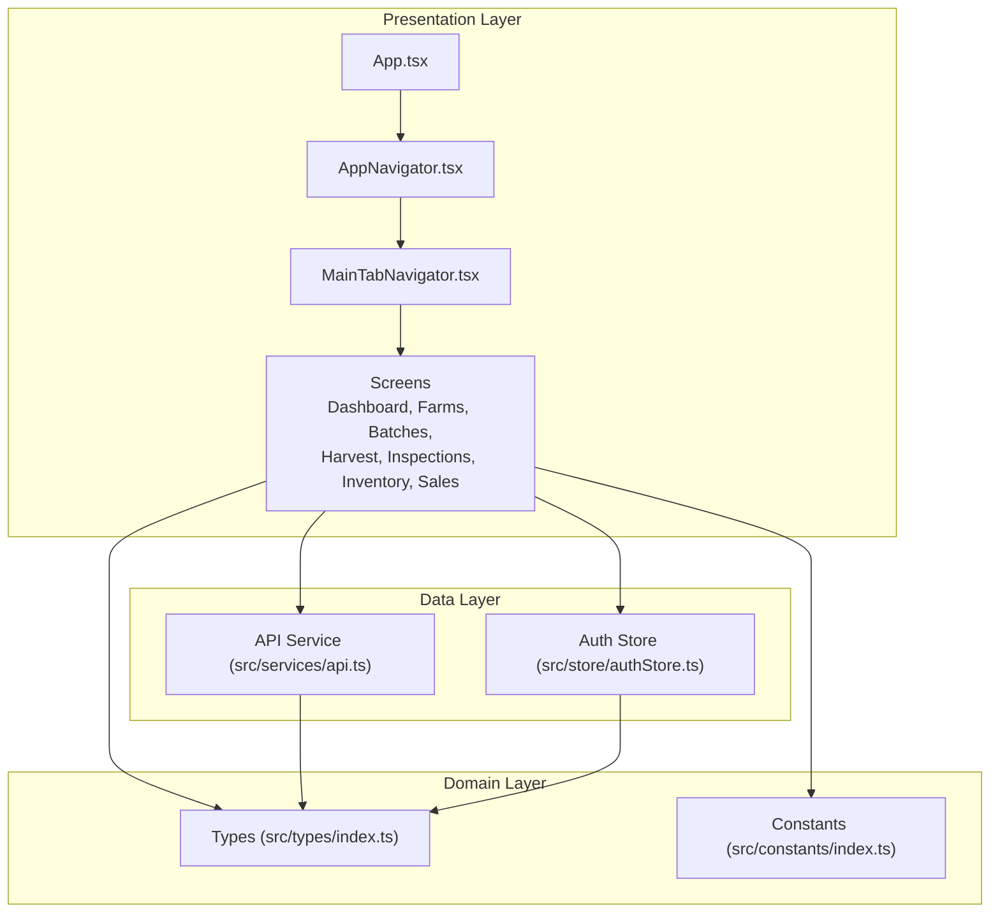
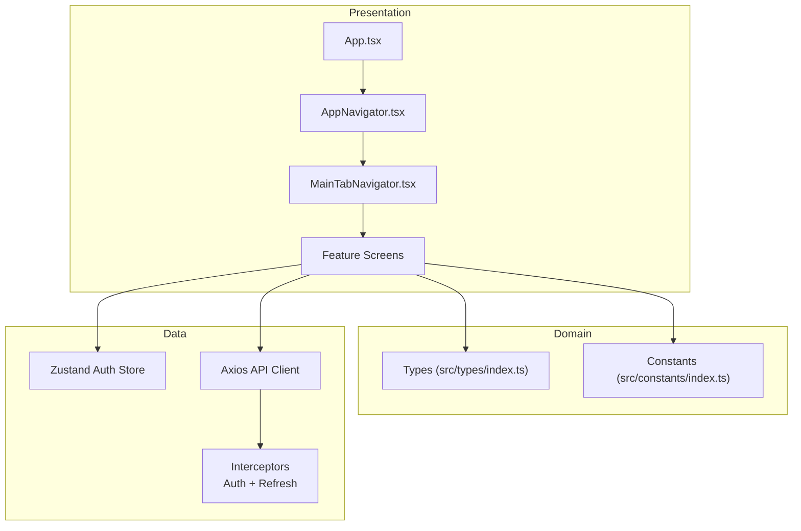
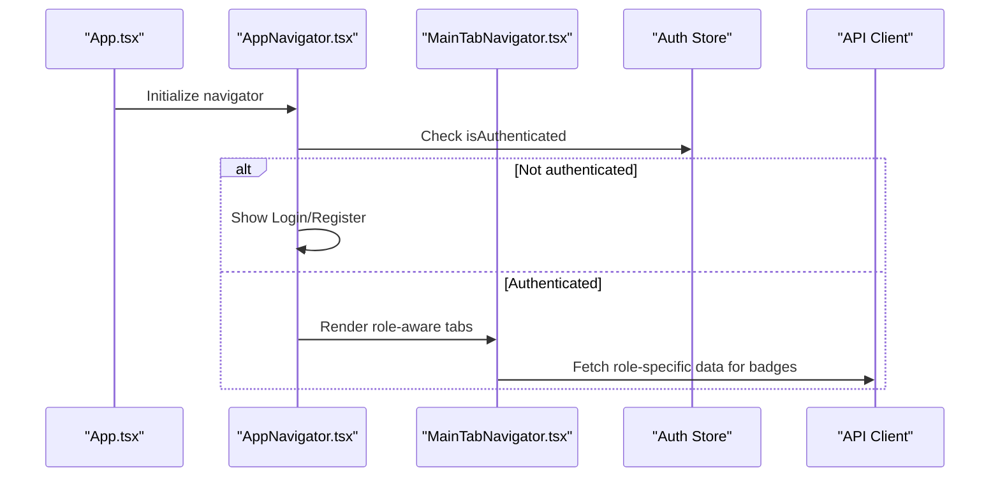
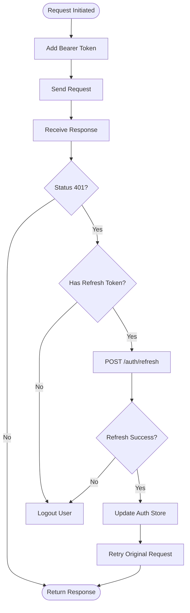
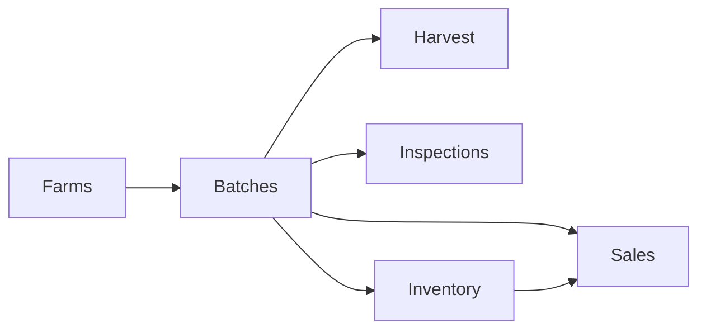
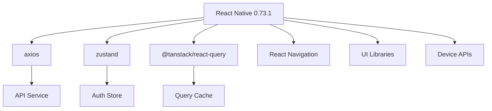

# Project Overview

<cite>
**Referenced Files in This Document**
- [package.json](file://package.json)
- [App.tsx](file://App.tsx)
- [AppNavigator.tsx](file://src/navigation/AppNavigator.tsx)
- [MainTabNavigator.tsx](file://src/navigation/MainTabNavigator.tsx)
- [authStore.ts](file://src/store/authStore.ts)
- [api.ts](file://src/services/api.ts)
- [DashboardScreen.tsx](file://src/screens/dashboard/DashboardScreen.tsx)
- [FarmsScreen.tsx](file://src/screens/farms/FarmsScreen.tsx)
- [BatchesScreen.tsx](file://src/screens/batches/BatchesScreen.tsx)
- [HarvestScreen.tsx](file://src/screens/harvest/HarvestScreen.tsx)
- [InspectionsScreen.tsx](file://src/screens/inspections/InspectionsScreen.tsx)
- [InventoryScreen.tsx](file://src/screens/inventory/InventoryScreen.tsx)
- [SalesScreen.tsx](file://src/screens/sales/SalesScreen.tsx)
- [index.ts (types)](file://src/types/index.ts)
- [index.ts (constants)](file://src/constants/index.ts)
</cite>

## Table of Contents
1. [Introduction](#introduction)
2. [Project Structure](#project-structure)
3. [Core Components](#core-components)
4. [Architecture Overview](#architecture-overview)
5. [Detailed Component Analysis](#detailed-component-analysis)
6. [Dependency Analysis](#dependency-analysis)
7. [Performance Considerations](#performance-considerations)
8. [Troubleshooting Guide](#troubleshooting-guide)
9. [Conclusion](#conclusion)

## Introduction
The Banana Harvest App is a comprehensive mobile application designed to streamline and digitize the entire banana supply chain. Built with React Native 0.73.1 and TypeScript, the application serves farmers, vendors, managers, and store keepers with a unified platform for farm management, batch tracking, harvest operations, quality inspections, inventory control, and sales invoicing. Its mobile-first, cross-platform architecture ensures reliable performance on both iOS and Android devices, while a glassmorphism UI theme enhances usability in field conditions.

The application’s core value proposition lies in solving real-world agricultural supply chain challenges:
- Real-time visibility into farm and batch lifecycle stages
- Streamlined inspection and approval workflows
- Automated inventory allocation and gate pass reconciliation
- Digital sales creation with invoice generation and sharing
- Role-based dashboards and actionable insights for efficient decision-making

## Project Structure
The frontend follows a modular, feature-based organization with clear separation of concerns:
- Presentation layer: React Native screens and reusable UI components
- Domain layer: TypeScript types and constants defining business entities and UI contracts
- Data layer: Centralized API service with interceptors for authentication and error handling
- State management: Zustand stores for authentication and global state
- Navigation: React Navigation stacks and bottom tabs for seamless user flow

**Diagram sources**
- [App.tsx](file://App.tsx#L1-L95)
- [AppNavigator.tsx](file://src/navigation/AppNavigator.tsx#L1-L60)
- [MainTabNavigator.tsx](file://src/navigation/MainTabNavigator.tsx#L1-L414)
- [api.ts](file://src/services/api.ts#L1-L326)
- [authStore.ts](file://src/store/authStore.ts#L1-L116)
- [index.ts (types)](file://src/types/index.ts#L1-L429)
- [index.ts (constants)](file://src/constants/index.ts#L1-L363)

**Section sources**
- [package.json](file://package.json#L1-L74)
- [App.tsx](file://App.tsx#L1-L95)
- [AppNavigator.tsx](file://src/navigation/AppNavigator.tsx#L1-L60)
- [MainTabNavigator.tsx](file://src/navigation/MainTabNavigator.tsx#L1-L414)
- [api.ts](file://src/services/api.ts#L1-L326)
- [authStore.ts](file://src/store/authStore.ts#L1-L116)
- [index.ts (types)](file://src/types/index.ts#L1-L429)
- [index.ts (constants)](file://src/constants/index.ts#L1-L363)

## Core Components
- Authentication and Navigation
  - App bootstraps the application with providers for navigation, state, and networking, and initializes the main navigator.
  - AppNavigator routes users between authentication screens and the main tabbed interface based on authentication state.
  - MainTabNavigator defines role-aware tabs and dynamic badges for actionable items.

- State Management
  - Auth store encapsulates user session, roles, and permissions with persistence for seamless re-authentication.

- API Layer
  - Centralized Axios client with request/response interceptors for token injection, automatic refresh, and error handling.
  - Feature-specific API modules for farms, batches, harvest, inventory, sales, and reporting.

- Business Screens
  - Dashboard: Role-based analytics and KPIs
  - Farms: Plot and vendor management
  - Batches: Lifecycle tracking and pending approvals
  - Harvest: Daily reporting and completion workflows
  - Inspections: Request, capture, and approval workflows
  - Inventory: Stock overview, allocation, and inbound reconciliation
  - Sales: Invoice creation, totals calculation, and sharing

**Section sources**
- [App.tsx](file://App.tsx#L1-L95)
- [AppNavigator.tsx](file://src/navigation/AppNavigator.tsx#L1-L60)
- [MainTabNavigator.tsx](file://src/navigation/MainTabNavigator.tsx#L1-L414)
- [authStore.ts](file://src/store/authStore.ts#L1-L116)
- [api.ts](file://src/services/api.ts#L1-L326)
- [DashboardScreen.tsx](file://src/screens/dashboard/DashboardScreen.tsx#L1-L402)
- [FarmsScreen.tsx](file://src/screens/farms/FarmsScreen.tsx#L1-L800)
- [BatchesScreen.tsx](file://src/screens/batches/BatchesScreen.tsx#L1-L462)
- [HarvestScreen.tsx](file://src/screens/harvest/HarvestScreen.tsx#L1-L718)
- [InspectionsScreen.tsx](file://src/screens/inspections/InspectionsScreen.tsx#L1-L800)
- [InventoryScreen.tsx](file://src/screens/inventory/InventoryScreen.tsx#L1-L687)
- [SalesScreen.tsx](file://src/screens/sales/SalesScreen.tsx#L1-L800)

## Architecture Overview
The application adheres to a clean architecture pattern with three distinct layers:
- Presentation: React Native screens and navigation orchestration
- Domain: Strongly typed models and constants
- Data: API service with interceptors and centralized state

**Diagram sources**
- [App.tsx](file://App.tsx#L1-L95)
- [AppNavigator.tsx](file://src/navigation/AppNavigator.tsx#L1-L60)
- [MainTabNavigator.tsx](file://src/navigation/MainTabNavigator.tsx#L1-L414)
- [authStore.ts](file://src/store/authStore.ts#L1-L116)
- [api.ts](file://src/services/api.ts#L1-L326)
- [index.ts (types)](file://src/types/index.ts#L1-L429)
- [index.ts (constants)](file://src/constants/index.ts#L1-L363)

## Detailed Component Analysis

### Authentication and Navigation Flow
The authentication and navigation flow ensures secure access and intuitive routing across roles.

**Diagram sources**
- [App.tsx](file://App.tsx#L1-L95)
- [AppNavigator.tsx](file://src/navigation/AppNavigator.tsx#L1-L60)
- [MainTabNavigator.tsx](file://src/navigation/MainTabNavigator.tsx#L1-L414)
- [authStore.ts](file://src/store/authStore.ts#L1-L116)
- [api.ts](file://src/services/api.ts#L1-L326)

**Section sources**
- [App.tsx](file://App.tsx#L1-L95)
- [AppNavigator.tsx](file://src/navigation/AppNavigator.tsx#L1-L60)
- [MainTabNavigator.tsx](file://src/navigation/MainTabNavigator.tsx#L1-L414)
- [authStore.ts](file://src/store/authStore.ts#L1-L116)
- [api.ts](file://src/services/api.ts#L1-L326)

### API Interceptors and Token Refresh
The API client implements robust interceptors for authentication and error handling, including automatic token refresh.

**Diagram sources**
- [api.ts](file://src/services/api.ts#L1-L326)
- [authStore.ts](file://src/store/authStore.ts#L1-L116)

**Section sources**
- [api.ts](file://src/services/api.ts#L1-L326)
- [authStore.ts](file://src/store/authStore.ts#L1-L116)

### Business Domain Coverage
The application comprehensively addresses the agricultural supply chain:

- Farm Management
  - Create and manage farm records, vendor assignment, and inspection requests
  - Filter and search farms, enforce active batch constraints

- Batch Tracking
  - Lifecycle management across creation, harvesting, dispatch, and delivery
  - Pending approvals and actionable tabs for supervisors

- Harvest Operations
  - Daily harvest reporting, progress tracking, and completion workflows
  - Integration with batch details and status updates

- Quality Inspections
  - Request creation, media capture, and approval workflows
  - Role-aware pending and history views

- Inventory
  - Stock overview, allocation to batches, and inbound reconciliation
  - Gate pass integration for receiving verification

- Sales and Invoicing
  - Domestic and export sale creation with tax calculations
  - Invoice generation, PDF download, and sharing via WhatsApp/email

**Diagram sources**
- [FarmsScreen.tsx](file://src/screens/farms/FarmsScreen.tsx#L1-L800)
- [BatchesScreen.tsx](file://src/screens/batches/BatchesScreen.tsx#L1-L462)
- [HarvestScreen.tsx](file://src/screens/harvest/HarvestScreen.tsx#L1-L718)
- [InspectionsScreen.tsx](file://src/screens/inspections/InspectionsScreen.tsx#L1-L800)
- [InventoryScreen.tsx](file://src/screens/inventory/InventoryScreen.tsx#L1-L687)
- [SalesScreen.tsx](file://src/screens/sales/SalesScreen.tsx#L1-L800)

**Section sources**
- [FarmsScreen.tsx](file://src/screens/farms/FarmsScreen.tsx#L1-L800)
- [BatchesScreen.tsx](file://src/screens/batches/BatchesScreen.tsx#L1-L462)
- [HarvestScreen.tsx](file://src/screens/harvest/HarvestScreen.tsx#L1-L718)
- [InspectionsScreen.tsx](file://src/screens/inspections/InspectionsScreen.tsx#L1-L800)
- [InventoryScreen.tsx](file://src/screens/inventory/InventoryScreen.tsx#L1-L687)
- [SalesScreen.tsx](file://src/screens/sales/SalesScreen.tsx#L1-L800)

## Dependency Analysis
The application leverages a modern React Native ecosystem with carefully chosen dependencies:

- Core Runtime
  - React Native 0.73.1, React 18.2.0, TypeScript 5.3.3
- Navigation and Routing
  - @react-navigation/native, @react-navigation/native-stack, @react-navigation/bottom-tabs, @react-navigation/stack
- State Management
  - zustand for lightweight, scalable state
  - @react-native-async-storage/async-storage for persistence
- Networking and Caching
  - axios for HTTP requests, @tanstack/react-query for caching and background sync
- UI and UX
  - react-native-vector-icons, react-native-gesture-handler, react-native-reanimated, react-native-safe-area-context
  - react-native-paper, react-native-svg, react-native-linear-gradient
- Device Integration
  - react-native-image-picker, react-native-vision-camera, react-native-share, react-native-fs
- Utilities
  - date-fns, yup, formik, expo-blur

**Diagram sources**
- [package.json](file://package.json#L1-L74)
- [api.ts](file://src/services/api.ts#L1-L326)
- [authStore.ts](file://src/store/authStore.ts#L1-L116)

**Section sources**
- [package.json](file://package.json#L1-L74)
- [api.ts](file://src/services/api.ts#L1-L326)
- [authStore.ts](file://src/store/authStore.ts#L1-L116)

## Performance Considerations
- Network Efficiency
  - Centralized Axios client with retry and staleTime configurations minimizes redundant network calls
  - Automatic token refresh prevents frequent login interruptions
- UI Responsiveness
  - React Navigation lazy loading and gesture handlers ensure smooth transitions
  - Reanimated-based animations enhance perceived performance without blocking the main thread
- Memory Management
  - Zustand stores with selective persistence reduce memory footprint
  - React Query cache invalidation keeps data fresh without excessive polling
- Offline Resilience
  - Local storage integration supports offline authentication state
  - Toast notifications provide immediate feedback for user actions

## Troubleshooting Guide
Common issues and resolutions:
- Authentication Failures
  - Symptom: Frequent logout or 401 errors
  - Resolution: Verify refresh token availability and interceptor logic; ensure proper token storage
- Network Errors
  - Symptom: Requests fail intermittently
  - Resolution: Check API_BASE_URL, timeouts, and network connectivity; leverage React Query refetch strategies
- UI State Drift
  - Symptom: Outdated lists or inconsistent badges
  - Resolution: Use queryClient.invalidateQueries strategically; ensure shared query keys across related screens
- Role-Based Access
  - Symptom: Unexpected navigation or missing tabs
  - Resolution: Confirm user role and navigation guards; verify ROLE_NAV_ITEMS configuration

**Section sources**
- [api.ts](file://src/services/api.ts#L1-L326)
- [authStore.ts](file://src/store/authStore.ts#L1-L116)
- [MainTabNavigator.tsx](file://src/navigation/MainTabNavigator.tsx#L1-L414)

## Conclusion
The Banana Harvest App delivers a robust, scalable solution for managing the complete banana supply chain on mobile devices. By combining React Native’s cross-platform capabilities with a clean architecture, TypeScript’s strong typing, and modern state and caching patterns, the application provides a seamless experience for diverse stakeholders. Its role-based dashboards, automated workflows, and integrated reporting empower users to make informed decisions, improve operational efficiency, and maintain transparency across the supply chain.