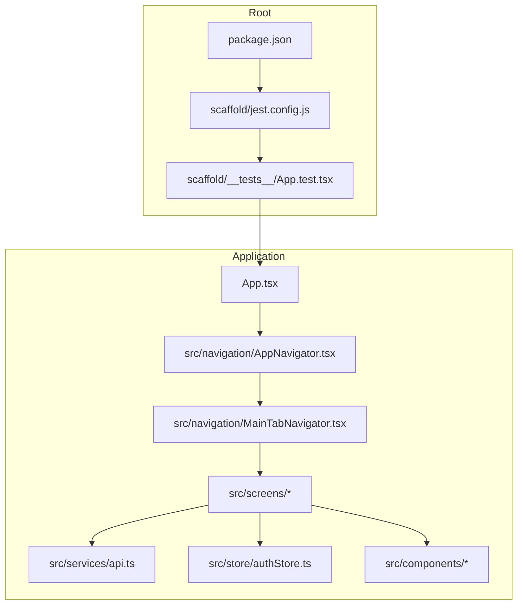
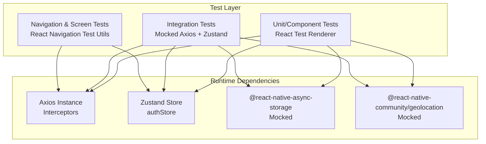
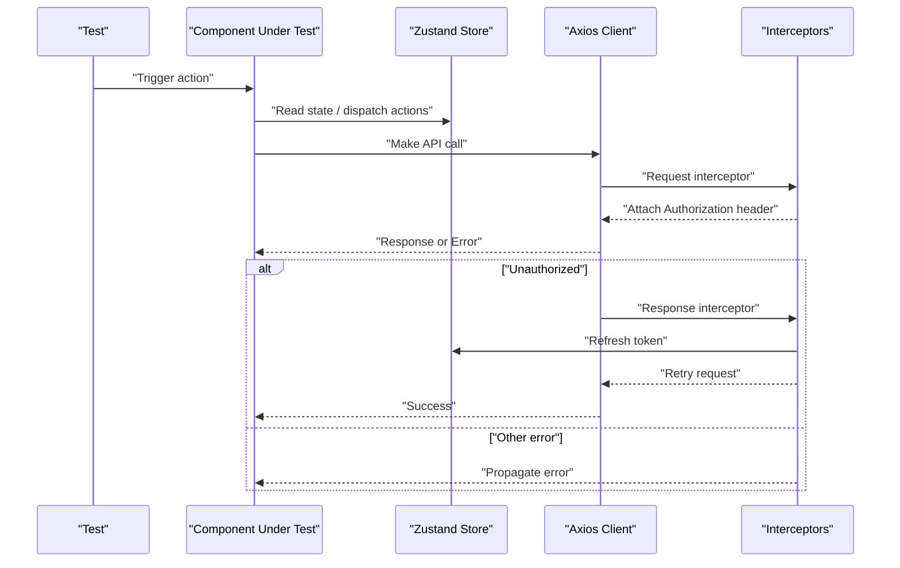
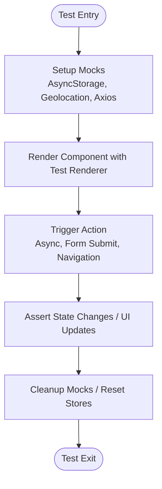
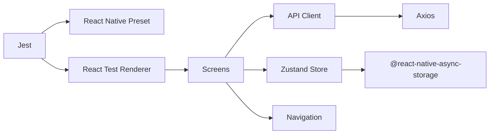

# Testing Strategy

<cite>
**Referenced Files in This Document**
- [jest.config.js](file://scaffold/jest.config.js)
- [package.json](file://package.json)
- [App.test.tsx](file://scaffold/__tests__/App.test.tsx)
- [api.ts](file://src/services/api.ts)
- [authStore.ts](file://src/store/authStore.ts)
- [App.tsx](file://App.tsx)
- [LoginScreen.tsx](file://src/screens/auth/LoginScreen.tsx)
- [RegisterScreen.tsx](file://src/screens/auth/RegisterScreen.tsx)
- [HarvestScreen.tsx](file://src/screens/harvest/HarvestScreen.tsx)
- [SubmitHarvestScreen.tsx](file://src/screens/harvest/SubmitHarvestScreen.tsx)
- [DashboardScreen.tsx](file://src/screens/dashboard/DashboardScreen.tsx)
- [InventoryScreen.tsx](file://src/screens/inventory/InventoryScreen.tsx)
- [FarmsScreen.tsx](file://src/screens/farms/FarmsScreen.tsx)
- [GatePassScreen.tsx](file://src/screens/harvest/GatePassScreen.tsx)
- [GatePassDetailsScreen.tsx](file://src/screens/harvest/GatePassDetailsScreen.tsx)
- [HarvestReportDetailsScreen.tsx](file://src/screens/harvest/HarvestReportDetailsScreen.tsx)
- [CameraScreen.tsx](file://src/screens/common/CameraScreen.tsx)
- [BatchLifecycleScreen.tsx](file://src/screens/batches/BatchLifecycleScreen.tsx)
- [BatchesScreen.tsx](file://src/screens/batches/BatchesScreen.tsx)
- [UserApprovalScreen.tsx](file://src/screens/admin/UserApprovalScreen.tsx)
- [InspectionsScreen.tsx](file://src/screens/inspections/InspectionsScreen.tsx)
- [CreateInspectionRequestScreen.tsx](file://src/screens/inspections/CreateInspectionRequestScreen.tsx)
- [SalesScreen.tsx](file://src/screens/sales/SalesScreen.tsx)
- [LedgerScreen.tsx](file://src/screens/ledger/LedgerScreen.tsx)
- [ProfileScreen.tsx](file://src/screens/profile/ProfileScreen.tsx)
- [AppNavigator.tsx](file://src/navigation/AppNavigator.tsx)
- [MainTabNavigator.tsx](file://src/navigation/MainTabNavigator.tsx)
- [GlassButton.tsx](file://src/components/glassmorphism/GlassButton.tsx)
- [GlassInput.tsx](file://src/components/glassmorphism/GlassInput.tsx)
- [GlassCard.tsx](file://src/components/glassmorphism/GlassCard.tsx)
- [GlassSearchBar.tsx](file://src/components/glassmorphism/GlassSearchBar.tsx)
- [BatchStatusBadge.tsx](file://src/components/common/BatchStatusBadge.tsx)
- [HorizontalScrollWrapper.tsx](file://src/components/common/HorizontalScrollWrapper.tsx)
- [index.ts](file://src/components/glassmorphism/index.ts)
- [index.ts](file://src/components/common/index.ts)
- [index.ts](file://src/constants/index.ts)
- [index.ts](file://src/types/index.ts)
</cite>

## Table of Contents
1. [Introduction](#introduction)
2. [Project Structure](#project-structure)
3. [Core Components](#core-components)
4. [Architecture Overview](#architecture-overview)
5. [Detailed Component Analysis](#detailed-component-analysis)
6. [Dependency Analysis](#dependency-analysis)
7. [Performance Considerations](#performance-considerations)
8. [Troubleshooting Guide](#troubleshooting-guide)
9. [Conclusion](#conclusion)
10. [Appendices](#appendices)

## Introduction
This document describes the Banana Harvest App’s testing strategy and implementation. It covers the Jest testing framework setup, configuration, and test runner settings; the testing approach for components and functions; integration testing for API interactions; component testing with React Test Renderer; mocking strategies for AsyncStorage, Geolocation, and network requests; patterns for async operations, form validation, navigation, and state management with Zustand; coverage expectations; continuous integration considerations; and debugging test failures. It also addresses mobile-specific testing concerns such as simulator/device testing and performance testing approaches.

## Project Structure
The project follows a React Native monorepo-like layout with a dedicated scaffold directory containing Jest configuration and a minimal baseline test. Application code resides under src, organized by domain areas (screens, components, services, store, navigation). Tests are colocated with source files using the standard convention of placing tests adjacent to the code they test.

**Diagram sources**
- [jest.config.js](file://scaffold/jest.config.js#L1-L4)
- [package.json](file://package.json#L1-L74)
- [App.test.tsx](file://scaffold/__tests__/App.test.tsx#L1-L18)
- [App.tsx](file://App.tsx)
- [AppNavigator.tsx](file://src/navigation/AppNavigator.tsx)
- [MainTabNavigator.tsx](file://src/navigation/MainTabNavigator.tsx)
- [api.ts](file://src/services/api.ts#L1-L326)
- [authStore.ts](file://src/store/authStore.ts#L1-L116)

**Section sources**
- [jest.config.js](file://scaffold/jest.config.js#L1-L4)
- [package.json](file://package.json#L1-L74)
- [App.test.tsx](file://scaffold/__tests__/App.test.tsx#L1-L18)

## Core Components
- Jest configuration: Uses the React Native preset to align with React Native environments and Metro bundler defaults.
- Test script: The npm/yarn test script invokes Jest globally.
- Baseline test: A single renderer test verifies that the root App component renders without throwing.

Key implications:
- The current Jest setup is minimal and suitable for component rendering checks but does not yet enforce coverage or include advanced mocks for async or native modules.
- Additional Jest configuration is recommended to enable coverage, module name mapping, and mocks for AsyncStorage, Geolocation, and network interceptors.

**Section sources**
- [jest.config.js](file://scaffold/jest.config.js#L1-L4)
- [package.json](file://package.json#L6-L12)
- [App.test.tsx](file://scaffold/__tests__/App.test.tsx#L1-L18)

## Architecture Overview
The testing architecture centers on three pillars:
- Unit and component tests using React Test Renderer for isolated UI verification.
- Integration tests leveraging mocked Axios interceptors and Zustand stores to simulate API flows and state transitions.
- Navigation and screen-level tests to validate routing and user journeys.

**Diagram sources**
- [api.ts](file://src/services/api.ts#L1-L326)
- [authStore.ts](file://src/store/authStore.ts#L1-L116)

## Detailed Component Analysis

### Jest Setup and Runner Configuration
- Preset: The React Native preset configures Jest to work with React Native’s transform pipeline and platform-specific modules.
- Scripts: The test script runs Jest; type checking and linting are separate scripts.
- Renderer: React Test Renderer is imported after React Native to ensure proper environment initialization.

Recommendations for improvement:
- Add coverage collection and thresholds.
- Configure module name mapping and resolver aliases to match the project’s TypeScript path aliases.
- Add a setup file to mock AsyncStorage, Geolocation, and network interceptors globally.

**Section sources**
- [jest.config.js](file://scaffold/jest.config.js#L1-L4)
- [package.json](file://package.json#L6-L12)
- [App.test.tsx](file://scaffold/__tests__/App.test.tsx#L1-L18)

### Mock Implementation Strategies

#### AsyncStorage
- Current usage: Zustand persist middleware uses AsyncStorage for state persistence.
- Recommended mocks:
  - Provide a simple in-memory mock for AsyncStorage to avoid filesystem dependencies during tests.
  - Ensure the mock supports basic AsyncStorage methods (getItem, setItem, removeItem, clear).
  - Scope the mock to the test environment via setup files or per-suite mocks.

#### Geolocation
- Current usage: The project depends on @react-native-community/geolocation.
- Recommended mocks:
  - Mock geolocation APIs to return deterministic coordinates or errors.
  - Allow enabling/disabling mocks per test to validate both success and failure paths.

#### Network Requests (Axios)
- Current usage: The API client sets base URL, timeout, and attaches request/response interceptors. Interceptors handle Authorization headers and token refresh logic.
- Recommended mocks:
  - Use a library like fetch-mock or Jest’s built-in fetch mocks to stub HTTP endpoints.
  - Mock interceptors’ behavior to simulate 401 Unauthorized and successful token refresh flows.
  - Isolate interceptors by resetting mocks between tests.

**Diagram sources**
- [api.ts](file://src/services/api.ts#L16-L65)
- [authStore.ts](file://src/store/authStore.ts#L29-L115)

**Section sources**
- [api.ts](file://src/services/api.ts#L1-L326)
- [authStore.ts](file://src/store/authStore.ts#L1-L116)

### Testing Patterns

#### Async Operations
- Pattern: Use async/await with React Test Renderer to render components after async state updates.
- Example scenarios:
  - Login flow: Simulate successful login, verify token stored and navigation triggered.
  - Fetch data: Mock API endpoints and assert UI reflects loading, success, and error states.

#### Form Validation
- Pattern: Render forms and simulate user input events, then assert validation messages and submission behavior.
- Example scenarios:
  - Login form: Validate required fields, email format, and submission triggers.
  - Registration form: Validate password strength and confirm password match.

#### Navigation Testing
- Pattern: Use React Navigation’s testing utilities to navigate programmatically and assert screen rendering.
- Example scenarios:
  - Tab navigation: Switch tabs and verify active tab indicators.
  - Stack navigation: Navigate to a screen and assert route parameters.

#### State Management Testing (Zustand)
- Pattern: Initialize store slices in tests, dispatch actions, and assert state changes.
- Example scenarios:
  - Authentication: Set credentials, verify isAuthenticated flag and getters.
  - Persisted state: Verify AsyncStorage-backed persistence and hydration.

[No sources needed since this diagram shows conceptual workflow, not actual code structure]

### Component-Level Testing Examples
Below are representative test targets grouped by feature area. Replace placeholders with actual test files as needed.

- Authentication
  - LoginScreen: Validate form submission, error handling, navigation post-login.
  - RegisterScreen: Validate registration flow and error states.
- Harvest
  - HarvestScreen: Validate data fetching and rendering.
  - SubmitHarvestScreen: Validate form submission and success feedback.
  - GatePassScreen: Validate gate pass listing and navigation.
  - GatePassDetailsScreen: Validate detail rendering and actions.
  - HarvestReportDetailsScreen: Validate report detail rendering.
- Batches
  - BatchLifecycleScreen: Validate lifecycle transitions.
  - BatchesScreen: Validate batch listing and filters.
- Inventory
  - InventoryScreen: Validate item listing and stock actions.
- Farms
  - FarmsScreen: Validate farm listing and creation.
- Inspections
  - InspectionsScreen: Validate inspection listing.
  - CreateInspectionRequestScreen: Validate request creation.
- Admin
  - UserApprovalScreen: Validate approval actions.
- Sales
  - SalesScreen: Validate sales listing and creation.
- Ledger
  - LedgerScreen: Validate ledger rendering.
- Profile
  - ProfileScreen: Validate profile display and edit actions.
- Navigation
  - AppNavigator: Validate top-level routes.
  - MainTabNavigator: Validate tab routing and active states.
- Components
  - GlassButton, GlassInput, GlassCard, GlassSearchBar: Validate props, interactions, and rendering.
  - BatchStatusBadge, HorizontalScrollWrapper: Validate status rendering and scroll behavior.

**Section sources**
- [LoginScreen.tsx](file://src/screens/auth/LoginScreen.tsx)
- [RegisterScreen.tsx](file://src/screens/auth/RegisterScreen.tsx)
- [HarvestScreen.tsx](file://src/screens/harvest/HarvestScreen.tsx)
- [SubmitHarvestScreen.tsx](file://src/screens/harvest/SubmitHarvestScreen.tsx)
- [GatePassScreen.tsx](file://src/screens/harvest/GatePassScreen.tsx)
- [GatePassDetailsScreen.tsx](file://src/screens/harvest/GatePassDetailsScreen.tsx)
- [HarvestReportDetailsScreen.tsx](file://src/screens/harvest/HarvestReportDetailsScreen.tsx)
- [BatchLifecycleScreen.tsx](file://src/screens/batches/BatchLifecycleScreen.tsx)
- [BatchesScreen.tsx](file://src/screens/batches/BatchesScreen.tsx)
- [InventoryScreen.tsx](file://src/screens/inventory/InventoryScreen.tsx)
- [FarmsScreen.tsx](file://src/screens/farms/FarmsScreen.tsx)
- [InspectionsScreen.tsx](file://src/screens/inspections/InspectionsScreen.tsx)
- [CreateInspectionRequestScreen.tsx](file://src/screens/inspections/CreateInspectionRequestScreen.tsx)
- [UserApprovalScreen.tsx](file://src/screens/admin/UserApprovalScreen.tsx)
- [SalesScreen.tsx](file://src/screens/sales/SalesScreen.tsx)
- [LedgerScreen.tsx](file://src/screens/ledger/LedgerScreen.tsx)
- [ProfileScreen.tsx](file://src/screens/profile/ProfileScreen.tsx)
- [AppNavigator.tsx](file://src/navigation/AppNavigator.tsx)
- [MainTabNavigator.tsx](file://src/navigation/MainTabNavigator.tsx)
- [GlassButton.tsx](file://src/components/glassmorphism/GlassButton.tsx)
- [GlassInput.tsx](file://src/components/glassmorphism/GlassInput.tsx)
- [GlassCard.tsx](file://src/components/glassmorphism/GlassCard.tsx)
- [GlassSearchBar.tsx](file://src/components/glassmorphism/GlassSearchBar.tsx)
- [BatchStatusBadge.tsx](file://src/components/common/BatchStatusBadge.tsx)
- [HorizontalScrollWrapper.tsx](file://src/components/common/HorizontalScrollWrapper.tsx)

## Dependency Analysis
The testing strategy relies on several key dependencies:
- Jest and React Native preset for test runner and platform compatibility.
- React Test Renderer for component rendering and snapshot testing.
- Axios and interceptors for API interactions.
- Zustand for state management with AsyncStorage persistence.
- Navigation libraries for routing tests.

**Diagram sources**
- [package.json](file://package.json#L14-L68)
- [api.ts](file://src/services/api.ts#L1-L326)
- [authStore.ts](file://src/store/authStore.ts#L1-L116)

**Section sources**
- [package.json](file://package.json#L14-L68)
- [api.ts](file://src/services/api.ts#L1-L326)
- [authStore.ts](file://src/store/authStore.ts#L1-L116)

## Performance Considerations
- Prefer shallow rendering for pure components and deep rendering only when necessary.
- Use lightweight mocks to reduce test execution time.
- Limit reliance on real network calls; prefer mocking for speed and determinism.
- For navigation-heavy tests, minimize stack depth and reuse navigators across tests.
- For state-heavy tests, reset store slices between tests to avoid cross-test contamination.

[No sources needed since this section provides general guidance]

## Troubleshooting Guide
Common issues and resolutions:
- Snapshot drift: Re-generate snapshots after intentional UI changes; review diffs carefully.
- AsyncStorage failures: Ensure AsyncStorage mocks are initialized before rendering components that depend on persisted state.
- Interceptor errors: Reset Axios mocks between tests; verify interceptor logic for token refresh and Unauthorized handling.
- Navigation issues: Use navigation test utils to programmatically navigate; assert route keys and params.
- Geolocation errors: Mock geolocation APIs to return predictable results; disable mocks when testing non-location-dependent features.
- CI flakiness: Run tests in isolation; avoid shared mutable state; use deterministic mocks.

**Section sources**
- [api.ts](file://src/services/api.ts#L16-L65)
- [authStore.ts](file://src/store/authStore.ts#L29-L115)

## Conclusion
The Banana Harvest App currently includes a minimal Jest setup suitable for rendering checks. To achieve comprehensive test coverage, integrate mocks for AsyncStorage, Geolocation, and Axios, adopt patterns for async operations, form validation, navigation, and Zustand state testing, and establish CI-friendly test scripts. These enhancements will improve reliability, maintainability, and developer confidence as the application evolves.

## Appendices

### Test Coverage Expectations
- Unit tests: >80% for pure functions and small utilities.
- Component tests: >70% for UI components with meaningful interactions.
- Integration tests: >60% for API flows and state transitions.
- Navigation tests: >75% for critical user journeys.
- Coverage thresholds: Define project-wide thresholds and enforce via CI.

[No sources needed since this section provides general guidance]

### Continuous Integration Testing Setup
- Run tests on pull requests and main branch builds.
- Use caching for node_modules and Metro cache to speed up CI.
- Parallelize tests where possible while respecting shared mocks and stores.
- Publish coverage reports and enforce minimum thresholds.

[No sources needed since this section provides general guidance]

### Mobile-Specific Testing Approaches
- Simulator testing: Use iOS Simulator and Android Emulator for UI and navigation tests.
- Device testing: Run critical flows on physical devices for performance and accuracy.
- Performance testing: Measure render times, navigation latency, and memory usage; track regressions over time.
- Network variability: Simulate offline and slow networks via network mocking.

[No sources needed since this section provides general guidance]