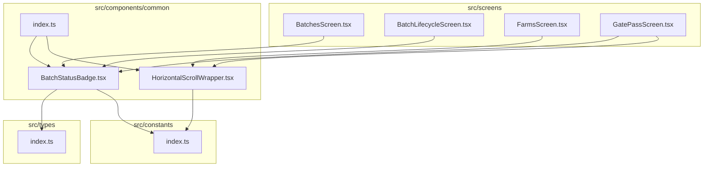
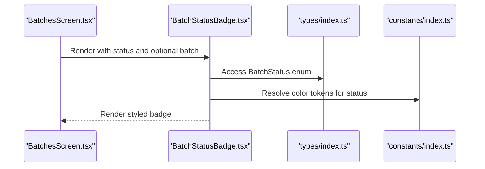
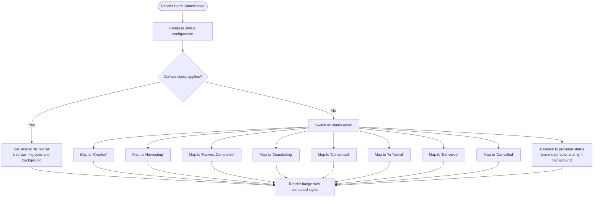
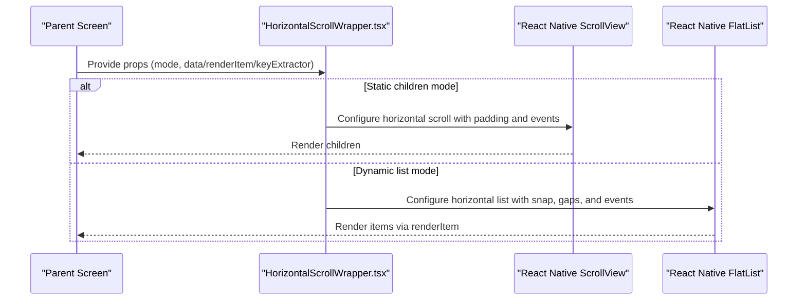
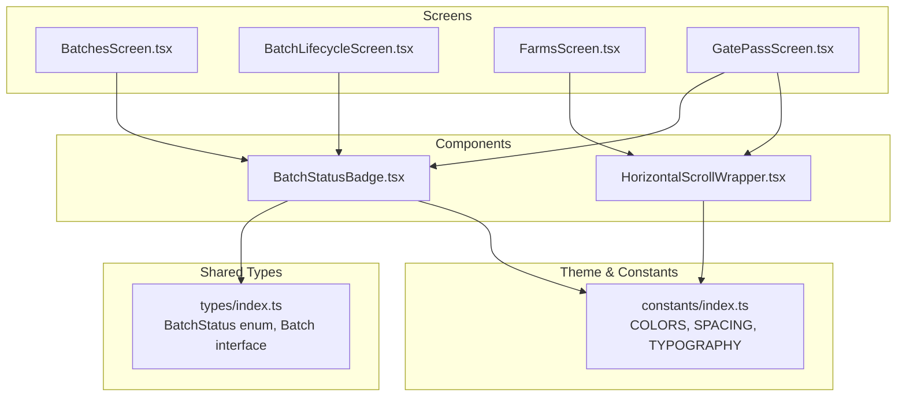

# Common Utility Components

<cite>
**Referenced Files in This Document**
- [BatchStatusBadge.tsx](file://src/components/common/BatchStatusBadge.tsx)
- [HorizontalScrollWrapper.tsx](file://src/components/common/HorizontalScrollWrapper.tsx)
- [index.ts](file://src/components/common/index.ts)
- [index.ts](file://src/types/index.ts)
- [index.ts](file://src/constants/index.ts)
- [BatchesScreen.tsx](file://src/screens/batches/BatchesScreen.tsx)
- [BatchLifecycleScreen.tsx](file://src/screens/batches/BatchLifecycleScreen.tsx)
- [FarmsScreen.tsx](file://src/screens/farms/FarmsScreen.tsx)
- [GatePassScreen.tsx](file://src/screens/harvest/GatePassScreen.tsx)
</cite>

## Table of Contents
1. [Introduction](#introduction)
2. [Project Structure](#project-structure)
3. [Core Components](#core-components)
4. [Architecture Overview](#architecture-overview)
5. [Detailed Component Analysis](#detailed-component-analysis)
6. [Dependency Analysis](#dependency-analysis)
7. [Performance Considerations](#performance-considerations)
8. [Accessibility Considerations](#accessibility-considerations)
9. [Troubleshooting Guide](#troubleshooting-guide)
10. [Conclusion](#conclusion)

## Introduction
This document provides comprehensive documentation for two common utility components that power the Banana Harvest App interface:
- BatchStatusBadge: A status visualization component that renders contextual badges based on batch lifecycle states, with dynamic logic for real-time updates.
- HorizontalScrollWrapper: A flexible horizontal scrolling container that supports both static children and dynamic FlatList-based lists, enabling responsive layouts and optimized scroll behavior.

These components are designed to maintain consistent UI patterns, support responsive design, and ensure cross-platform compatibility across iOS and Android.

## Project Structure
The common utility components are located under the shared components layer and are exported via a central index file for easy consumption across the application.

**Diagram sources**
- [BatchStatusBadge.tsx](file://src/components/common/BatchStatusBadge.tsx#L1-L98)
- [HorizontalScrollWrapper.tsx](file://src/components/common/HorizontalScrollWrapper.tsx#L1-L191)
- [index.ts](file://src/components/common/index.ts#L1-L3)
- [index.ts](file://src/types/index.ts#L142-L176)
- [index.ts](file://src/constants/index.ts#L21-L138)
- [BatchesScreen.tsx](file://src/screens/batches/BatchesScreen.tsx#L130-L159)
- [BatchLifecycleScreen.tsx](file://src/screens/batches/BatchLifecycleScreen.tsx#L70-L90)
- [FarmsScreen.tsx](file://src/screens/farms/FarmsScreen.tsx#L650-L690)
- [GatePassScreen.tsx](file://src/screens/harvest/GatePassScreen.tsx#L160-L180)

**Section sources**
- [index.ts](file://src/components/common/index.ts#L1-L3)
- [BatchStatusBadge.tsx](file://src/components/common/BatchStatusBadge.tsx#L1-L98)
- [HorizontalScrollWrapper.tsx](file://src/components/common/HorizontalScrollWrapper.tsx#L1-L191)

## Core Components
This section introduces the two components and their roles in the application.

- BatchStatusBadge
  - Purpose: Render contextual status badges for batches with dynamic logic that reflects real-time state transitions (e.g., In Transit vs. Completed).
  - Key features: Color-coded labels, derived status computation, and flexible styling via props.
  - Integration: Used extensively in batch-related screens to display current lifecycle stage.

- HorizontalScrollWrapper
  - Purpose: Provide a unified, responsive horizontal scrolling container supporting both static children and dynamic FlatList-based lists.
  - Key features: Configurable padding, item gaps, snap behavior, scroll indicators, and event callbacks.
  - Integration: Used in multiple screens to present chips, cards, and lists horizontally with optimized performance.

**Section sources**
- [BatchStatusBadge.tsx](file://src/components/common/BatchStatusBadge.tsx#L8-L79)
- [HorizontalScrollWrapper.tsx](file://src/components/common/HorizontalScrollWrapper.tsx#L1-L191)

## Architecture Overview
The components integrate with the application’s type system and theme constants to ensure consistent styling and behavior.

**Diagram sources**
- [BatchesScreen.tsx](file://src/screens/batches/BatchesScreen.tsx#L130-L159)
- [BatchStatusBadge.tsx](file://src/components/common/BatchStatusBadge.tsx#L8-L79)
- [index.ts](file://src/types/index.ts#L142-L176)
- [index.ts](file://src/constants/index.ts#L68-L99)

## Detailed Component Analysis

### BatchStatusBadge Component
Purpose and Behavior
- Renders a small, rounded badge displaying the current status of a batch.
- Implements a prioritized status resolution algorithm:
  - Real-time derived status: If dispatched boxes exceed received boxes, shows “In Transit” regardless of raw status.
  - Final receipt: If harvest completed and all dispatched boxes are received, shows “Received”.
  - Standard statuses: Maps enum values to predefined labels and colors.
  - Fallback: Uses a muted color for unknown or legacy status values.

Prop Interfaces
- status: BatchStatus enum or string representing the current state.
- batch: Optional Batch object used to compute derived statuses (dispatched/received).
- style: Optional ViewStyle to customize badge appearance.

Rendering Logic
- Computes a configuration object containing label, text color, and background color.
- Applies computed styles to a View and Text pair for the badge.

Usage Patterns
- Static usage: Pass status and optional batch to render a contextual badge.
- Scaling adjustments: Apply transforms to fit dense layouts (e.g., scaling down for compact rows).

Integration Examples
- Batches screen: Displays a badge alongside batch metadata.
- Batch lifecycle screen: Shows a centered badge reflecting the active batch’s status.
- Gate pass screen: Renders a scaled badge within a batch selection card.

Accessibility Considerations
- Text is uppercase and bold for readability.
- Color contrast is defined via theme tokens to ensure visibility against backgrounds.

Performance Considerations
- Pure functional component with memoized configuration computation.
- Minimal re-renders when props remain unchanged.

**Diagram sources**
- [BatchStatusBadge.tsx](file://src/components/common/BatchStatusBadge.tsx#L14-L67)

**Section sources**
- [BatchStatusBadge.tsx](file://src/components/common/BatchStatusBadge.tsx#L8-L79)
- [index.ts](file://src/types/index.ts#L142-L176)
- [index.ts](file://src/constants/index.ts#L68-L99)
- [BatchesScreen.tsx](file://src/screens/batches/BatchesScreen.tsx#L130-L159)
- [BatchLifecycleScreen.tsx](file://src/screens/batches/BatchLifecycleScreen.tsx#L70-L90)
- [GatePassScreen.tsx](file://src/screens/harvest/GatePassScreen.tsx#L160-L180)

### HorizontalScrollWrapper Component
Purpose and Behavior
- Provides a unified horizontal scroll container supporting:
  - Static children mode: Wraps arbitrary children in a ScrollView.
  - Dynamic list mode: Uses FlatList for efficient rendering of large datasets.
- Offers extensive customization for padding, item gaps, snapping, scroll indicators, and event callbacks.

Prop Interfaces
- BaseProps:
  - containerStyle: Outer container style.
  - contentStyle: Content container style (padding inside the scroll area).
  - horizontalPadding: Horizontal padding around content (default: 16).
  - itemGap: Gap between items in FlatList mode (default: 10).
  - showScrollIndicator: Whether to show the horizontal scroll indicator (default: false).
  - snapEnabled: Enable iOS-style snap-to-alignment (default: false).
  - snapInterval: Width to snap to (e.g., card width + gap).
  - decelerationRate: 'fast' or 'normal' (default: 'fast').
  - onScroll/onMomentumScrollEnd: Scroll event handlers.
- ChildrenProps (static children mode): Requires children and excludes FlatList props.
- ListProps<T> (dynamic list mode): Requires data, renderItem, keyExtractor, and optional EmptyComponent and extra FlatList props.

Rendering Logic
- Detects mode based on presence of data prop.
- In static mode: Renders ScrollView with horizontal orientation and configured padding.
- In dynamic mode: Renders FlatList with horizontal orientation, snap settings, and ItemSeparatorComponent for gaps.

Usage Patterns
- Static children: Wrap a series of chips or cards for quick selection.
- Dynamic lists: Render horizontally scrolling lists of items with efficient virtualization.

Integration Examples
- Farms screen: Horizontal vendor selection chips with tight spacing.
- Batch lifecycle screen: Horizontal photo thumbnails.
- Gate pass screen: Horizontal batch selector with FlatList mode and empty state handling.

Accessibility Considerations
- Keyboard persistence is handled to keep inputs accessible while scrolling.
- Scroll indicators can be toggled for clarity on devices where they aid navigation.

Performance Considerations
- Uses FlatList in list mode for efficient rendering of large datasets.
- scrollEventThrottle is set to optimize scroll performance.
- Snap behavior is configurable for smooth user interactions.

**Diagram sources**
- [HorizontalScrollWrapper.tsx](file://src/components/common/HorizontalScrollWrapper.tsx#L83-L175)

**Section sources**
- [HorizontalScrollWrapper.tsx](file://src/components/common/HorizontalScrollWrapper.tsx#L34-L191)
- [FarmsScreen.tsx](file://src/screens/farms/FarmsScreen.tsx#L650-L690)
- [BatchLifecycleScreen.tsx](file://src/screens/batches/BatchLifecycleScreen.tsx#L280-L295)
- [GatePassScreen.tsx](file://src/screens/harvest/GatePassScreen.tsx#L254-L269)

## Dependency Analysis
The components rely on shared types and constants to maintain consistent theming and behavior.

**Diagram sources**
- [BatchStatusBadge.tsx](file://src/components/common/BatchStatusBadge.tsx#L1-L98)
- [HorizontalScrollWrapper.tsx](file://src/components/common/HorizontalScrollWrapper.tsx#L1-L191)
- [index.ts](file://src/types/index.ts#L142-L176)
- [index.ts](file://src/constants/index.ts#L21-L138)
- [BatchesScreen.tsx](file://src/screens/batches/BatchesScreen.tsx#L130-L159)
- [BatchLifecycleScreen.tsx](file://src/screens/batches/BatchLifecycleScreen.tsx#L70-L90)
- [FarmsScreen.tsx](file://src/screens/farms/FarmsScreen.tsx#L650-L690)
- [GatePassScreen.tsx](file://src/screens/harvest/GatePassScreen.tsx#L160-L180)

**Section sources**
- [index.ts](file://src/types/index.ts#L142-L176)
- [index.ts](file://src/constants/index.ts#L21-L138)

## Performance Considerations
- BatchStatusBadge
  - Stateless and lightweight; minimal recomputation through configuration caching.
  - Ideal for frequent re-renders in lists without performance overhead.

- HorizontalScrollWrapper
  - Uses FlatList in list mode for efficient virtualization and memory usage.
  - scrollEventThrottle is set to balance responsiveness and performance.
  - Snap behavior is optional and can be tuned via decelerationRate and snapInterval.

[No sources needed since this section provides general guidance]

## Accessibility Considerations
- BatchStatusBadge
  - Uppercase, bold text improves readability.
  - Color tokens ensure sufficient contrast against backgrounds.

- HorizontalScrollWrapper
  - keyboardShouldPersistTaps is set to "handled" to keep inputs accessible during horizontal scrolling.
  - Optional scroll indicators can help users understand scrollable content.

[No sources needed since this section provides general guidance]

## Troubleshooting Guide
- BatchStatusBadge not updating
  - Ensure the batch prop is passed when derived status logic is required (e.g., In Transit).
  - Verify that status values match the BatchStatus enum or supported string variants.

- HorizontalScrollWrapper not scrolling
  - Confirm that containerStyle does not restrict width or height unexpectedly.
  - In FlatList mode, ensure data is provided and renderItem/keyExtractor are correctly implemented.

- Snap behavior not working
  - Verify snapEnabled is true and snapInterval is set appropriately for the content width plus gaps.

- Scroll events not firing
  - Check onScroll and onMomentumScrollEnd handlers are attached and that scrollEventThrottle is configured.

**Section sources**
- [BatchStatusBadge.tsx](file://src/components/common/BatchStatusBadge.tsx#L14-L67)
- [HorizontalScrollWrapper.tsx](file://src/components/common/HorizontalScrollWrapper.tsx#L83-L175)

## Conclusion
The BatchStatusBadge and HorizontalScrollWrapper components are foundational utilities that enhance user experience by providing consistent, responsive, and accessible UI patterns. They encapsulate complex logic—such as derived status computation and efficient list rendering—while integrating seamlessly with the application’s type system and theme constants. Their modular design enables rapid development and ensures cross-platform compatibility across iOS and Android.