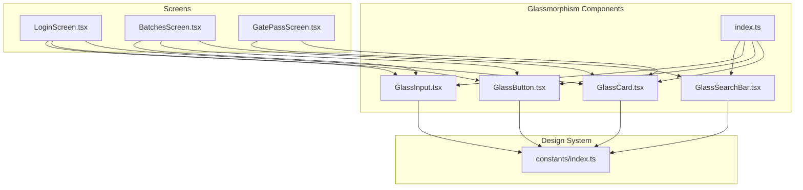
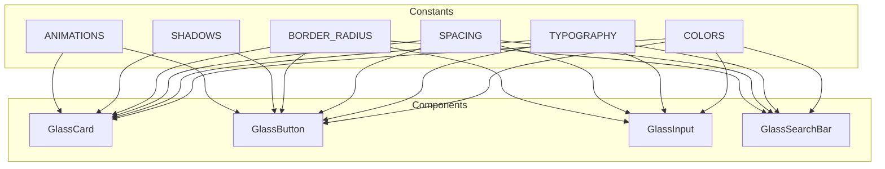
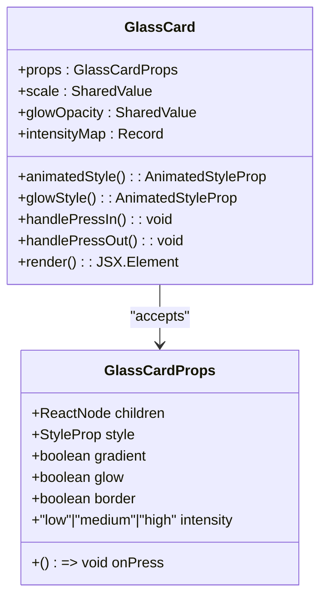
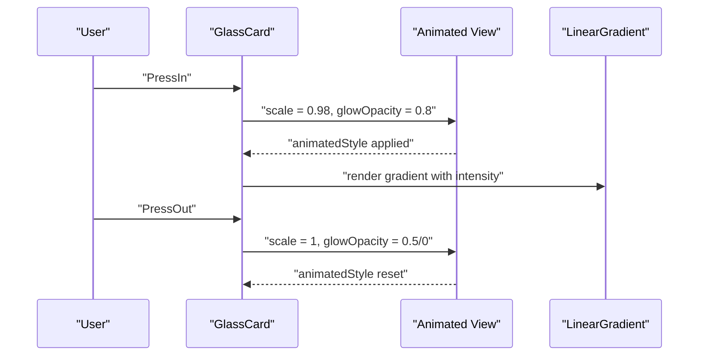
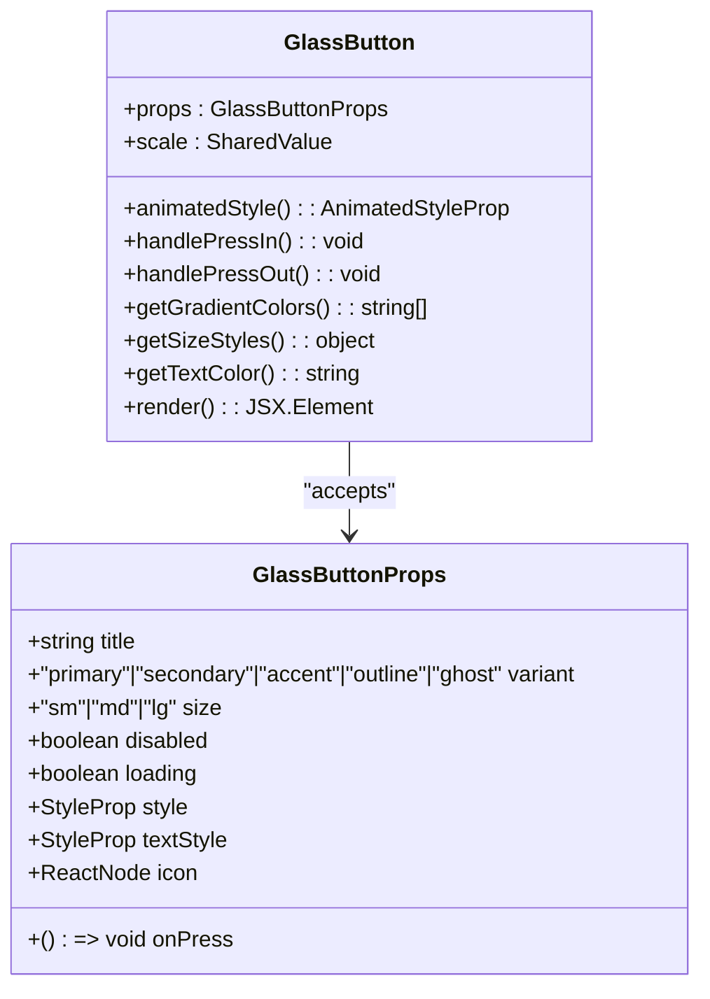
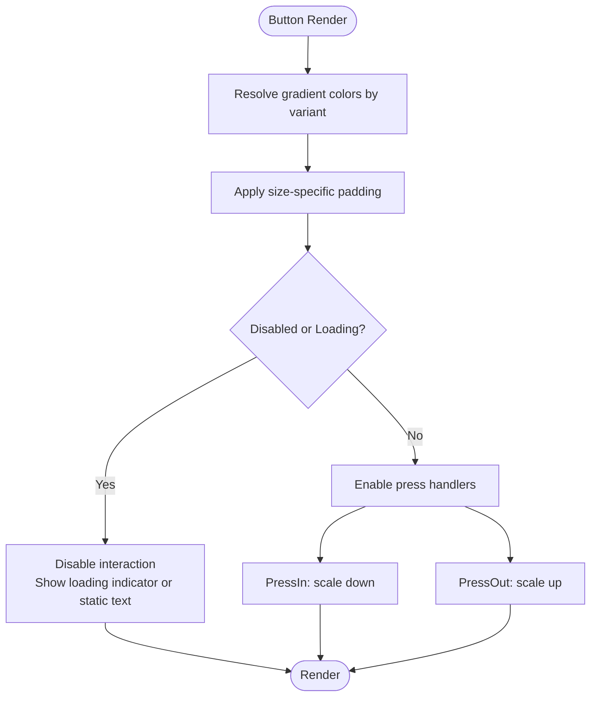
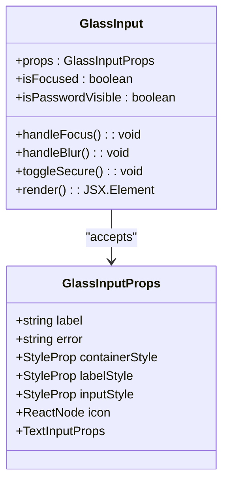
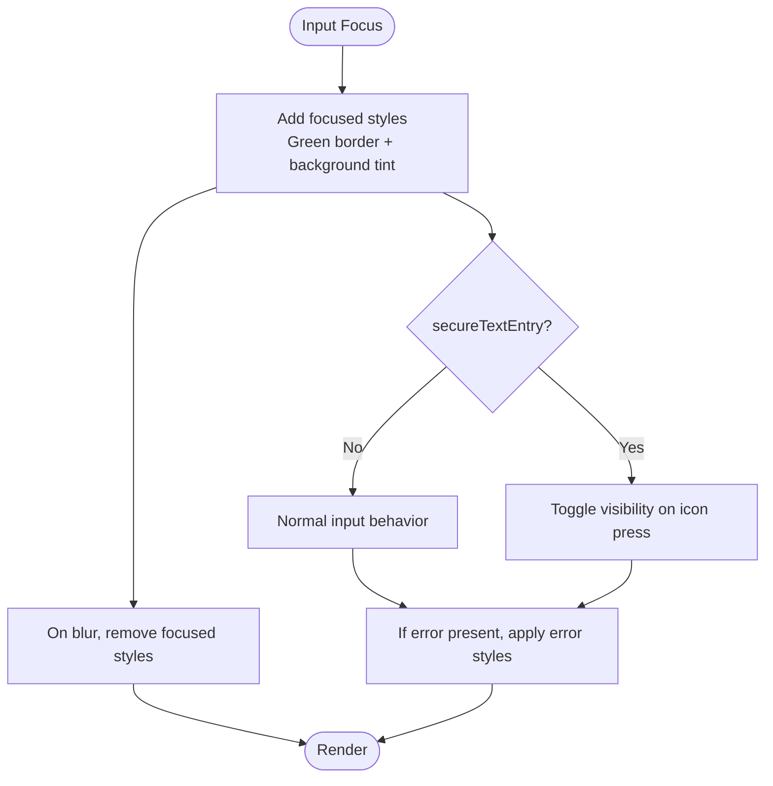
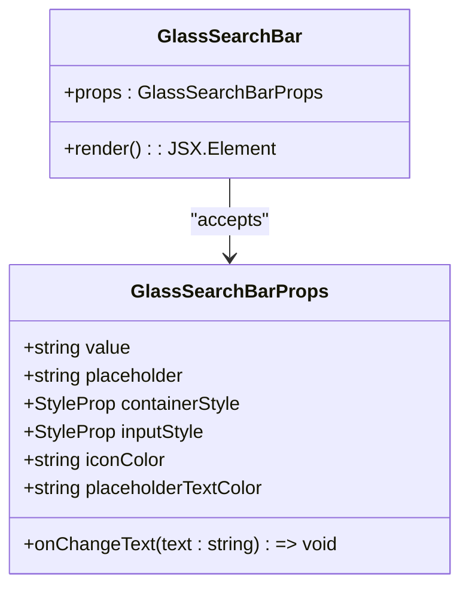
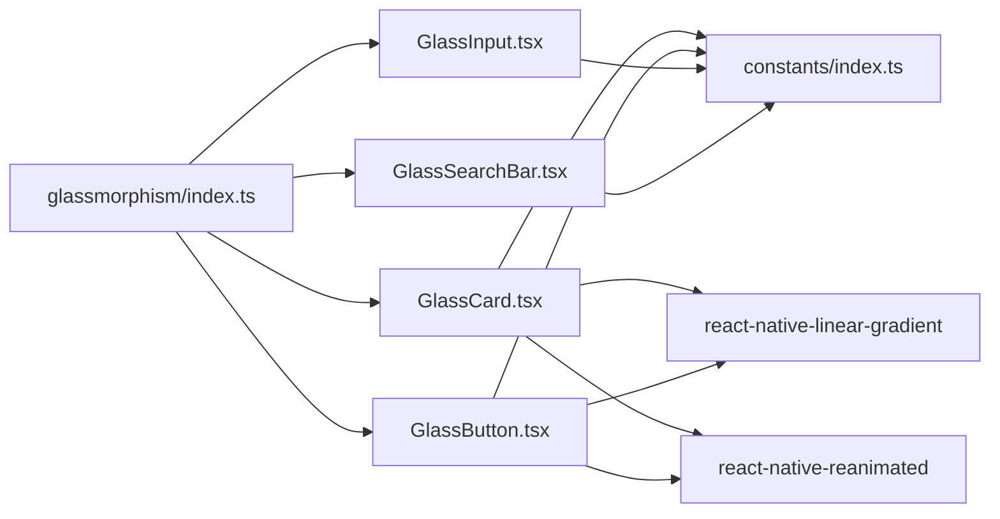

# Glassmorphism Components

<cite>
**Referenced Files in This Document**
- [GlassCard.tsx](file://src/components/glassmorphism/GlassCard.tsx)
- [GlassButton.tsx](file://src/components/glassmorphism/GlassButton.tsx)
- [GlassInput.tsx](file://src/components/glassmorphism/GlassInput.tsx)
- [GlassSearchBar.tsx](file://src/components/glassmorphism/GlassSearchBar.tsx)
- [index.ts](file://src/components/glassmorphism/index.ts)
- [constants/index.ts](file://src/constants/index.ts)
- [LoginScreen.tsx](file://src/screens/auth/LoginScreen.tsx)
- [BatchesScreen.tsx](file://src/screens/batches/BatchesScreen.tsx)
- [GatePassScreen.tsx](file://src/screens/harvest/GatePassScreen.tsx)
</cite>

## Table of Contents
1. [Introduction](#introduction)
2. [Project Structure](#project-structure)
3. [Core Components](#core-components)
4. [Architecture Overview](#architecture-overview)
5. [Detailed Component Analysis](#detailed-component-analysis)
6. [Dependency Analysis](#dependency-analysis)
7. [Performance Considerations](#performance-considerations)
8. [Troubleshooting Guide](#troubleshooting-guide)
9. [Conclusion](#conclusion)
10. [Appendices](#appendices)

## Introduction
This document describes the glassmorphism component library used throughout the Banana Harvest App. It focuses on four reusable UI primitives designed to deliver a modern, translucent, and interactive interface aligned with the app’s dark theme and glass-like aesthetic. The components are:
- GlassCard: A versatile container with gradient backgrounds, optional glow, border, press animations, and adjustable intensity.
- GlassButton: An interactive button with gradient backgrounds, variants, sizes, loading states, and press animations.
- GlassInput: A styled text input with labels, icons, focused/error states, and secure text entry toggles.
- GlassSearchBar: A lightweight search input with icon and placeholder support.

These components integrate with a centralized design system that defines colors, typography, spacing, radius, shadows, and animation presets.

## Project Structure
The glassmorphism components live under a dedicated folder and are exported via a barrel index for easy consumption across the app. They rely on shared design tokens from the constants module.

**Diagram sources**
- [GlassCard.tsx](file://src/components/glassmorphism/GlassCard.tsx#L1-L133)
- [GlassButton.tsx](file://src/components/glassmorphism/GlassButton.tsx#L1-L165)
- [GlassInput.tsx](file://src/components/glassmorphism/GlassInput.tsx#L1-L136)
- [GlassSearchBar.tsx](file://src/components/glassmorphism/GlassSearchBar.tsx#L1-L60)
- [index.ts](file://src/components/glassmorphism/index.ts#L1-L5)
- [constants/index.ts](file://src/constants/index.ts#L1-L363)
- [LoginScreen.tsx](file://src/screens/auth/LoginScreen.tsx#L1-L200)
- [BatchesScreen.tsx](file://src/screens/batches/BatchesScreen.tsx#L1-L200)
- [GatePassScreen.tsx](file://src/screens/harvest/GatePassScreen.tsx#L240-L269)

**Section sources**
- [index.ts](file://src/components/glassmorphism/index.ts#L1-L5)
- [constants/index.ts](file://src/constants/index.ts#L1-L363)

## Core Components
This section summarizes each component’s purpose, props, and customization options.

- GlassCard
  - Purpose: A container with gradient background, optional glow, border, and press animations.
  - Key props: children, style, onPress, gradient, glow, border, intensity ('low' | 'medium' | 'high').
  - Intensity levels: low, medium, high map to different alpha values for the background gradient.
  - Press behavior: Scales down slightly and increases glow opacity during press.

- GlassButton
  - Purpose: A gradient-styled button with variants, sizes, loading states, and press animations.
  - Key props: title, onPress, variant ('primary' | 'secondary' | 'accent' | 'outline' | 'ghost'), size ('sm' | 'md' | 'lg'), disabled, loading, style, textStyle, icon.
  - Variants: primary, secondary, accent, outline, ghost; outline and ghost use transparent gradients with colored borders/text.
  - Sizes: small, medium, large paddings.
  - Loading: displays an activity indicator with text color matching variant.

- GlassInput
  - Purpose: A labeled input field with icon, focused/error states, and secure text toggle.
  - Key props: label, error, containerStyle, labelStyle, inputStyle, icon, plus all TextInputProps.
  - States: focused highlights with a green border and subtle background tint; error applies a red border.
  - Secure entry: optional toggle to show/hide password.

- GlassSearchBar
  - Purpose: A compact search input with magnifier icon and placeholder.
  - Key props: value, onChangeText, placeholder, containerStyle, inputStyle, iconColor, placeholderTextColor.
  - Behavior: Real-time filtering is handled by parent screens (e.g., GatePassScreen).

**Section sources**
- [GlassCard.tsx](file://src/components/glassmorphism/GlassCard.tsx#L11-L19)
- [GlassButton.tsx](file://src/components/glassmorphism/GlassButton.tsx#L19-L29)
- [GlassInput.tsx](file://src/components/glassmorphism/GlassInput.tsx#L13-L20)
- [GlassSearchBar.tsx](file://src/components/glassmorphism/GlassSearchBar.tsx#L6-L14)

## Architecture Overview
The components share a common design system via constants for colors, typography, spacing, border radius, shadows, and animation presets. They use React Native Reanimated for smooth press animations and react-native-linear-gradient for glass-like backgrounds.

**Diagram sources**
- [constants/index.ts](file://src/constants/index.ts#L21-L138)
- [GlassCard.tsx](file://src/components/glassmorphism/GlassCard.tsx#L8-L9)
- [GlassButton.tsx](file://src/components/glassmorphism/GlassButton.tsx#L17-L17)

## Detailed Component Analysis

### GlassCard
GlassCard renders a container with a gradient background and optional glow and border. It supports press animations using Reanimated to scale down and increase glow opacity.

**Diagram sources**
- [GlassCard.tsx](file://src/components/glassmorphism/GlassCard.tsx#L11-L101)

**Diagram sources**
- [GlassCard.tsx](file://src/components/glassmorphism/GlassCard.tsx#L32-L57)

Key customization options:
- intensity: low, medium, high adjusts the alpha of the gradient background.
- glow: toggles a luminous border effect using a LinearGradient overlay.
- border: toggles a thin white border around the card.
- onPress: wraps the content in an animated touchable for press feedback.

Usage example references:
- Login screen card with high intensity.
- Batch list items as cards.

**Section sources**
- [GlassCard.tsx](file://src/components/glassmorphism/GlassCard.tsx#L11-L101)
- [constants/index.ts](file://src/constants/index.ts#L52-L58)
- [LoginScreen.tsx](file://src/screens/auth/LoginScreen.tsx#L109-L150)
- [BatchesScreen.tsx](file://src/screens/batches/BatchesScreen.tsx#L117-L159)

### GlassButton
GlassButton provides a gradient-styled button with multiple variants, sizes, and loading states. It animates on press and supports icons and custom styles.

**Diagram sources**
- [GlassButton.tsx](file://src/components/glassmorphism/GlassButton.tsx#L19-L43)

**Diagram sources**
- [GlassButton.tsx](file://src/components/glassmorphism/GlassButton.tsx#L44-L58)
- [GlassButton.tsx](file://src/components/glassmorphism/GlassButton.tsx#L60-L95)

Key customization options:
- variant: primary, secondary, accent, outline, ghost; outline/ghost use transparent gradients with colored borders/text.
- size: sm, md, lg adjust padding.
- loading: replaces text with an activity indicator; text color adapts to variant.
- disabled: disables interaction and reduces opacity.
- icon: optional leading icon node.

Usage example references:
- Login screen submit button with primary variant and large size.
- Batch inspection actions with primary/secondary variants and small size.

**Section sources**
- [GlassButton.tsx](file://src/components/glassmorphism/GlassButton.tsx#L19-L138)
- [constants/index.ts](file://src/constants/index.ts#L29-L50)
- [LoginScreen.tsx](file://src/screens/auth/LoginScreen.tsx#L139-L146)
- [BatchesScreen.tsx](file://src/screens/batches/BatchesScreen.tsx#L179-L195)

### GlassInput
GlassInput is a labeled text input with optional icon, focused/error states, and secure text toggle. It integrates with the design system for colors and spacing.

**Diagram sources**
- [GlassInput.tsx](file://src/components/glassmorphism/GlassInput.tsx#L13-L31)

**Diagram sources**
- [GlassInput.tsx](file://src/components/glassmorphism/GlassInput.tsx#L32-L73)

Key customization options:
- label: optional label text with muted color.
- icon: optional leading icon node.
- error: displays error text and applies error border.
- secureTextEntry: toggles password visibility with an icon.

Usage example references:
- Login screen email and password inputs with labels and error handling.
- Registration and batch screens with similar patterns.

**Section sources**
- [GlassInput.tsx](file://src/components/glassmorphism/GlassInput.tsx#L13-L82)
- [constants/index.ts](file://src/constants/index.ts#L60-L66)
- [LoginScreen.tsx](file://src/screens/auth/LoginScreen.tsx#L120-L137)

### GlassSearchBar
GlassSearchBar is a minimal search input with an icon and placeholder. Filtering is performed by parent screens using the provided value and onChange callback.

**Diagram sources**
- [GlassSearchBar.tsx](file://src/components/glassmorphism/GlassSearchBar.tsx#L6-L24)

Real-time filtering example:
- GatePassScreen maintains a searchQuery state and filters batches based on farm name and batch ID.

**Section sources**
- [GlassSearchBar.tsx](file://src/components/glassmorphism/GlassSearchBar.tsx#L6-L37)
- [GatePassScreen.tsx](file://src/screens/harvest/GatePassScreen.tsx#L90-L95)

## Dependency Analysis
The components depend on shared design tokens and third-party libraries for animations and gradients. The barrel index exports all components for convenient imports.

**Diagram sources**
- [index.ts](file://src/components/glassmorphism/index.ts#L1-L5)
- [GlassCard.tsx](file://src/components/glassmorphism/GlassCard.tsx#L3-L8)
- [GlassButton.tsx](file://src/components/glassmorphism/GlassButton.tsx#L11-L16)
- [constants/index.ts](file://src/constants/index.ts#L1-L363)

**Section sources**
- [index.ts](file://src/components/glassmorphism/index.ts#L1-L5)
- [GlassCard.tsx](file://src/components/glassmorphism/GlassCard.tsx#L3-L8)
- [GlassButton.tsx](file://src/components/glassmorphism/GlassButton.tsx#L11-L16)

## Performance Considerations
- Animations: Reanimated is used for hardware-accelerated transforms and opacity changes, minimizing layout thrashing.
- Gradients: react-native-linear-gradient renders efficiently; keep gradient stops minimal and avoid deep nesting.
- Press feedback: Scale and glow updates are throttled by Reanimated springs; avoid excessive re-renders by passing memoized callbacks.
- Inputs: Secure text toggling and focus states are lightweight; avoid heavy computations in onChangeText for search bars.
- Lists: For large datasets, prefer FlatList and memoization; the GatePassScreen demonstrates filtering without external debouncing.

[No sources needed since this section provides general guidance]

## Troubleshooting Guide
Common issues and resolutions:
- Glow not visible: Ensure glow prop is true and the container has sufficient padding to reveal the glow overlay.
- Button not responding: Verify disabled and loading props; disabled buttons prevent press handlers from firing.
- Input border not changing: Confirm focused and error states are not conflicting; focused takes precedence over error.
- Search not filtering: Ensure parent screen updates state and recomputes filtered lists on value change.

**Section sources**
- [GlassCard.tsx](file://src/components/glassmorphism/GlassCard.tsx#L28-L30)
- [GlassButton.tsx](file://src/components/glassmorphism/GlassButton.tsx#L38-L40)
- [GlassInput.tsx](file://src/components/glassmorphism/GlassInput.tsx#L32-L47)
- [GatePassScreen.tsx](file://src/screens/harvest/GatePassScreen.tsx#L90-L95)

## Conclusion
The glassmorphism component library delivers a cohesive, visually appealing UI with consistent interactivity and styling. By leveraging shared design tokens and Reanimated, the components provide smooth animations and responsive feedback. Their compositional simplicity enables flexible usage across screens while maintaining design system alignment.

[No sources needed since this section summarizes without analyzing specific files]

## Appendices

### Prop Interfaces Summary
- GlassCardProps
  - children: ReactNode
  - style: StyleProp<ViewStyle>
  - onPress: () => void
  - gradient: boolean
  - glow: boolean
  - border: boolean
  - intensity: 'low' | 'medium' | 'high'

- GlassButtonProps
  - title: string
  - onPress: () => void
  - variant: 'primary' | 'secondary' | 'accent' | 'outline' | 'ghost'
  - size: 'sm' | 'md' | 'lg'
  - disabled: boolean
  - loading: boolean
  - style: StyleProp<ViewStyle>
  - textStyle: StyleProp<TextStyle>
  - icon: ReactNode

- GlassInputProps
  - label: string
  - error: string
  - containerStyle: StyleProp<ViewStyle>
  - labelStyle: StyleProp<TextStyle>
  - inputStyle: StyleProp<TextStyle>
  - icon: ReactNode
  - secureTextEntry: boolean
  - Plus all TextInputProps

- GlassSearchBarProps
  - value: string
  - onChangeText: (text: string) => void
  - placeholder: string
  - containerStyle: StyleProp<ViewStyle>
  - inputStyle: StyleProp<TextStyle>
  - iconColor: string
  - placeholderTextColor: string

**Section sources**
- [GlassCard.tsx](file://src/components/glassmorphism/GlassCard.tsx#L11-L19)
- [GlassButton.tsx](file://src/components/glassmorphism/GlassButton.tsx#L19-L29)
- [GlassInput.tsx](file://src/components/glassmorphism/GlassInput.tsx#L13-L20)
- [GlassSearchBar.tsx](file://src/components/glassmorphism/GlassSearchBar.tsx#L6-L14)

### Usage Examples (by reference)
- LoginScreen
  - GlassCard with high intensity
  - GlassInput for email/password
  - GlassButton for submit
  - Reference: [LoginScreen.tsx](file://src/screens/auth/LoginScreen.tsx#L109-L146)

- BatchesScreen
  - GlassCard for batch items
  - GlassButton for inspection actions
  - GlassInput for forms
  - Reference: [BatchesScreen.tsx](file://src/screens/batches/BatchesScreen.tsx#L117-L195)

- GatePassScreen
  - GlassSearchBar for filtering batches
  - GlassCard for summary
  - Reference: [GatePassScreen.tsx](file://src/screens/harvest/GatePassScreen.tsx#L243-L247)