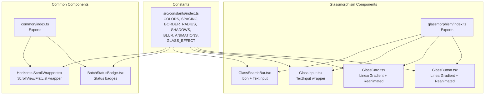
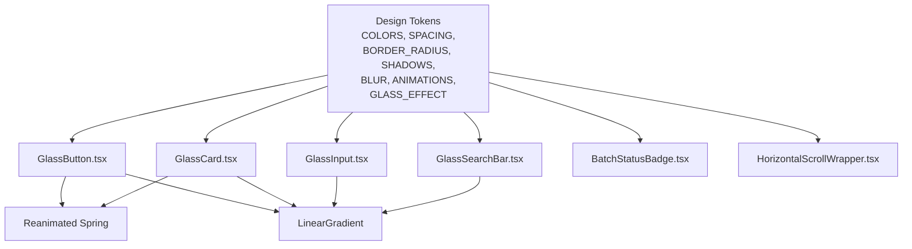
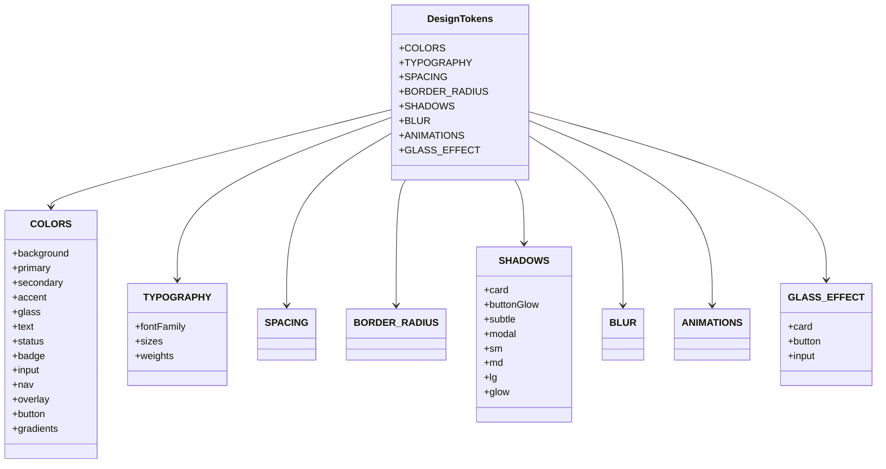
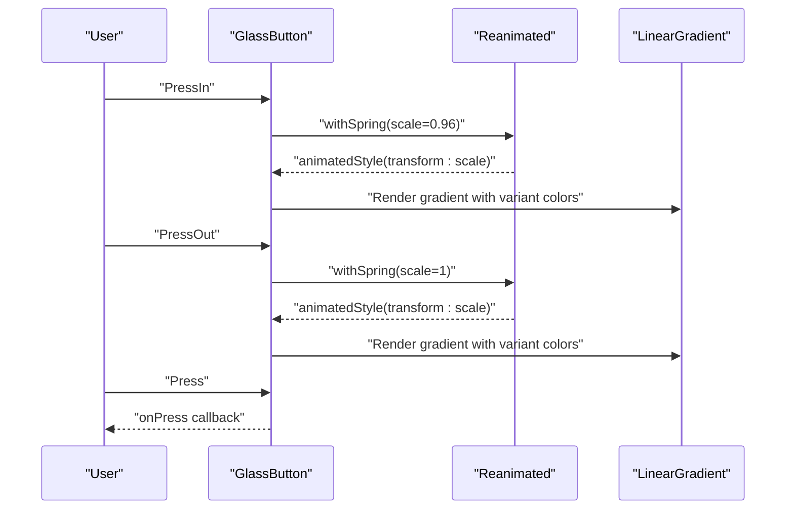
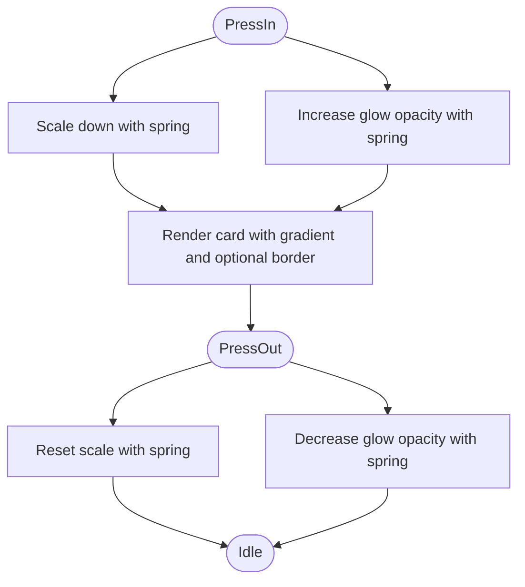
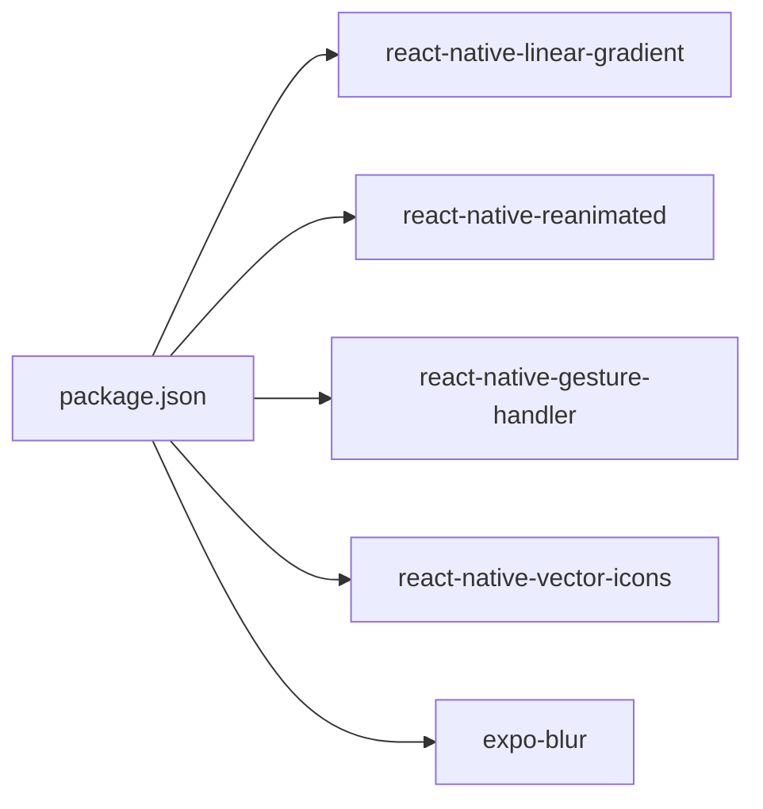

# Styling Architecture & Design System

<cite>
**Referenced Files in This Document**
- [index.ts](file://src/constants/index.ts)
- [GlassButton.tsx](file://src/components/glassmorphism/GlassButton.tsx)
- [GlassCard.tsx](file://src/components/glassmorphism/GlassCard.tsx)
- [GlassInput.tsx](file://src/components/glassmorphism/GlassInput.tsx)
- [GlassSearchBar.tsx](file://src/components/glassmorphism/GlassSearchBar.tsx)
- [BatchStatusBadge.tsx](file://src/components/common/BatchStatusBadge.tsx)
- [HorizontalScrollWrapper.tsx](file://src/components/common/HorizontalScrollWrapper.tsx)
- [index.ts](file://src/components/glassmorphism/index.ts)
- [index.ts](file://src/components/common/index.ts)
- [package.json](file://package.json)
- [metro.config.js](file://metro.config.js)
</cite>

## Table of Contents
1. [Introduction](#introduction)
2. [Project Structure](#project-structure)
3. [Core Components](#core-components)
4. [Architecture Overview](#architecture-overview)
5. [Detailed Component Analysis](#detailed-component-analysis)
6. [Dependency Analysis](#dependency-analysis)
7. [Performance Considerations](#performance-considerations)
8. [Troubleshooting Guide](#troubleshooting-guide)
9. [Conclusion](#conclusion)
10. [Appendices](#appendices)

## Introduction
This document describes the styling architecture and design system of the Banana Harvest App component library. It focuses on the design token system (colors, spacing, border radii), glassmorphism design principles, animation framework integration with React Native Reanimated, responsive design patterns, platform-specific adaptations, accessibility compliance, extension guidelines, and performance optimization techniques for animations and gradients.

## Project Structure
The styling system is organized around a central constants module that defines design tokens and presets, and a set of glassmorphic UI components that consume these tokens. Supporting common components provide additional UI primitives and layout helpers.

**Diagram sources**
- [index.ts](file://src/constants/index.ts#L1-L363)
- [GlassButton.tsx](file://src/components/glassmorphism/GlassButton.tsx#L1-L165)
- [GlassCard.tsx](file://src/components/glassmorphism/GlassCard.tsx#L1-L133)
- [GlassInput.tsx](file://src/components/glassmorphism/GlassInput.tsx#L1-L136)
- [GlassSearchBar.tsx](file://src/components/glassmorphism/GlassSearchBar.tsx#L1-L60)
- [BatchStatusBadge.tsx](file://src/components/common/BatchStatusBadge.tsx#L1-L98)
- [HorizontalScrollWrapper.tsx](file://src/components/common/HorizontalScrollWrapper.tsx#L1-L191)
- [index.ts](file://src/components/glassmorphism/index.ts#L1-L5)
- [index.ts](file://src/components/common/index.ts#L1-L3)

**Section sources**
- [index.ts](file://src/constants/index.ts#L1-L363)
- [index.ts](file://src/components/glassmorphism/index.ts#L1-L5)
- [index.ts](file://src/components/common/index.ts#L1-L3)

## Core Components
- Design tokens: Centralized definitions for colors, typography, spacing, border radii, shadows, blur, and animation presets.
- Glassmorphism components: Reusable UI elements implementing glass-like visuals with gradients, borders, and optional glow effects.
- Common components: Utility components that complement the glassmorphism system (badges, horizontal scrolling).

Key token categories:
- COLORS: Background gradients, primary/accent palettes, glass surfaces, text, status, inputs, navigation, overlays, buttons, and legacy gradients.
- TYPOGRAPHY: Font families, sizes, and weights.
- SPACING: Consistent spacing scale for paddings, gaps, and margins.
- BORDER_RADIUS: Standardized corner radii for rounded elements.
- SHADOWS: Platform-appropriate shadow configurations for cards, buttons, modals, and glows.
- BLUR: Blur values tailored for glass cards, inputs, navigation, and modals.
- ANIMATIONS: Duration presets and spring physics for smooth transitions.
- GLASS_EFFECT: Predefined styles for glass cards, buttons, and inputs.

**Section sources**
- [index.ts](file://src/constants/index.ts#L18-L324)

## Architecture Overview
The design system follows a unidirectional data flow:
- Constants define tokens and presets.
- Components import tokens to maintain visual consistency.
- Animations integrate with Reanimated for interactive states.
- Gradients from react-native-linear-gradient provide glass and glow visuals.
- Platform-specific rendering is handled by React Native’s native drivers and shadow elevations.

**Diagram sources**
- [index.ts](file://src/constants/index.ts#L18-L324)
- [GlassButton.tsx](file://src/components/glassmorphism/GlassButton.tsx#L1-L165)
- [GlassCard.tsx](file://src/components/glassmorphism/GlassCard.tsx#L1-L133)
- [GlassInput.tsx](file://src/components/glassmorphism/GlassInput.tsx#L1-L136)
- [GlassSearchBar.tsx](file://src/components/glassmorphism/GlassSearchBar.tsx#L1-L60)
- [BatchStatusBadge.tsx](file://src/components/common/BatchStatusBadge.tsx#L1-L98)
- [HorizontalScrollWrapper.tsx](file://src/components/common/HorizontalScrollWrapper.tsx#L1-L191)

## Detailed Component Analysis

### Design Token System
- Color palette (COLORS): Defines background gradients, primary/accent hues, glass surfaces, text states, status indicators, inputs, navigation, overlays, and button gradients. Includes legacy gradient presets for backward compatibility.
- Typography (TYPOGRAPHY): Provides font families and size/weight scales for consistent text hierarchy.
- Spacing (SPACING): A compact scale enabling predictable layouts across components.
- Border radius (BORDER_RADIUS): Standardized radii for rounded corners across components.
- Shadows (SHADOWS): Comprehensive shadow profiles for cards, buttons, modals, and glow effects, including elevation for Android.
- Blur (BLUR): Targeted blur values for glass surfaces.
- Animations (ANIMATIONS): Duration presets and spring physics for transitions.
- Glass effect presets (GLASS_EFFECT): Ready-to-use style sets for cards, buttons, and inputs.

**Diagram sources**
- [index.ts](file://src/constants/index.ts#L18-L324)

**Section sources**
- [index.ts](file://src/constants/index.ts#L18-L324)

### GlassButton
- Purpose: Interactive button with gradient backgrounds, optional outline/ghost variants, and loading states.
- Glassmorphism: Uses linear gradients and shared border/background tokens; supports outline/ghost variants by rendering transparent gradients with bordered containers.
- Animation: Integrates Reanimated with spring-based scaling on press-in/out for tactile feedback.
- Variants and sizing: Controlled via props; text color adapts per variant; icon support included.

**Diagram sources**
- [GlassButton.tsx](file://src/components/glassmorphism/GlassButton.tsx#L1-L165)
- [index.ts](file://src/constants/index.ts#L18-L324)

**Section sources**
- [GlassButton.tsx](file://src/components/glassmorphism/GlassButton.tsx#L1-L165)
- [index.ts](file://src/constants/index.ts#L18-L324)

### GlassCard
- Purpose: Container with optional gradient, border, glow, and pressable interactions.
- Glassmorphism: Implements layered gradient backgrounds, optional border, and a glow layer rendered behind content with animated opacity.
- Animation: Spring-based scaling and glow opacity adjustments on press events.
- Intensity: Low/medium/high intensity maps provide consistent translucency levels.

**Diagram sources**
- [GlassCard.tsx](file://src/components/glassmorphism/GlassCard.tsx#L1-L133)
- [index.ts](file://src/constants/index.ts#L18-L324)

**Section sources**
- [GlassCard.tsx](file://src/components/glassmorphism/GlassCard.tsx#L1-L133)
- [index.ts](file://src/constants/index.ts#L18-L324)

### GlassInput
- Purpose: Styled input field with label, icon, focus/error states, and optional secure entry toggle.
- Glassmorphism: Uses glass background and border tokens; focus state adjusts border thickness and background tint; error state applies status border.
- Interaction: Toggle visibility for secure entries; integrates with placeholder text color tokens.

**Section sources**
- [GlassInput.tsx](file://src/components/glassmorphism/GlassInput.tsx#L1-L136)
- [index.ts](file://src/constants/index.ts#L18-L324)

### GlassSearchBar
- Purpose: Minimal search input with icon and placeholder.
- Glassmorphism: Lightweight glass styling with rounded container and border tokens; consistent typography and spacing.

**Section sources**
- [GlassSearchBar.tsx](file://src/components/glassmorphism/GlassSearchBar.tsx#L1-L60)
- [index.ts](file://src/constants/index.ts#L18-L324)

### BatchStatusBadge
- Purpose: Status indicator with contextual colors and labels.
- Logic: Computes derived statuses (e.g., In Transit vs. Received) based on dispatch/receipt metrics; falls back to standard status mapping.
- Styling: Uses status colors and background tints; small uppercase label with tight spacing.

**Section sources**
- [BatchStatusBadge.tsx](file://src/components/common/BatchStatusBadge.tsx#L1-L98)
- [index.ts](file://src/constants/index.ts#L18-L324)

### HorizontalScrollWrapper
- Purpose: Unified horizontal scrolling container supporting both static children and FlatList-backed lists.
- Features: Padding, item gaps, snap-to-alignment, scroll indicators, and event hooks; preserves keyboard interactions.

**Section sources**
- [HorizontalScrollWrapper.tsx](file://src/components/common/HorizontalScrollWrapper.tsx#L1-L191)

## Dependency Analysis
External libraries and their roles:
- react-native-linear-gradient: Provides gradient backgrounds for glass and glow effects.
- react-native-reanimated: Powers spring-based animations for interactive states.
- react-native-gesture-handler: Enables gesture support for press interactions.
- react-native-vector-icons: Supplies icons for search bar and input actions.
- expo-blur: Offers blur effects for glass surfaces (available in dependencies).
- Platform-specific rendering: React Native handles iOS/Android differences via native drivers and elevation.

**Diagram sources**
- [package.json](file://package.json#L14-L49)

**Section sources**
- [package.json](file://package.json#L14-L49)

## Performance Considerations
- Prefer native driver for animations: The animation presets specify native driver usage to offload work to the UI thread.
- Minimize gradient complexity: Use concise gradient arrays and avoid deep nesting of gradient views.
- Limit animated opacity and blur: Excessive animated opacity or blur can impact frame rates; tune spring stiffness/damping appropriately.
- Optimize scroll lists: Use FlatList with proper key extractors and item separators; leverage snap intervals judiciously.
- Avoid unnecessary re-renders: Keep token imports centralized to prevent redundant recalculations.
- Platform-specific shadows: Use elevation on Android and shadow properties on iOS to balance visual fidelity and performance.

[No sources needed since this section provides general guidance]

## Troubleshooting Guide
- Gradient not visible: Verify gradient colors array and ensure the gradient view covers the intended area.
- Press animations feel sluggish: Adjust spring stiffness and damping in shared values; confirm native driver is enabled.
- Focus state not applying: Confirm focus handlers update internal state and that styles reflect focused state.
- Blur artifacts: Reduce blur radius or disable blur on lower-end devices; test with expo-blur if needed.
- Scroll snapping misalignment: Match snapInterval to item width plus gaps; adjust deceleration rate for smoother UX.

[No sources needed since this section provides general guidance]

## Conclusion
The Banana Harvest App employs a robust, token-driven design system with consistent colors, spacing, and radii. Glassmorphism visuals are achieved through gradients and borders, enhanced by Reanimated animations for interactive feedback. The architecture supports responsive patterns, platform-specific rendering, and maintainable extensions through shared tokens and component presets.

[No sources needed since this section summarizes without analyzing specific files]

## Appendices

### Responsive Design Patterns
- Use SPACING and BORDER_RADIUS consistently across components to maintain proportional scaling.
- Leverage typography scales for readable text across device sizes.
- For layout adaptability, pair fixed-size tokens with flexible container layouts.

[No sources needed since this section provides general guidance]

### Accessibility Compliance
- Ensure sufficient color contrast for text and status indicators against glass backgrounds.
- Provide focus-visible indicators and accessible labels for interactive elements.
- Respect platform accessibility APIs for gestures and animations.

[No sources needed since this section provides general guidance]

### Extension Guidelines
- Add new tokens to the constants module under appropriate categories.
- Create new components using existing tokens and animation presets.
- Maintain variant parity across components to preserve design consistency.
- Document new components with usage examples and prop descriptions.

[No sources needed since this section provides general guidance]