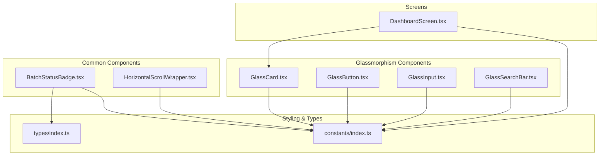
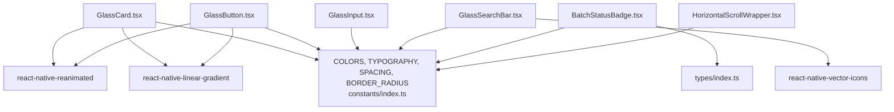
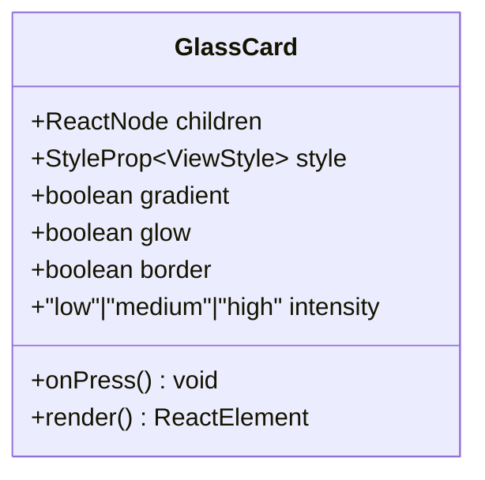
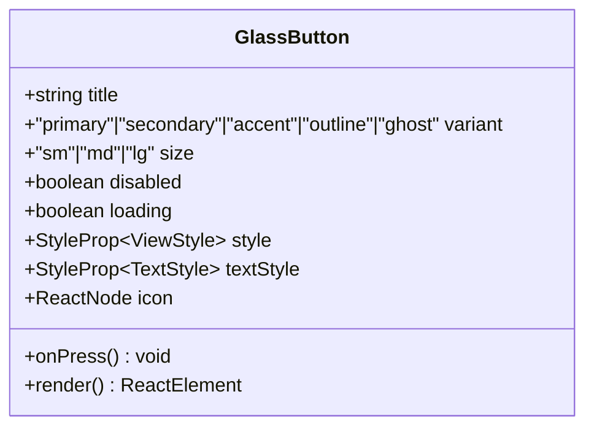
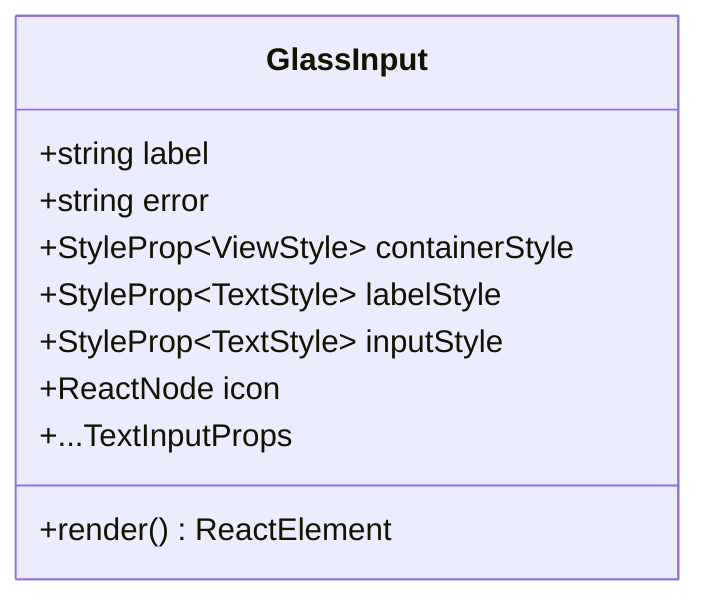
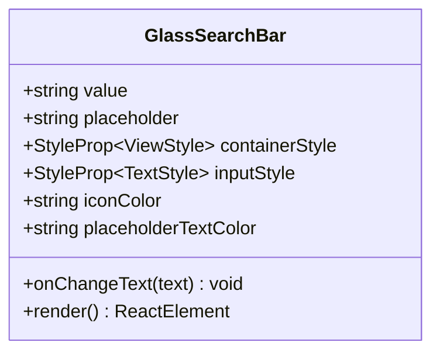
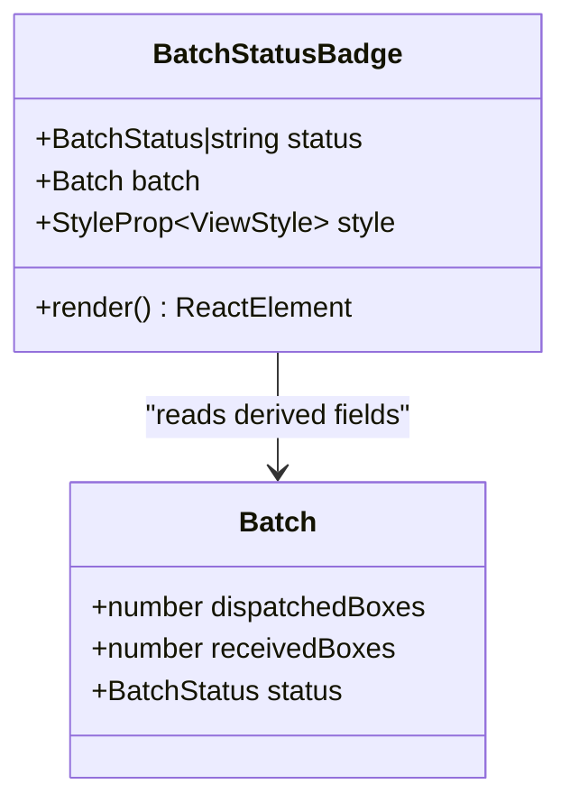
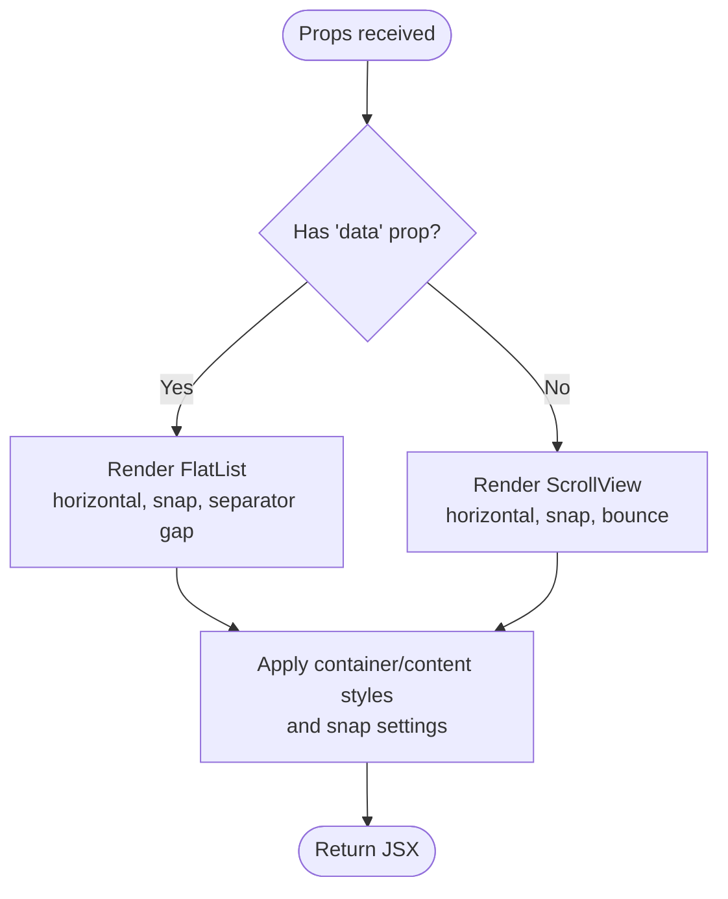
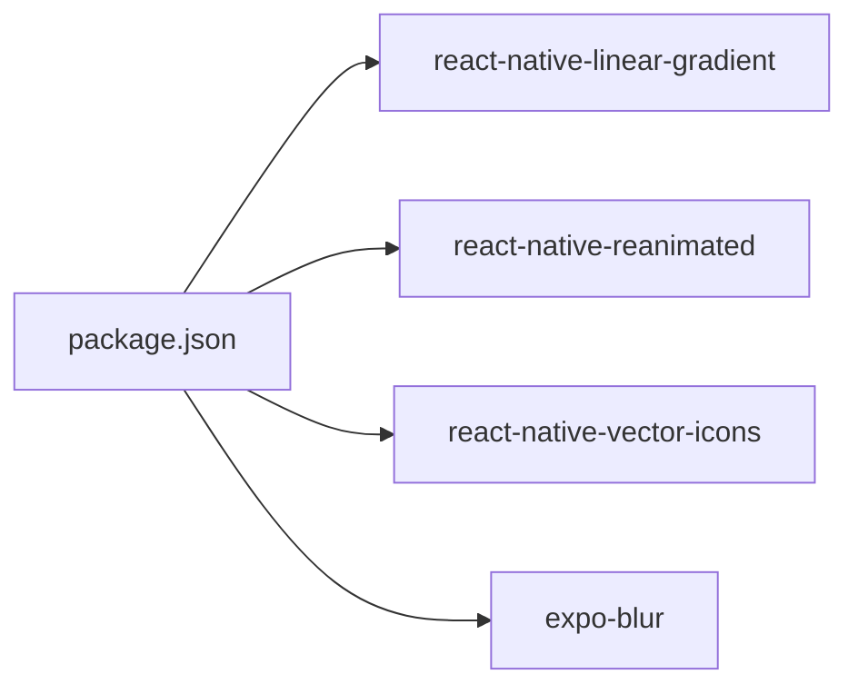

# UI Component System

<cite>
**Referenced Files in This Document**
- [GlassCard.tsx](file://src/components/glassmorphism/GlassCard.tsx)
- [GlassButton.tsx](file://src/components/glassmorphism/GlassButton.tsx)
- [GlassInput.tsx](file://src/components/glassmorphism/GlassInput.tsx)
- [GlassSearchBar.tsx](file://src/components/glassmorphism/GlassSearchBar.tsx)
- [BatchStatusBadge.tsx](file://src/components/common/BatchStatusBadge.tsx)
- [HorizontalScrollWrapper.tsx](file://src/components/common/HorizontalScrollWrapper.tsx)
- [index.ts (glassmorphism exports)](file://src/components/glassmorphism/index.ts)
- [index.ts (common exports)](file://src/components/common/index.ts)
- [constants/index.ts](file://src/constants/index.ts)
- [types/index.ts](file://src/types/index.ts)
- [package.json](file://package.json)
- [DashboardScreen.tsx](file://src/screens/dashboard/DashboardScreen.tsx)
</cite>

## Table of Contents
1. [Introduction](#introduction)
2. [Project Structure](#project-structure)
3. [Core Components](#core-components)
4. [Architecture Overview](#architecture-overview)
5. [Detailed Component Analysis](#detailed-component-analysis)
6. [Dependency Analysis](#dependency-analysis)
7. [Performance Considerations](#performance-considerations)
8. [Troubleshooting Guide](#troubleshooting-guide)
9. [Conclusion](#conclusion)
10. [Appendices](#appendices)

## Introduction
This document describes the Banana Harvest App’s UI component system with a focus on the glassmorphism design pattern. It documents the glassmorphism component library (GlassCard, GlassButton, GlassInput, GlassSearchBar), common utility components (BatchStatusBadge, HorizontalScrollWrapper), the styling architecture using gradient backgrounds and theme constants, and usage patterns across the app. Accessibility and cross-platform compatibility considerations are included, along with performance optimization techniques and reusability patterns.

## Project Structure
The UI component system is organized into two primary areas:
- Glassmorphism components under src/components/glassmorphism
- Common utility components under src/components/common
- Centralized theming and constants under src/constants
- Type definitions under src/types
- Example usage under src/screens

**Diagram sources**
- [GlassCard.tsx](file://src/components/glassmorphism/GlassCard.tsx#L1-L133)
- [GlassButton.tsx](file://src/components/glassmorphism/GlassButton.tsx#L1-L165)
- [GlassInput.tsx](file://src/components/glassmorphism/GlassInput.tsx#L1-L136)
- [GlassSearchBar.tsx](file://src/components/glassmorphism/GlassSearchBar.tsx#L1-L60)
- [BatchStatusBadge.tsx](file://src/components/common/BatchStatusBadge.tsx#L1-L98)
- [HorizontalScrollWrapper.tsx](file://src/components/common/HorizontalScrollWrapper.tsx#L1-L191)
- [constants/index.ts](file://src/constants/index.ts#L1-L363)
- [types/index.ts](file://src/types/index.ts#L1-L429)
- [DashboardScreen.tsx](file://src/screens/dashboard/DashboardScreen.tsx#L1-L200)

**Section sources**
- [index.ts (glassmorphism exports)](file://src/components/glassmorphism/index.ts#L1-L5)
- [index.ts (common exports)](file://src/components/common/index.ts#L1-L3)
- [constants/index.ts](file://src/constants/index.ts#L1-L363)
- [types/index.ts](file://src/types/index.ts#L1-L429)

## Core Components
This section summarizes the glassmorphism components and their roles:
- GlassCard: A versatile container with optional press animations, gradient background, optional border, optional glow, and optional press scaling.
- GlassButton: A gradient-styled button supporting variants, sizes, icons, loading states, and press animations.
- GlassInput: A labeled input with optional icon, secure text entry toggle, focused/error states, and integrated error messaging.
- GlassSearchBar: A minimal search input with icon and placeholder, styled for glassmorphism.

These components share a consistent theming system via constants for colors, typography, spacing, and radius.

**Section sources**
- [GlassCard.tsx](file://src/components/glassmorphism/GlassCard.tsx#L11-L101)
- [GlassButton.tsx](file://src/components/glassmorphism/GlassButton.tsx#L19-L138)
- [GlassInput.tsx](file://src/components/glassmorphism/GlassInput.tsx#L13-L82)
- [GlassSearchBar.tsx](file://src/components/glassmorphism/GlassSearchBar.tsx#L6-L37)
- [constants/index.ts](file://src/constants/index.ts#L18-L138)

## Architecture Overview
The glassmorphism components rely on:
- Theme constants for colors, typography, spacing, and radii
- react-native-linear-gradient for gradient backgrounds
- react-native-reanimated for animated press feedback and glow transitions
- react-native-vector-icons for icons in GlassSearchBar and badges
- MaterialCommunityIcons for dashboard icons

**Diagram sources**
- [constants/index.ts](file://src/constants/index.ts#L18-L138)
- [GlassCard.tsx](file://src/components/glassmorphism/GlassCard.tsx#L3-L8)
- [GlassButton.tsx](file://src/components/glassmorphism/GlassButton.tsx#L11-L16)
- [GlassSearchBar.tsx](file://src/components/glassmorphism/GlassSearchBar.tsx#L3)
- [BatchStatusBadge.tsx](file://src/components/common/BatchStatusBadge.tsx#L3-L4)
- [types/index.ts](file://src/types/index.ts#L142-L176)

## Detailed Component Analysis

### GlassCard
- Purpose: A glass-like container with optional press animation, glow, border, and gradient background.
- Props:
  - children: React.ReactNode
  - style: StyleProp<ViewStyle>
  - onPress: () => void
  - gradient: boolean
  - glow: boolean
  - border: boolean
  - intensity: 'low' | 'medium' | 'high'
- Behavior:
  - Uses Animated TouchableOpacity for press scaling and glow opacity transitions.
  - Renders a LinearGradient backdrop with configurable intensity.
  - Optional glow ring rendered behind the card with a directional gradient.
- Styling:
  - Uses BORDER_RADIUS and SPACING constants.
  - Applies a border when enabled and adjusts padding accordingly.

**Diagram sources**
- [GlassCard.tsx](file://src/components/glassmorphism/GlassCard.tsx#L11-L101)

**Section sources**
- [GlassCard.tsx](file://src/components/glassmorphism/GlassCard.tsx#L11-L133)
- [constants/index.ts](file://src/constants/index.ts#L186-L195)
- [constants/index.ts](file://src/constants/index.ts#L171-L182)

### GlassButton
- Purpose: A gradient-styled button with variants, sizes, icons, loading state, and press feedback.
- Props:
  - title: string
  - onPress: () => void
  - variant: 'primary' | 'secondary' | 'accent' | 'outline' | 'ghost'
  - size: 'sm' | 'md' | 'lg'
  - disabled: boolean
  - loading: boolean
  - style: StyleProp<ViewStyle>
  - textStyle: StyleProp<TextStyle>
  - icon: React.ReactNode
- Behavior:
  - Animated press scaling with spring physics.
  - Variant-specific gradient colors and text color logic.
  - Loading state shows ActivityIndicator with variant-aware color.
- Styling:
  - Uses BORDER_RADIUS and TYPOGRAPHY constants for sizing and typography.

**Diagram sources**
- [GlassButton.tsx](file://src/components/glassmorphism/GlassButton.tsx#L19-L138)

**Section sources**
- [GlassButton.tsx](file://src/components/glassmorphism/GlassButton.tsx#L19-L165)
- [constants/index.ts](file://src/constants/index.ts#L141-L168)
- [constants/index.ts](file://src/constants/index.ts#L186-L195)

### GlassInput
- Purpose: A labeled input with optional icon, secure text entry toggle, focused/error states, and error messaging.
- Props:
  - label: string
  - error: string
  - containerStyle: ViewStyle
  - labelStyle: TextStyle
  - inputStyle: TextStyle
  - icon: React.ReactNode
  - ...TextInputProps
- Behavior:
  - Tracks focus state to adjust border and background.
  - Secure entry toggles visibility with an interactive icon.
  - Inherits TextInputProps for full customization.
- Styling:
  - Uses COLORS.glass.* for background and borders, and COLORS.text.* for placeholders and text.

**Diagram sources**
- [GlassInput.tsx](file://src/components/glassmorphism/GlassInput.tsx#L13-L82)

**Section sources**
- [GlassInput.tsx](file://src/components/glassmorphism/GlassInput.tsx#L13-L136)
- [constants/index.ts](file://src/constants/index.ts#L52-L58)
- [constants/index.ts](file://src/constants/index.ts#L60-L66)

### GlassSearchBar
- Purpose: A compact, icon-integrated search input styled for glassmorphism.
- Props:
  - value: string
  - onChangeText: (text: string) => void
  - placeholder: string
  - containerStyle: ViewStyle
  - inputStyle: TextStyle
  - iconColor: string
  - placeholderTextColor: string
- Behavior:
  - Renders a MaterialCommunityIcons magnify icon.
  - TextInput with placeholder and placeholderTextColor customization.
- Styling:
  - Uses SPACING and TYPOGRAPHY constants for layout and typography.

**Diagram sources**
- [GlassSearchBar.tsx](file://src/components/glassmorphism/GlassSearchBar.tsx#L6-L37)

**Section sources**
- [GlassSearchBar.tsx](file://src/components/glassmorphism/GlassSearchBar.tsx#L6-L60)
- [constants/index.ts](file://src/constants/index.ts#L141-L168)
- [constants/index.ts](file://src/constants/index.ts#L171-L182)

### BatchStatusBadge
- Purpose: Visual status indicator for batches with real-time derived states and legacy status support.
- Props:
  - status: BatchStatus | string
  - batch?: Batch
  - style?: ViewStyle
- Behavior:
  - Computes derived statuses (e.g., In Transit based on dispatched vs received boxes).
  - Returns label, text color, and background color per status.
- Styling:
  - Uses BORDER_RADIUS.full and SPACING constants for rounded badge and padding.

**Diagram sources**
- [BatchStatusBadge.tsx](file://src/components/common/BatchStatusBadge.tsx#L8-L79)
- [types/index.ts](file://src/types/index.ts#L142-L176)

**Section sources**
- [BatchStatusBadge.tsx](file://src/components/common/BatchStatusBadge.tsx#L8-L98)
- [types/index.ts](file://src/types/index.ts#L142-L176)
- [constants/index.ts](file://src/constants/index.ts#L186-L195)

### HorizontalScrollWrapper
- Purpose: A reusable horizontal scroll container supporting both static children and dynamic FlatList mode.
- Props:
  - containerStyle, contentStyle, horizontalPadding, itemGap, showScrollIndicator, snapEnabled, snapInterval, decelerationRate, onScroll, onMomentumScrollEnd
  - Children mode: children
  - FlatList mode: data, renderItem, keyExtractor, flatListProps, EmptyComponent
- Behavior:
  - Switches between ScrollView and FlatList based on presence of data.
  - Supports iOS-style snap with interval alignment and deceleration rate.
  - Provides keyboardShouldPersistTaps and scroll throttling for smoothness.
- Styling:
  - Centralizes horizontal padding and content container styles.

**Diagram sources**
- [HorizontalScrollWrapper.tsx](file://src/components/common/HorizontalScrollWrapper.tsx#L83-L175)

**Section sources**
- [HorizontalScrollWrapper.tsx](file://src/components/common/HorizontalScrollWrapper.tsx#L36-L191)

## Dependency Analysis
External dependencies used by the component system:
- react-native-linear-gradient: gradient backgrounds for cards and buttons
- react-native-reanimated: animated press scaling and glow transitions
- react-native-vector-icons: icons for search bar and dashboard
- expo-blur: blur effects for overlays and modals (referenced in package.json)

**Diagram sources**
- [package.json](file://package.json#L14-L48)

**Section sources**
- [package.json](file://package.json#L14-L48)

## Performance Considerations
- Reanimated springs: Press animations use withSpring for lightweight native-driven animations.
- Conditional rendering: Glow and border are toggled via props to avoid unnecessary renders.
- FlatList optimization: HorizontalScrollWrapper leverages FlatList for large datasets, with keyboardShouldPersistTaps and scrollEventThrottle to maintain responsiveness.
- Gradient caching: LinearGradient is used sparingly; reuse shared color arrays from constants to minimize allocations.
- Blur trade-offs: While expo-blur is present, the glass components primarily rely on rgba backgrounds and borders; reserve blur for overlays and modals.

[No sources needed since this section provides general guidance]

## Troubleshooting Guide
- Button disabled state: Ensure disabled and loading flags are set correctly; loading overrides press handlers.
- Input focus and errors: Verify onFocus/onBlur and error prop to ensure proper visual states.
- Scroll snapping: Confirm snapInterval aligns with item width plus itemGap for predictable snapping.
- Badge status derivation: For accurate In Transit badge, ensure dispatchedBoxes and receivedBoxes are populated on the batch object.

**Section sources**
- [GlassButton.tsx](file://src/components/glassmorphism/GlassButton.tsx#L33-L138)
- [GlassInput.tsx](file://src/components/glassmorphism/GlassInput.tsx#L22-L82)
- [HorizontalScrollWrapper.tsx](file://src/components/common/HorizontalScrollWrapper.tsx#L101-L138)
- [BatchStatusBadge.tsx](file://src/components/common/BatchStatusBadge.tsx#L14-L79)

## Conclusion
The glassmorphism component system delivers a cohesive, theme-driven UI with consistent animations, responsive layouts, and robust utility components. By centralizing styling in constants and leveraging gradients and reanimated for interactions, the components remain highly reusable and performant across platforms.

[No sources needed since this section summarizes without analyzing specific files]

## Appendices

### Theming and Styling Architecture
- Color palette: Primary, secondary, accent, background gradients, text, status, input, and overlay colors are defined centrally.
- Typography: Font families and sizes are standardized.
- Spacing and radius: Consistent spacing tokens and border radius presets ensure uniform sizing.
- Glass presets: Shared presets for card, button, and input backgrounds and borders.

**Section sources**
- [constants/index.ts](file://src/constants/index.ts#L18-L138)
- [constants/index.ts](file://src/constants/index.ts#L141-L168)
- [constants/index.ts](file://src/constants/index.ts#L171-L195)
- [constants/index.ts](file://src/constants/index.ts#L302-L324)

### Component Usage Examples
- GlassCard usage in DashboardScreen demonstrates gradient, glow, and iconography integration.
- BatchStatusBadge usage shows status computation and badge rendering with derived fields.

**Section sources**
- [DashboardScreen.tsx](file://src/screens/dashboard/DashboardScreen.tsx#L32-L117)
- [BatchStatusBadge.tsx](file://src/components/common/BatchStatusBadge.tsx#L69-L79)

### Accessibility and Cross-Platform Notes
- Touch targets: Buttons and inputs use adequate padding and spacing for touch-friendly interactions.
- Focus states: Inputs update visuals on focus and error conditions.
- Icons: Ensure sufficient color contrast against glass backgrounds; adjust iconColor and placeholderTextColor as needed.
- Platform differences: Reanimated animations and linear gradients behave consistently across iOS and Android; test gesture handling on both platforms.

[No sources needed since this section provides general guidance]